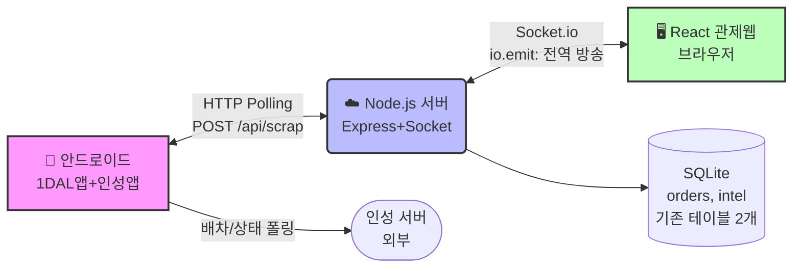
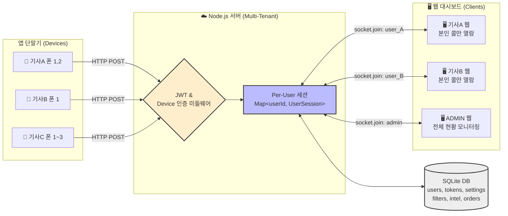
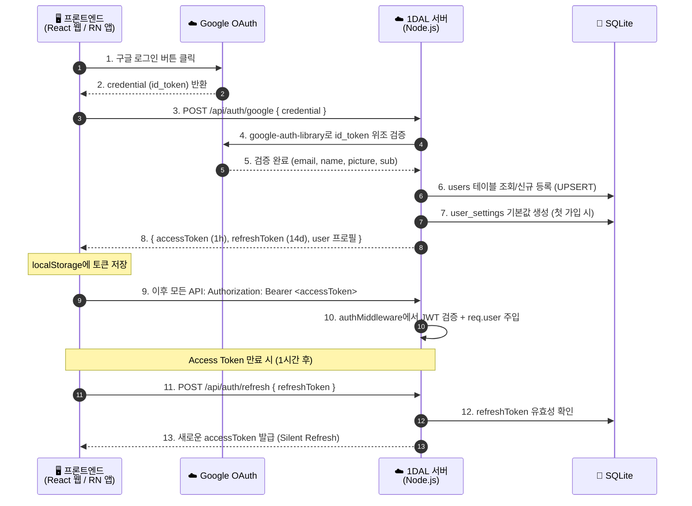
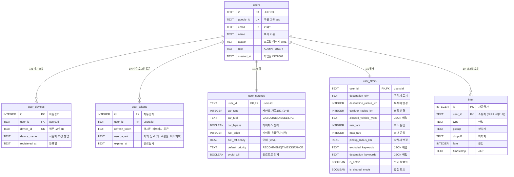

# 🏗️ 1DAL SaaS 전환 종합 구현 설계서 (Implementation Blueprint)

> **목적**: 이 문서는 1DAL 시스템을 **개인용 매크로 → 다중 사용자 SaaS 플랫폼**으로 전환하기 위한 **완전한 구현 설계서**입니다.
> 
> 이 문서만 읽고 개발에 착수할 수 있도록, 아키텍처 · 데이터베이스 · API · 프론트엔드 · 보안의 모든 상세를 빠짐없이 기술합니다.

---

## 📋 목차

1. [프로젝트 개요 및 현재 상태](#1-프로젝트-개요-및-현재-상태)
2. [아키텍처 대전환: Multi-Tenant 설계](#2-아키텍처-대전환-multi-tenant-설계)
3. [인증/인가 시스템 (JWT + Google OAuth)](#3-인증인가-시스템-jwt--google-oauth)
4. [데이터베이스 스키마 설계 (SQLite)](#4-데이터베이스-스키마-설계-sqlite)
5. [백엔드 API 명세](#5-백엔드-api-명세)
6. [Socket.io 멀티테넌트 통신 설계](#6-socketio-멀티테넌트-통신-설계)
7. [카카오 API 개인화 주입](#7-카카오-api-개인화-주입)
8. [프론트엔드 구현 명세](#8-프론트엔드-구현-명세)
9. [권한 매트릭스 (RBAC)](#9-권한-매트릭스-rbac)
10. [파일별 변경 체크리스트](#10-파일별-변경-체크리스트)
11. [환경 변수 및 의존성](#11-환경-변수-및-의존성)
12. [검증 계획](#12-검증-계획)

---

## 1. 프로젝트 개요 및 현재 상태

### 1-1. 현재 아키텍처 (AS-IS)


**현재 한계점:**
- **인증 없음**: 누구나 URL만 알면 관제 대시보드 접근 가능
- **전역 상태**: 필터, 콜 상태 등이 서버 메모리에 전역(Global)으로 1개만 존재
- **단일 사용자**: 기사 1명 + 관제사 1명 구조에 최적화

### 1-2. 목표 아키텍처 (TO-BE)



### 1-3. 기술 스택

| 레이어 | 기술 | 비고 |
|--------|------|------|
| **Backend** | Node.js + Express + TypeScript | 기존 유지 |
| **DB** | SQLite (better-sqlite3) | 기존 유지 |
| **실시간 통신** | Socket.io | 기존 유지, Room 기반으로 전환 |
| **인증** | Google OAuth 2.0 + JWT (Access+Refresh) | **신규** |
| **Frontend** | React + Vite + TypeScript | 기존 유지 |
| **외부 API** | 카카오 모빌리티 (지오코딩/내비) | 기존 유지, 개인화 파라미터 주입 |
| **패키지 관리** | pnpm workspace | 기존 유지 |

---

## 2. 아키텍처 대전환: Multi-Tenant 설계

### 2-1. 핵심 패러다임 전환

| 영역 | AS-IS (전역) | TO-BE (Per-User) |
|------|:---:|:---:|
| 콜 필터 | `activeFilterConfig` (메모리 1개) | `user_filters` 테이블 (유저당 1행) |
| 콜 상태 (mainCall, subCalls) | 전역 변수 | `Map<userId, UserSession>` ← **이미 리팩토링 완료** |
| Socket 브로드캐스트 | `io.emit(...)` 전체 방송 | `io.to(userId).emit(...)` 개인 룸 |
| 카카오 API 파라미터 | `car_type=1` 하드코딩 | `user_settings.car_type` DB 조회 |
| 스크랩 데이터 소유권 | 익명 (누구의 것인지 모름) | `user_devices` 매핑으로 소유자 식별 |

### 2-2. 이미 완료된 리팩토링 (현재 코드 기준)

> [!TIP]
> 아래 항목들은 이미 코드에 반영되어 있으므로 **추가 작업 불필요**합니다.

- ✅ `userSessionStore.ts` — `Map<userId, UserSession>` 구조 완성
- ✅ `dispatchEngine.ts` — 배차 로직 모듈 분리
- ✅ `socketHandlers.ts` — Socket 핸들러 분리
- ✅ `routeOptimizer.ts` — TSP/경로 최적화 분리
- ✅ `dispatchConfig.ts` — 설정 분리

### 2-3. 핵심 안정화 설계 (Hydration & 비동기 Queue) [필수 반영]

SaaS 환경 전환 시 발생할 수 있는 치명적 문제 2가지를 예방하기 위한 아키텍처 레벨의 해결책입니다.

1. **메모리 Map 상태 복구 (Hydration)**
   - **이슈**: 서버 재시작 시 `userSessionStore`의 Map 구조가 휘발되어 기사들의 배차가 멈춤.
   - **해결책**: `index.ts` 초기 구동 시점에 DB에서 활성화된 모든 `user_settings` 및 `user_filters` 정보를 읽어와 `Map<userId, UserSession>` 객체를 사전에 채워넣는(Hydration) 로직을 추가합니다.

2. **SQLite 동시성(Concurrent Writes) 병목 회피 (Write Queue)**
   - **이슈**: 다수의 모바일 기기가 초당 수 회씩 `POST /api/scrap` (DB INSERT/UPDATE) 요청을 보낼 경우 `database is locked` 오류 발생.
   - **해결책**: SQLite는 Read 동시성은 좋지만 Write는 Lock이 걸리므로, Node.js 서버단에 **"인메모리 비동기 쓰기 큐(In-memory Async Write Queue)"** 패턴을 구축합니다. `scrap.ts` 등 쓰기 요청들은 큐(`taskQueue.push`)에 먼저 담기고, 백그라운드 Worker가 큐의 내용을 차례대로(`await db.exec()`) 하나씩 실행하여 병목을 방어합니다 (Option A 적용).

---

## 3. 인증/인가 시스템 (JWT + Google OAuth)

### 3-1. 인증 시퀀스 다이어그램



### 3-2. JWT 토큰 스펙

#### Access Token (수명: 1시간)
```json
{
  "sub": "user_uuid_here",
  "email": "driver@gmail.com",
  "name": "김기사",
  "role": "USER",
  "iat": 1713456789,
  "exp": 1713460389
}
```

#### Refresh Token (수명: 14일)
- DB의 별도 컬럼(`users.refresh_token`)에 해시 저장
- 갱신 시 기존 Refresh Token 폐기 → 새로 발급 (Rotation 전략)

### 3-3. 미들웨어 설계

#### `authMiddleware.ts` [NEW]

```typescript
// 핵심 인터페이스
interface AuthUser {
  id: string;       // users.id (UUID)
  email: string;
  name: string;
  role: 'ADMIN' | 'USER';
}

// Express Request 확장
declare global {
  namespace Express {
    interface Request {
      user?: AuthUser;
    }
  }
}

// 미들웨어 함수
export function requireAuth(req, res, next) {
  // 1. Authorization 헤더에서 Bearer 토큰 추출
  // 2. jsonwebtoken.verify()로 검증
  // 3. 실패 시 401 Unauthorized 반환
  // 4. 성공 시 req.user = decoded payload → next()
}

export function requireAdmin(req, res, next) {
  // requireAuth 통과 후 req.user.role !== 'ADMIN'이면 403 Forbidden
}
```

#### Socket.io 핸드셰이크 인증

```typescript
// index.ts 또는 socketHandlers.ts에 추가
io.use((socket, next) => {
  const token = socket.handshake.auth?.token 
                || socket.handshake.headers?.authorization?.split(' ')[1];
  
  if (!token) return next(new Error('인증 토큰 없음'));
  
  try {
    const decoded = jwt.verify(token, JWT_SECRET);
    socket.data.user = decoded; // { id, email, name, role }
    next();
  } catch (err) {
    next(new Error('토큰 만료 또는 위조'));
  }
});

// 연결 성공 시 개인 Room 입장
io.on('connection', (socket) => {
  const userId = socket.data.user.id;
  socket.join(userId); // 개인 프라이빗 룸
  
  if (socket.data.user.role === 'ADMIN') {
    socket.join('admin_room'); // 어드민은 추가로 관리자 룸  
  }
});
```

---

## 4. 데이터베이스 스키마 설계 (SQLite)

### 4-1. ER 다이어그램



### 4-2. 전체 DDL (생성 SQL)

```sql
-- ═══════════════════════════════════════
-- [1] 사용자 테이블
-- ═══════════════════════════════════════
CREATE TABLE IF NOT EXISTS users (
    id TEXT PRIMARY KEY,              -- UUID v4 (서버에서 생성)
    google_id TEXT UNIQUE NOT NULL,   -- Google OAuth 'sub' 값
    email TEXT UNIQUE NOT NULL,       -- 구글 이메일
    name TEXT NOT NULL,               -- 표시 이름
    avatar TEXT,                      -- 프로필 이미지 URL
    role TEXT DEFAULT 'USER' CHECK(role IN ('ADMIN', 'USER')),
    created_at TEXT DEFAULT (datetime('now'))
);

-- ═══════════════════════════════════════
-- [1.5] 사용자 다중 로그인 토큰 (1:N) [NEW]
-- ═══════════════════════════════════════
CREATE TABLE IF NOT EXISTS user_tokens (
    id INTEGER PRIMARY KEY AUTOINCREMENT,
    user_id TEXT NOT NULL,
    refresh_token TEXT NOT NULL,      -- 해시된 리프레시 토큰
    user_agent TEXT,                  -- 기기/브라우저 식별 (로그인 충돌 방지용)
    created_at TEXT DEFAULT (datetime('now')),
    expires_at TEXT NOT NULL,         -- 토큰 만료 시점
    FOREIGN KEY(user_id) REFERENCES users(id) ON DELETE CASCADE
);

-- ═══════════════════════════════════════
-- [2] 사용자-기기 매핑 (1:N)
-- ═══════════════════════════════════════
CREATE TABLE IF NOT EXISTS user_devices (
    id INTEGER PRIMARY KEY AUTOINCREMENT,
    user_id TEXT NOT NULL,
    device_id TEXT NOT NULL,          -- 앱폰 고유 ID (예: '앱폰-sdk_gpho-160')
    device_name TEXT,                 -- 기기 별명 (예: '업무용 갤S23')
    registered_at TEXT DEFAULT (datetime('now')),
    FOREIGN KEY(user_id) REFERENCES users(id) ON DELETE CASCADE,
    UNIQUE(user_id, device_id)
);

-- ═══════════════════════════════════════
-- [3] 사용자 차량/라우팅 설정 (1:1)
-- ═══════════════════════════════════════
CREATE TABLE IF NOT EXISTS user_settings (
    user_id TEXT PRIMARY KEY,
    -- 차량 정보
    car_type INTEGER DEFAULT 1,       -- 카카오 차종 (1:승용/소형, 2:중형, 3:대형, 4:2축, 5:3축, 6:4축이상)
    car_fuel TEXT DEFAULT 'GASOLINE',  -- 유종 ('GASOLINE', 'DIESEL', 'LPG')
    car_hipass BOOLEAN DEFAULT 1,     -- 하이패스 장착 여부
    -- 연비/단가 산정
    fuel_price INTEGER DEFAULT 1600,  -- 리터당 유류 단가 (원)
    fuel_efficiency REAL DEFAULT 10.0,-- 연비 (km/L)
    -- 경로 선호
    default_priority TEXT DEFAULT 'RECOMMEND' CHECK(default_priority IN ('RECOMMEND', 'TIME', 'DISTANCE')),
    avoid_toll BOOLEAN DEFAULT 0,     -- 유료도로 회피 여부
    FOREIGN KEY(user_id) REFERENCES users(id) ON DELETE CASCADE
);

-- ═══════════════════════════════════════
-- [4] 사용자별 오더 사냥 필터 (1:1)
-- ═══════════════════════════════════════
CREATE TABLE IF NOT EXISTS user_filters (
    user_id TEXT PRIMARY KEY,
    destination_city TEXT DEFAULT '',
    destination_radius_km INTEGER DEFAULT 10,
    corridor_radius_km INTEGER DEFAULT 1,
    allowed_vehicle_types TEXT DEFAULT '["다마스","라보","오토바이"]', -- JSON 배열
    min_fare INTEGER DEFAULT 0,
    max_fare INTEGER DEFAULT 1000000,
    pickup_radius_km REAL DEFAULT 999,
    excluded_keywords TEXT DEFAULT '[]',       -- JSON 배열
    destination_keywords TEXT DEFAULT '[]',    -- JSON 배열
    is_active BOOLEAN DEFAULT 0,
    is_shared_mode BOOLEAN DEFAULT 0,
    FOREIGN KEY(user_id) REFERENCES users(id) ON DELETE CASCADE
);

-- ═══════════════════════════════════════
-- [5] intel 테이블 마이그레이션 (컬럼 추가)
-- ═══════════════════════════════════════
-- 기존 데이터(22,000건)는 user_id = NULL로 유지 (레거시 빅데이터로 간주)
ALTER TABLE intel ADD COLUMN user_id TEXT REFERENCES users(id);
ALTER TABLE intel ADD COLUMN device_id TEXT;
```

### 4-3. 레거시 데이터 처리 정책

| 대상 | 건수 | 정책 |
|------|------|------|
| `intel` 기존 데이터 | ~22,000건 | `user_id = NULL` 유지, "시스템 공용 훈련/통계 빅데이터"로 분류 |
| 신규 `intel` 데이터 | 향후 | `user_devices` 매핑을 통해 `user_id` 자동 귀속 |

---

## 5. 백엔드 API 명세

### 5-1. 인증 API (`routes/auth.ts` [NEW])

| Method | Endpoint | Auth | 설명 | Request Body | Response |
|--------|----------|:----:|------|-------------|----------|
| POST | `/api/auth/google` | ❌ | 구글 로그인, JWT 발급 | `{ credential: string }` | `{ accessToken, refreshToken, user }` |
| POST | `/api/auth/refresh` | ❌ | Access Token 갱신 | `{ refreshToken: string }` | `{ accessToken }` |
| POST | `/api/auth/logout` | ✅ | 로그아웃 (Refresh Token 폐기) | - | `{ success: true }` |
| GET  | `/api/auth/me` | ✅ | 현재 유저 프로필 조회 | - | `{ user, settings, devices }` |

#### `POST /api/auth/google` 상세 로직

```
1. req.body.credential에서 id_token 추출
2. google-auth-library의 OAuth2Client.verifyIdToken()으로 검증
   - audience: GOOGLE_CLIENT_ID
3. payload에서 { sub, email, name, picture } 추출
4. DB users 테이블에서 google_id = sub 조회
   - 없으면 → UUID 생성, INSERT INTO users + INSERT INTO user_settings (기본값)
   - 있으면 → 기존 유저 조회
5. accessToken = jwt.sign({ sub: user.id, email, name, role }, JWT_SECRET, { expiresIn: '1h' })
6. refreshToken = jwt.sign({ sub: user.id, type: 'refresh' }, JWT_REFRESH_SECRET, { expiresIn: '14d' })
7. bcrypt.hash(refreshToken) → users.refresh_token에 저장
8. Response: { accessToken, refreshToken, user: { id, email, name, avatar, role } }
```

### 5-2. 사용자 설정 API (`routes/settings.ts` [NEW])

| Method | Endpoint | Auth | 설명 |
|--------|----------|:----:|------|
| GET | `/api/settings` | ✅ | 본인 차량/라우팅 설정 조회 |
| PUT | `/api/settings` | ✅ | 본인 설정 업데이트 |

#### `PUT /api/settings` Request Body

```json
{
  "car_type": 2,
  "car_fuel": "DIESEL",
  "car_hipass": true,
  "fuel_price": 1750,
  "fuel_efficiency": 8.5,
  "default_priority": "TIME",
  "avoid_toll": false
}
```

### 5-3. 기기 페어링 API (`routes/devices.ts` 확장)

| Method | Endpoint | Auth | 설명 |
|--------|----------|:----:|------|
| GET | `/api/devices/my` | ✅ | 본인 등록 기기 목록 |
| POST | `/api/devices/pair` | ✅ | 기기 페어링 (deviceId 등록) |
| DELETE | `/api/devices/:deviceId` | ✅ | 기기 해제 |

#### 페어링 방식

```
방법 1 (QR 코드):
  1. 웹에서 POST /api/devices/pair-code → 6자리 단축 코드 발급 (5분 유효)
  2. 안드로이드 앱에서 코드 입력 → POST /api/devices/pair { code, deviceId }
  3. 서버가 코드 검증 후 user_devices에 INSERT

방법 2 (수동 입력):
  1. 안드로이드 앱의 deviceId를 확인 (설정 화면에 표시됨)
  2. 웹에서 직접 POST /api/devices/pair { deviceId, deviceName }
```

### 5-4. 필터 API (`routes/filters.ts` [NEW])

| Method | Endpoint | Auth | 설명 |
|--------|----------|:----:|------|
| GET | `/api/filters` | ✅ | 본인 필터 설정 조회 |
| PUT | `/api/filters` | ✅ | 본인 필터 업데이트 → 소켓으로 앱에 실시간 전파 |

### 5-5. 기존 API 인증 적용

| 기존 Endpoint | 변경 사항 |
|--------------|----------|
| `POST /api/scrap` | `deviceId`로 `user_devices` 조회 → 소유자 `userId` 식별 → 해당 유저 세션에 데이터 라우팅 |
| `POST /api/orders/confirm` | `requireAuth` 미들웨어 부착, `req.user.id`로 세션 접근 |
| `POST /api/orders/detail` | 동일 |
| `POST /api/emergency` | 동일 |

> [!IMPORTANT]
> `POST /api/scrap`은 안드로이드 앱(무인 단말기)에서 호출하므로 JWT 인증 대신 **deviceId 기반 인증**을 유지합니다. 서버가 `user_devices` 테이블에서 해당 `deviceId`의 소유자를 찾아 `userId`를 역산합니다.

---

## 6. Socket.io 멀티테넌트 통신 설계

### 6-1. Room 구조

```
Socket.io Rooms
├── user_{userId_A}     ← 기사A의 웹 브라우저 소켓
├── user_{userId_B}     ← 기사B의 웹 브라우저 소켓
├── user_{userId_C}     ← 기사C의 웹 브라우저 소켓
└── admin_room          ← ADMIN 역할 소켓 (모니터링용)
```

### 6-2. 이벤트 라우팅 변경

| 이벤트 | AS-IS | TO-BE |
|--------|-------|-------|
| `order-evaluating` | `io.emit(...)` | `io.to(userId).emit(...)` |
| `order-detail-received` | `io.emit(...)` | `io.to(userId).emit(...)` |
| `order-evaluated` | `io.emit(...)` | `io.to(userId).emit(...)` |
| `filter-updated` | `io.emit(...)` | `io.to(userId).emit(...)` |
| `decision` (KEEP/CANCEL) | `socket.on('decision')` → 전역 처리 | `socket.on('decision')` → `socket.data.user.id` 기준 세션 처리 |

### 6-3. 스크랩 데이터 라우팅 흐름

```
📱 앱폰(deviceId='앱폰-sdk_gpho-160')
  │
  ▼ POST /api/scrap { deviceId, data }
  │
☁️ 서버: scrap.ts
  │ 1. DB에서 user_devices.device_id = '앱폰-sdk_gpho-160' 조회
  │ 2. user_id = 'user_ABC' 확인
  │ 3. getUserSession('user_ABC') 로 해당 유저 세션 접근
  │ 4. 필터링: user_filters에서 'user_ABC'의 필터 로드
  │ 5. 결과를 io.to('user_ABC').emit('order-evaluating', ...) 으로 전송
  │
  ▼
🖥️ 기사ABC의 웹 대시보드만 수신
```

---

## 7. 카카오 API 개인화 주입

### 7-1. 현재 하드코딩 위치와 변경점

`kakaoUtil.ts`에서 현재 하드코딩된 `car_type=1`을 사용자별 설정으로 동적 주입합니다.

| 파일 | 현재 코드 | 개선 코드 |
|------|----------|----------|
| `kakaoUtil.ts` L70 | `&car_type=1` | `&car_type=${settings.car_type}&car_fuel=${settings.car_fuel}&car_hipass=${settings.car_hipass ? 1 : 0}` |
| `kakaoUtil.ts` L152 | `car_type: 1` | `car_type: settings.car_type` |
| `kakaoUtil.ts` L184 | `car_type: 1` | `car_type: settings.car_type` |

### 7-2. 카카오 API 파라미터 매핑

| DB 컬럼 | 카카오 파라미터 | 설명 |
|---------|---------------|------|
| `car_type` | `car_type` | 1:승용/소형, 2:중형(2.5t), 3:대형(5t+), 4:2축, 5:3축, 6:4축 |
| `car_fuel` | `car_fuel` | GASOLINE, DIESEL, LPG |
| `car_hipass` | `car_hipass` | 하이패스 할인 적용 여부 |
| `avoid_toll` | `priority` 조정 | avoid_toll=true 시 `priority=AVOID_TOLL` |
| `fuel_price` | 서버 자체 계산 | 수익률 = (운임 - 유류비) / 총 시간 |
| `fuel_efficiency` | 서버 자체 계산 | 유류비 = (총거리km / 연비) × 유가 |

### 7-3. 함수 시그니처 변경

```typescript
// AS-IS
export async function calculateSoloRoute(
    apiKey: string,
    pickupX, pickupY, dropoffX, dropoffY,
    driverLoc?, priority?
): Promise<RouteResult>

// TO-BE: userSettings 파라미터 추가
export async function calculateSoloRoute(
    apiKey: string,
    pickupX, pickupY, dropoffX, dropoffY,
    driverLoc?,
    priority?,
    userSettings?: UserSettings  // ← 추가
): Promise<RouteResult>
```

---

## 8. 프론트엔드 구현 명세

### 8-1. 신규 파일

| 파일 경로 | 역할 |
|----------|------|
| `client/src/pages/Login.tsx` | 구글 소셜 로그인 페이지 |
| `client/src/pages/DevicePairing.tsx` | 기기 페어링 UI |
| `client/src/pages/MySettings.tsx` | 차량/라우팅 설정 UI |
| `client/src/api/auth.ts` | Axios 인터셉터 (JWT 자동 탑재 + Refresh) |
| `client/src/hooks/useAuth.ts` | 인증 상태 관리 커스텀 훅 |
| `client/src/contexts/AuthContext.tsx` | 전역 인증 Context Provider |

### 8-2. 라우팅 변경 (`App.tsx`)

```tsx
// 인증 여부에 따른 조건부 렌더링
function App() {
  const { isAuthenticated, isLoading } = useAuth();

  if (isLoading) return <SplashScreen />;

  return (
    <BrowserRouter>
      <Routes>
        {!isAuthenticated ? (
          <>
            <Route path="/login" element={<Login />} />
            <Route path="*" element={<Navigate to="/login" />} />
          </>
        ) : (
          <>
            <Route path="/" element={<Dashboard />} />
            <Route path="/settlement" element={<Settlement />} />
            <Route path="/settings" element={<MySettings />} />
            <Route path="/devices" element={<DevicePairing />} />
            <Route path="/admin/*" element={<AdminPanel />} />  {/* ADMIN 전용 */}
            <Route path="*" element={<Navigate to="/" />} />
          </>
        )}
      </Routes>
    </BrowserRouter>
  );
}
```

### 8-3. Axios 인터셉터 (`api/auth.ts`)

```typescript
const api = axios.create({ baseURL: '/api' });

// 요청 인터셉터: 모든 요청에 JWT 자동 탑재
api.interceptors.request.use((config) => {
  const token = localStorage.getItem('accessToken');
  if (token) config.headers.Authorization = `Bearer ${token}`;
  return config;
});

// 응답 인터셉터: 401 시 Silent Refresh 시도
api.interceptors.response.use(
  (res) => res,
  async (error) => {
    if (error.response?.status === 401 && !error.config._retry) {
      error.config._retry = true;
      const newToken = await refreshAccessToken();
      error.config.headers.Authorization = `Bearer ${newToken}`;
      return api(error.config);
    }
    return Promise.reject(error);
  }
);
```

### 8-4. Socket.io 인증 연결

```typescript
// 기존
const socket = io('http://localhost:4000');

// 변경
const socket = io('http://localhost:4000', {
  auth: {
    token: localStorage.getItem('accessToken')
  }
});

// 토큰 만료 시 재연결
socket.on('connect_error', async (err) => {
  if (err.message === '토큰 만료 또는 위조') {
    await refreshAccessToken();
    socket.auth.token = localStorage.getItem('accessToken');
    socket.connect();
  }
});
```

### 8-5. Dashboard 헤더 및 설정 모달 UI 변경

사용자 실수 방지 및 깔끔한 상단 바를 위해 `Header.tsx`에는 기본 사용자 정보(아바타, 이름)만 남기고, 로그아웃 기능은 환경 변경 팝업인 `SettingsModal.tsx` 안으로 이동시켰습니다.

**[상단 헤더(Header.tsx)]**
```
┌──────────────────────────────────────────────┐
│  🚛 1DAL                 [프로필 사진] 김기사 │
└──────────────────────────────────────────────┘
```

**[설정 모달(SettingsModal.tsx)]**
```
┌──────────────────────────────────────────────┐
│  ⚙️ 설정                                      │
│                                              │
│  내 차량 종류 (배차 탐색 기준)                   │
│  [ 다마스 ▼ ]                                 │
│                                              │
│  기본 경로 탐색 옵션                            │
│  [ 추천 경로 ▼ ]                              │
│                                              │
│  [ 로그아웃 ]              [ 취소 ] [ 저장하기 ] │
└──────────────────────────────────────────────┘
```

---

## 9. 권한 매트릭스 (RBAC)

| 기능 영역 | ADMIN (플랫폼 관리자) | USER (일반 기사) |
|:---|:---|:---|
| **필터/오더 제어** | 개별 기사 필터·배차에 개입 안 함 (조회만) | 본인 거주지/동선 기준 필터 완전 제어, 본인 KEEP/CANCEL |
| **기기 관리** | 전체 연동 폰 현황 모니터링 | 본인 투/쓰리폰 귀속(페어링) 및 해제 |
| **라우팅/수익** | 전체 API 호출량 및 부하 모니터링 | 본인 차종·연비 특화 카카오 경로/정산 |
| **운행 일지(Intel)** | 전체 기사 빅데이터 통계 및 열람 | 본인 폰 스크랩 내역 + 배차 콜 일지 열람 |
| **사용자 관리** | 가입자 승인, 정지, 권한 변경 | 본인 프로필 조회 및 구글 연동 |
| **스크랩 수신** | - | 기기(단말기) 고유 권한 (JWT 불필요) |

---

## 10. 파일별 변경 체크리스트

### Backend (서버)

| 상태 | 파일 | 작업 내용 |
|:---:|------|----------|
| 🆕 | `server/src/routes/auth.ts` | Google OAuth 검증, JWT Access+Refresh 발급, 갱신, 로그아웃 |
| 🆕 | `server/src/routes/settings.ts` | 사용자 차량/라우팅 설정 CRUD |
| 🆕 | `server/src/routes/filters.ts` | 사용자별 필터 CRUD + 소켓 실시간 전파 |
| 🆕 | `server/src/middlewares/authMiddleware.ts` | JWT 파싱, Role Guard (`requireAuth`, `requireAdmin`) |
| ✏️ | `server/src/db.ts` | 신규 테이블 4개 DDL + `intel` 마이그레이션 |
| ✏️ | `server/src/index.ts` | 신규 라우터 등록, Socket.io 핸드셰이크 인증 |
| ✏️ | `server/src/socket/socketHandlers.ts` | `io.emit` → `io.to(userId).emit` 전환, `socket.data.user` 활용 |
| ✏️ | `server/src/routes/scrap.ts` | `deviceId` → `user_devices` 조회 → userId 역산 → 세션 라우팅 |
| ✏️ | `server/src/routes/orders.ts` | `requireAuth` 미들웨어 적용, userId 기반 세션 |
| ✏️ | `server/src/routes/detail.ts` | `requireAuth` 적용, `user_settings` DB 조회 → 카카오 파라미터 주입 |
| ✏️ | `server/src/routes/devices.ts` | 페어링/해제 API 추가 |
| ✏️ | `server/src/routes/kakaoUtil.ts` | `car_type=1` 하드코딩 제거 → `userSettings` 동적 주입 (3곳) |
| ✅ | `server/src/state/userSessionStore.ts` | 이미 완료 (Map<userId, UserSession>) |
| ✅ | `server/src/services/dispatchEngine.ts` | 이미 완료 |

### Frontend (클라이언트)

| 상태 | 파일 | 작업 내용 |
|:---:|------|----------|
| 🆕 | `client/src/pages/Login.tsx` | 구글 소셜 로그인 UI |
| 🆕 | `client/src/pages/DevicePairing.tsx` | 기기 연결(페어링) UI |
| 🆕 | `client/src/pages/MySettings.tsx` | 차량/라우팅 설정 폼 |
| 🆕 | `client/src/api/auth.ts` | Axios 인터셉터 (JWT 자동탑재 + Silent Refresh) |
| 🆕 | `client/src/hooks/useAuth.ts` | 인증 상태 관리 훅 |
| 🆕 | `client/src/contexts/AuthContext.tsx` | 전역 인증 Context |
| ✏️ | `client/src/App.tsx` | 인증 분기 라우팅 (Login ↔ Dashboard) |
| ✏️ | `client/src/components/layout/Header.tsx` | 사용자 프로필·차종 표시, 로그아웃 버튼 |
| ✏️ | `client/src/pages/Dashboard.tsx` | Socket 연결 시 JWT 전달, 필터 API 연동 |
| ✏️ | `client/src/components/OrderFilterModal.tsx` | 로컬 전역 스토어 → 백엔드 `user_filters` API 연동 |

---

## 11. 환경 변수 및 의존성

### 11-1. 환경 변수 (.env)

```bash
# ═══ 서버 (.env) ═══
PORT=4000
DB_FILE=local.db

# Google OAuth
GOOGLE_CLIENT_ID=xxxxx.apps.googleusercontent.com

# JWT
JWT_SECRET=your_jwt_secret_at_least_32_chars
JWT_REFRESH_SECRET=your_refresh_secret_at_least_32_chars

# 카카오 API (기존)
KAKAO_API_KEY=xxxxxxxxxxxxxxxxxxxxxxx
```

```bash
# ═══ 프론트엔드 (.env.local) ═══
VITE_GOOGLE_CLIENT_ID=xxxxx.apps.googleusercontent.com
VITE_API_BASE_URL=http://localhost:4000
```

### 11-2. 신규 패키지 (npm 의존성)

#### Backend
```bash
pnpm --filter server add google-auth-library jsonwebtoken bcrypt uuid
pnpm --filter server add -D @types/jsonwebtoken @types/bcrypt @types/uuid
```

#### Frontend
```bash
pnpm --filter client add @react-oauth/google axios
```

---

## 12. 검증 계획

### 12-1. 자동화 테스트

```bash
# 인증 플로우
curl -X POST http://localhost:4000/api/auth/google \
  -H "Content-Type: application/json" \
  -d '{"credential":"mock_google_token"}'

# 인증된 API 호출
curl http://localhost:4000/api/auth/me \
  -H "Authorization: Bearer <accessToken>"

# 필터 업데이트
curl -X PUT http://localhost:4000/api/filters \
  -H "Authorization: Bearer <accessToken>" \
  -d '{"destination_city":"수원","is_active":true}'
```

### 12-2. 수동 검증 체크리스트

- [ ] 구글 로그인 → JWT 발급 → localStorage 저장
- [ ] 새로고침 시 로그인 유지 (accessToken 살아있을 때)
- [ ] accessToken 만료 후 Silent Refresh 동작
- [ ] Socket.io 연결 시 JWT 핸드셰이크 통과
- [ ] 기사A가 올린 콜이 기사B 화면에 안 보이는지 (격리)
- [ ] ADMIN이 전체 현황 볼 수 있는지
- [ ] 기기 페어링 후 해당 폰의 스크랩이 본인에게 귀속되는지
- [ ] 카카오 API에 car_type이 DB 값으로 주입되는지
- [ ] 유료도로 회피 설정이 카카오 경로에 반영되는지

### 12-3. 구현 우선순위 (권장 순서)

```
Phase 1 (기반):  DB 스키마 + auth.ts + authMiddleware.ts + Login.tsx
Phase 2 (격리):  Socket Room 전환 + scrap.ts deviceId→userId 라우팅
Phase 3 (개인화): user_settings CRUD + kakaoUtil 파라미터 주입
Phase 4 (완성):  user_filters DB화 + OrderFilterModal 연동 + DevicePairing
Phase 5 (어드민): Admin 전용 모니터링 페이지 (선택)
```
