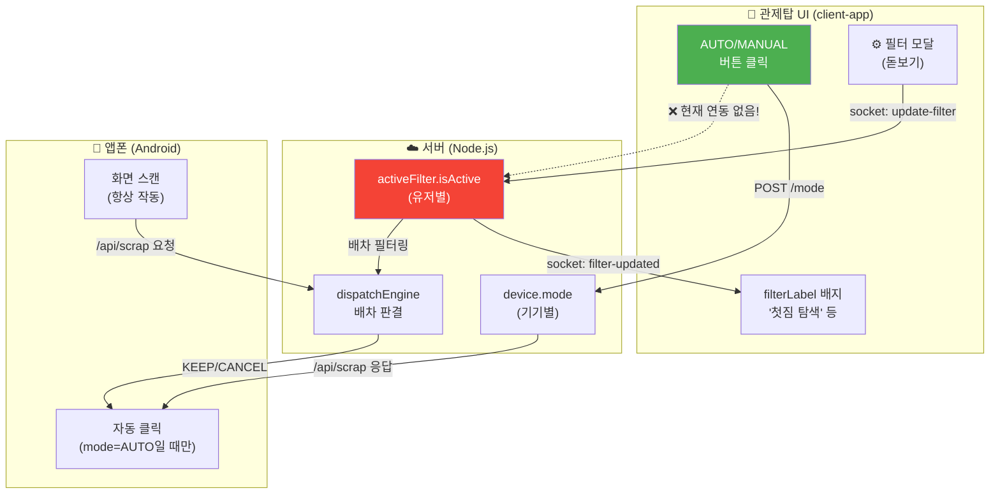
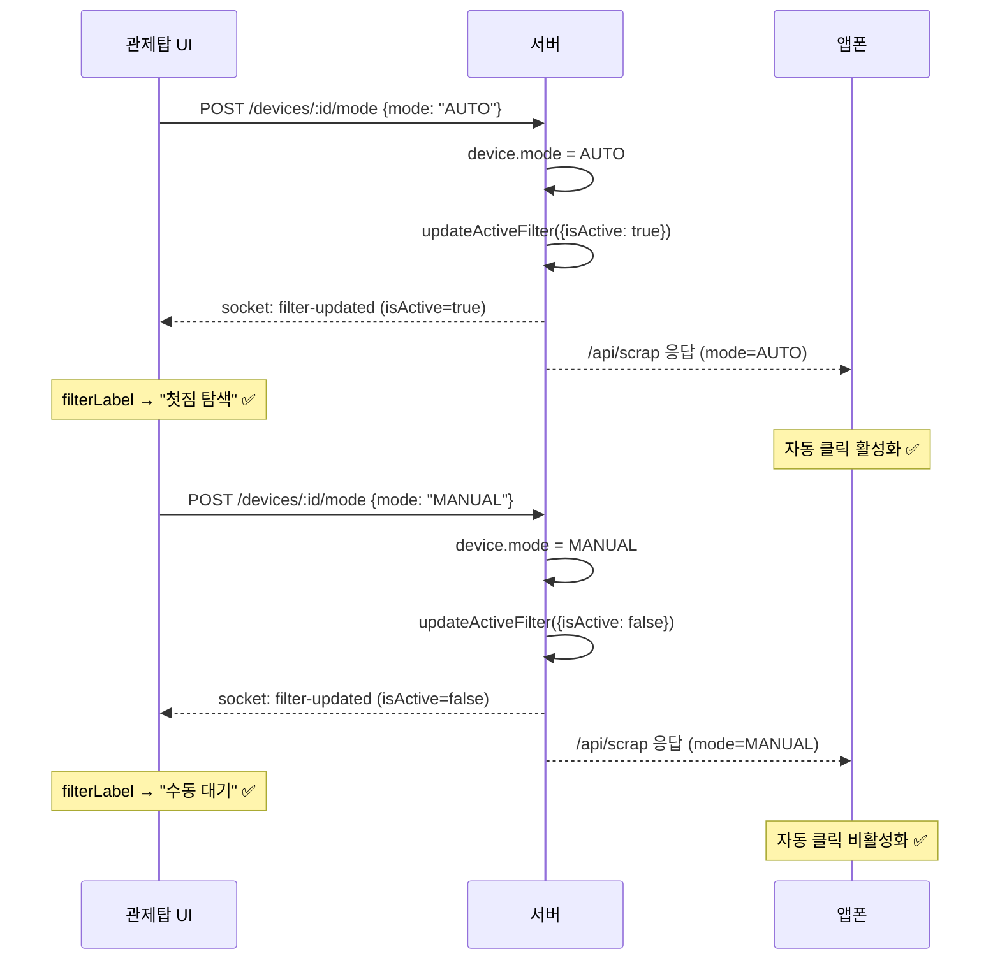

# 🔧 AUTO/MANUAL 모드 ↔ 필터 상태(isActive) 연동 수정

## 1. 전체 시스템 그림: 누가 무엇을 제어하는가



### 현재 문제의 핵심

| 주체 | 제어 대상 | 현재 상태 |
|:---:|:---:|:---:|
| **AUTO/MANUAL 버튼** | `device.mode` 만 변경 | ✅ 정상 |
| **AUTO/MANUAL 버튼** | `filter.isActive` 변경 | ❌ **연동 안 됨!** |
| **필터 모달(돋보기)** | `filter.*` 전체 변경 | ✅ 정상 |
| **필터 모달(돋보기)** | `filter.isActive` 변경 | ⚠️ 저장 시에만 true로 설정 |
| **배차 엔진** | `filter.isActive` 참조 | ✅ 정상 (false면 필터 매칭 안 함) |
| **앱폰 스캔** | 화면 읽기 + 서버 전송 | ✅ **isActive와 무관하게 항상 동작** |

> [!CAUTION]
> **"스캔 정지"인데 수집(polled) 카운트가 올라가는 이유**: 앱폰은 `isActive` 값과 상관없이 **항상** 화면을 읽고 서버에 전송합니다. `isActive`는 서버의 배차 엔진이 "이 오더를 평가할지 말지"만 결정합니다. 따라서 "스캔 정지"는 **거짓말**이고, 실제로는 "필터 비활성 (배차 판단 안 함)"이 정확합니다.

---

## 2. filterLabel 코드 분석

```typescript
// 📍 DeviceControlPanel.tsx (52~76행)
let filterLabel = '일시정지';        // ① 기본값 (dead code)
let filterColor = '...';

if (currentFilter) {                 // ② 필터가 로드됨
    if (!currentFilter.isActive) {   // ③ 필터 비활성
        filterLabel = '스캔 정지';   // ← 실제로는 스캔 중인데 "정지"라고 표시
    } else {
        // ④ 필터 활성 → 배차 페이즈에 따라 라벨 결정
        if (action === 'UNLOADING') filterLabel = '하차 대기';
        else if (phase === 'GATHERING') filterLabel = '합짐 탐색';
        else if (phase === 'DELIVERING') filterLabel = '경로 탐색';
        else filterLabel = '첫짐 탐색'; // STANDBY
    }
}
```

### 문제점

| 라인 | 값 | 언제 보이나 | 문제 |
|:---:|:---:|:---:|:---:|
| ① `'일시정지'` | 기본값 | `currentFilter`가 **null**일 때 (소켓 아직 미연결) | **dead code** — 사실상 로딩 상태인데 "일시정지"라는 오해 유발 |
| ③ `'스캔 정지'` | isActive=false | 필터 비활성 시 | 앱은 실제로 스캔 중이므로 **거짓말** |

---

## 3. 수정 방향: 모드가 마스터 스위치

> [!IMPORTANT]
> **핵심 원칙**: AUTO 버튼을 누르면 `mode=AUTO` + `isActive=true`가 **원자적으로** 같이 바뀌어야 합니다. 두 변수가 분리되어 있으면 안 됩니다.



---

## 4. Proposed Changes

### 서버

#### [MODIFY] [devices.ts](file:///Users/seungwookkim/reps/onedal/onedal-web/server/src/routes/devices.ts#L284-L323)

`POST /api/devices/:deviceId/mode` 핸들러에서 모드 변경 시 `isActive` 자동 연동:

```diff
 session.mode = mode;
 activeDevices.set(deviceId, session);
+
+// [핵심] AUTO ↔ MANUAL 전환 시 filter.isActive 원자적 연동
+const userId = req.user!.id;
+const { updateActiveFilter } = require("../state/filterManager");
+const io = req.app.get("io");
+if (mode === "AUTO") {
+    updateActiveFilter(userId, { isActive: true }, io);
+} else {
+    updateActiveFilter(userId, { isActive: false }, io);
+}
```

---

### 관제탑 UI (client-app)

#### [MODIFY] [DeviceControlPanel.tsx](file:///Users/seungwookkim/reps/onedal/onedal-web/client-app/src/components/dashboard/DeviceControlPanel.tsx#L52-L76)

`filterLabel` 로직을 `device.mode`와 연동하여 라벨 정합성 확보:

```typescript
// 수정 후: mode 기반으로 1차 분기, isActive로 2차 분기
let filterLabel = '동기화 중';  // ← null일 때만 (소켓 미연결 로딩 상태)
let filterColor = 'bg-surface-alt text-text-muted border-border';

if (currentFilter) {
    if (!currentFilter.isActive) {
        // mode=MANUAL이면 자연스럽게 여기로 옴 (연동 후)
        filterLabel = '수동 대기';
        filterColor = 'bg-surface-alt text-text-muted border-border';
    } else {
        const phase = currentFilter.dispatchPhase || 'STANDBY';
        const action = currentFilter.driverAction || 'WAITING';

        if (action === 'UNLOADING') {
            filterLabel = '하차 대기';
            filterColor = 'bg-surface-alt text-text-muted border-border';
        } else if (phase === 'GATHERING') {
            filterLabel = '합짐 탐색';
            filterColor = 'bg-info-alt/20 text-info-alt border-info-alt/30';
        } else if (phase === 'DELIVERING') {
            filterLabel = '경로 탐색';
            filterColor = 'bg-accent-alt/20 text-accent-alt border-accent-alt/30';
        } else {
            filterLabel = '첫짐 탐색';
            filterColor = 'bg-success/20 text-success border-success/30';
        }
    }
}
```

#### [MODIFY] [OrderFilterStatus.tsx](file:///Users/seungwookkim/reps/onedal/onedal-web/client-app/src/components/dashboard/OrderFilterStatus.tsx#L16-L25)

동일하게 라벨 정리:
- `'스캔 일시정지'` → `'수동 대기'`

---

## 5. 수정 후 동작 흐름 요약

```
[사용자 행동]              → [서버 상태 변화]              → [UI 라벨]
────────────────────────────────────────────────────────────────────────
첫 접속 (소켓 미연결)      → filter = null                → "동기화 중"
MANUAL → AUTO 클릭        → mode=AUTO, isActive=true     → "첫짐 탐색" ✅
AUTO → MANUAL 클릭        → mode=MANUAL, isActive=false  → "수동 대기" ✅
AUTO + 합짐 진입           → mode=AUTO, phase=GATHERING   → "합짐 탐색" ✅
AUTO + 배달 진행           → mode=AUTO, phase=DELIVERING  → "경로 탐색" ✅
AUTO + 하차 도착           → mode=AUTO, action=UNLOADING  → "하차 대기" ✅
```

## 6. Verification Plan

### 수동 검증
1. 관제탑에서 MANUAL → AUTO 클릭 → "수동 대기" → "첫짐 탐색"으로 즉시 전환 확인
2. AUTO → MANUAL 클릭 → "첫짐 탐색" → "수동 대기"로 즉시 전환 확인
3. Logcat에서 앱폰이 `isActive=true/false` 필터를 정확히 수신하는지 확인
4. 수집(polled) 카운트는 AUTO/MANUAL 관계없이 올라가는 것이 정상 (스캔은 항상 동작)
