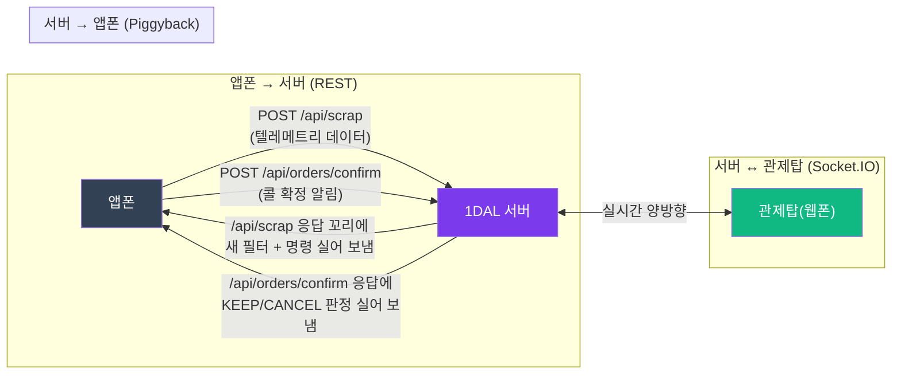
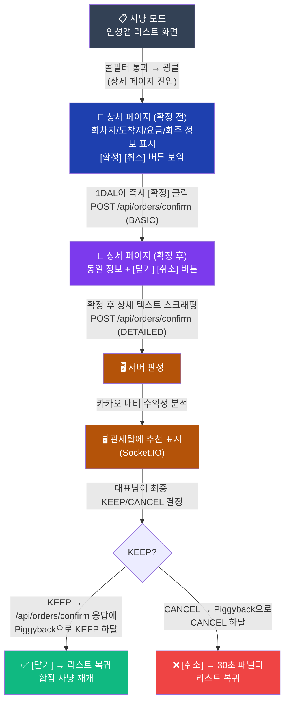
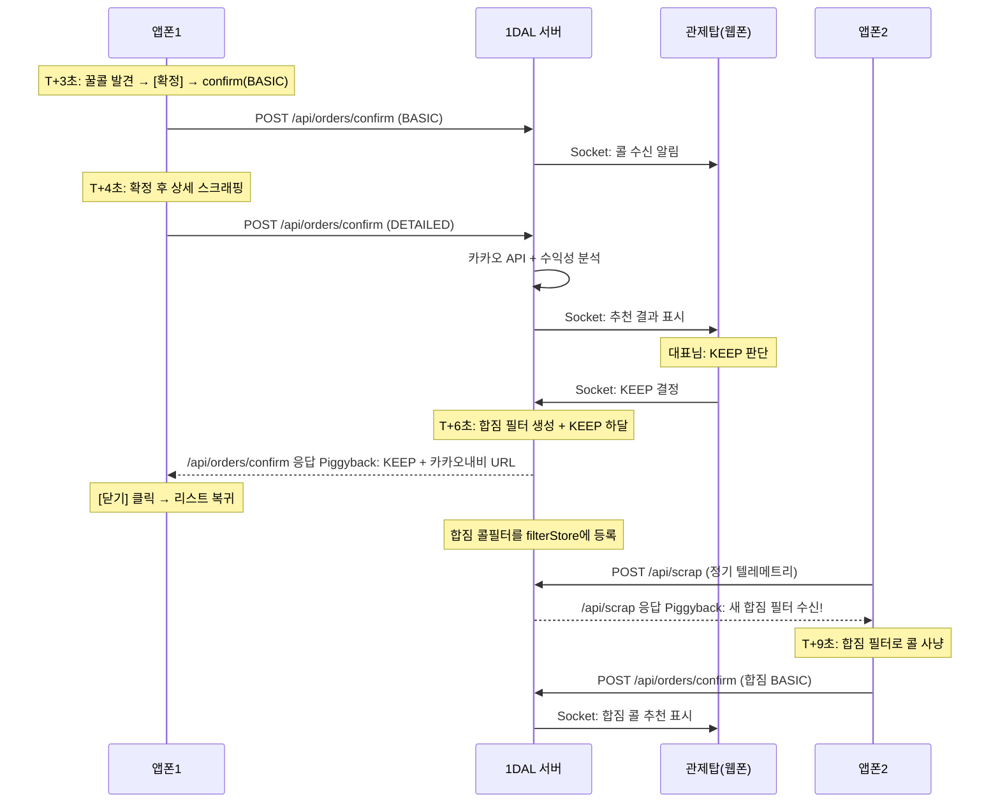

# 1DAL 자동화 엔진 로드맵 (PRD 기반 재설계)

## 통신 아키텍처 원칙 (PRD §11)

> [!IMPORTANT]
> **피기백(Piggyback) 통신**: 웹소켓의 모바일 끊김을 피하고, 앱폰의 API 요청 **응답 꼬리에** 서버 명령을 실어 보내는 구조.



| 통신 경로 | 방식 | 용도 |
|----------|------|------|
| 앱폰 → 서버 | `POST /api/scrap` | 3초 주기 텔레메트리 (스크랩 데이터) |
| 서버 → 앱폰 | `/api/scrap` **응답 Piggyback** | 새 필터, kill-switch, 모드 변경 |
| 앱폰 → 서버 | `POST /api/orders/confirm` | 콜 확정([확정] 누른 후) 알림 |
| 서버 → 앱폰 | `/api/orders/confirm` **응답 Piggyback** | KEEP/CANCEL 판정 |
| 서버 ↔ 관제탑 | **Socket.IO** | 실시간 대시보드, 판정 추천, 관제 제어 |

---

## 현재 위치 (완료된 것)


✅ 완성:
- 리스트 감시 → 4대 조건 AND → 광클 → `/api/orders/confirm` 서버 전송
- `/api/scrap` 텔레메트리 루프 + Piggyback으로 필터 수신
- 관제탑 대시보드 + 소켓 실시간 연동

---

## Step 1: 리스트 파서 정확도 개선 (난이도 ⭐⭐)

> [!IMPORTANT]
> 상차/하차를 꾸밈문자로 구분하는 것은 불가능 (양쪽 다 `-`, `@`, `+`, `3곳` 등이 붙을 수 있음)

**실제 로그 데이터 분석**:
```
5.3, 51.2, 태전동-,  주엽동,      1t, 88   ← 상차에만 - 붙음
7.9, 12.0, @이매동-, 송정동+문형동, 라, 22   ← 하차에 + 붙음!
7.3, 8.3,  초월읍,   광주시3곳,    오, 33   ← 하차에 "3곳"
6.8, 47.9, 고산동-,  남구3곳,      83       ← 하차에 "3곳"
```

**현실적 해결**: 리스트 단계에서는 100% 정확한 구분이 어려움. 감지된 **모든 지역명을 필터 조건1과 매칭**하여, 하나라도 걸리면 통과시키는 방식이 안전함. 정확한 데이터는 Step 2(상세 페이지)에서 확보.

**추가 개선**:
- 꾸밈문자 정리: `태전동-` → `태전동`, `@이매동-` → `이매동`, `송정동+문형동` → `[송정동, 문형동]`
- UI 노이즈 제거 리스트 보강
- 차종 코드 파싱: `1t`, `다`, `라`, `오` → 합짐 시 활용

**수정 파일**: `ScrapParser.kt`

---

## ✅ Step 2: 상세 페이지 파싱 + [확정] 자동화 (난이도 ⭐⭐⭐) [완료]

#### 인성앱 화면 흐름과 1DAL의 동작 (✅ 레이스 컨디션 완벽 방어)
* 💡 **달성 사항**: `ScrapParser.kt` 에 `pickupDistance` 속성을 추가하여 누락없는 4대 필터 통과. 상세 팝업 오픈 시 발생했던 **"터치 씹힘 현상(Race Condition)"**을 픽셀 잔상 방어 로직으로 타파하여 연속 팝업(출발지 ➡️ 도착지 ➡️ 적요) 파싱 100% 성공. 다중 라인(Multiline) 추출 파서를 통해 고객명과 지번 주소의 완벽한 분리 획득 완료.



#### Fail-Safe (PRD §2 2단계)
- 서버 무응답 시 → **30초 후 자동 [취소]** 클릭 타이머 가동
- 네트워크 장애 시에도 페널티 최소화

#### 상세 페이지에서 추출할 데이터

| 필드 | 인성앱 표시 예시 | 서버 전송 |
|------|---------------|----------|
| 회차지(상차) | "태전동 / 0" | `pickup: "태전동"` |
| 도착지(하차) | "경기/남구/용현5동/화우산주입로" | `dropoff: "용현5동"` |
| 요금+결제 | "89,000(신용)(계산서)" | `fare: 89000, payment: "신용"` |
| 화주 | "고양퀵서비스-031-932-7722" | `shipper: "고양퀵서비스"` |
| 품목 | "소봉투 2개" | `cargo: "소봉투 2개"` |
| 차종 | "1t" | `vehicleType: "1t"` |

> [!IMPORTANT]
> 서버의 판정은 **추천**입니다. 최종 결정은 관제탑(대표님)이 합니다.

**수정 파일**: `HijackService.kt` (상태 머신 추가), `ScrapParser.kt` (상세 파서), `ApiClient.kt` (DETAILED 전송)

---

## ✅ Step 3: 콜 판정 보드 + 카카오 내비 연동 (난이도 ⭐⭐) [완료]

**카카오 지오코딩 및 경로 연산 고도화 (✅ 3중 폴백 구조 완성)**
* 💡 **달성 사항**: 카카오 로컬 API(address/keyword)가 실패하는 원인을 분석하여, `카카오 개발자 콘솔 오픈 권한 활성화 + 정규식 활용 괄호 제거 + 띄어쓰기 기준 4어절 절사`라는 3중 방어막(Fallback) 구현 완료. 어떤 난해한 주소가 들어와도 카카오 맵 API를 구동시켜 1초 내로 X/Y 좌표를 도출하고 단독 주행 노선의 비용과 패널티를 정밀 산출합니다.

**서버 흐름**:
1. DETAILED 수신 → 카카오 경로 API 호출
2. 수익성 점수 산출 → **관제탑에 소켓으로 추천 전송**
3. 대표님이 관제탑에서 KEEP/CANCEL 판단
4. 판단 결과 → `/api/orders/confirm` 응답의 **Piggyback**으로 앱폰에 하달

**카카오 내비 전송 (PRD §2 4단계)**:
- KEEP 판정 시 → 경유지 포함 카카오맵 링크 생성 → 기사 카카오톡으로 전송

**수정 파일**: `server/routes/orders.ts`, `client/Dashboard.tsx`

---

## Step 4: 합짐 자동화 시스템 (난이도 ⭐⭐⭐⭐)

#### 전체 흐름



#### 4-1. 웹폰 GPS 트래킹 (합짐 동선 판정용)

- 웹폰 브라우저 `navigator.geolocation.watchPosition()` → 30초 간격
- 서버가 기사 현위치 + 첫짐 상차지 좌표로 **"동선 위 여부"** 판정
- 필터 조건에 "동선 ±3km 회랑(Corridor)" 반영 (PRD §6)

#### 4-2. 합짐 필터 자동 조정

첫짐 확보 후 서버가 자동으로 필터를 변경:

| 필터 항목 | 첫짐 모드 | 합짐 모드 (자동 변경) |
|----------|----------|---------------------|
| **mode** | "첫짐" | → "합짐" |
| **차종** | 1t | → 다마스, 라보, 오토바이 (남은 적재량) |
| **최소요금** | 40,000원 | → 10,000원 (소형 = 저요금 허용) |
| **상차반경** | 현위치 30km | → 동선 위 ±3km (가는 길만!) |
| **하차방향** | 지역 전체 | → 첫짐 하차지 방향 (우회 최소화) |

변경된 필터는 **`/api/scrap` 응답 Piggyback**으로 앱폰들에게 자동 전파.

#### 4-3. 차종 적재 연동 (PRD §7)

- 통화 후 대표님이 관제탑에서 적재 정보 입력 (예: "1파레트")
- 서버가 남은 공간 계산 → 합짐 필터의 차종 범위 자동 축소
- `CBM(용적)` 기반 공간 제한 필터 (PRD §7)

---

## 전체 진행 순서

| 순서 | 작업 | 핵심 | 상태 |
|------|------|------|------|
| ✅ **완료** | Step 1 — 파서 개선 | 지역명 매칭 정확도, `pickupDistance` 누락 수정 | **완료** |
| ✅ **완료** | Step 2 — 상세 페이지 + [확정] 자동화 | 팝업 레이스컨디션 방어, 멀티라인 파서 탑재 | **완료** |
| ✅ **완료** | Step 3 — 콜 판정 보드 + 카카오 지오코딩 | 3중 폴백 구조, 카카오맵 권한 활성화 | **완료** |
| ✅ **완료** | Step 3.5 — 다중 경유지 무제한 합짐 엔진 | 30 Waypoints POST 전환, ETA 복원, 위상 정렬 UI | **완료** |
| 🚧 **다음** | Step 4 — 합짐 자동화 시스템 | GPS 트래킹, 동선 회랑 필터, 차종 적재 연동 | 선행조건: Step 3.5 + HTTPS |

## 다음 과제 (Next Steps) 💬

1. **Step 4 합짐 필터 배포**: 첫짐 KEEP 직후, 서버가 자동으로 합짐 필터를 생성하고 `scrap` Piggyback으로 앱폰2에 전파하는 로직 구현.
2. **데스밸리 방어 (15초 자동 취소)**: 서버로부터 CANCEL 판정을 받으면 앱폰이 인성앱 내 `[취소]` 버튼을 자동 클릭하는 로직 구현.
3. **웹폰 GPS 트래킹 연동**: 관제 브라우저에서 `navigator.geolocation.watchPosition()`으로 기사 현위치를 서버에 30초마다 전송, 합짐 동선 판정에 활용.
4. **카카오톡 내비 링크 자동 발송**: KEEP 판정 확정 시, 서버가 카카오맵 경유지 링크를 기사 톡으로 자동 전송.
