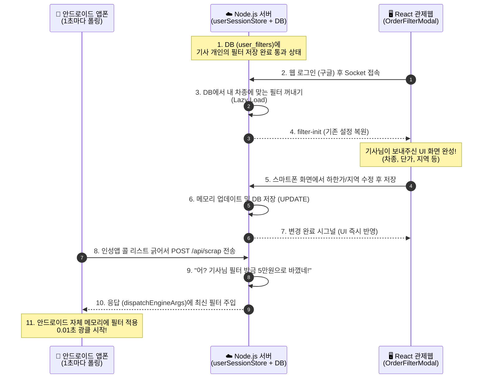
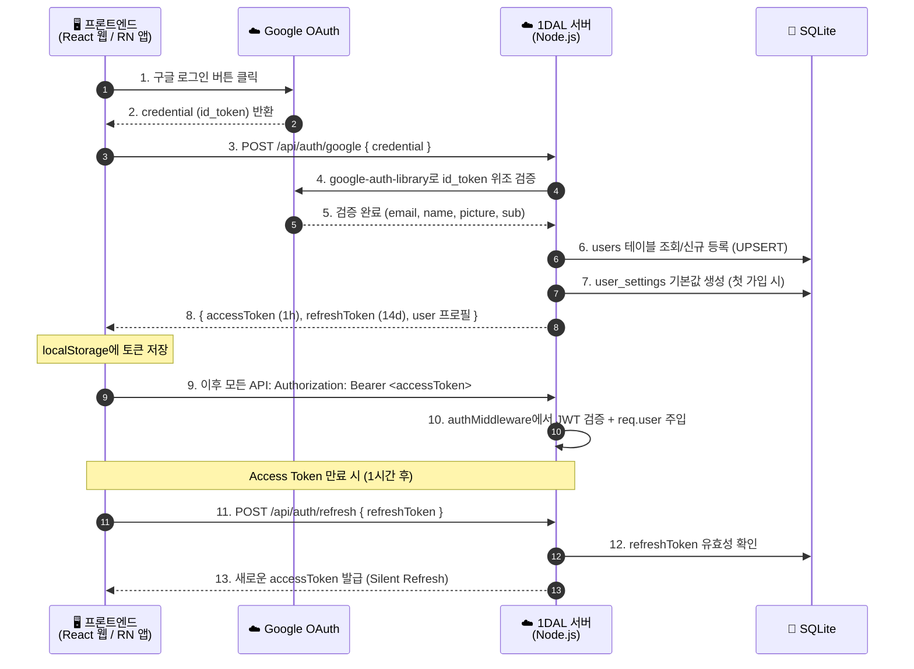
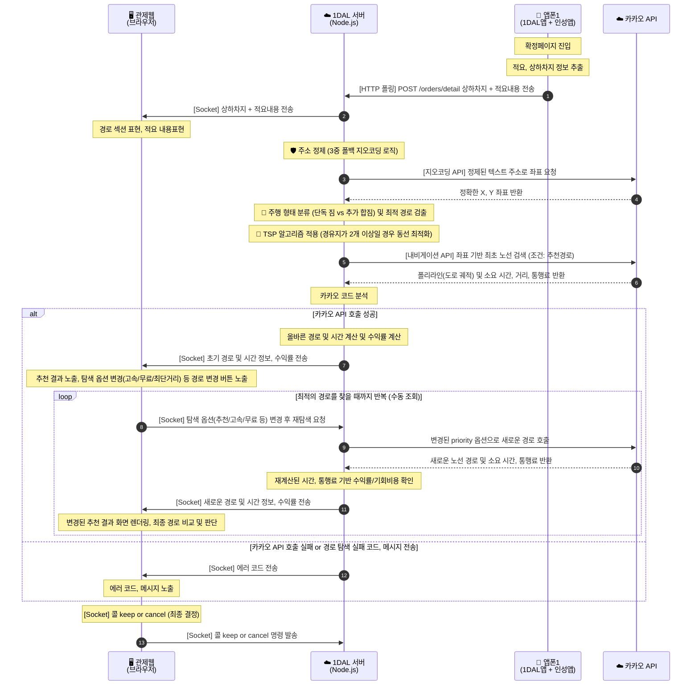

```mermaid
sequenceDiagram
    autonumber
    
    %% 그룹핑을 통해 어디에 뭐가 설치되어 있는지 시각화
    box "1DAL 관제 시스템"
        participant 관제탑 as 🖥️ 관제웹<br/>(브라우저)
        participant 서버 as ☁️ 1DAL 서버<br/>(Node.js)
    end
    box "현장 안드로이드 폰"
        participant 앱폰1 as 📱 앱폰1<br/>(1DAL앱 + 인성앱)
        participant 앱폰2 as 📱 앱폰2<br/>(1DAL앱 + 인성앱)
    end
    box "외부 연동망"
        participant 인성DB as ☁️ 인성 서버
        participant 카카오 as ☁️ 카카오 API
    end

    Note over 관제탑, 서버: 관제웹 ↔ 1DAL서버: 실시간 Socket.io
    Note over 서버, 앱폰2 : 폰 1DAL앱 ↔ 1DAL서버: HTTP 폴링 (REST)
    Note over 앱폰1, 인성DB : 폰 인성앱 ↔ 인성서버: 인성 자체 소켓

    서버->>서버: 서버 기동 및 디폴트 필터 셋업 (대기 모드)
    Note over 관제탑: 1DAL 웹(관제웹) 시작, 로그인 
    서버-->>관제탑: [Socket] 디폴트 필터 설정값 전송 (관제 UI 초기화)
    Note over 관제탑: 필터 섹션에 표시
    관제탑->>관제탑: 필터 설정(첫콜)
    관제탑->>서버: [Socket] 첫콜 필터 설정값 전송 (서버 필터 세팅 업데이트)
    
    Note over 앱폰1: [0초] 인성앱 실행 후 1DAL앱 접근성 권한 on  
    앱폰1->>서버: [HTTP 폴링] POST /api/scrap (아이디전송)
    서버->>관제탑: [Socket] 폰 정보 전송
    Note over 관제탑: 폰 섹션에 앱폰1 추가
    서버-->>앱폰1: [HTTP 폴링] 응답 (첫콜필터정보)
    인성DB-->>앱폰1: [인성 Socket] 리스트 푸시 (수신)

    Note over 앱폰2: [1초] 인성앱 실행 후 1DAL앱 접근성 권한 on
    앱폰2->>서버: [HTTP 폴링] POST /api/scrap (아이디전송)
    서버->>관제탑: [Socket] 폰 정보 전송
    Note over 관제탑: 폰 섹션에 앱폰2 추가
    서버-->>앱폰2: [HTTP 폴링] 응답 (첫콜필터정보)
    인성DB-->>앱폰2: [인성 Socket] 리스트 푸시 (수신)
    
    rect rgb(30, 41, 59)
    Note over 관제탑, 인성DB: [3초 ~ 6초] ⭐ 첫짐 1차 선점 (앱폰1 맹활약)
    Note over 관제탑: 관제 대기 중
    Note over 인성DB: 콜 발생 (주인 없음)
    인성DB-->>앱폰1: [인성 Socket] 새 리스트 푸시
    Note over 앱폰1: AccessibilityService로 바뀐 리스트 감지 후 text 추출 

    Note over 앱폰1: text로 필터 조건으로 꿀콜로 판단 
    alt 똥콜로 판단
        Note over 앱폰1: 리스트 무시하고 다음 감시 대기
    else 꿀콜로 판단
        Note over 앱폰1: 리스트에서 꿀콜로 판단된 콜영역 클릭 
        앱폰1->>인성DB: [인성 Socket] 인성콜에 선택된 콜 정보 전달
        인성DB-->>앱폰1: 상세페이지 데이터 전달 
        Note over 앱폰1: 상세페이지 진입
        Note over 앱폰1: 상세페이지 데이터(확정,적요상세,출발지,도착지) 추출 
        Note over 앱폰1: 추출된 데이터로 한번더 필터링 
        alt 2차 필터링 실패
            Note over 앱폰1: 상세페이지에서 '취소' 추출 후 클릭   
            Note over 앱폰1: 리스트 페이지 진입
        else 2차 필터링 통과
            Note over 앱폰1: 상세페이지에서 '확정' 추출 후 클릭   
            앱폰1->>인성DB: [인성 Socket] 콜 확정 완료
            인성DB-->>앱폰1: 확정페이지 데이터 전달 
            Note over 앱폰1: 확정페이지 진입
            앱폰1->>서버: [HTTP 폴링] POST /orders/confirm 확정정보 정보 전송
            Note over 서버 : 대기 필터로 설정값 업데이트
            서버-->>앱폰1: [HTTP 폴링] 응답 /orders/confirm 
            서버->>관제탑: [Socket] 확정정보 정보 + 대기 필터 정보 전송
            Note over 관제탑: 닫기 ,취소 버튼 노출
            
            Note over 앱폰1: 확정페이지에서 '적요상세' 추출 후 클릭
            앱폰1->>인성DB: [인성 Socket] 적요상세 정보 요청 
            인성DB-->>앱폰1: 적요상세 정보 전달 
            Note over 앱폰1: 적요상세페이지에서 '젹요 내용' 추출 및 저장 후 닫기 클릭
            Note over 앱폰1: 확정페이지 진입
            Note over 앱폰1: 확정페이지에서 '출발지' 추출 후 클릭
            앱폰1->>인성DB: [인성 Socket] 출발지 정보 요청 
            인성DB-->>앱폰1: 출발지 정보 전달 
            Note over 앱폰1: 출발지페이지 text중 '전화, 위치' 추출 및 저장 후 닫기 클릭
            Note over 앱폰1: 확정페이지 진입
            Note over 앱폰1: 확정페이지에서 '도착지' 추출 후 클릭 
            앱폰1->>인성DB: [인성 Socket] 도착지 정보 요청
            인성DB-->>앱폰1: 도착지 정보 전달 
            Note over 앱폰1: 도착지페이지 text중 '전화, 위치' 추출 및 저장 후 닫기 클릭
            Note over 앱폰1: 확정페이지 진입
            앱폰1->>서버: [HTTP 폴링] POST /orders/detail 상하차지 + 적요내용 정보 전송
            서버->>관제탑: [Socket] 상하차지 + 적요내용 정보 전송
            Note over 관제탑: 경로 섹션 표현, 적요 내용표현 
            Note over 서버: 🛡️ [카카오 API 3중 폴백] 괄호제거 ➡️ 주소검색 ➡️ 키워드검색 ➡️ 4어절 절사
            서버->>카카오: 3중 폴백 거친 정제 주소로 좌표/경로 및 시간 요청
            카카오-->>서버: 좌표 기반 노선 경로 및 소요 시간 반환
            Note over 서버: 올바른 경로 및 시간 계산 및 수익률 계산
            서버->>관제탑: [Socket] 경로 및 시간 정보, 수익률 전송
            Note over 관제탑: 추천 결과 노출, 경로보기버튼 추가 노출 후 판단 (취소 or 닫기)

            alt 취소를 선택한 경우 (Cancel)
                관제탑->>서버: [Socket] 취소 전달 
                Note over 서버: 첫콜 필터로 설정값 업데이트
                서버->>관제탑: [Socket] 첫콜 필터 전송 (UI 대기화면 복구)
                Note over 관제탑: 관제 대기 중
                서버-->>앱폰1: [HTTP 폴링] 응답 /orders/detail 취소 정보 전송
                Note over 앱폰1: 확정페이지 진입으로 바뀐 text중 '취소' 추출 후 클릭 
                앱폰1->>인성DB: [인성 Socket] 취소
                인성DB-->>앱폰1: 리스트 데이터 전달 
                Note over 앱폰1: 리스트 페이지로 복귀 후 감지 대기 
            else 닫기(유지)를 선택한 경우 (Keep)
                관제탑->>서버: [Socket] 유지 전달 
                Note over 서버: 합짐 필터로 설정값 업데이트 (합짐 사냥용)
                서버->>관제탑: [Socket] 합짐 필터 전송 (대시보드 합짐 모드)
                Note over 관제탑: 합짐 사냥 모드 돌입
                서버-->>앱폰1: [HTTP 폴링] 응답 /orders/detail 유지 정보 전송
                Note over 앱폰1: '닫기' 클릭 후 리스트 페이지로 복귀 후 감지 대기 
            end      
        end
    
    
    
    
    end
    
    
    end
    
    rect rgb(60, 20, 20)
    Note over 관제탑, 인성DB: [7초 ~ 12초] 🎯 합짐 2차 선점 (앱폰2 맹활약 - 1초 엇박자)
    Note over 서버: 앞선 단계에서 서버가 앱폰들에게 '합짐 레이더' 필터를 배포한 상태
    Note over 인성DB: 합짐 조건(동선)에 맞는 꿀콜 발생
    인성DB-->>앱폰2: [인성 Socket] 새 리스트 푸시 (앱폰1은 엇박자로 뒷북 로딩중)
    Note over 앱폰2: AccessibilityService로 리스트 감지 후 합짐 레이더 통과
    
    앱폰2->>인성DB: [인성 Socket] 인성콜 리스트 클릭
    인성DB-->>앱폰2: 상세페이지 데이터 전달
    Note over 앱폰2: '확정' 추출 후 즉시 클릭 (합짐 낚아챔)
    앱폰2->>인성DB: [인성 Socket] 콜 확정 완료
    인성DB-->>앱폰2: 확정페이지 데이터 전달
    
    앱폰2->>서버: [HTTP 폴링] POST /orders/confirm 확정(합짐) 정보 전송
    서버-->>앱폰2: [HTTP 폴링] 응답 /orders/confirm
    
    Note over 앱폰2: 적요상세, 출발지, 도착지 추출 순차 진행...
    
    앱폰2->>서버: [HTTP 폴링] POST /orders/detail 상하차지 + 적요내용 정보 전송
    서버->>관제탑: [Socket] 합짐 상하차지 + 적요 전송
    Note over 관제탑: 대시보드 상단 Subway UI (상차→상차→하차) 노선도 업데이트
    
    서버->>카카오: 기존 동선 대비 추가 경유지(합짐) 포함 요청
    카카오-->>서버: 우회 노선 경로 및 시간 반환
    Note over 서버: 서버단 동적 우회 연산 (+12분 추가, +4km 추가 도출)
    서버->>관제탑: [Socket] 합짐 패널티 연산 결과 (기회비용) 브리핑 전송
    Note over 관제탑: 수익률/패널티 확인 후 '닫기(수락)' 최종 결재 클릭
    
    관제탑->>서버: [Socket] 합짐 최종 유지 전달
    Note over 서버: 2번째 합짐 대비 콜필터 재변경 및 카카오맵 경유지 링크 생성
    서버->>관제탑: [Socket] 운행일지 DB 세팅 정보 브로드캐스트
    서버-->>앱폰2: [HTTP 폴링] 응답 /orders/detail 합짐 수락(유지) 결과 전송
    Note over 앱폰2: '닫기' 클릭 후 콜 유지 상태로 합짐 감시 대기
    end


```

## 🔄 3각 동기화 (Triangular Synchronization) 흐름도: 다중 기기 필터/상태 동기화

```mermaid
sequenceDiagram
    autonumber
    participant 앱 as 📱 안드로이드 앱폰<br>(1초마다 폴링)
    participant 서버 as ☁️ Node.js 서버<br>(userSessionStore + DB)
    participant 관제 as 🖥️ React 관제웹<br>(OrderFilterModal)

    Note over 서버: 1. DB (user_filters)에<br>기사 개인의 필터 저장 완료 통과 상태

    관제->>서버: 2. 웹 로그인 (구글) 후 Socket 접속
    서버->>서버: 3. DB에서 내 차종에 맞는 필터 꺼내기<br>(Lazy Load)
    서버-->>관제: 4. filter-init (기존 설정 복원)
    Note over 관제: 기사님이 보내주신 UI 화면 완성!<br>(차종, 단가, 지역 등)

    관제->>서버: 5. 스마트폰 화면에서 하한가/지역 수정 후 저장
    서버->>서버: 6. 메모리 업데이트 및 DB 저장 (UPDATE)
    서버-->>관제: 7. 변경 완료 시그널 (UI 즉시 반영)

    앱->>서버: 8. 인성앱 콜 리스트 긁어서 POST /api/scrap 전송
    서버->>서버: 9. "어? 기사님 필터 방금 5만원으로 바꼈네!"
    서버-->>앱: 10. 응답 (dispatchEngineArgs)에 최신 필터 주입
    Note over 앱: 11. 안드로이드 자체 메모리에 필터 적용<br>0.01초 광클 시작!
```

### 3-1. 인증 시퀀스 다이어그램

```mermaid
sequenceDiagram
    autonumber
    participant 유저 as 🖥️ 프론트엔드<br/>(React 웹 / RN 앱)
    participant 구글 as ☁️ Google OAuth
    participant 서버 as ☁️ 1DAL 서버<br/>(Node.js)
    participant DB as 💾 SQLite

    유저->>구글: 1. 구글 로그인 버튼 클릭
    구글-->>유저: 2. credential (id_token) 반환
    유저->>서버: 3. POST /api/auth/google { credential }
    서버->>구글: 4. google-auth-library로 id_token 위조 검증
    구글-->>서버: 5. 검증 완료 (email, name, picture, sub)
    서버->>DB: 6. users 테이블 조회/신규 등록 (UPSERT)
    서버->>DB: 7. user_settings 기본값 생성 (첫 가입 시)
    서버-->>유저: 8. { accessToken (1h), refreshToken (14d), user 프로필 }
    
    Note over 유저: localStorage에 토큰 저장

    유저->>서버: 9. 이후 모든 API: Authorization: Bearer <accessToken>
    서버->>서버: 10. authMiddleware에서 JWT 검증 + req.user 주입

    Note over 유저,서버: Access Token 만료 시 (1시간 후)
    유저->>서버: 11. POST /api/auth/refresh { refreshToken }
    서버->>DB: 12. refreshToken 유효성 확인
    서버-->>유저: 13. 새로운 accessToken 발급 (Silent Refresh)
```

### 3-1. 카카오 경로탐색 시퀀스 다이어그램

```mermaid
sequenceDiagram
    autonumber
    participant 관제탑 as 🖥️ 관제웹<br/>(브라우저)
    participant 서버 as ☁️ 1DAL 서버<br/>(Node.js)
    participant 앱폰1 as 📱 앱폰1<br/>(1DAL앱 + 인성앱)
    participant 카카오 as ☁️ 카카오 API
    
    Note over 앱폰1: 확정페이지 진입
    Note over 앱폰1: 적요, 상하차지 정보 추출
    앱폰1->>서버: [HTTP 폴링] POST /orders/detail 상하차지 + 적요내용 전송
    서버->>관제탑: [Socket] 상하차지 + 적요내용 전송
    Note over 관제탑: 경로 섹션 표현, 적요 내용표현 
    Note over 서버: 🛡️ 주소 정제 (3중 폴백 지오코딩 로직)
    서버->>카카오: [지오코딩 API] 정제된 텍스트 주소로 좌표 요청
    카카오-->>서버: 정확한 X, Y 좌표 반환
    Note over 서버: 🚙 주행 형태 분류 (단독 짐 vs 추가 합짐) 및 최적 경로 검출
    Note over 서버: 🧩 TSP 알고리즘 적용 (경유지가 2개 이상일 경우 동선 최적화)
    서버->>카카오: [내비게이션 API] 좌표 기반 최초 노선 검색 (조건: 추천경로)
    카카오-->>서버: 폴리라인(도로 궤적) 및 소요 시간, 거리, 통행료 반환
    Note over 서버: 카카오 코드 분석 
    alt 카카오 API 호출 성공
        Note over 서버: 올바른 경로 및 시간 계산 및 수익률 계산
        서버->>관제탑: [Socket] 초기 경로 및 시간 정보, 수익률 전송
        Note over 관제탑: 추천 결과 노출, 탐색 옵션 변경(고속/무료/최단거리) 등 경로 변경 버튼 노출
        loop 최적의 경로를 찾을 때까지 반복 (수동 조회)
            관제탑->>서버: [Socket] 탐색 옵션(추천/고속/무료 등) 변경 후 재탐색 요청
            서버->>카카오: 변경된 priority 옵션으로 새로운 경로 호출 
            카카오-->>서버: 새로운 노선 경로 및 소요 시간, 통행료 반환
            Note over 서버: 재계산된 시간, 통행료 기반 수익률/기회비용 확인
            서버->>관제탑: [Socket] 새로운 경로 및 시간 정보, 수익률 전송
            Note over 관제탑: 변경된 추천 결과 화면 렌더링, 최종 경로 비교 및 판단
        end    
    else 카카오 API 호출 실패 or 경로 탐색 실패 코드, 메시지 전송
        서버->>관제탑: [Socket] 에러 코드 전송 
        Note over 관제탑: 에러 코드, 메시지 노출
    end
    
    
    
    Note over 관제탑: [Socket] 콜 keep or cancel (최종 결정)
    관제탑->>서버: [Socket] 콜 keep or cancel 명령 발송
```