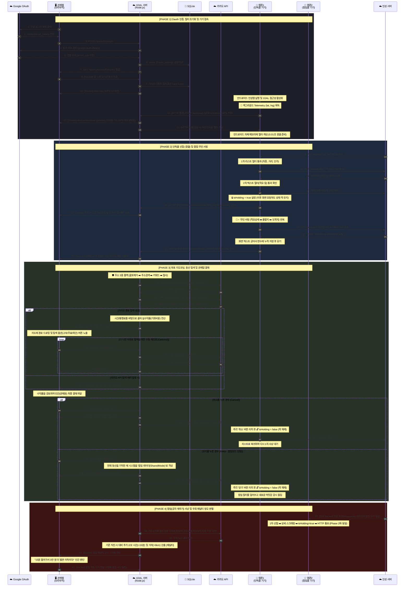

```mermaid
sequenceDiagram
    autonumber
    participant 구글 as ☁️ Google OAuth
    participant 관제탑 as 🖥️ 관제웹<br/>(브라우저)
    participant 서버 as ☁️ 1DAL 서버<br/>(Node.js)
    participant DB as 💾 SQLite
    participant 카카오 as ☁️ 카카오 API
    participant 앱폰1 as 📱 앱폰1<br/>(단독콜 기기)
    participant 앱폰2 as 📱 앱폰2<br/>(합짐콜 기기)
    participant 인성DB as ☁️ 인성 서버

    %% =========================================================
    %% [PHASE 1] 인증 및 환경 세팅
    %% =========================================================
    rect rgb(30, 30, 40)
    Note over 관제탑, 앱폰2: [PHASE 1] Oauth 인증, 필터 초기화 및 기기 접속
    
    관제탑->>구글: 1. 구글 로그인 버튼 클릭
    구글-->>관제탑: 2. credential (id_token) 반환
    관제탑->>서버: 3. POST /api/auth/google
    서버->>구글: 4. 토큰 위조 검증 (google-auth-library)
    구글-->>서버: 5. 검증 완료 (email, sub 반환)
    서버->>DB: 6. users 및 user_settings 생성/조회
    서버-->>관제탑: 7. JWT Token (Access/Refresh) 발급
    관제탑->>서버: 8. [Socket] 웹 소켓 실시간 통신 연결
    서버->>DB: 9. 기사의 디폴트 필터 옵션 Lazy Load
    서버-->>관제탑: 10. [Socket] filter-init (프론트 UI 복원)
    
    Note over 앱폰1: 안드로이드 인성앱 실행 및 1DAL 접근성 활성화
    Note over 앱폰1: 📍 백그라운드 Telemetry (lat, lng) 획득
    앱폰1->>서버: 11. [HTTP 폴링] POST /api/scrap (상태+isHolding+GPS 전송)
    서버->>관제탑: 12. [Socket] device-sessions-updated (지도에 기사 GPS 마커 렌더링)
    서버-->>앱폰1: 13. [HTTP 폴링] 응답 시 최신 단독콜 필터 주입
    Note over 앱폰1: 안드로이드 자체 메모리에 필터 캐싱 (0.01초 광클 준비)
    end

    %% =========================================================
    %% [PHASE 2] 단독콜 1차 사냥 및 팝업 서핑
    %% =========================================================
    rect rgb(30, 41, 59)
    Note over 관제탑, 앱폰2: [PHASE 2] 단독콜 선점 (광클) 및 팝업 무인 서핑
    
    인성DB-->>앱폰1: 14. [인성 Socket] 신규 오더 리스트 푸시
    Note over 앱폰1: 1차 리스트 필터 통과 (차종, 거리, 단가)
    앱폰1->>인성DB: 15. [인성 Socket] 해당 오더 클릭 (가로채기!)
    인성DB-->>앱폰1: 16. 상세페이지 진입 및 데이터 노출
    Note over 앱폰1: 2차 텍스트 필터(적요 등) 통과 확인
    
    앱폰1->>인성DB: 17. '확정' 버튼 광클 및 확정 명령
    Note over 앱폰1: 🔒 isHolding = true 설정 (이후 화면 요동쳐도 상태 락 유지)
    앱폰1->>서버: 18. [HTTP 폴링] POST /orders/confirm (확정 사실 및 isHolding 전송)
    서버->>관제탑: 19. [Socket] 확정 수신 및 대시보드 [🔒 콜 처리 중] 배지 노출
    
    Note over 앱폰1: 🏄‍♂️ 무인 서핑 (적요상세 ➡️ 출발지 ➡️ 도착지) 반복
    앱폰1->>인성DB: 20. [인성 Socket] 각 팝업별 버튼 터치하여 상세 호출
    인성DB-->>앱폰1: 21. 연락처, 세부 주소 등 세부 데이터 노출
    Note over 앱폰1: 화면 텍스트 긁어서 변수에 누적 저장 후 닫기
    
    앱폰1->>서버: 22. [HTTP 폴링] POST /orders/detail (긁어모은 상하차지+적요 전송)
    서버->>관제탑: 23. [Socket] 관제탑 UI에 출발지 가안 및 적요 내용 선출력
    end

    %% =========================================================
    %% [PHASE 3] 카카오 연산 및 관제탑 결재 (기동 방어)
    %% =========================================================
    rect rgb(40, 50, 40)
    Note over 관제탑, 앱폰2: [PHASE 3] 좌표 지오코딩, 동선 탐색 및 관제탑 결재
    
    Note over 서버: 🛡️ 주소 3중 폴백 (괄호제거 ➡️ 주소검색 ➡️ 키워드 ➡️ 절사)
    서버->>카카오: 24. [지오코딩 API] 정제 텍스트로 정확한 좌표 요청
    카카오-->>서버: 25. 정확한 상하차지 X, Y 좌표 반환
    
    서버->>카카오: 26. [내비게이션 API] 단독 노선 검색 (조건: 추천경로)
    카카오-->>서버: 27. 폴리라인(도로 궤적), 소요 시간, 거리, 통행료 반환
    
    alt 카카오 경로 탐색 성공
        Note over 서버: 시간/통행료를 바탕으로 콜의 실수익률(기회비용) 연산
        서버->>관제탑: 28. [Socket] 초기 경로 정보 및 수익률 브리핑 전송
        Note over 관제탑: 지도에 경로 드로잉 및 탐색 옵션(고속/무료/최단) 버튼 노출
        
        loop 더 나은 우회로 탐색을 위한 수동 재조회 (Optional)
            관제탑->>서버: 29. 옵션 변경 후 재탐색 요청
            서버->>카카오: 30. [내비 재요청] Priority 변경
            카카오-->>서버: 31. 신규 노선 데이터
            서버->>관제탑: 32. 렌더링 갱신
        end
    else 카카오 API 탐색 에러 발생 시
        서버->>관제탑: 28-1. [Socket] 에러 코드 및 얼럿 모달 전송
    end

    Note over 관제탑: 수익률을 검토하여 인간(관제원) 최종 결재 하달
    
    alt 취소를 누른 경우 (Cancel)
        관제탑->>서버: 33. [Socket] 취소 판결 하달
        서버->>관제탑: 34. 첫콜 사냥용 기본 필터로 원복
        서버-->>앱폰1: 35. [HTTP 폴링] 응답으로 Action=Cancel 명령
        Note over 앱폰1: 즉각 '취소' 버튼 터치 후 🔓 isHolding = false (락 해제)
        앱폰1->>인성DB: 36. [인성 Socket] 취소 처리
        Note over 앱폰1: 리스트로 복귀하여 다시 1차 사냥 대기
        
    else 유지를 누른 경우 (Keep - 합짐모드 진입)
        관제탑->>서버: 33. [Socket] 유지 판결 하달
        Note over 서버: 현재 동선을 기억한 채 시스템을 '합짐 레이더(SharedMode)'로 격상
        서버->>관제탑: 34. 대시보드 UI를 합짐 사냥 모드로 전환
        서버-->>앱폰1: 35. [HTTP 폴링] 응답으로 Action=Keep 명령
        Note over 앱폰1: 즉각 '닫기' 버튼 터치 후 🔓 isHolding = false (락 해제)
        Note over 앱폰1: 합짐 필터를 덮어쓰고 새로운 먹잇감 감시 돌입
    end
    end

    %% =========================================================
    %% [PHASE 4] 다중 경유지(합짐) 사냥 알고리즘 
    %% =========================================================
    rect rgb(60, 20, 20)
    Note over 관제탑, 앱폰2: [PHASE 4] 합짐(공차 채우기) 사냥 및 우회 패널티 정오 판별
    
    인성DB-->>앱폰2: 37. [인성 Socket] 첫콜 동선(Waypoints) 궤적상의 합짐 오더 발생
    Note over 앱폰2: 1차 선점 ➡️ 상세 스크래핑 ➡️ isHolding=true ➡️ HTTP 통보 (Phase 2와 동일)
    
    서버->>카카오: 38. 기존 1번째 콜의 좌표 사이에 합짐지(경유지)를 끼워넣어 다중 TSP 연산
    카카오-->>서버: 39. 우회 노선 결과 반환
    
    Note over 서버: 기존 직진 시 대비 추가 소모 시간(+15분) 및 거리(+6km) 산출 (패널티)
    서버->>관제탑: 40. [Socket] 합짐 패널티 연산 브리핑 전송
    Note over 관제탑: "15분 돌아가서 3만 원 더 벌면 이득이다!" 인간 판단
    관제탑->>서버: 41. [Socket] 합짐 최종 유지 전달 (3번째 합짐 사냥 돌입)
    
    end
```