```mermaid
sequenceDiagram
    autonumber
    participant 구글 as ☁️ Google OAuth
    participant 관제탑 as 🖥️ 관제웹<br/>(브라우저)
    participant 서버 as ☁️ 1DAL 서버<br/>(Node.js)
    participant DB as 💾 SQLite
    participant 카카오 as ☁️ 카카오 API
    participant 앱폰1 as 📱 앱폰1<br/>(단독콜 기기)
    participant 앱폰2 as 📱 앱폰2<br/>(합짐콜 기기)
    participant 인성DB as ☁️ 인성 서버

    %% =========================================================
    %% [PHASE 1] 인증 및 환경 세팅
    %% =========================================================
    rect rgb(30, 30, 40)
    Note over 관제탑, 앱폰2: [PHASE 1] Oauth 인증, 필터 초기화 및 기기 접속
    
    관제탑->>구글: 1. 구글 로그인 버튼 클릭
    구글-->>관제탑: 2. credential (id_token) 반환
    관제탑->>서버: 3. POST /api/auth/google
    서버->>구글: 4. 토큰 위조 검증 (google-auth-library)
    구글-->>서버: 5. 검증 완료 (email, sub 반환)
    서버->>DB: 6. users 및 user_settings 생성/조회
    서버-->>관제탑: 7. JWT Token (Access/Refresh) 발급
    관제탑->>서버: 8. [Socket] 웹 소켓 실시간 통신 연결
    서버->>DB: 9. 기사의 디폴트 필터 옵션 Lazy Load
    서버-->>관제탑: 10. [Socket] filter-init (프론트 UI 복원)
    
    Note over 앱폰1: [Current Page: MainActivity] 1DAL 앱 실행 및 초기 설정
    앱폰1->>앱폰1: 배터리 최적화 예외 권한 획득
    앱폰1->>서버: 기기 연동 PIN 번호 입력 및 인증 요청 (Device Pairing)
    서버-->>앱폰1: 인증 성공 및 고유 deviceId 발급/저장
    Note over 앱폰1: 앱 기동 전 또는 백그라운드 ➡️ [Current Page: UNKNOWN]
    앱폰1->>앱폰1: 안드로이드 환경설정 진입하여 '1DAL 접근성 서비스' 활성화 (HijackService 기동)
    Note over 앱폰1: 📍 백그라운드 Telemetry (lat, lng) 획득 엔진 가동!
    앱폰1->>서버: 11. [HTTP] POST /api/scrap Req (상태+isHolding+GPS 전송)
    서버->>관제탑: 12. [Socket] device-sessions-updated (지도에 기사 GPS 마커 렌더링)
    서버-->>앱폰1: 13. [HTTP] 200 OK 응답 (최신 단독콜 필터 payload 주입)
    Note over 앱폰1: 인성앱 콜 리스트 렌더링 ➡️ [Current Page: LIST] 진입
    Note over 앱폰1: 안드로이드 자체 메모리에 필터 캐싱 완료 및 대기
    end

    %% =========================================================
    %% [PHASE 2] 단독콜 1차 사냥 및 팝업 서핑
    %% =========================================================
    rect rgb(30, 41, 59)
    Note over 관제탑, 앱폰2: [PHASE 2] 단독콜 선점 (광클) 및 팝업 무인 서핑
    
    인성DB-->>앱폰1: 14. [인성 Socket] 신규 오더 리스트 푸시 (UI 렌더링)
    Note over 앱폰1: [Current Page: LIST] 상태 유지 및 1차 리스트 필터 통과 확인
    앱폰1->>인성DB: 15. [UI 클릭] 해당 오더 터치 (꿀콜 가로채기!)
    인성DB-->>앱폰1: 16. [인성 Socket] 상세페이지 데이터 응답 및 UI 렌더링
    Note over 앱폰1: [Current Page: DETAIL_PRE_CONFIRM] 진입 완료
    Note over 앱폰1: 상세페이지 텍스트 추출 및 2차 필터(적요 등) 통과 확인
    
    앱폰1->>인성DB: 17. [UI 클릭] '확정' 버튼 광클 송신
    인성DB-->>앱폰1: 18. [인성 Socket] 확정 요청 처리 및 확정페이지 UI 렌더링
    Note over 앱폰1: [Current Page: DETAIL_CONFIRMED] 진입 완료
    Note over 앱폰1: 🔒 isHolding = true 설정 (이후 화면 요동쳐도 락 유지)
    앱폰1->>서버: 19. [HTTP] POST /orders/confirm Req (확정 데이터 전송)
    서버->>관제탑: 20. [Socket] 확정 수신 및 대시보드 [🔒 콜 처리 중] 배지 노출
    서버-->>앱폰1: 21. [HTTP] 200 OK 응답 (수신 완료)
    
    Note over 앱폰1: 🏄‍♂️ 무인 서핑 가동 (State Machine: IDLE)
    
    %% 적요상세 스텝
    Note over 앱폰1: [Current Page: DETAIL_CONFIRMED] 확정페이지 체류 및 팝업버튼 트리거 대기
    앱폰1->>인성DB: 20-1. [UI 클릭] '적요상세' 팝업 오픈 요청
    인성DB-->>앱폰1: [인성 Socket] 적요상세 팝업창 UI 렌더링 응답
    Note over 앱폰1: [Current Page: POPUP_MEMO] 진입 완료 ("적요 내용" 텍스트 매칭 확인)
    Note over 앱폰1: 적요상세 데이터 추출 및 메모리에 누적 저장
    앱폰1->>인성DB: 20-2. [UI 클릭] '닫기' 버튼 터치
    인성DB-->>앱폰1: [인성 Socket] 팝업 닫힘 및 확정페이지 UI 렌더링 응답
    
    %% 출발지 스텝
    Note over 앱폰1: [Current Page: DETAIL_CONFIRMED] 확정페이지 복귀 확인 (잔상 회피 완료)
    앱폰1->>인성DB: 20-3. [UI 클릭] '출발지' 팝업 오픈 요청
    인성DB-->>앱폰1: [인성 Socket] 출발지 팝업창 UI 렌더링 응답
    Note over 앱폰1: [Current Page: POPUP_PICKUP] 진입 완료 ("전화1" 텍스트 매칭 확인)
    Note over 앱폰1: 출발지 데이터 추출 및 메모리에 누적 저장
    앱폰1->>인성DB: 20-4. [UI 클릭] '닫기' 버튼 터치
    인성DB-->>앱폰1: [인성 Socket] 팝업 닫힘 및 확정페이지 UI 렌더링 응답
    
    %% 도착지 스텝
    Note over 앱폰1: [Current Page: DETAIL_CONFIRMED] 확정페이지 복귀 확인 (잔상 회피 완료)
    앱폰1->>인성DB: 20-5. [UI 클릭] '도착지' 팝업 오픈 요청
    인성DB-->>앱폰1: [인성 Socket] 도착지 팝업창 UI 렌더링 응답
    Note over 앱폰1: [Current Page: POPUP_DROPOFF] 진입 완료 ("전화1" 텍스트 매칭 확인)
    Note over 앱폰1: 도착지 데이터 추출 및 메모리에 누적 저장
    앱폰1->>인성DB: 20-6. [UI 클릭] '닫기' 버튼 터치
    인성DB-->>앱폰1: [인성 Socket] 팝업 닫힘 및 확정페이지 UI 렌더링 응답
    
    Note over 앱폰1: [Current Page: DETAIL_CONFIRMED] 무인 서핑 종료 (State Machine: DONE)
    
    앱폰1->>서버: 22. [HTTP] POST /orders/detail Req (상하차지+적요 배열 전송)
    서버-->>앱폰1: 23. [HTTP] 200 OK 응답 (텔레메트리 접수 완료)
    서버->>관제탑: 24. [Socket] 관제탑 UI에 출발지 가안 및 적요 내용 선출력
    end

    %% =========================================================
    %% [PHASE 3] 카카오 연산 및 관제탑 결재 (기동 방어)
    %% =========================================================
    rect rgb(40, 50, 40)
    Note over 관제탑, 앱폰2: [PHASE 3] 좌표 지오코딩, 동선 탐색 및 관제탑 결재
    
    Note over 서버: 🛡️ 주소 3중 폴백 (괄호제거 ➡️ 주소검색 ➡️ 키워드 ➡️ 절사)
    서버->>카카오: 24. [지오코딩 API] 정제 텍스트로 정확한 좌표 요청
    카카오-->>서버: 25. 정확한 상하차지 X, Y 좌표 반환
    
    서버->>카카오: 26. [내비게이션 API] 단독 노선 검색 (조건: 추천경로)
    카카오-->>서버: 27. 폴리라인(도로 궤적), 소요 시간, 거리, 통행료 반환
    
    alt 카카오 경로 탐색 성공
        Note over 서버: 시간/통행료를 바탕으로 콜의 실수익률(기회비용) 연산
        서버->>관제탑: 28. [Socket] 초기 경로 정보 및 수익률 브리핑 전송
        Note over 관제탑: 지도에 경로 드로잉 및 탐색 옵션(고속/무료/최단) 버튼 노출
        
        loop 더 나은 우회로 탐색을 위한 수동 재조회 (Optional)
            관제탑->>서버: 29. 옵션 변경 후 재탐색 요청
            서버->>카카오: 30. [내비 재요청] Priority 변경
            카카오-->>서버: 31. 신규 노선 데이터
            서버->>관제탑: 32. 렌더링 갱신
        end
    else 카카오 API 탐색 에러 발생 시
        서버->>관제탑: 28-1. [Socket] 에러 코드 및 얼럿 모달 전송
    end

    Note over 관제탑: 수익률을 검토하여 인간(관제원) 최종 결재 하달 혹은 무응답 대기
    
    %% 데스밸리 방어기동 추가
    Note over 앱폰1: ⏳ [데스밸리 방어] 확정 후 30초간 서버 무응답(네트워크/관제 지연) 시
    앱폰1->>인성DB: 32-1. [인성 Socket] 앱 자체 판단으로 취소 버튼 클릭 유발
    Note over 앱폰1: 🔓 isHolding = false 해제 및 자동 [Current Page: LIST] 복귀
    앱폰1->>서버: 32-2. [HTTP 폴링] 비상 취소 상태 통보
    
    alt 취소를 누른 경우 (Cancel)
        관제탑->>서버: 33. [Socket] 취소 판결 하달
        서버->>관제탑: 34. 첫콜 사냥용 기본 필터로 원복
        서버-->>앱폰1: 35. [HTTP 폴링] 응답으로 Action=Cancel 명령 수신
        Note over 앱폰1: [Current Page: DETAIL_CONFIRMED] 체류 상태 확인
        앱폰1->>인성DB: 36. [UI 클릭] 즉각 '취소' 버튼 터치 송신
        인성DB-->>앱폰1: [인성 Socket] 취소 정보 서버처리 후 리스트 페이지 응답
        Note over 앱폰1: [Current Page: LIST] 로 복귀 렌더링 완료
        Note over 앱폰1: 🔓 isHolding = false 락 해제. 다시 1차 사냥 대기
        
    else 유지를 누른 경우 (Keep - 합짐모드 진입)
        관제탑->>서버: 33. [Socket] 유지 판결 하달
        Note over 서버: 현재 동선을 기억한 채 시스템을 '합짐 레이더(SharedMode)'로 격상
        서버->>관제탑: 34. 대시보드 UI를 합짐 사냥 모드로 전환
        서버-->>앱폰1: 35. [HTTP 폴링] 응답으로 Action=Keep 명령 수신
        Note over 앱폰1: [Current Page: DETAIL_CONFIRMED] 체류 상태 확인
        앱폰1->>인성DB: 36. [UI 클릭] 즉각 '닫기' 버튼 터치 송신
        인성DB-->>앱폰1: [인성 Socket] 상세화면 닫힘 및 리스트 페이지 응답
        Note over 앱폰1: [Current Page: LIST] 로 복귀 렌더링 완료
        Note over 앱폰1: 🔓 isHolding = false 락 해제. 합짐 필터를 덮어쓰고 새로운 먹잇감 감시 돌입
    end
    end

    %% =========================================================
    %% [PHASE 4] 다중 경유지(합짐) 사냥 알고리즘 
    %% =========================================================
    rect rgb(60, 20, 20)
    Note over 관제탑, 앱폰2: [PHASE 4] 합짐(공차 채우기) 사냥 및 우회 패널티 정오 판별
    
    인성DB-->>앱폰2: 37. [인성 Socket] 첫콜 동선(Waypoints) 궤적상의 합짐 오더 리스트 푸시
    Note over 앱폰2: [Current Page: LIST] 대기 중 합짐 필터 통과 확인
    앱폰2->>인성DB: 38. [UI 클릭] 합짐 오더 터치 (1차 선점)
    인성DB-->>앱폰2: [인성 Socket] 상세페이지 응답 및 UI 렌더링
    Note over 앱폰2: [Current Page: DETAIL_PRE_CONFIRM] 진입 확인 및 상세 텍스트 스크래핑
    앱폰2->>인성DB: 39. [UI 클릭] '확정' 버튼 광클 송신
    인성DB-->>앱폰2: [인성 Socket] 확정페이지 응답 및 UI 렌더링
    Note over 앱폰2: [Current Page: DETAIL_CONFIRMED] 진입 완료 ➡️ 🔒 isHolding=true 설정
    
    서버->>카카오: 38. 기존 1번째 콜의 좌표 사이에 합짐지(경유지)를 끼워넣어 다중 TSP 연산
    카카오-->>서버: 39. 우회 노선 결과 반환
    
    Note over 서버: 기존 직진 시 대비 추가 소모 시간(+15분) 및 거리(+6km) 산출 (패널티)
    서버->>관제탑: 40. [Socket] 합짐 패널티 연산 브리핑 전송
    Note over 관제탑: "15분 돌아가서 3만 원 더 벌면 이득이다!" 인간 판단
    관제탑->>서버: 41. [Socket] 합짐 최종 유지 전달 (3번째 합짐 사냥 돌입)
    
    end
```

---

## 📦 주요 통신 페이로드 (Payload Schema Specification)

각 단계별 화살표에서 교환되는 핵심 데이터 모델입니다. 개발자는 이 스펙을 기준으로 기획안을 이해하고, `App`, `Server`, `Frontend` 간의 인터페이스 규격을 일치시켜 버그를 방지해야 합니다.

### 1. `POST /api/scrap` (앱 ➡️ 서버 : 정기 텔레메트리 및 화면 상태 전송)
안드로이드 앱이 0.1초~0.2초 간격으로 서버에 현재 상태를 무한히 넘겨주는 심장박동(Heartbeat) 페이로드입니다.
```json
{
  "deviceId": "앱폰-sdk_gpho-160",
  "context": "DETAIL_CONFIRMED",      // 물리적인 현재 화면 상태 명시 (LIST, DETAIL_PRE_CONFIRM, POPUP_MEMO 등)
  "isHolding": true,                  // 논리적인 시스템 락 상태 (팝업 무인 서핑 또는 결재 대기 시 true)
  "lat": 37.123456,                   // 백그라운드 GPS 획득 위도
  "lng": 127.123456,                  // 백그라운드 GPS 획득 경도
  "..." : "..."
}
```

### 2. `POST /orders/confirm` & `/orders/detail` (앱 ➡️ 서버 : 상세 데이터 획득 통보)
팝업 무인 서핑(`POPUP_MEMO` 등)을 거치며 스크래핑한 콜 정보를 카카오 지오코딩 및 분석을 위해 서버로 보내는 페이로드입니다.
```json
{
  "orderId": "721c7da7-e8fb-45a0-9b60-57b0d8242b41",
  "pickup": "경기 광주시 경안동 167-1",       
  "dropoff": "인천 남동구 논현동",
  "cargo": "다마스(급) / 상하차 도움",
  "fare": 58000
}
```