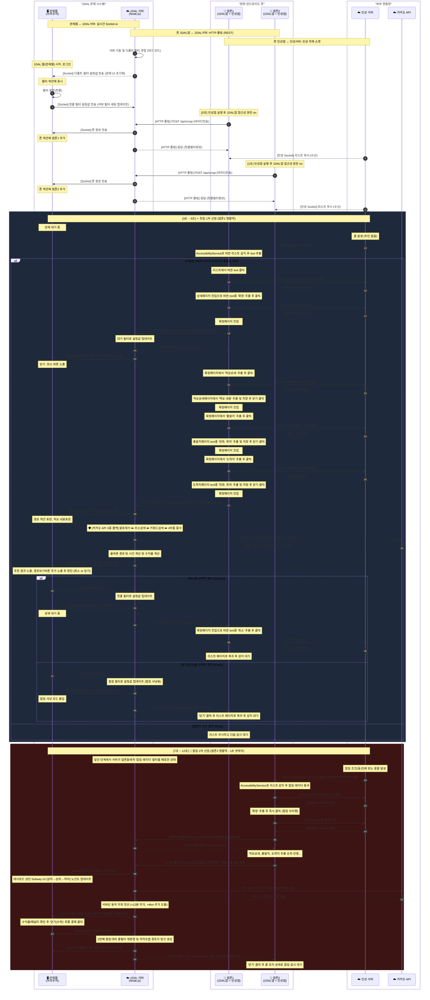

```mermaid
sequenceDiagram
    autonumber
    
    %% 그룹핑을 통해 어디에 뭐가 설치되어 있는지 시각화
    box "1DAL 관제 시스템"
        participant 관제탑 as 🖥️ 관제웹<br/>(브라우저)
        participant 서버 as ☁️ 1DAL 서버<br/>(Node.js)
    end
    box "현장 안드로이드 폰"
        participant 앱폰1 as 📱 앱폰1<br/>(1DAL앱 + 인성앱)
        participant 앱폰2 as 📱 앱폰2<br/>(1DAL앱 + 인성앱)
    end
    box "외부 연동망"
        participant 인성DB as ☁️ 인성 서버
        participant 카카오 as ☁️ 카카오 API
    end

    Note over 관제탑, 서버: 관제웹 ↔ 1DAL서버: 실시간 Socket.io
    Note over 서버, 앱폰2 : 폰 1DAL앱 ↔ 1DAL서버: HTTP 폴링 (REST)
    Note over 앱폰1, 인성DB : 폰 인성앱 ↔ 인성서버: 인성 자체 소켓

    서버->>서버: 서버 기동 및 디폴트 필터 셋업 (대기 모드)
    Note over 관제탑: 1DAL 웹(관제웹) 시작, 로그인 
    서버-->>관제탑: [Socket] 디폴트 필터 설정값 전송 (관제 UI 초기화)
    Note over 관제탑: 필터 섹션에 표시
    관제탑->>관제탑: 필터 설정(첫콜)
    관제탑->>서버: [Socket] 첫콜 필터 설정값 전송 (서버 필터 세팅 업데이트)
    
    Note over 앱폰1: [0초] 인성앱 실행 후 1DAL앱 접근성 권한 on  
    앱폰1->>서버: [HTTP 폴링] POST /api/scrap (아이디전송)
    서버->>관제탑: [Socket] 폰 정보 전송
    Note over 관제탑: 폰 섹션에 앱폰1 추가
    서버-->>앱폰1: [HTTP 폴링] 응답 (첫콜필터정보)
    인성DB-->>앱폰1: [인성 Socket] 리스트 푸시 (수신)

    Note over 앱폰2: [1초] 인성앱 실행 후 1DAL앱 접근성 권한 on
    앱폰2->>서버: [HTTP 폴링] POST /api/scrap (아이디전송)
    서버->>관제탑: [Socket] 폰 정보 전송
    Note over 관제탑: 폰 섹션에 앱폰2 추가
    서버-->>앱폰2: [HTTP 폴링] 응답 (첫콜필터정보)
    인성DB-->>앱폰2: [인성 Socket] 리스트 푸시 (수신)
    
    rect rgb(30, 41, 59)
    Note over 관제탑, 인성DB: [3초 ~ 6초] ⭐ 첫짐 1차 선점 (앱폰1 맹활약)
    Note over 관제탑: 관제 대기 중
    Note over 인성DB: 콜 발생 (주인 없음)
    인성DB-->>앱폰1: [인성 Socket] 새 리스트 푸시
    Note over 앱폰1: AccessibilityService로 바뀐 리스트 감지 후 text 추출 

    alt 추출된 text로 4가지 조건으로 꿀콜로 판단
    Note over 앱폰1: 리스트에서 바뀐 text 클릭 
    앱폰1->>인성DB: [인성 Socket] 인성콜에 선택된 콜 정보 전달
    인성DB-->>앱폰1: 상세페이지 데이터 전달 
    Note over 앱폰1: 상세페이지 진입으로 바뀐 text중 '확정' 추출 후 클릭 
    앱폰1->>인성DB: [인성 Socket] 콜 확정 완료
    인성DB-->>앱폰1: 확정페이지 데이터 전달 
    Note over 앱폰1: 확정페이지 진입
    앱폰1->>서버: [HTTP 폴링] POST /orders/confirm 확정정보 정보 전송
    Note over 서버 : 대기 필터로 설정값 업데이트
    서버-->>앱폰1: [HTTP 폴링] 응답 /orders/confirm 
    서버->>관제탑: [Socket] 확정정보 정보 + 대기 필터 정보 전송
    Note over 관제탑: 닫기 ,취소 버튼 노출
    
    Note over 앱폰1: 확정페이지에서 '적요상세' 추출 후 클릭
    앱폰1->>인성DB: [인성 Socket] 적요상세 정보 요청 
    인성DB-->>앱폰1: 적요상세 정보 전달 
    Note over 앱폰1: 적요상세페이지에서 '젹요 내용' 추출 및 저장 후 닫기 클릭
    Note over 앱폰1: 확정페이지 진입
    Note over 앱폰1: 확정페이지에서 '출발지' 추출 후 클릭
    앱폰1->>인성DB: [인성 Socket] 출발지 정보 요청 
    인성DB-->>앱폰1: 출발지 정보 전달 
    Note over 앱폰1: 출발지페이지 text중 '전화, 위치' 추출 및 저장 후 닫기 클릭
    Note over 앱폰1: 확정페이지 진입
    Note over 앱폰1: 확정페이지에서 '도착지' 추출 후 클릭 
    앱폰1->>인성DB: [인성 Socket] 도착지 정보 요청
    인성DB-->>앱폰1: 도착지 정보 전달 
    Note over 앱폰1: 도착지페이지 text중 '전화, 위치' 추출 및 저장 후 닫기 클릭
    Note over 앱폰1: 확정페이지 진입
    앱폰1->>서버: [HTTP 폴링] POST /orders/detail 상하차지 + 적요내용 정보 전송
    서버->>관제탑: [Socket] 상하차지 + 적요내용 정보 전송
    Note over 관제탑: 경로 섹션 표현, 적요 내용표현 
    Note over 서버: 🛡️ [카카오 API 3중 폴백] 괄호제거 ➡️ 주소검색 ➡️ 키워드검색 ➡️ 4어절 절사
    서버->>카카오: 3중 폴백 거친 정제 주소로 좌표/경로 및 시간 요청
    카카오-->>서버: 좌표 기반 노선 경로 및 소요 시간 반환
    Note over 서버: 올바른 경로 및 시간 계산 및 수익률 계산
    서버->>관제탑: [Socket] 경로 및 시간 정보, 수익률 전송
    Note over 관제탑: 추천 결과 노출, 경로보기버튼 추가 노출 후 판단 (취소 or 닫기)

    alt 취소를 선택한 경우 (Cancel)
        관제탑->>서버: [Socket] 취소 전달 
        Note over 서버: 첫콜 필터로 설정값 업데이트
        서버->>관제탑: [Socket] 첫콜 필터 전송 (UI 대기화면 복구)
        Note over 관제탑: 관제 대기 중
        서버-->>앱폰1: [HTTP 폴링] 응답 /orders/detail 취소 정보 전송
        Note over 앱폰1: 확정페이지 진입으로 바뀐 text중 '취소' 추출 후 클릭 
        앱폰1->>인성DB: [인성 Socket] 취소
        인성DB-->>앱폰1: 리스트 데이터 전달 
        Note over 앱폰1: 리스트 페이지로 복귀 후 감지 대기 
    else 닫기(유지)를 선택한 경우 (Keep)
        관제탑->>서버: [Socket] 유지 전달 
        Note over 서버: 합짐 필터로 설정값 업데이트 (합짐 사냥용)
        서버->>관제탑: [Socket] 합짐 필터 전송 (대시보드 합짐 모드)
        Note over 관제탑: 합짐 사냥 모드 돌입
        서버-->>앱폰1: [HTTP 폴링] 응답 /orders/detail 유지 정보 전송
        Note over 앱폰1: '닫기' 클릭 후 리스트 페이지로 복귀 후 감지 대기 
    end
    
    
    else 꿀콜이 아닌 경우 (Else)
    Note over 앱폰1: 리스트 무시하고 다음 감시 대기
    end
    
    
    end
    
    rect rgb(60, 20, 20)
    Note over 관제탑, 인성DB: [7초 ~ 12초] 🎯 합짐 2차 선점 (앱폰2 맹활약 - 1초 엇박자)
    Note over 서버: 앞선 단계에서 서버가 앱폰들에게 '합짐 레이더' 필터를 배포한 상태
    Note over 인성DB: 합짐 조건(동선)에 맞는 꿀콜 발생
    인성DB-->>앱폰2: [인성 Socket] 새 리스트 푸시 (앱폰1은 엇박자로 뒷북 로딩중)
    Note over 앱폰2: AccessibilityService로 리스트 감지 후 합짐 레이더 통과
    
    앱폰2->>인성DB: [인성 Socket] 인성콜 리스트 클릭
    인성DB-->>앱폰2: 상세페이지 데이터 전달
    Note over 앱폰2: '확정' 추출 후 즉시 클릭 (합짐 낚아챔)
    앱폰2->>인성DB: [인성 Socket] 콜 확정 완료
    인성DB-->>앱폰2: 확정페이지 데이터 전달
    
    앱폰2->>서버: [HTTP 폴링] POST /orders/confirm 확정(합짐) 정보 전송
    서버-->>앱폰2: [HTTP 폴링] 응답 /orders/confirm
    
    Note over 앱폰2: 적요상세, 출발지, 도착지 추출 순차 진행...
    
    앱폰2->>서버: [HTTP 폴링] POST /orders/detail 상하차지 + 적요내용 정보 전송
    서버->>관제탑: [Socket] 합짐 상하차지 + 적요 전송
    Note over 관제탑: 대시보드 상단 Subway UI (상차→상차→하차) 노선도 업데이트
    
    서버->>카카오: 기존 동선 대비 추가 경유지(합짐) 포함 요청
    카카오-->>서버: 우회 노선 경로 및 시간 반환
    Note over 서버: 서버단 동적 우회 연산 (+12분 추가, +4km 추가 도출)
    서버->>관제탑: [Socket] 합짐 패널티 연산 결과 (기회비용) 브리핑 전송
    Note over 관제탑: 수익률/패널티 확인 후 '닫기(수락)' 최종 결재 클릭
    
    관제탑->>서버: [Socket] 합짐 최종 유지 전달
    Note over 서버: 2번째 합짐 대비 콜필터 재변경 및 카카오맵 경유지 링크 생성
    서버->>관제탑: [Socket] 운행일지 DB 세팅 정보 브로드캐스트
    서버-->>앱폰2: [HTTP 폴링] 응답 /orders/detail 합짐 수락(유지) 결과 전송
    Note over 앱폰2: '닫기' 클릭 후 콜 유지 상태로 합짐 감시 대기
    end


```