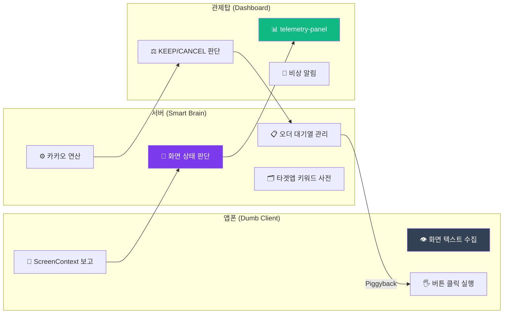

# 1DAL 안전 모드 최종 설계서 (Safety Mode Specification)

> **핵심 원칙**: 안드로이드 앱은 "눈과 손(Dumb Client)"이며, 판단은 오직 "뇌(Server)"가 통제한다.
> 이전 오더 사이클이 완전히 끝날 때까지 새 오더를 절대 잡지 않는다.

본 문서는 1차~4차 설계 논의를 통합한 **최종 구현 기준서**입니다.

---

## 📑 목차

1. [문제 정의](#-문제-정의-왜-노쑈가-발생하는가)
2. [아키텍처 전환](#-아키텍처-전환-smart-server--dumb-client)
3. [Layer 1: 앱폰](#-layer-1-앱폰-hijackservicekt)
4. [Layer 2: 서버](#-layer-2-서버-express--nodejs)
5. [Layer 3: 관제탑](#-layer-3-관제탑-dashboard)
6. [엣지 케이스 전수 분석](#-엣지-케이스-전수-분석)
7. [다중 폰 경합 시뮬레이션](#-다중-폰-경합-시뮬레이션)
8. [구현 순서](#-최종-구현-순서)

---

## 🔴 문제 정의: 왜 노쑈가 발생하는가

### 근본 원인: 앱 내부 상태와 인성앱 화면 불일치

현재 앱은 타임아웃이 발생하면 내부 상태를 `SEARCHING`으로 강제 롤백합니다.
하지만 인성앱 화면은 여전히 "확정된 상세 페이지"에 머물러 있습니다.
이 **화면-상태 불일치**가 모든 노쑈의 시작점입니다.

### 오작동 시나리오 3가지

**시나리오 A — 앱폰 타임아웃 → 화면 방치**
```
HijackService.kt:96-103:
  12초 경과 → currentState = SEARCHING, currentOrder = null

실제 상황:
  앱폰은 인성앱 "확정 후 상세 페이지"에 있음
  상태만 SEARCHING → 다음 콜 잡으려 시도 → but 화면이 열려있음
  인성앱 기준으로 확정된 오더를 "방치" → 노쑈
```

**시나리오 B — 서버 타임아웃 → CANCEL 전송 → 클릭 실패**
```
detail.ts:206-217:
  30초 경과 → heldRes.json({ action: 'CANCEL' })
  앱폰: "취소" 버튼 찾아 클릭 시도

문제:
  30초 후 화면이 이미 리스트로 돌아가 있으면 "취소" 버튼 없음
  → 클릭 실패 → 12초 후 타임아웃 → 강제 SEARCHING → 노쑈
```

**시나리오 C — 2대 동시 확정 → 검증 없는 합짐**
```
detail.ts:53-65:
  KEEP → mainCallState 없으면 본콜, 있으면 subCalls.push()

문제:
  앱폰2가 합짐 낚아채서 인성앱에서 확정 완료
  → 서버/관제탑 검토 없이 이미 확정된 상태
  → 잘못된 합짐이면 노쑈
```

---

## 🏗️ 아키텍처 전환: Smart Server & Dumb Client

### 기존의 한계

| 영역 | 문제 |
|------|------|
| **앱이 너무 똑똑함** | 12초 자체 타임아웃, 독단적 상태 초기화 |
| **인성앱 디펜던시** | "확정", "출발지 상세" 등 텍스트가 앱에 하드코딩 |
| **관제 불가** | 폰이 지금 무슨 화면인지 서버/대표님이 알 수 없음 |

### V3 개편 방향



1. **앱의 역할**: 화면이 바뀔 때마다 `[텍스트 전부]` + `[ScreenContext]`를 서버로 전송.
2. **서버의 역할**: 수신된 텍스트를 분석하여 명령(`KEEP`/`CANCEL`/`EMERGENCY`) 하달.
3. **관제탑의 역할**: 각 앱폰의 현재 화면을 실시간 모니터링, 비상 시 수동 개입.

---

## 📱 Layer 1: 앱폰 (HijackService.kt)

### 1-1. 데스밸리 타이머 설정 분리

| 항목 | 변경 전 | 변경 후 |
|------|---------|---------|
| 타임아웃 값 | `HijackService.kt`에 12초 하드코딩 | `MainActivity.kt` UI 설정 (기본 30초) |
| 저장 방식 | 없음 | `SharedPreference("deathValleyTimeout")` |
| 조작 주체 | 개발자만 변경 가능 | 대표님이 현장에서 20~40초로 자유 조절 |

### 1-2. ScreenContext 타입 리포터

화면이 바뀔 때마다(잔상 제외) 현재 화면 정보를 서버에 실시간 보고합니다.

**ScreenContext Type 정의**:

| Type | 설명 | 판별 기준 (기본) |
|------|------|-----------------|
| `LIST` | 사냥 리스트 화면 | 요금 후보(숫자) 패턴 다수 존재 |
| `DETAIL_PRE_CONFIRM` | 광클 직전 상세 | "확정" 텍스트 존재 |
| `DETAIL_CONFIRMED` | 확정 후 상세 화면 | "닫기", "취소" 텍스트 존재 |
| `POPUP_PICKUP` | 출발지 상세 팝업 | "출발지 상세" 텍스트 존재 |
| `POPUP_DROPOFF` | 도착지 상세 팝업 | "도착지 상세" 텍스트 존재 |
| `POPUP_MEMO` | 적요 상세 팝업 | "적요상세" 텍스트 존재 |
| `POPUP_ERROR` | 에러/실패 팝업 | "실패", "취소할 수 없" 등 |
| `UNKNOWN` | 알 수 없는 화면 | 위 어디에도 해당 안 됨 |

> [!IMPORTANT]
> 판별 기준 텍스트는 앱에 하드코딩하지 않습니다.
> 서버의 `config/inseong.json`에서 관리하며, 앱 부팅 시 다운로드합니다.
> 24시 콜 앱 추가 시에는 `config/24h.json`을 만들면 됩니다.

### 1-3. Dumb Client 행동 강령

```
[정상 흐름]
  콜 확정 → 스크래핑 → POST /detail 전송 → 롱폴링 대기
  서버 KEEP 수신 → "닫기" 클릭 → LIST 복귀 확인 → 서버에 보고
  서버 CANCEL 수신 → "취소" 클릭 → 결과 확인 → 서버에 보고

[자동 취소 (Fail-Safe)]
  30초(설정값) 내에 서버 응답 없음 → 스스로 "취소" 클릭
  → 취소 성공 시: POST /emergency ("자동취소 완료") → LIST 복귀
  → "취소할 수 없습니다" 팝업 시: POST /emergency (팝업 텍스트 전송) → 서버/관제탑 알림

[알 수 없는 화면]
  ScreenContext가 UNKNOWN → POST /emergency (현재 텍스트 전부 전송)
  → 서버가 분석 후 관제탑에 경고 emit
```

> [!WARNING]
> **SEARCHING으로 돌아가는 유일한 2가지 경로**:
> 1. `EXECUTING_DECISION` → 버튼 클릭 성공 확인 → LIST 화면 확인
> 2. 자동취소 → POST /emergency 전송 완료 → LIST 화면 확인

---

## 🧠 Layer 2: 서버 (Express + Node.js)

### 2-1. POST /emergency 엔드포인트 [신설]

앱폰이 자동취소를 실행하거나 이상 상황을 감지했을 때 호출합니다.

```typescript
// server/src/routes/emergency.ts [NEW]
POST /api/emergency
Body: {
  deviceId: string,
  orderId: string,
  reason: 'AUTO_CANCEL' | 'CANCEL_EXPIRED' | 'UNKNOWN_SCREEN' | 'APP_CRASH',
  screenText: string,        // 현재 화면 텍스트 전부
  screenContext: ScreenContext
}

서버 처리:
  1. pendingDetailRequests에서 orderId 삭제 (롱폴링 해제)
  2. pendingOrdersData에서 orderId 삭제
  3. mainCallState가 이 orderId면 null로 초기화 + 필터 '첫짐'으로 복원
  4. 관제탑에 emergency-alert emit (reason 포함)
  5. 관제탑에 order-canceled emit
```

### 2-2. 타겟 앱 키워드 사전 (`config/inseong.json`)

인성앱별, 24시앱별로 화면 판별 키워드를 서버에서 관리합니다.

```json
{
  "appName": "인성콜",
  "screenDetection": {
    "LIST": { "keywords": ["요금", "거리"], "minKeywordCount": 3 },
    "DETAIL_PRE_CONFIRM": { "keywords": ["확정"] },
    "DETAIL_CONFIRMED": { "keywords": ["닫기", "취소"] },
    "POPUP_PICKUP": { "keywords": ["출발지 상세", "전화1"] },
    "POPUP_DROPOFF": { "keywords": ["도착지 상세", "전화1"] },
    "POPUP_ERROR": { "keywords": ["실패", "취소할 수 없", "시간이 지나"] }
  },
  "buttons": {
    "confirm": ["확정"],
    "close": ["닫기"],
    "cancel": ["취소"],
    "pickup": ["출발지", "상차"],
    "dropoff": ["도착지", "하차"]
  }
}
```

앱은 부팅 시 `GET /api/config/target` 로 이 사전을 다운로드하여 `SharedPreference`에 캐시합니다.
앱 UI에 `[타겟 앱 선택: 인성콜 / 24시]` 드롭다운을 추가해, 선택한 타겟에 따라 해당 사전을 요청합니다.

### 2-3. 타임아웃 정책 변경

| 항목 | 변경 전 | 변경 후 |
|------|---------|---------|
| 30초 타임아웃 | 앱폰에 CANCEL 자동 전송 | 관제탑에 **"⚠️ 응답기한 초과"** 경고만 emit |
| 취소 주체 | 서버가 명령 → 앱폰이 실행 | **앱폰이 스스로 판단** (30초 초과 시 자동취소) |
| 서버 후처리 | 없음 | 앱폰의 `POST /emergency` 수신 후 메모리 초기화 |

**왜 서버가 직접 CANCEL을 보내면 안 되는가**:
서버는 타임아웃 시점에 앱폰의 화면 상태를 알 수 없습니다.
앱이 이미 리스트로 돌아갔는데 CANCEL을 보내면, 앱이 "취소" 버튼을 못 찾아 또 타임아웃 → 노쑈.
따라서 취소 판단은 **화면을 보고 있는 앱폰 자신**이 하는 것이 가장 정확합니다.

### 2-4. 오더 대기열(subCalls) 관리

서버의 `detail.ts`는 `mainCallState` + `subCalls[]` 배열로 모든 오더를 관리합니다.
앱폰이 몇 개의 콜을 물어오든, 서버가 배열로 받아주고 관제탑에 동시에 띄워 대표님이 판단합니다.

---

## 🖥 Layer 3: 관제탑 (Dashboard)

### 3-1. Telemetry Panel 고도화

기존 패널(수집/수락/취소 숫자)에 **현재 화면 상태 배지**를 추가합니다.

```
┌─────────────────────────────────────────────┐
│ 앱폰1-sdk_gpho-160                          │
│ 수집: 5171  수락: 3  취소: 1                │
│ 📱 [인성앱-확정화면 대기중] ← NEW           │
├─────────────────────────────────────────────┤
│ 앱폰2-sdk_gpho-161                          │
│ 수집: 4823  수락: 2  취소: 0                │
│ 📱 [인성앱-리스트 스캔 중] ← NEW            │
└─────────────────────────────────────────────┘
```

### 3-2. 비상 알림 UI

| 트리거 | 관제탑 표시 |
|--------|------------|
| `POST /emergency` (AUTO_CANCEL) | 🟡 "앱폰1이 자동취소를 실행했습니다" |
| `POST /emergency` (CANCEL_EXPIRED) | 🔴 "⚠️ 취소 불가 팝업! 배차실 직접 취소 요망!" |
| `POST /emergency` (UNKNOWN_SCREEN) | 🟠 "앱폰1이 알 수 없는 화면에 빠졌습니다" |
| 기기 `lastSeen` 20초 초과 | 🔴 "연결 끊김 — 기기 직접 확인 필요" |
| 30초 타임아웃 (서버측) | 🟡 "응답기한 초과 — 앱폰 자동취소 예정" |

---

## 🔍 엣지 케이스 전수 분석

코드 전수 조사(`HijackService.kt`, `ApiClient.kt`, `detail.ts`, `scrap.ts`, `devices.ts`)에서 발견한 모든 엣지 케이스입니다.

| ID | 시나리오 | 위험도 | V3 해결 | 상세 |
|----|----------|--------|---------|------|
| EC-1 | KEEP 응답 유실 (네트워크 끊김) | 🔴 치명 | ✅ | 앱 자동취소 후 POST /emergency → 서버 초기화 |
| EC-2 | 롱폴링 HTTP 중첩 | 🟢 안전 | ✅ 이미 안전 | `SingleThreadExecutor`가 순차 처리 보장 |
| EC-3 | 안드로이드 시스템이 앱 강제 종료 | 🔴 치명 | ⚠️ 100% 불가 | 배터리 최적화 제외 + 관제탑 연결끊김 경고 |
| EC-4 | 자동취소 후 서버 상태 불일치 | 🔴 치명 | ✅ | POST /emergency → pendingRequests/orderData/mainCallState 삭제 |
| EC-5 | 인성앱 "확정 실패" 팝업 | 🟡 중간 | ✅ | ScreenContext.POPUP_ERROR 리포트 → 서버 판단 |
| EC-6 | "취소할 수 없습니다" 팝업 | 🟡 중간 | ✅ | POST /emergency (CANCEL_EXPIRED) → 관제탑 수동 개입 |

### EC-1 상세: KEEP 응답 유실 (가장 위험한 시나리오)

```
서버: KEEP 전송 → 네트워크 끊김 → 앱폰: 수신 실패
앱폰: 30초 만료 → 스스로 "취소" 클릭 (인성앱에서 오더 취소됨)
서버: mainCallState에 저장 + 합짐 필터 전파 (살아있다고 착각)

→ 서버와 인성앱의 상태가 완전히 어긋남 → 노쑈
```

**방어**: 앱폰이 자동취소 직후 `POST /emergency` 전송.
서버가 이 시점에 `mainCallState`가 해당 orderId이면 즉시 null로 초기화하고 필터를 '첫짐'으로 복원.

> [!IMPORTANT]
> 현재 `ApiClient.kt:139-141`에서 HTTP 에러 시 콜백으로 CANCEL을 돌려주는 로직이 있지만,
> 이것은 **네트워크 에러** 처리입니다. 앱이 **스스로 취소 버튼을 눌렀을 때** 서버에 통보하는 경로는 없습니다.
> → `POST /emergency` 신설이 필수.

### EC-4 상세: 자동취소 → 서버 상태 불일치 (두 번째로 위험)

```
앱폰: POST /detail 전송 → WAITING_DECISION
서버: 롱폴링 홀드 중 (pendingDetailRequests에 Response 저장)
앱폰: 30초 → 스스로 취소 → SEARCHING 진입

이 시점에서:
  서버 pendingDetailRequests에 여전히 Response 객체 존재
  대표님이 KEEP 누르면?
  → 이미 끊어진 HTTP 연결에 응답 시도 → 에러
  → 동시에 mainCallState에 이미 취소된 오더 등록 → 완전한 꼬임
```

**방어**: POST /emergency → 서버가 해당 orderId의 pendingDetailRequests, pendingOrdersData, mainCallState를 모두 삭제.

### EC-3 상세: 앱 강제 종료 (소프트웨어로 100% 방어 불가)

```
안드로이드 배터리 최적화/메모리 부족 → HijackService 강제 종료
인성앱: 확정된 오더가 그대로 살아 있음
서버: 롱폴링 30초 후 타임아웃 → 관제탑에 경고 emit
→ 대표님이 인성앱 직접 들어가서 수동 취소 필요
```

**최선의 방어**:
1. `MainActivity.kt` 부팅 시 `ACTION_REQUEST_IGNORE_BATTERY_OPTIMIZATIONS` 다이얼로그 필수
2. 관제탑에 기기 `lastSeen` 20초 초과 시 🔴 연결 끊김 경고 (이미 `devices.ts`에 존재)

---

## 🤝 다중 폰 경합 시뮬레이션

현재 2대, 향후 4대까지 확장 예정. 모든 경합 상황을 서버의 `subCalls[]` 대기열이 흡수합니다.

### Case A: 같은 콜을 동시에 클릭

```
앱폰1: 콜 A 확정 성공 (인성서버에서 배차)
앱폰2: 콜 A 확정 시도 → 인성서버: "이미 배차됨" 실패 팝업

앱폰2 처리:
  ScreenContext → POPUP_ERROR (실패 팝업 감지)
  → 팝업 닫기 → LIST 로 복귀 → 리스트 사냥 재개
  → 정상 방어 ✅
```

### Case B: 앱폰1 대기 중 앱폰2가 다른 콜 확정 성공

```
앱폰1: 콜 A 확정 → POST /detail → 데스밸리 대기 중
앱폰2: 콜 B 확정 성공 → POST /detail 전송

1DAL 서버:
  mainCallState에 콜 A 존재 → 콜 B를 subCalls[] 배열에 저장
  관제탑에 콜 A + 콜 B 동시 표시

관제탑:
  대표님이 두 콜을 비교 후 판단
  → 콜 A KEEP + 콜 B KEEP (합짐)
  → 또는 콜 A CANCEL + 콜 B KEEP (교체)
  → 서버가 배열로 관리하므로 어떤 경우든 정확하게 처리 ✅
```

### Case C: 필터 전파 지연으로 과거 필터로 사냥

```
앱폰1: 콜 A 확정 → 서버가 필터를 '대기'로 변경
앱폰2: 아직 이전 Piggyback 응답 수신 전 → '첫짐' 필터로 콜 B 낚아챔

처리: Case B와 동일 → subCalls[] 대기열에 저장 → 관제탑 판단
→ 정상 방어 ✅
```

---

## 📋 최종 구현 순서

| 우선순위 | 작업 | 파일 | 설명 |
|---------|------|------|------|
| **🔴 P0** | `POST /emergency` 엔드포인트 | `server/src/routes/emergency.ts` [NEW] | 앱 자동취소 보고 → 서버 메모리 초기화. **노쑈 방지의 핵심** |
| **🔴 P0** | ScreenContext 타입 정의 | `shared/src/index.ts` | 앱↔서버 공유 타입. 모든 레이어의 기초 |
| **🟡 P1** | 데스밸리 타이머 설정 UI | `MainActivity.kt` | SharedPreference로 30초 기본값, 대표님 조절 가능 |
| **🟡 P1** | 배터리 최적화 제외 요청 | `MainActivity.kt` | 앱 부팅 시 다이얼로그. EC-3 방어 |
| **🟡 P1** | HijackService 리팩토링 | `HijackService.kt` | 12초 타임아웃 제거, ScreenContext 리포트, 자동취소 + POST /emergency 흐름 |
| **🟡 P1** | 서버 타임아웃 정책 변경 | `detail.ts` | 30초 자동 CANCEL 제거 → 관제탑 경고만 emit |
| **🟢 P2** | Telemetry Panel 화면 상태 배지 | `DeviceControlPanel.tsx` | 기기별 현재 화면 실시간 표시 |
| **🟢 P2** | Emergency 경고 UI | `PinnedRoute.tsx` | 취소불가 팝업 등 비상 시 붉은 알림 배너 |
| **🟢 P2** | 타겟 앱 키워드 사전 | `server/config/inseong.json` [NEW] | 인성앱 버튼/화면 키워드 외부 관리 (24시 확장 대비) |
| **⚪ P3** | 타겟 앱 선택 드롭다운 | `MainActivity.kt` | 인성콜/24시 앱 타겟 스위칭 UI |

---

## ✅ 종합 판정

> **V3 아키텍처는 충분합니다.**
> 
> 핵심 추가물은 딱 2개입니다:
> 1. **`POST /emergency`** — 앱 → 서버: "나 자동취소 했어. 메모리 초기화해"
> 2. **배터리 최적화 제외 다이얼로그** — EC-3 (앱 강제 종료) 최선의 방어
>
> 이 두 가지가 탑재되면:
> - 네트워크가 끊겨도 앱이 스스로 취소하고 서버에 보고합니다.
> - 서버가 멋대로 CANCEL을 보내서 화면이 꼬이는 일이 없습니다.
> - 어떤 이상 상황에서도 관제탑에 실시간 경고가 뜨고, 대표님이 인지합니다.
> - 4대까지 확장해도 서버의 `subCalls[]` 대기열이 모든 경합을 흡수합니다.
