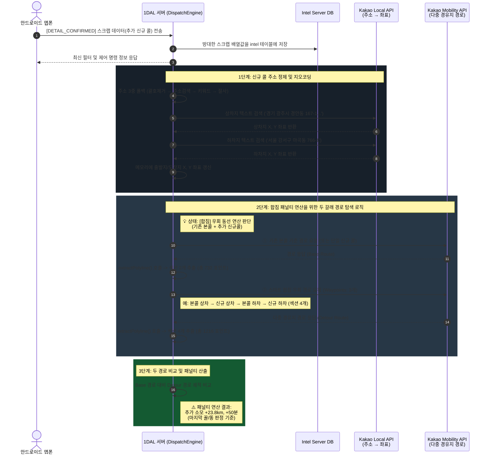

```mermaid
sequenceDiagram
    autonumber
    actor App as 안드로이드 앱폰
    participant Server as 1DAL 서버 (DispatchEngine)
    participant DB as Intel Server DB
    participant KakaoLocal as Kakao Local API<br/>(주소 → 좌표)
    participant KakaoNavi as Kakao Mobility API<br/>(다중 경유지 경로)

    App->>Server: [DETAIL_CONFIRMED] 스크랩 데이터(추가 신규 콜) 전송
    Server->>DB: 방대한 스크랩 배열값을 intel 테이블에 저장
    Server-->>App: 최신 필터 및 제어 명령 정보 응답

    rect rgb(23, 32, 42)
    Note over Server,KakaoLocal: 1단계: 신규 콜 주소 정제 및 지오코딩
    Server->>Server: 주소 3중 폴백 (괄호제거 → 주소검색 → 키워드 → 절사)
    Server->>KakaoLocal: 상차지 텍스트 검색 ('경기 광주시 경안동 167-1...')
    KakaoLocal-->>Server: 상차지 X, Y 좌표 반환
    Server->>KakaoLocal: 하차지 텍스트 검색 ('서울 강서구 마곡동 766-1')
    KakaoLocal-->>Server: 하차지 X, Y 좌표 반환
    Server->>Server: 메모리에 출발지/도착지 X, Y 좌표 갱신
    end

    rect rgb(39, 55, 70)
    Note over Server,KakaoNavi: 2단계: 합짐 패널티 연산을 위한 두 갈래 경로 탐색 로직
    Note right of Server: 💡 상태: [합짐] 우회 동선 연산 판단<br/>(기존 본콜 + 추가 신규콜)
    
    %% Base Route 판별 (기존 본콜의 남은 거리를 기준으로 하거나 단순 단일 경로 비교)
    Server->>KakaoNavi: ① 기존 본콜 기준 경로 요청 (또는 단일 신규 콜)
    KakaoNavi-->>Server: 경로 응답 (Base Route)
    Server->>Server: extractPolyline() 호출 -> 섹션 2개 추출 (총 732 포인트)

    %% Detour Route 판별 (합짐 다중 경유지)
    Server->>KakaoNavi: ② 스마트 합짐 우회 경로 요청 (Waypoints: 3개)
    Note right of Server: 예: 본콜 상차 → 신규 상차 → 본콜 하차 → 신규 하차 (섹션 4개)
    KakaoNavi-->>Server: 다중 경유지 경로 응답 (Detour Route)
    Server->>Server: extractPolyline() 호출 -> 섹션 4개 추출 (총 1216 포인트)
    end

    rect rgb(20, 90, 50)
    Note over Server: 3단계: 두 경로 비교 및 패널티 산출
    Server->>Server: Base 경로 대비 Detour 경로 궤적 비교
    Note right of Server: ⚠️ 패널티 연산 결과:<br/>추가 소모 +23.8km, +50분<br/>(마지막 꿀/똥 판정 기준)
    end
```