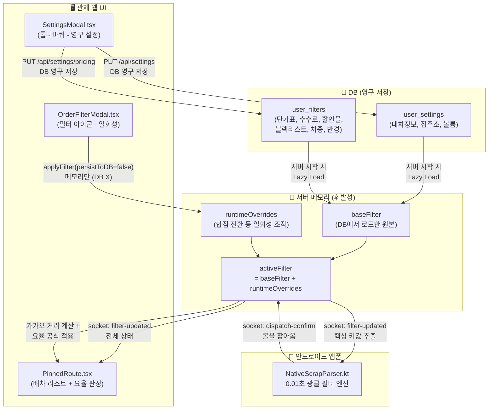
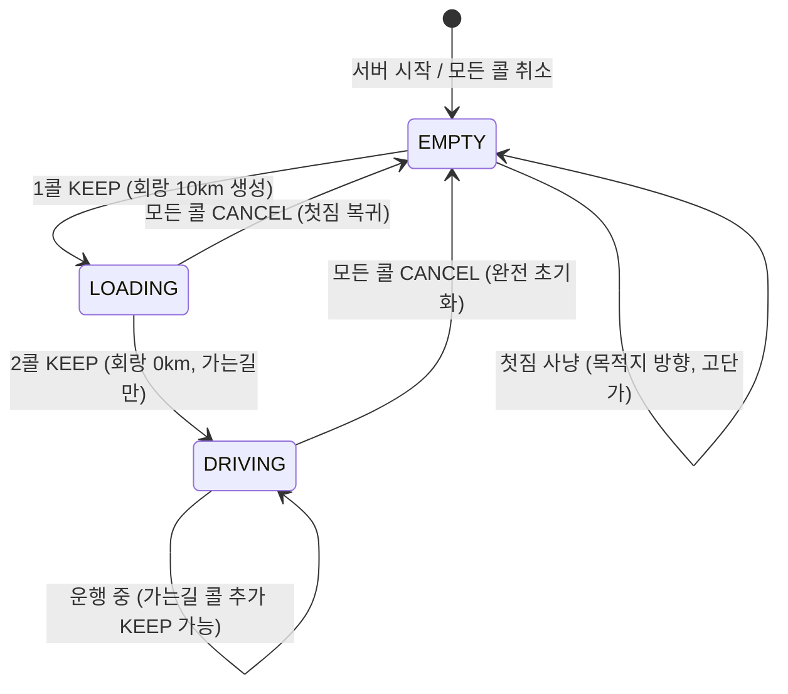

# 🎯 1DAL 필터 시스템 아키텍처

> **이 문서는 1DAL 배차 필터의 설계·구현·운영 전체를 한 곳에 정리한 단일 정본(Single Source of Truth)입니다.**
> 마지막 업데이트: 2026-04-23

---

## 목차

1. [시스템 전체 그림](#1-시스템-전체-그림)
2. [데이터 흐름도](#2-데이터-흐름도)
3. [DB 스키마 (ERD)](#3-db-스키마-erd)
4. [필터 계층 구조 (baseFilter / runtimeOverrides / activeFilter)](#4-필터-계층-구조)
5. [적재 상태 머신 (EMPTY → LOADING → DRIVING)](#5-적재-상태-머신)
6. [요율 계산 엔진](#6-요율-계산-엔진)
7. [UI 구조 (설정 모달 vs 필터 모달)](#7-ui-구조)
8. [앱(Android) 필터 엔진](#8-앱android-필터-엔진)
9. [미구현 로드맵](#9-미구현-로드맵)
10. [변경 이력](#10-변경-이력)

---

## 1. 시스템 전체 그림

1DAL 필터 시스템은 **"기사님이 원하는 콜만 자동으로 잡아주는 두뇌"** 입니다.

```
[인성망] ─→ [앱폰: 0.01초 광클 필터] ─→ [서버: 카카오 경로 + 요율 판정] ─→ [관제탑: 최종 결재]
                     ↑                              ↑
              4대 필터 조건                   다이내믹 요율 공식
           (차종/도착지/요금/거리)          (단가×거리×수수료)
```

**핵심 원칙**:
- 앱은 **"일단 잡아와라"** (최소한의 쓰레기만 거르고 빠르게 광클)
- 서버는 **"수익성을 판단한다"** (카카오 거리 기반 요율 계산)
- 사장님이 **"최종 결재한다"** (관제탑에서 KEEP/CANCEL)

---

## 2. 데이터 흐름도



### 핵심: 데이터는 단방향으로만 흐른다

```
DB(원천) → 서버 메모리(baseFilter) → activeFilter → 소켓 → 프론트/앱
```

- **기본값의 단일 출처**: DB 스키마의 `DEFAULT` 값이 유일한 기본값
- 서버·프론트·앱은 **자체 폴백을 갖지 않음** (DB를 신뢰)
- 앱만 오프라인 안전망으로 Kotlin 모델에 기본값 유지

---

## 3. DB 스키마 (ERD)

```mermaid
erDiagram
    users ||--o{ user_devices : "1:N 기기 소유"
    users ||--o{ user_tokens : "1:N 로그인 토큰"
    users ||--|| user_settings : "1:1 기본 설정"
    users ||--|| user_filters : "1:1 요율 및 필터 설정"

    user_settings {
        TEXT user_id PK_FK "users.id"
        INTEGER car_type "카카오 차종코드 (1~7)"
        TEXT vehicle_type "내 차종 문자열 (1t 등)"
        TEXT car_fuel "GASOLINE | DIESEL | LPG"
        BOOLEAN car_hipass "하이패스 유무"
        INTEGER fuel_price "리터당 유가 (원)"
        REAL fuel_efficiency "연비 (km/L)"
        TEXT default_priority "RECOMMEND | TIME | DISTANCE"
        BOOLEAN avoid_toll "유료도로 회피"
        TEXT home_address "복귀용 집주소"
        REAL home_x "집 경도"
        REAL home_y "집 위도"
        INTEGER alarm_volume "알림 볼륨 0~100"
    }

    user_filters {
        TEXT user_id PK_FK "users.id"
        TEXT destination_city "목적지 도시"
        INTEGER destination_radius_km "목적지 반경 (기본 10)"
        INTEGER corridor_radius_km "회랑 반경 (기본 1)"
        REAL pickup_radius_km "상차지 반경 (기본 10)"
        TEXT allowed_vehicle_types "JSON 배열"
        INTEGER min_fare "첫짐 절대 하한선 (기본 0)"
        INTEGER max_fare "최대 운임 (기본 1000000)"
        TEXT excluded_keywords "블랙리스트 JSON 배열"
        TEXT destination_keywords "도착지 읍면동 JSON 배열"
        BOOLEAN is_active "필터 활성화"
        BOOLEAN is_shared_mode "합짐 모드"
        TEXT load_state "EMPTY | LOADING | DRIVING"
        TEXT vehicle_rates "차종별 단가표 JSON"
        REAL agency_fee_percent "퀵사 수수료율 (기본 23)"
        REAL max_discount_percent "최대 할인율 (기본 10)"
    }

    user_devices {
        INTEGER id PK "자동증가"
        TEXT user_id FK "users.id"
        TEXT device_id UK "앱폰 고유 ID"
        TEXT device_name "사용자 지정 별명"
        TEXT registered_at "등록일"
    }
```

> **주의**: `is_shared_mode`와 `load_state`는 DB에 저장되지만, 세션 복구 시 항상 `EMPTY`/`false`로 초기화됩니다.
> 어제의 LOADING/DRIVING 상태가 오늘 되살아나는 것을 방지하기 위함입니다.

---

## 4. 필터 계층 구조 (완전 격리 모델)

과거에는 `runtimeOverrides`를 매번 합성하는 방식이었으나, 잦은 동기화 버그와 복잡도를 제거하기 위해 **완전 격리(Complete Isolation) 아키텍처**로 개편되었습니다.

```
┌─────────────────────────────────────────────┐
│  activeFilter (앱/프론트가 실제로 보는 값)       │
│  - 현재 사냥에 직접 쓰이는 1등 시민 객체        │
│  - 돋보기(OrderFilterModal), 관제탑 시스템 조작  │
├─────────────────────────────────────────────┤
│  baseFilter (영구 설정 - DB 원본)              │
│  - 내일 출근할 때 적용될 "나의 기본 세팅"       │
│  - 톱니바퀴(SettingsModal)에서만 조작           │
└─────────────────────────────────────────────┘
```

**핵심 원칙**: 영구 설정(톱니바퀴)을 바꿔도 현재 진행 중인 사냥(`activeFilter`)에는 1도 영향을 주지 않습니다. 두 필터는 로그인 시 1회 복사된 이후 완전히 남남으로 동작합니다.

### filterManager.ts — 역할의 명확한 분리

| 함수 | 역할 | 누가 호출 | DB 접근 | activeFilter 수정 |
|---|---|---|---|---|
| `saveBaseFilter()` | 영구 설정 저장 | SettingsModal(톱니바퀴) | ✅ DB 저장 | ❌ 안 건드림 |
| `updateActiveFilter()` | 현재 사냥 수정 | OrderFilterModal(돋보기), State Machine | ❌ 안 건드림 | ✅ 직접 수정 |

**EMPTY 초기화 시 자동 청소**: 합짐(LOADING/DRIVING) 사이클이 끝나고 `EMPTY`로 전환되는 순간에만, `activeFilter`를 `baseFilter` 기준으로 깨끗하게 덮어써서(Reset) 다음 사냥을 준비합니다.

---

## 5. 적재 상태 머신



### 상태별 필터 동작

| 상태 | 상차 반경 | 회랑 반경 | 차종 | 합짐 모드 |
|------|----------|----------|------|----------|
| `EMPTY` | 사용자 설정값 (예: 10km) | — | 사용자 차종 이하 | `false` |
| `LOADING` | **무시** (isSharedMode) | **10km** (적재 중 추가콜 탐색) | 첫짐 차종 이하 | `true` |
| `DRIVING` | **무시** (isSharedMode) | **0km** (가는길 콜만) | 첫짐 차종 이하 | `true` |

### 상차 반경 바이패스 원리

합짐 모드에서는 상차 반경을 **데이터로 조작하지 않습니다** (과거에는 999km로 덮어썼으나 제거됨).
대신 앱(`NativeScrapParser.kt`)이 `isSharedMode=true`를 보고 **규칙(Rule)으로 거리 검사를 건너뜁니다**:

```kotlin
// NativeScrapParser.kt — shouldClick()
val distanceMatch = if (order.pickupDistance == null) {
    true
} else if (filter.isSharedMode) {
    true // 합짐 모드: 상차 반경 무시 (회랑 필터가 대신 판단)
} else {
    order.pickupDistance <= filter.pickupRadiusKm
}
```

### 전이 코드 위치

**파일**: `server/src/services/dispatchEngine.ts` — `handleDecision()` 함수 내

```typescript
// EMPTY → LOADING (첫짐 KEEP)
applyFilter(userId, {
    isSharedMode: true, loadState: 'LOADING',
    corridorRadiusKm: 10, allowedVehicleTypes: sharedVehicleTypes,
}, io, false);

// LOADING → DRIVING (2콜 KEEP)
applyFilter(userId, {
    isSharedMode: true, loadState: 'DRIVING',
    corridorRadiusKm: 0, allowedVehicleTypes: sharedVehicleTypes,
}, io, false);
```

### 차종 자동 추론

합짐 전환 시, 첫 짐의 차종을 기준으로 **적재 가능한 하위 차종**을 자동 계산합니다.

```
기사 차종: 1t → 첫짐 차종: 라보 → 합짐 허용: [오토바이, 다마스, 라보]
```

`getSharedModeVehicleTypes()` 함수가 12종 전체 차량 배열에서 현재 차종 이하만 슬라이스합니다.

---

## 6. 요율 계산 엔진

서버가 콜을 받으면 **카카오 실주행 거리 기반**으로 적정 금액을 계산하고, 관제탑에 판정 결과를 표시합니다.

### 계산 공식

```
적정 금액 = (카카오 실제 주행 거리 km) × (오더 차량 단가표 값) × (1 - 퀵사수수료)
수용 하한선 = 적정 금액 × (1 - 최대할인율)
```

**예시**: 1t, 100km, 수수료 23%, 할인 10%
- 적정 = 100 × 1,000 × 0.77 = **77,000원**
- 하한 = 77,000 × 0.90 = **69,300원**

### 판정 결과

| 실제 요금 vs 하한선 | 판정 | UI 표시 |
|-------------------|------|--------|
| 실제 ≥ 적정 | 꿀콜 | 🍯 |
| 하한 ≤ 실제 < 적정 | 적정 | ✅ |
| 실제 < 하한 | 미달 | 🔴 `[요율 미달 -9,300원]` |

> **자동 취소하지 않습니다.** 관제탑에 사유만 표시하고, 사장님이 최종 판단합니다.

### 차종 불명 Fallback

인성망에서 차종이 `null`인 경우, 기사 본인의 `vehicle_type`(user_settings)을 대신 사용합니다.

---

## 7. UI 구조

### SettingsModal.tsx (톱니바퀴 ⚙️ — 영구 설정)

DB에 저장되어 서버 재시작 후에도 유지됩니다.

| 탭 | 내용 | 저장 대상 |
|----|------|----------|
| **기본 설정** | 내 차종, 경로 옵션, 집 주소, 알림 볼륨 | `user_settings` |
| **요율/필터** | 차종별 단가, 수수료, 할인율, 하한가, 상한가, 상차 반경, 블랙리스트, 내 노선 | `user_filters` |
| **기기 설정** | 앱폰 등록/해제, 별명 수정 | `user_devices` |

### OrderFilterModal.tsx (필터 아이콘 🔍 — 일회성)

서버 메모리만 변경하며, DB에 저장되지 않습니다.

| 탭 | 내용 |
|----|------|
| **첫짐** | "어디로 갈까?" — 도착 시/도, 반경 |
| **합짐** | "얼마나 돌아갈까?" — 회랑 이탈 허용 반경 |

---

## 8. 앱(Android) 필터 엔진

**파일**: `app/src/main/java/com/onedal/app/core/NativeScrapParser.kt`

앱은 서버에서 3초마다 텔레메트리로 받은 `activeFilter`를 SharedPreferences에 저장하고,
`shouldClick()` 함수에서 **5대 필터 조건을 AND(교집합)으로 검사**합니다:

| # | 조건 | 설명 |
|---|------|------|
| 0 | 차종 매칭 | `allowedVehicleTypes`에 포함 여부 |
| 1 | 도착지 매칭 | `destinationKeywords` 중 하나 포함 (2차 상세 필터 지원) |
| 2 | 요금 하한선 | `order.fare >= filter.minFare` |
| 3 | 상차지 거리 | `order.pickupDistance <= filter.pickupRadiusKm` (합짐 시 무시) |
| 4 | 블랙리스트 | `excludedKeywords`에 해당하지 않음 |

> **앱의 기본값은 "오프라인 안전망"**: 서버가 항상 완전한 필터를 전송하므로, Kotlin 모델의 기본값(`pickupRadiusKm=10` 등)은 통신 실패 시에만 사용됩니다.

---

## 9. 미구현 로드맵

### 9-1. "출발" 버튼 (난이도: ⭐)

> LOADING 상태에서 1콜만으로 출발하고 싶을 때, 수동으로 DRIVING 전환하는 UI

- **프론트**: PinnedRoute에 "🚀 출발" 버튼 추가
- **서버**: 소켓 이벤트 `manual-depart` → `applyFilter(loadState: 'DRIVING', corridorRadiusKm: 0)`

### 9-2. 🏠 귀가콜 가상 오더 (난이도: ⭐⭐)

> 배달 완료 후 집으로 돌아가면서 가는길 콜을 자동 잡는 기능

**동작 흐름**:
1. 관제탑에서 "🏠 귀가" 버튼 클릭
2. 서버가 가상 오더 생성: 상차지=현재 GPS, 하차지=집 주소(`user_settings.home_address`)
3. 카카오 경로 연산 → 폴리라인 생성 → 회랑 10km
4. 이후 일반 합짐 흐름과 동일

**필요 작업**:
- 소켓 핸들러: `create-home-return`
- 프론트: EMPTY/ARRIVED 상태에서 "🏠 귀가" 버튼 노출

### 9-3. GPS Progressive Corridor Trim + 도착 감지 (난이도: ⭐⭐⭐)

> 이동 중 이미 지나간 구간의 키워드를 자동 제거하고, 하차지 도착을 자동 감지

**Corridor Trim**:
- DRIVING 상태에서 GPS가 2km 이상 이동할 때마다
- Turf.js의 `nearestPointOnLine`으로 현재 위치 이후의 폴리라인만 남김
- 남은 구간으로 회랑 재계산 → `destinationKeywords` 자동 갱신

**도착 감지**:
- 마지막 하차지 GPS 반경 500m 이내 도달 시
- 반자동: "🏁 도착한 것 같습니다" 알림 → 사장님 확인 시 ARRIVED 전환

**트리거 조건**:

| 조건 | 값 | 이유 |
|------|-----|------|
| GPS 이동 거리 | 2km 이상 | Turf.js 연산 CPU 보호 |
| 도착 감지 반경 | 500m | 도심 GPS 오차 고려 |
| DRIVING 상태에서만 | ✅ | EMPTY/LOADING 때는 불필요 |

---

## 10. 변경 이력

| 날짜 | 변경 내용 |
|------|----------|
| 2026-04-23 | `pickupRadiusKm=999` 데이터 변조 제거 → `isSharedMode` 룰 기반 바이패스로 대체 |
| 2026-04-23 | 서버/프론트/앱의 기본값 폴백 제거 → DB를 단일 기본값 출처로 중앙화 |
| 2026-04-22 | `filter_system.md` + `filter_system2.md` 통합 (이 문서) |
| 2026-04-22 | 다이내믹 요율 계산 엔진 구현 (`calculateDynamicFare`) |
| 2026-04-21 | `applyFilter()` 중앙화 + `persistToDB` 이원화 완료 |
| 2026-04-21 | 3단계 State Machine (EMPTY→LOADING→DRIVING) 구현 |
| 2026-04-21 | SettingsModal 3탭 구조 + 차종별 단가표 UI 완성 |
| 2026-04-21 | DB 마이그레이션: vehicle_rates, agency_fee_percent, max_discount_percent, alarm_volume |


## 나중에 문서에 추가할 내용들

# 1DAL 필터 시스템 수정 계획 및 생명주기 완벽 정리

## 🗣️ 사장님의 멘탈 모델 vs 현재 코드의 꼬임 분석 (요청하신 풀이 설명)

사장님께서 말씀하신 다음 흐름이 정말 직관적이고 이상적인 접근입니다:
> *"DB에서 필터값 가져와서 baseFilter에 두고... 그걸 모아 activeFilter로 만들어 엡/웹에 보여주다가... 설정 팝업에서 수정/저장하면 activeFilter에 오버라이드하고... 중간에 합짐이 되면 우회 탐색값 만들어 배열에 넣어주고... 끝나면 그냥 메모리에서 날려버리면 끝나는거 아냐?"*


> *"'db에서 user_filters 필터값 가져와서 baseFilter에 깊은 복사 해서 두고 그 값을 이용해서 
들어 있는 시/도 값으로 읍/면/동도 만들고  허용 차종도 만들어서 그값을 모아   activeFilter 로 만들어 넣고 그걸 엡과 웹에 서 보여주고 필터로 보여 주다가. 통제 필터 설정 팝업을 열면 activeFilter 를 runTimeOverrides에다 깊은 복사 해서 그 값으로 팝업에 각 앨리먼드 들에 각각 넣어 주고 그걸 수정하고 저장 하면 그걸 다시 activeFilter에 오버 라이드 해주면 되는거 아냐? 
중간에 합짐이 되면 activeFilter에 읍/면/동값을 경로와 우회 탐색값으로 다시 만들어 배열에 넣어 주면 되는거 같은데.. 그리고 로그아웃 하거나 끝나면 그냥 메모리에서 날려버리면 끝나는거 아냐?'"*

**네, 사장님 생각이 100% 맞습니다!** 하지만 **현재 서버 코드가 사장님의 생각과 다르게 짜여 있어서 버그가 터지고 있습니다.**
사장님의 흐름대로 풀어서, **'현재 어떻게 꼬여있는지(AS-IS)'**와 **'어떻게 고칠 것인지(TO-BE)'**를 설명해 드릴게요.

### 1. 필터 초기화 단계의 꼬임
- **사장님 생각**: DB(`user_filters`)에서 가져온 값을 `baseFilter`에 넣는다. (사장님이 `db.ts`에서 보신 것처럼 `is_active`도 DB 컬럼이므로 당연히 `baseFilter`로 들어가야 함!)
- **현재 코드(버그)**: DB에서 필터를 가져올 때, 엉뚱하게 `isActive`만 쏙 빼서 임시 바구니인 `runtimeOverrides`에 먼저 넣어버립니다! 여기서부터 꼬였습니다.

### 2. 설정 변경 시의 꼬임 (State Shadowing)
- **사장님 생각**: 설정을 수정하고 저장하면 필터에 오버라이드 한다.
- **현재 코드**: 관제탑 대시보드에서 스위치를 켜거나 설정창에서 값을 저장하면, 서버는 "이건 영구 저장이다!" 하고 **DB에 업데이트 쿼리(stmtUpdateFilter.run)를 때리고 원본인 `baseFilter`를 바꿉니다.** (내일 출근해도 유지되어야 하니까 이건 정상입니다.)
- **문제 발생**: 그런데 아까 1번에서 `isActive`를 임시 바구니(`runtimeOverrides`)에 잘못 넣어놨죠? `activeFilter`를 만들 때 `baseFilter` + `runtimeOverrides` 순서로 합치는데, **임시 바구니에 들어있던 옛날 `isActive` 값이 새롭게 DB에 저장한 `baseFilter` 값을 가려버립니다(덮어씀).** 이것이 제가 "오답"이라고 지적한 섀도잉 현상입니다!

### 3. 콜 취소(종료) 시의 꼬임 (DB 덮어쓰기)
- **사장님 생각**: 중간에 합짐이 되면 임시로 읍면동 배열을 넣고, 끝나면 쿨하게 메모리에서 날려버리면 끝난다.
- **현재 코드(버그)**: 합짐이 되면 읍면동 배열을 임시 바구니(`runtimeOverrides`)에 넣는 것까진 잘 작동합니다. **그런데 콜이 끝나서 메모리를 날려버릴 때 사고가 터집니다.** 
  디스패치 엔진이 갑자기 *"차종 배열도 하위 차종 전체(다마스, 라보 등)로 강제 세팅해서 DB(baseFilter)에 영구 저장해버리자!"* 라며 `applyFilter`를 기본값(`persistToDB=true`)으로 실행해버립니다. 이 때문에 사장님이 팝업에서 세팅해둔 고유 차종이 DB에서 영구 삭제됩니다.

### 💡 최종 결론 (수정 방향)
사장님의 머릿속에 있는 그 완벽하고 직관적인 흐름대로 코드를 돌려놓는 것이 제 계획입니다!
1. `isActive`는 엄연히 DB 컬럼에 있으니, 헷갈리게 임시 객체에 넣지 말고 당당하게 원본(`baseFilter`)에 넣는다!
2. 설정창이나 스위치를 조작하면 DB와 `baseFilter`만 깔끔하게 바꾼다. (임시 객체가 원본을 가리지 못하게 청소 로직을 넣는다).
3. 합짐 중에는 임시 객체(`runtimeOverrides`)만 쓰고, 끝나면 쿨하게 비워버린다. **(절대 이때 DB에 차종을 맘대로 덮어쓰지 못하게 코드를 삭제한다).**

*(아래는 위 설명을 바탕으로 한 상세 코드 수정 계획입니다)*

---

사장님께서 질문하신 내용들이 현재 1DAL 시스템 아키텍처의 핵심을 정확히 관통하고 있습니다! 특히 "isActive가 필터 조건들과 같은 객체에 묶여서 꼬이는 것 같다"는 말씀은 정확한 통찰입니다. 

질문하신 내용들을 바탕으로 **필터의 정체와 생명주기**를 사장님의 눈높이(시니어 레벨)에 맞춰 완벽하게 정리해 드리고, 이를 바탕으로 기존 수정 계획을 다시 제안합니다.

---

## 💡 Q&A: 필터의 정체와 멘탈 모델 교정

### Q1. `isActive` (자동사냥 스위치)는 최초에 어디서 정의되나요?
`server/src/db.ts`의 `user_filters` 테이블 생성문을 보면 `is_active BOOLEAN DEFAULT 0` 컬럼이 존재합니다. 
관제탑에서 켠 "Full Auto(자동 사냥)" 스위치의 온/오프 상태는 **DB에 영구 저장**됩니다. 서버가 꺼졌다 켜져도 어제 스위치를 켜고 퇴근했으면 오늘 켜져 있어야 하니까요.

### Q2. `baseFilter`의 스키마가 어떻게 되나요?
`@onedal/shared/src/index.ts`에 정의된 `AutoDispatchFilter` 인터페이스입니다.
```typescript
export interface AutoDispatchFilter {
    isActive: boolean;              // "Full Auto" 스위치 온/오프 (DB 저장됨)
    allowedVehicleTypes: string[];  // 허용 차종 배열 (예: ["1t","다마스"])
    isSharedMode: boolean;          // 합짐 모드 여부
    loadState: LoadState;           // 상태 ('EMPTY', 'LOADING', 'DRIVING')
    pickupRadiusKm: number;         // 상차지 탐색 반경(km)
    minFare: number;                // 최소 운임 하한선
    destinationCity: string;        // 하차 목표 메인 지역
    corridorRadiusKm?: number;      // (합짐 모드) 우회 이탈 허용 반경
    // ... 등등
}
```

### Q3. `persistToDB` 변수는 뭐할 때 쓰는 건가요?
서버의 **메모리(RAM)만 바꿀 것인가, 아니면 SQLite DB 파일까지 써서 "영구 저장"할 것인가**를 결정하는 스위치입니다.
- `persistToDB = true`: 톱니바퀴 설정창에서 차종을 바꾸거나 하한가를 바꿀 때. 내일 출근해도 유지되어야 하니 DB에 씁니다.
- `persistToDB = false`: 앱이 콜을 잡아서 자동으로 '합짐(LOADING) 모드'로 변신할 때. 이건 콜이 끝나면 다시 '첫짐(EMPTY)'으로 리셋되어야 하니 메모리만 잠깐 바꿉니다.

### Q4. `runtimeOverrides` (임시 덮어쓰기 객체)는 설정 팝업창을 위한 건가요?
**아닙니다! 이 부분이 사장님의 멘탈 모델과 코드가 달랐던 지점입니다.**
팝업창의 상태는 React 프론트엔드가 자체적으로 들고 있습니다. 서버의 `runtimeOverrides`는 **"상황에 따른 시스템의 자동 강제 개입(오버라이드)"**을 위한 바구니입니다.

1. 사장님이 설정창에서 `회랑반경=1km`로 설정해서 DB에 저장했습니다 (`baseFilter`).
2. 앱이 첫 짐을 딱 잡았습니다! 서버가 판단합니다. **"어? 적재 중이네. 다음 합짐을 구해야 하니까 일시적으로 회랑 반경을 10km로 확 늘려!"**
3. 이때 DB의 `baseFilter`를 10km로 바꿔버리면 내일 출근할 때 10km로 시작해버립니다. 
4. 그래서 DB는 냅두고, `runtimeOverrides` 바구니에 `{ corridorRadiusKm: 10, isSharedMode: true }`를 슬쩍 밀어 넣습니다 (`persistToDB=false`).
5. `activeFilter`는 이 둘을 짬뽕하여 최종 **10km**를 만들어 앱으로 쏩니다.
6. 목적지에 도착해 콜이 다 끝났습니다(`EMPTY`). 서버는 `runtimeOverrides` 바구니를 메모리에서 싹 비워버립니다. 그러면 다시 사장님이 세팅한 원본 `baseFilter`의 1km가 부활합니다!

### Q5. 그럼 `applyFilter`는 언제 쓰는 건가요? 필터의 생명주기 총정리!

시스템에는 오직 **1개의 필터(`AutoDispatchFilter`)** 스키마만 존재하며, 그것이 3개의 그릇을 거쳐 흘러갑니다.

| 그릇 이름 | 성격 | 생명 주기 (Lifecycle) | 업데이트 주체 (`applyFilter` 호출자) |
| :--- | :--- | :--- | :--- |
| **`baseFilter`** | **원본 (DB)** | 기사가 회원가입할 때 생성 ➡️ 설정창에서 수정할 때 업데이트 ➡️ 영원히 보존 | `SettingsModal.tsx`에서 저장 버튼 클릭 시 (`persistToDB=true`) |
| **`runtimeOverrides`** | **시스템 임시 덮어쓰기** | 콜을 잡아서 상태가 변할 때(EMPTY ➡️ LOADING ➡️ DRIVING) 시스템이 강제로 값을 주입 ➡️ 콜이 모두 종료되어 EMPTY로 돌아가면 메모리에서 **삭제됨 (비워짐)** | `dispatchEngine.ts`가 콜 상태 변화를 감지할 때 (`persistToDB=false`) |
| **`activeFilter`** | **최종 짬뽕 결과물** | 위의 두 그릇이 병합된 결과물. 매초마다 소켓을 타고 안드로이드 앱으로 날아가서 **0.01초 광클의 기준점**이 됨 | 위 두 그릇 중 하나라도 변하면 즉시 새로 합성되어 생성됨 |

---

## 🚨 발견된 치명적 오류와 수정 계획 (Code Review)

사장님의 말씀대로 `isActive`(자동사냥 스위치)가 위 필터들과 한 몸으로 묶여있어서 꼬인 것이 맞습니다. 또한 `runtimeOverrides`를 오용하고 있는 코드 찌꺼기를 지우는 것이 이번 계획의 핵심입니다!

### 1. `isActive` (Full Auto) 상태 섀도잉 및 로드 오류
**문제**: 서버가 처음 켜질 때 DB에서 `isActive`를 읽어서 `baseFilter`가 아닌 `runtimeOverrides`에 박아넣고 있습니다. 사장님 말씀대로 **"그냥 이 코드를 지워버리고 원본에 넣으면"** 해결됩니다.

**[🔍 코드 증명 및 수정 계획]**
- `server/src/state/userSessionStore.ts` (67번째 줄)
```typescript
// [AS-IS: 오답]
session.runtimeOverrides = {
    isActive: Boolean(filterRow.is_active), // 🚨 임시 객체에 넣어버림! 지워야 할 코드!
    // ...
};

// [TO-BE: 수정 계획]
session.baseFilter = {
    ...
    isActive: Boolean(filterRow.is_active), // ✅ 원본(baseFilter)으로 이사!
};
session.runtimeOverrides = { loadState: 'EMPTY', isSharedMode: false }; // 깔끔하게 비움
```

### 2. 필터 저장 시 찌꺼기 미청소 (Shadowing 발생 원인)
**문제**: 관제탑에서 [자동사냥] 스위치를 끄면 `applyFilter({isActive: false}, true)`가 호출되어 `baseFilter`는 업데이트됩니다. 하지만 `runtimeOverrides`에 예전에 쓰던 찌꺼기 값이 남아있으면 JavaScript 특성상 옛날 값이 새 값을 가려버립니다.

**[🔍 코드 증명 및 수정 계획]**
- `server/src/state/filterManager.ts` (87번째 줄)
```typescript
// [AS-IS: 오답]
if (persistToDB) {
    session.baseFilter = { ...session.baseFilter, ...changes };
    stmtUpdateFilter.run( ..., session.runtimeOverrides.isActive ? 1 : 0 ); // 🚨 잘못된 임시 값을 DB에 저장!
}

// [TO-BE: 수정 계획]
if (persistToDB) {
    session.baseFilter = { ...session.baseFilter, ...changes };
    // ✅ 임시 바구니(runtimeOverrides)에 겹치는 키가 있으면 찌꺼기 청소(delete)
    for (const key of Object.keys(changes)) {
        if (key in session.runtimeOverrides) delete (session.runtimeOverrides as any)[key];
    }
    stmtUpdateFilter.run( ..., session.baseFilter.isActive ? 1 : 0 ); // ✅ 올바른 원본 값을 DB에 저장!
}
```

### 3. 차종 필터 DB 강제 덮어쓰기 (Data Loss)
**문제**: 기사가 콜을 취소해서 `EMPTY` 모드로 돌아갈 때, 디스패치 엔진이 "어? 초기화됐네? 차종 필터를 하위 차종 전체로 세팅해야지!" 하고 배열을 만든 뒤 **기본값(`persistToDB=true`)으로 DB에 엎어쳐버립니다.** 사장님이 설정해둔 고유 차종이 날아갑니다.

**[🔍 코드 증명 및 수정 계획]**
- `server/src/services/dispatchEngine.ts` (536번째 줄 부근)
```typescript
// [AS-IS: 오답]
if (!session.mainCallState && session.subCalls.length === 0) {
    resetFilter.allowedVehicleTypes = getSharedModeVehicleTypes(...); // 🚨 하위 차종 배열 강제 생성
    resetFilter.loadState = 'EMPTY';
}
applyFilter(userId, resetFilter, io); // 🚨 persistToDB=true 로 동작하여 DB에 덮어씀!

// [TO-BE: 수정 계획]
if (!session.mainCallState && session.subCalls.length === 0) {
    resetFilter.loadState = 'EMPTY';
    // ✅ 강제 배열 생성 코드 삭제! (런타임 오버라이드가 비워지면 알아서 baseFilter의 내 차종으로 복구됨)
}
applyFilter(userId, resetFilter, io, false); // ✅ DB 오염 방지를 위해 명시적으로 false 주입
```

---
**사장님, 설명해 드린 이 필터의 생명주기와 멘탈 모델이 맞으신가요?** 
맞으시다면 이 계획대로 세 군데의 코드를 즉각 칼질(수정)하여 꼬여있는 필터 시스템을 견고하게 풀어내겠습니다!
