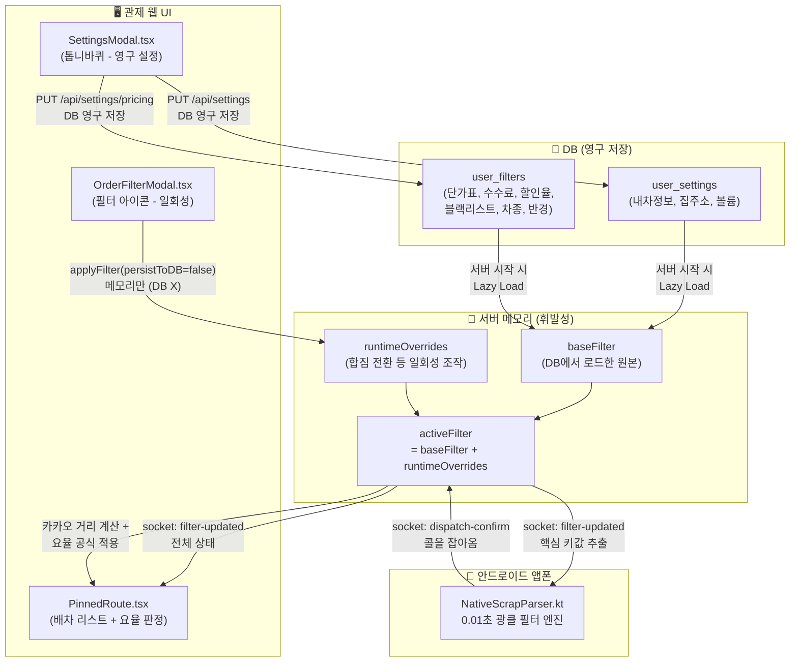
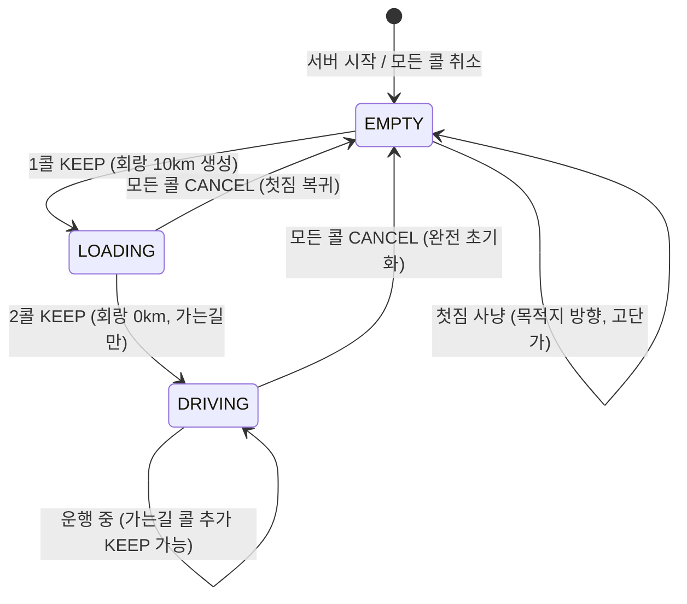

# 🎯 1DAL 필터 시스템 아키텍처

> **이 문서는 1DAL 배차 필터의 설계·구현·운영 전체를 한 곳에 정리한 단일 정본(Single Source of Truth)입니다.**
> 마지막 업데이트: 2026-04-23

---

## 목차

1. [시스템 전체 그림](#1-시스템-전체-그림)
2. [데이터 흐름도](#2-데이터-흐름도)
3. [DB 스키마 (ERD)](#3-db-스키마-erd)
4. [필터 계층 구조 (baseFilter / runtimeOverrides / activeFilter)](#4-필터-계층-구조)
5. [적재 상태 머신 (EMPTY → LOADING → DRIVING)](#5-적재-상태-머신)
6. [요율 계산 엔진](#6-요율-계산-엔진)
7. [UI 구조 (설정 모달 vs 필터 모달)](#7-ui-구조)
8. [앱(Android) 필터 엔진](#8-앱android-필터-엔진)
9. [미구현 로드맵](#9-미구현-로드맵)
10. [변경 이력](#10-변경-이력)

---

## 1. 시스템 전체 그림

1DAL 필터 시스템은 **"기사님이 원하는 콜만 자동으로 잡아주는 두뇌"** 입니다.

```
[인성망] ─→ [앱폰: 0.01초 광클 필터] ─→ [서버: 카카오 경로 + 요율 판정] ─→ [관제탑: 최종 결재]
                     ↑                              ↑
              4대 필터 조건                   다이내믹 요율 공식
           (차종/도착지/요금/거리)          (단가×거리×수수료)
```

**핵심 원칙**:
- 앱은 **"일단 잡아와라"** (최소한의 쓰레기만 거르고 빠르게 광클)
- 서버는 **"수익성을 판단한다"** (카카오 거리 기반 요율 계산)
- 사장님이 **"최종 결재한다"** (관제탑에서 KEEP/CANCEL)

---

## 2. 데이터 흐름도



### 핵심: 데이터는 단방향으로만 흐른다

```
DB(원천) → 서버 메모리(baseFilter) → activeFilter → 소켓 → 프론트/앱
```

- **기본값의 단일 출처**: DB 스키마의 `DEFAULT` 값이 유일한 기본값
- 서버·프론트·앱은 **자체 폴백을 갖지 않음** (DB를 신뢰)
- 앱만 오프라인 안전망으로 Kotlin 모델에 기본값 유지

---

## 3. DB 스키마 (ERD)

```mermaid
erDiagram
    users ||--o{ user_devices : "1:N 기기 소유"
    users ||--o{ user_tokens : "1:N 로그인 토큰"
    users ||--|| user_settings : "1:1 기본 설정"
    users ||--|| user_filters : "1:1 요율 및 필터 설정"

    user_settings {
        TEXT user_id PK_FK "users.id"
        INTEGER car_type "카카오 차종코드 (1~7)"
        TEXT vehicle_type "내 차종 문자열 (1t 등)"
        TEXT car_fuel "GASOLINE | DIESEL | LPG"
        BOOLEAN car_hipass "하이패스 유무"
        INTEGER fuel_price "리터당 유가 (원)"
        REAL fuel_efficiency "연비 (km/L)"
        TEXT default_priority "RECOMMEND | TIME | DISTANCE"
        BOOLEAN avoid_toll "유료도로 회피"
        TEXT home_address "복귀용 집주소"
        REAL home_x "집 경도"
        REAL home_y "집 위도"
        INTEGER alarm_volume "알림 볼륨 0~100"
    }

    user_filters {
        TEXT user_id PK_FK "users.id"
        TEXT destination_city "목적지 도시"
        INTEGER destination_radius_km "목적지 반경 (기본 10)"
        INTEGER corridor_radius_km "회랑 반경 (기본 1)"
        REAL pickup_radius_km "상차지 반경 (기본 10)"
        TEXT allowed_vehicle_types "JSON 배열"
        INTEGER min_fare "첫짐 절대 하한선 (기본 0)"
        INTEGER max_fare "최대 운임 (기본 1000000)"
        TEXT excluded_keywords "블랙리스트 JSON 배열"
        TEXT destination_keywords "도착지 읍면동 JSON 배열"
        BOOLEAN is_active "필터 활성화"
        BOOLEAN is_shared_mode "합짐 모드"
        TEXT load_state "EMPTY | LOADING | DRIVING"
        TEXT vehicle_rates "차종별 단가표 JSON"
        REAL agency_fee_percent "퀵사 수수료율 (기본 23)"
        REAL max_discount_percent "최대 할인율 (기본 10)"
    }

    user_devices {
        INTEGER id PK "자동증가"
        TEXT user_id FK "users.id"
        TEXT device_id UK "앱폰 고유 ID"
        TEXT device_name "사용자 지정 별명"
        TEXT registered_at "등록일"
    }
```

> **주의**: `is_shared_mode`와 `load_state`는 DB에 저장되지만, 세션 복구 시 항상 `EMPTY`/`false`로 초기화됩니다.
> 어제의 LOADING/DRIVING 상태가 오늘 되살아나는 것을 방지하기 위함입니다.

---

## 4. 필터 계층 구조

필터는 3개 계층으로 분리되어 원본 데이터의 무결성을 보장합니다.

```
┌─────────────────────────────────────────────┐
│  activeFilter (앱/프론트가 실제로 보는 값)       │
│  = baseFilter + runtimeOverrides            │
├─────────────────────────────────────────────┤
│  runtimeOverrides (휘발성 — 세션 중 임시 조작)   │
│  예: isSharedMode=true, corridorRadiusKm=10  │
│  → applyFilter(persistToDB=false)           │
├─────────────────────────────────────────────┤
│  baseFilter (영구 — DB에서 로드한 원본 설정)     │
│  예: pickupRadiusKm=10, minFare=30000       │
│  → applyFilter(persistToDB=true)            │
└─────────────────────────────────────────────┘
```

### applyFilter() — 모든 필터 변경의 단일 진입점

**파일**: `server/src/state/filterManager.ts`

```typescript
applyFilter(userId, changes, io, persistToDB?)
```

| 매개변수 | 설명 |
|---------|------|
| `persistToDB=true` | baseFilter 업데이트 + DB 저장 + 소켓 emit (SettingsModal 등 영구 설정) |
| `persistToDB=false` | runtimeOverrides 업데이트 + 소켓 emit (합짐 전환 등 일회성 조작) |

**EMPTY 초기화 시 자동 청소**: `loadState`가 `EMPTY`로 전환되면, `runtimeOverrides`에서 `isActive`만 남기고 나머지(회랑, 합짐 모드 등)를 전부 파기합니다.

---

## 5. 적재 상태 머신



### 상태별 필터 동작

| 상태 | 상차 반경 | 회랑 반경 | 차종 | 합짐 모드 |
|------|----------|----------|------|----------|
| `EMPTY` | 사용자 설정값 (예: 10km) | — | 사용자 차종 이하 | `false` |
| `LOADING` | **무시** (isSharedMode) | **10km** (적재 중 추가콜 탐색) | 첫짐 차종 이하 | `true` |
| `DRIVING` | **무시** (isSharedMode) | **0km** (가는길 콜만) | 첫짐 차종 이하 | `true` |

### 상차 반경 바이패스 원리

합짐 모드에서는 상차 반경을 **데이터로 조작하지 않습니다** (과거에는 999km로 덮어썼으나 제거됨).
대신 앱(`NativeScrapParser.kt`)이 `isSharedMode=true`를 보고 **규칙(Rule)으로 거리 검사를 건너뜁니다**:

```kotlin
// NativeScrapParser.kt — shouldClick()
val distanceMatch = if (order.pickupDistance == null) {
    true
} else if (filter.isSharedMode) {
    true // 합짐 모드: 상차 반경 무시 (회랑 필터가 대신 판단)
} else {
    order.pickupDistance <= filter.pickupRadiusKm
}
```

### 전이 코드 위치

**파일**: `server/src/services/dispatchEngine.ts` — `handleDecision()` 함수 내

```typescript
// EMPTY → LOADING (첫짐 KEEP)
applyFilter(userId, {
    isSharedMode: true, loadState: 'LOADING',
    corridorRadiusKm: 10, allowedVehicleTypes: sharedVehicleTypes,
}, io, false);

// LOADING → DRIVING (2콜 KEEP)
applyFilter(userId, {
    isSharedMode: true, loadState: 'DRIVING',
    corridorRadiusKm: 0, allowedVehicleTypes: sharedVehicleTypes,
}, io, false);
```

### 차종 자동 추론

합짐 전환 시, 첫 짐의 차종을 기준으로 **적재 가능한 하위 차종**을 자동 계산합니다.

```
기사 차종: 1t → 첫짐 차종: 라보 → 합짐 허용: [오토바이, 다마스, 라보]
```

`getSharedModeVehicleTypes()` 함수가 12종 전체 차량 배열에서 현재 차종 이하만 슬라이스합니다.

---

## 6. 요율 계산 엔진

서버가 콜을 받으면 **카카오 실주행 거리 기반**으로 적정 금액을 계산하고, 관제탑에 판정 결과를 표시합니다.

### 계산 공식

```
적정 금액 = (카카오 실제 주행 거리 km) × (오더 차량 단가표 값) × (1 - 퀵사수수료)
수용 하한선 = 적정 금액 × (1 - 최대할인율)
```

**예시**: 1t, 100km, 수수료 23%, 할인 10%
- 적정 = 100 × 1,000 × 0.77 = **77,000원**
- 하한 = 77,000 × 0.90 = **69,300원**

### 판정 결과

| 실제 요금 vs 하한선 | 판정 | UI 표시 |
|-------------------|------|--------|
| 실제 ≥ 적정 | 꿀콜 | 🍯 |
| 하한 ≤ 실제 < 적정 | 적정 | ✅ |
| 실제 < 하한 | 미달 | 🔴 `[요율 미달 -9,300원]` |

> **자동 취소하지 않습니다.** 관제탑에 사유만 표시하고, 사장님이 최종 판단합니다.

### 차종 불명 Fallback

인성망에서 차종이 `null`인 경우, 기사 본인의 `vehicle_type`(user_settings)을 대신 사용합니다.

---

## 7. UI 구조

### SettingsModal.tsx (톱니바퀴 ⚙️ — 영구 설정)

DB에 저장되어 서버 재시작 후에도 유지됩니다.

| 탭 | 내용 | 저장 대상 |
|----|------|----------|
| **기본 설정** | 내 차종, 경로 옵션, 집 주소, 알림 볼륨 | `user_settings` |
| **요율/필터** | 차종별 단가, 수수료, 할인율, 하한가, 상한가, 상차 반경, 블랙리스트, 내 노선 | `user_filters` |
| **기기 설정** | 앱폰 등록/해제, 별명 수정 | `user_devices` |

### OrderFilterModal.tsx (필터 아이콘 🔍 — 일회성)

서버 메모리만 변경하며, DB에 저장되지 않습니다.

| 탭 | 내용 |
|----|------|
| **첫짐** | "어디로 갈까?" — 도착 시/도, 반경 |
| **합짐** | "얼마나 돌아갈까?" — 회랑 이탈 허용 반경 |

---

## 8. 앱(Android) 필터 엔진

**파일**: `app/src/main/java/com/onedal/app/core/NativeScrapParser.kt`

앱은 서버에서 3초마다 텔레메트리로 받은 `activeFilter`를 SharedPreferences에 저장하고,
`shouldClick()` 함수에서 **5대 필터 조건을 AND(교집합)으로 검사**합니다:

| # | 조건 | 설명 |
|---|------|------|
| 0 | 차종 매칭 | `allowedVehicleTypes`에 포함 여부 |
| 1 | 도착지 매칭 | `destinationKeywords` 중 하나 포함 (2차 상세 필터 지원) |
| 2 | 요금 하한선 | `order.fare >= filter.minFare` |
| 3 | 상차지 거리 | `order.pickupDistance <= filter.pickupRadiusKm` (합짐 시 무시) |
| 4 | 블랙리스트 | `excludedKeywords`에 해당하지 않음 |

> **앱의 기본값은 "오프라인 안전망"**: 서버가 항상 완전한 필터를 전송하므로, Kotlin 모델의 기본값(`pickupRadiusKm=10` 등)은 통신 실패 시에만 사용됩니다.

---

## 9. 미구현 로드맵

### 9-1. "출발" 버튼 (난이도: ⭐)

> LOADING 상태에서 1콜만으로 출발하고 싶을 때, 수동으로 DRIVING 전환하는 UI

- **프론트**: PinnedRoute에 "🚀 출발" 버튼 추가
- **서버**: 소켓 이벤트 `manual-depart` → `applyFilter(loadState: 'DRIVING', corridorRadiusKm: 0)`

### 9-2. 🏠 귀가콜 가상 오더 (난이도: ⭐⭐)

> 배달 완료 후 집으로 돌아가면서 가는길 콜을 자동 잡는 기능

**동작 흐름**:
1. 관제탑에서 "🏠 귀가" 버튼 클릭
2. 서버가 가상 오더 생성: 상차지=현재 GPS, 하차지=집 주소(`user_settings.home_address`)
3. 카카오 경로 연산 → 폴리라인 생성 → 회랑 10km
4. 이후 일반 합짐 흐름과 동일

**필요 작업**:
- 소켓 핸들러: `create-home-return`
- 프론트: EMPTY/ARRIVED 상태에서 "🏠 귀가" 버튼 노출

### 9-3. GPS Progressive Corridor Trim + 도착 감지 (난이도: ⭐⭐⭐)

> 이동 중 이미 지나간 구간의 키워드를 자동 제거하고, 하차지 도착을 자동 감지

**Corridor Trim**:
- DRIVING 상태에서 GPS가 2km 이상 이동할 때마다
- Turf.js의 `nearestPointOnLine`으로 현재 위치 이후의 폴리라인만 남김
- 남은 구간으로 회랑 재계산 → `destinationKeywords` 자동 갱신

**도착 감지**:
- 마지막 하차지 GPS 반경 500m 이내 도달 시
- 반자동: "🏁 도착한 것 같습니다" 알림 → 사장님 확인 시 ARRIVED 전환

**트리거 조건**:

| 조건 | 값 | 이유 |
|------|-----|------|
| GPS 이동 거리 | 2km 이상 | Turf.js 연산 CPU 보호 |
| 도착 감지 반경 | 500m | 도심 GPS 오차 고려 |
| DRIVING 상태에서만 | ✅ | EMPTY/LOADING 때는 불필요 |

---

## 10. 변경 이력

| 날짜 | 변경 내용 |
|------|----------|
| 2026-04-23 | `pickupRadiusKm=999` 데이터 변조 제거 → `isSharedMode` 룰 기반 바이패스로 대체 |
| 2026-04-23 | 서버/프론트/앱의 기본값 폴백 제거 → DB를 단일 기본값 출처로 중앙화 |
| 2026-04-22 | `filter_system.md` + `filter_system2.md` 통합 (이 문서) |
| 2026-04-22 | 다이내믹 요율 계산 엔진 구현 (`calculateDynamicFare`) |
| 2026-04-21 | `applyFilter()` 중앙화 + `persistToDB` 이원화 완료 |
| 2026-04-21 | 3단계 State Machine (EMPTY→LOADING→DRIVING) 구현 |
| 2026-04-21 | SettingsModal 3탭 구조 + 차종별 단가표 UI 완성 |
| 2026-04-21 | DB 마이그레이션: vehicle_rates, agency_fee_percent, max_discount_percent, alarm_volume |
