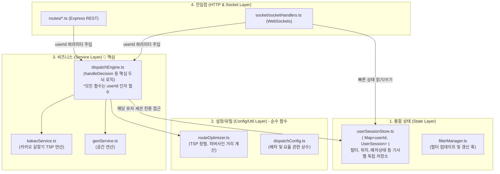

# 🛠️ 1DAL 아키텍처 리팩토링 및 모듈화 (SaaS 전환 체제)

> 이 문서는 기존 `refactoring_analysis.md` 1~5편을 하나로 통합한 최종 아키텍처 다이어그램 문서입니다. 
> 현재 1DAL 시스템(Node.js 서버)은 이 설계도에 따라 "전역 변수 덩어리"에서 **"완벽히 격리된 다중 사용자(Multi-Tenant) 4계층 아키텍처"**로 100% 리팩토링 완료되어 작동 중입니다.

---

## 1. 🏗️ 아키텍처 대전환: 왜 모듈화를 했는가?
이전의 코드는 모든 사용자(기사)가 서버의 단일 전역 변수(`mainCallState`, `activeFilterConfig` 등)를 공유하는 거미줄 구조였습니다.
SaaS(다중 사용자) 체제로 넘어가면서 여러 기사의 배차 상태와 필터가 충돌(Race Condition)하는 것을 막기 위해, 코드를 **4개의 명확한 계층(Layer)**으로 쪼개고 모든 상태를 `userId` 기반으로 격리했습니다.

---

## 2. 🏛️ 최종 서버 아키텍처 의존 관계도 (4계층 구조)

---

## 3. 📂 디렉토리별 역할 및 구현 현황

### 1️⃣ 상태 계층 (`state/`)
모든 상태가 더 이상 라우터에 떠돌지 않고, `userId` 기반의 Map 객체로 안전하게 보호됩니다.
* `userSessionStore.ts`: 1명의 기사가 가지는 '모든' 메모리 상태(`mainCallState`, `pendingOrdersData`, `activeFilter`)를 `UserSession` 인터페이스로 캡슐화.
* `filterManager.ts`: 기사의 필터가 변경될 때 소켓 이벤트와 DB 저장을 조율하는 중간 관리자.

### 2️⃣ 유틸 및 설정 계층 (`utils/`, `config/`)
외부 상태(DB나 Store)를 전혀 건드리지 않는 순수 알고리즘과 상수들의 모음입니다.
* `routeOptimizer.ts`: 카카오 다중 경유지 정렬을 위한 최적화 로직.
* `dispatchConfig.ts`: 꿀콜/똥콜 판단을 위한 임계값 및 상수.

### 3️⃣ 비즈니스 서비스 계층 (`services/`)
기존에 `detail.ts`에 뭉쳐있던 900줄짜리 로직들을 해체하여 역할을 부여했습니다.
* `dispatchEngine.ts`: 배차 판독(`handleDecision`), 콜 캐싱, 타임아웃 캔슬을 관장하는 서버의 핵심 두뇌. **(모든 함수에 `userId`를 주입받아 작동)**
* `kakaoService.ts`: 카카오 모빌리티 API(Directions)와의 직접적인 통신 전담.

### 4️⃣ 라우터 계층 (`routes/`, `socket/`)
비즈니스 로직을 전혀 가지고 있지 않으며, 오직 HTTP Request/Response와 WebSocket 이벤트 송수신만 담당합니다. 들어온 요청에 `userId`를 달아서 즉시 Service 계층으로 던집니다.
* `socketHandlers.ts`: `io.to(userId).emit(...)` 구조를 통해 브로드캐스트가 아닌 프라이빗 룸 송출을 전담하여 SaaS 격리를 달성합니다.

---

## 4. 🚀 결론
이 4계층 리팩토링 덕분에, 우리는 기존 단일 매크로 코드베이스의 뼈대를 훼손하지 않으면서도 수백 명의 기사가 동시에 접속해도 메모리나 상태가 절대 섞이지 않는 **완벽한 SaaS(Multi-Tenant) 서버**를 완성하게 되었습니다.
