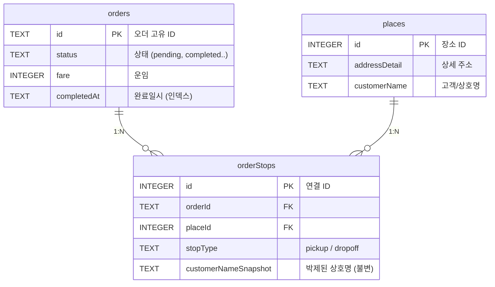

# 1DAL 데이터베이스 스키마 및 운행일지 아키텍처 (v3.1)

> **문서 상태**: Draft (시니어 리뷰 반영 완료)
> **작성 목적**: 1DAL 플랫폼의 운행일지 및 정산 시스템을 완벽하게 지원하기 위한 SQLite 테이블 스키마 정의

---

## 🏗️ 1. 아키텍처 핵심 설계 철학 (Senior Review)

1. **TS-DB 네이밍 동기화**: 모든 컬럼명은 `camelCase`로 작성하여 Node.js 메모리(TypeScript) ↔ DB(SQLite) 간의 변환 비용과 휴먼 에러를 제거합니다.
2. **영수증 데이터 불변성 (Immutability)**: 장부(Ledger) 역할을 하는 `orderStops`에는 배차 당시의 고객명과 연락처를 스냅샷(Snapshot)으로 박제합니다. `places` 마스터가 수정되어도 과거 영수증은 변조되지 않습니다.
3. **다중 상하차 정규화**: 1오더-다중상하차(경유콜)를 지원하기 위해 `places`(장소 마스터)와 `orderStops`(N:M 연결 테이블)를 분리합니다.
4. **조회 성능 최적화**: 일/월별 통계 대시보드의 성능 확보를 위해 복합 인덱스(Composite Index)를 필수적으로 구성합니다.

---

## 🗄️ 2. ERD (Entity Relationship Diagram)



---

## 📜 3. 테이블 DDL 상세

### 3.1 `orders` (핵심 오더 / 장부)

오더의 핵심 정보와 요금, 전체 운행 시간, 정산 상태를 보관합니다. 리스트 렌더링에 필요한 출발/도착 요약 텍스트는 비정규화(Denormalization)하여 읽기 성능을 높입니다.

```sql
CREATE TABLE IF NOT EXISTS orders (
    -- [식별]
    id                    TEXT PRIMARY KEY,
    type                  TEXT NOT NULL DEFAULT 'NEW_ORDER',
    status                TEXT NOT NULL DEFAULT 'pending',
    userId                TEXT REFERENCES users(id),
    capturedDeviceId      TEXT,
    capturedAt            TEXT,
    timestamp             TEXT NOT NULL,

    -- [UI 요약] (빠른 리스트 렌더링용 비정규화)
    pickup                TEXT NOT NULL,
    dropoff               TEXT NOT NULL,

    -- [요금 및 문서]
    fare                  INTEGER DEFAULT 0,
    vehicleType           TEXT,
    paymentType           TEXT,
    billingType           TEXT,
    commissionRate        TEXT,
    tollFare              TEXT,
    tripType              TEXT,
    orderForm             TEXT,
    itemDescription       TEXT,
    detailMemo            TEXT,

    -- [배차사]
    dispatcherName        TEXT,
    dispatcherPhone       TEXT,

    -- [운행 정보 - 카카오 연산 통합]
    distanceKm            REAL,
    totalDistanceKm       REAL,
    totalDurationMin      INTEGER,
    kakaoSoloDistanceKm   REAL,
    kakaoSoloDurationMin  INTEGER,
    kakaoTimeExt          TEXT,

    -- [정산 - SettlementInfo 플랫화]
    settlementStatus      TEXT DEFAULT '미정산',
    unpaidAmount          INTEGER DEFAULT 0,
    payerName             TEXT,
    payerPhone            TEXT,
    dueDate               TEXT,
    settlementMemo        TEXT,

    -- [메타 플래그 및 감사(Audit)]
    isShared              BOOLEAN DEFAULT 0,
    isExpress             BOOLEAN DEFAULT 0,
    postTime              TEXT,
    scheduleText          TEXT,
    createdAt             TEXT DEFAULT (datetime('now', 'localtime')),
    completedAt           TEXT,                   -- 운행 완료 시각
    canceledAt            TEXT,                   -- [추가] 취소 시각
    cancelReason          TEXT                    -- [추가] 취소 사유
);

-- [통계 성능 인덱스] "특정 기사의 특정 기간 완료된 콜" 조회 최적화
CREATE INDEX IF NOT EXISTS idx_orders_dashboard 
ON orders(userId, status, completedAt);
```

### 3.2 `places` (장소 마스터)

모든 상하차 장소의 마스터 데이터입니다. 주소+상호명 조합으로 유니크 키를 구성하여 동일 빌딩 내 다수 고객 충돌을 방지합니다.

```sql
CREATE TABLE IF NOT EXISTS places (
    id              INTEGER PRIMARY KEY AUTOINCREMENT,
    
    address         TEXT,
    x               REAL,
    y               REAL,
    region          TEXT,
    addressDetail   TEXT,
    
    customerName    TEXT,
    department      TEXT,
    contactName     TEXT,
    phone1          TEXT,
    phone2          TEXT,
    mileage         INTEGER DEFAULT 0,
    
    createdAt       TEXT DEFAULT (datetime('now', 'localtime')),
    lastVisitedAt   TEXT,

    -- [복합 유니크 키] 같은 건물(주소)에 다른 회사(상호명)가 있을 수 있으므로 복합키 사용
    UNIQUE(addressDetail, customerName)
);

CREATE INDEX IF NOT EXISTS idx_places_region ON places(region);
```

### 3.3 `orderStops` (경유지 스냅샷 연결)

오더와 장소를 연결합니다. **영수증 불변성**을 위해 방문 당시의 상호명과 연락처를 스냅샷으로 저장합니다.

```sql
CREATE TABLE IF NOT EXISTS orderStops (
    id              INTEGER PRIMARY KEY AUTOINCREMENT,
    orderId         TEXT NOT NULL REFERENCES orders(id) ON DELETE CASCADE,
    placeId         INTEGER NOT NULL REFERENCES places(id),
    stopType        TEXT NOT NULL CHECK(stopType IN ('pickup', 'dropoff')),
    stopOrder       INTEGER DEFAULT 0,

    -- [데이터 불변성(Snapshot)] 장소 마스터가 나중에 바뀌어도 영수증은 유지되어야 함
    customerNameSnapshot TEXT,
    phoneSnapshot        TEXT,

    -- [오더 종속 가변 데이터]
    requestedTime   TEXT,
    memo            TEXT
);

CREATE INDEX IF NOT EXISTS idx_orderStops_orderId ON orderStops(orderId);
CREATE INDEX IF NOT EXISTS idx_orderStops_placeId ON orderStops(placeId);
```

---

## 📊 4. 운행일지/대시보드 활용 쿼리 예시

### 4.1 일간/월간 매출 요약 (대시보드)
`idx_orders_dashboard` 복합 인덱스를 타므로 매우 빠릅니다.
```sql
SELECT 
    COUNT(*) AS totalCount,
    SUM(fare) AS totalRevenue,
    SUM(totalDistanceKm) AS totalDistance,
    SUM(CASE WHEN settlementStatus = '미수금' THEN unpaidAmount ELSE 0 END) AS unpaidSum
FROM orders 
WHERE userId = 'user_1' 
  AND status = 'completed' 
  AND completedAt >= '2026-05-01 00:00:00' 
  AND completedAt <= '2026-05-01 23:59:59';
```

### 4.2 오더 상세 영수증 (다중 경유지 포함)
조회 시 `places` 테이블이 아닌 `orderStops`의 스냅샷 데이터를 사용하여 과거 영수증의 데이터 무결성을 보장합니다.
```sql
SELECT 
    o.id, o.completedAt, o.fare, o.dispatcherName,
    s.stopType, s.stopOrder,
    p.addressDetail, 
    s.customerNameSnapshot, -- 현재 places.customerName이 아님! (불변성)
    s.phoneSnapshot,
    s.memo
FROM orders o
JOIN orderStops s ON o.id = s.orderId
JOIN places p ON s.placeId = p.id
WHERE o.id = 'order_1234'
ORDER BY s.stopType DESC, s.stopOrder ASC;
```

### 4.3 단골 장소 TOP 10 (자동화 타겟 발굴)
마스터 테이블인 `places`와 연결되어 있어 정확한 방문 통계가 가능합니다.
```sql
SELECT 
    p.customerName, p.addressDetail, 
    COUNT(*) AS visitCount, 
    MAX(o.completedAt) AS lastVisit
FROM orderStops s
JOIN places p ON p.id = s.placeId
JOIN orders o ON o.id = s.orderId
WHERE o.userId = 'user_1' AND o.status = 'completed'
GROUP BY p.id
ORDER BY visitCount DESC
LIMIT 10;
```
---

## 📋 운행일지 활용 예시 (이 스키마로 할 수 있는 것들)

아래는 차주님이 하루 4건의 콜을 처리한 시나리오를 가정한 실제 데이터 예시입니다.

### 시나리오: 2026년 5월 1일 (목) 하루 운행

| 순서 | 시간 | 출발 | 도착 | 요금 | 거리 | 소요 | 배차사 | 비고 |
|:---:|:---:|------|------|-----:|-----:|-----:|--------|------|
| 1 | 08:30~09:45 | 경기 광주 오포 | 서울 강남구 역삼동 | 45,000 | 32.1km | 48분 | 광주퀵서비스 | 편도 |
| 2 | 10:20~11:10 | 서울 마포구 상암동 | 경기 고양시 일산서구 | 35,000 | 18.5km | 35분 | 고양퀵서비스 | 급송 |
| 3 | 13:00~15:20 | 경기 화성시 안녕동 | 서울 용산구 한남동 + 서울 종로구 평창동 | 72,000 | 65.3km | 92분 | 화성퀵서비스 | **경유콜** (하차 2곳) |
| 4 | 16:00~17:30 | 서울 강남구 역삼동 | 경기 파주시 금촌동 | 55,000 | 52.8km | 78분 | 고양퀵서비스 | 합짐, 착불 |

> [!NOTE]
> 3번 콜은 **경유콜(하차 2곳)**입니다. 현재 스키마에서는 이를 처리할 수 없지만, 새 스키마에서는 `orderStops` 테이블에 행 3개(상차1 + 하차2)로 자연스럽게 기록됩니다.

---

### 활용 1: 🗓 하루 요약 대시보드

```
┌─────────────────────────────────────────────┐
│  📊 2026년 5월 1일 (목) 운행 요약            │
├─────────────────────────────────────────────┤
│  총 건수      4건                            │
│  총 매출      207,000원                      │
│  총 주행거리  168.7km                        │
│  총 운행시간  4시간 13분                      │
│  km당 단가    1,227원/km                     │
├─────────────────────────────────────────────┤
│  💰 정산 현황                                │
│  정산완료     152,000원  (3건)               │
│  미수금       55,000원   (1건 — 고양퀵서비스) │
└─────────────────────────────────────────────┘
```

**사용 쿼리:** `SELECT SUM(fare), SUM(totalDistanceKm), SUM(totalDurationMin) FROM orders WHERE ...`

---

### 활용 2: 📝 상세 운행일지 (프린트용)

| # | 배차시각 | 완료시각 | 출발지 | 도착지 | 차종 | 운임 | 거리 | 시간 | 배차사 | 결제 | 정산 |
|:-:|:-------:|:-------:|--------|--------|:----:|-----:|-----:|-----:|--------|:----:|:----:|
| 1 | 08:30 | 09:45 | 경기 광주 오포 | 강남구 역삼동 | 1t | 45,000 | 32.1 | 48분 | 광주퀵서비스 | 신용 | ✅ |
| 2 | 10:20 | 11:10 | 마포구 상암동 | 고양 일산서구 | 다마스 | 35,000 | 18.5 | 35분 | 고양퀵서비스 | 신용 | ✅ |
| 3 | 13:00 | 15:20 | 화성시 안녕동 | 한남동 → 평창동 | 1t | 72,000 | 65.3 | 92분 | 화성퀵서비스 | 카드 | ✅ |
| 4 | 16:00 | 17:30 | 강남구 역삼동 | 파주시 금촌동 | 1t | 55,000 | 52.8 | 78분 | 고양퀵서비스 | **착불** | ❌ 미수금 |

**사용 쿼리:** `SELECT capturedAt, completedAt, pickup, dropoff, fare, totalDistanceKm, ... FROM orders WHERE ...`

---

### 활용 3: 📍 경유콜 상세 (3번 콜의 orderStops + places 조인)

3번 콜은 상차 1곳 + 하차 2곳이므로 `orderStops`에 3행이 저장됩니다:

| 구분 | 순서 | 장소(places) | 고객명 | 연락처 | 예약시간 | 메모 |
|:----:|:---:|-------------|--------|--------|:-------:|------|
| 🔵 상차 | 0 | 경기 화성시 안녕동 158-95 | *레드캠프 | 010-2228-4991 | 13:00 | 5층 하차 |
| 🔴 하차 | 0 | 서울 용산구 한남동 734-4 | SK스토아 홈쇼핑 | 02-6100-1234 | 14:20 | 지하 1층 반품창고 |
| 🔴 하차 | 1 | 서울 종로구 평창동 123-8 | 평창갤러리 | 02-391-5678 | 15:00 | 정문 앞 대기 |

**사용 쿼리:** `SELECT s.stopType, p.addressDetail, p.customerName, p.phone1, s.requestedTime, s.memo FROM orderStops s JOIN places p ON p.id = s.placeId WHERE s.orderId = ?`

> [!TIP]
> `places` 테이블에 "레드캠프"와 "SK스토아"가 한 번 등록되면, 다음에 같은 곳으로 콜이 와도 **기존 장소를 재사용**합니다. 고객 연락처가 변경되면 UPSERT로 자동 갱신됩니다.

---

### 활용 4: 💸 미수금 추적 보드

| 날짜 | 도착지 | 운임 | 미수금 | 결제처 | 연락처 | 입금예정 | 메모 |
|:----:|--------|-----:|------:|--------|--------|:-------:|------|
| 05/01 | 파주시 금촌동 | 55,000 | 55,000 | 고양퀵서비스 | 031-932-7722 | 5/15 | 착불 — 전화 안받음 |
| 04/28 | 인천 부평구 | 38,000 | 38,000 | 부평퀵서비스 | 032-123-4567 | 4/30 | 수수료 떼고 입금 약속 |
| **합계** | | | **93,000** | | | | |

**사용 쿼리:** `SELECT completedAt, dropoff, fare, unpaidAmount, payerName, payerPhone, dueDate, settlementMemo FROM orders WHERE settlementStatus = '미수금'`

---

### 활용 5: 🏢 단골 장소 TOP 10

`places` 테이블 덕분에 같은 장소를 몇 번이나 방문했는지 통계를 뽑을 수 있습니다:

| 순위 | 장소 | 지역 | 고객명 | 방문 횟수 | 최근 방문 |
|:---:|------|------|--------|:--------:|:---------:|
| 1 | 강남구 역삼동 123-4 | 서울 강남구 | (주)한국물류 | 12회 | 05/01 |
| 2 | 화성시 안녕동 158-95 | 경기 화성시 | *레드캠프 | 8회 | 05/01 |
| 3 | 고양시 일산서구 대화동 | 경기 고양시 | CJ대한통운 | 6회 | 04/30 |

**사용 쿼리:** `SELECT p.addressDetail, p.region, p.customerName, COUNT(*) AS 방문횟수 FROM orderStops s JOIN places p ... GROUP BY p.id ORDER BY 방문횟수 DESC`

> [!TIP]
> 이 데이터를 활용하면 나중에 "이 고객에게 콜이 오면 자동 수락" 같은 VIP 자동화 기능도 구현할 수 있습니다.

---

### 활용 6: 📊 월별 요약 리포트

| 월 | 건수 | 매출 | 주행거리 | 운행시간 | km당 단가 | 미수금 |
|:--:|:---:|------:|--------:|--------:|--------:|------:|
| 3월 | 78건 | 4,230,000 | 2,847km | 71시간 | 1,486원 | 120,000 |
| 4월 | 92건 | 5,180,000 | 3,412km | 84시간 | 1,518원 | 55,000 |
| 5월(진행중) | 4건 | 207,000 | 169km | 4시간 | 1,227원 | 55,000 |

**사용 쿼리:** `SELECT strftime('%Y-%m', completedAt) AS 월, COUNT(*), SUM(fare), SUM(totalDistanceKm) ... GROUP BY 월`

---

## 수정 대상 파일 (4개)

> [!CAUTION]
> 소스 코드 수정은 차주님 승인 후에만 진행합니다.

### [MODIFY] [db.ts](file:///Users/seungwookkim/reps/onedal/onedal-web/server/src/db.ts)
- `CREATE TABLE IF NOT EXISTS orders` → 새 camelCase 스키마로 교체
- `CREATE TABLE IF NOT EXISTS orderStops` 신규 추가
- 기존 ALTER TABLE 마이그레이션 코드 삭제

### [MODIFY] [dispatchEngine.ts](file:///Users/seungwookkim/reps/onedal/onedal-web/server/src/services/dispatchEngine.ts)
- `handleDecision` KEEP 블록: INSERT문을 새 컬럼에 맞게 확장
- `cachedOrder`(SecuredOrder)에서 pickupDetails/dropoffDetails를 꺼내 `orderStops`에 행 삽입

### [MODIFY] [socketHandlers.ts](file:///Users/seungwookkim/reps/onedal/onedal-web/server/src/socket/socketHandlers.ts)
- `dispatch-complete`: `completedAt` 컬럼 함께 기록
- `start-two-track`: 동일하게 `completedAt` 추가

### [MODIFY] [orders.ts](file:///Users/seungwookkim/reps/onedal/onedal-web/server/src/routes/orders.ts)
- GET `/api/orders`: SELECT 쿼리 및 응답 매핑 확장
- POST `/` 레거시: INSERT문 새 스키마 적용

---

## 의도적으로 제외한 필드

| SecuredOrder 필드 | 제외 사유 |
|---|---|
| `routePolyline` | 좌표 수천 개 배열 — DB 용량 폭발. 실시간 전용 |
| `sectionEtas` | 경유지 도착 시간 배열 — 실시간 전용 |
| `pickupEta`, `dropoffEta` | 예상 도착 시간 — 운행 끝나면 무의미 |
| `isRejected`, `rejectionReasons`, `approvalReasons` | 배차 판단 사유 — 평가 중에만 유효 |
| `osrmSolo*`, `osrmError` | 보조 연산 결과 — 카카오 결과만 보관 |
| `kakaoCalculatedFare` | 미구현 확장 필드 |
| `rawText` | 안드로이드 원본 — intel 테이블 담당 |

---

## Open Questions

> [!NOTE]
> **Q1. `completedAt` 외에 `startedAt`(운행 시작 시각)도 필요한지?**
> - 현재: `capturedAt`(배차) → `completedAt`(완료)만 기록
> - 실제 출발 시각 기록하려면 프론트에 "운행 시작" 버튼 추가 필요

## Verification Plan

### Automated Tests
1. `sqlite3 local.db ".schema orders"` — 새 테이블 구조 확인
2. `sqlite3 local.db ".schema orderStops"` — 경유지 테이블 확인
3. 콜 확정 → 완료 후 `SELECT * FROM orders` + `SELECT * FROM orderStops` 검증

### Manual Verification
- 관제탑에서 경유콜(합짐) 확정 → 완료 후 orderStops에 다중 행 저장 확인
- 운행일지 쿼리 실행하여 하루 요약/상세 출력 확인