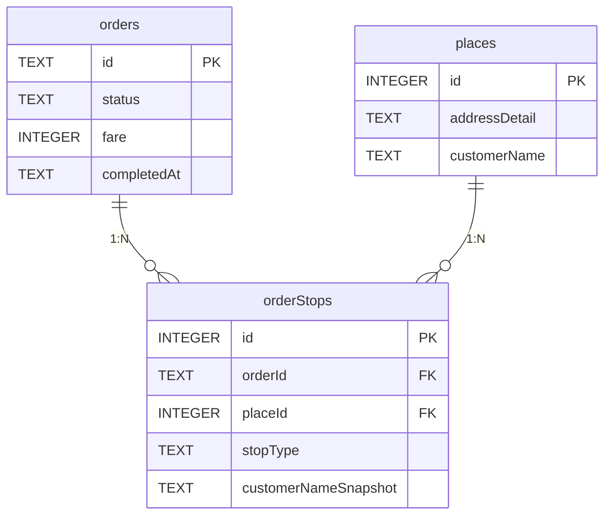

# 1DAL 데이터베이스 스키마 설계서 (v4)

> **문서 상태**: Final Draft  
> **작성일**: 2026-05-01  
> **목적**: 운행일지 및 정산 시스템을 완벽하게 지원하는 SQLite 스키마 정의

---

## 1. 설계 원칙

| # | 원칙 | 설명 |
|:-:|------|------|
| 1 | **camelCase 통일** | TS 인터페이스와 DB 컬럼명 동일 → 변환 오류 원천 차단 |
| 2 | **장소 마스터 분리** | 같은 곳을 매일 가도 places에 1번만 저장, orderStops로 N:M 연결 |
| 3 | **영수증 불변성** | orderStops에 스냅샷 컬럼으로 과거 데이터 보존 |
| 4 | **조회 성능** | 복합 인덱스로 대시보드 쿼리 최적화 |

---

## 2. ERD



---

## 3. 테이블 DDL

### 3.1 `orders`

```sql
CREATE TABLE IF NOT EXISTS orders (
    -- [식별]
    id                    TEXT PRIMARY KEY,
    type                  TEXT NOT NULL DEFAULT 'NEW_ORDER',
    status                TEXT NOT NULL DEFAULT 'pending',
    userId                TEXT REFERENCES users(id),
    capturedDeviceId      TEXT,
    capturedAt            TEXT,
    timestamp             TEXT NOT NULL,

    -- [UI 요약 — 비정규화]
    pickup                TEXT NOT NULL,
    dropoff               TEXT NOT NULL,

    -- [요금 및 문서]
    fare                  INTEGER DEFAULT 0,
    vehicleType           TEXT,
    paymentType           TEXT,
    billingType           TEXT,
    commissionRate        TEXT,
    tollFare              TEXT,
    tripType              TEXT,
    orderForm             TEXT,
    itemDescription       TEXT,
    detailMemo            TEXT,

    -- [배차사]
    dispatcherName        TEXT,
    dispatcherPhone       TEXT,

    -- [운행 거리/시간]
    distanceKm            REAL,
    totalDistanceKm       REAL,
    totalDurationMin      INTEGER,
    kakaoSoloDistanceKm   REAL,
    kakaoSoloDurationMin  INTEGER,
    kakaoTimeExt          TEXT,

    -- [정산 — SettlementInfo 플랫화]
    settlementStatus      TEXT DEFAULT '미정산',
    unpaidAmount          INTEGER DEFAULT 0,
    payerName             TEXT,
    payerPhone            TEXT,
    dueDate               TEXT,
    settlementMemo        TEXT,

    -- [메타 플래그]
    isShared              BOOLEAN DEFAULT 0,
    isExpress             BOOLEAN DEFAULT 0,
    postTime              TEXT,
    scheduleText          TEXT,

    -- [타임스탬프 & 감사]
    createdAt             TEXT DEFAULT (datetime('now', 'localtime')),
    completedAt           TEXT,
    canceledAt            TEXT,
    cancelReason          TEXT
);

CREATE INDEX IF NOT EXISTS idx_orders_dashboard
ON orders(userId, status, completedAt);
```

### 3.2 `places`

```sql
CREATE TABLE IF NOT EXISTS places (
    id              INTEGER PRIMARY KEY AUTOINCREMENT,
    address         TEXT,
    x               REAL,
    y               REAL,
    region          TEXT,
    addressDetail   TEXT,
    customerName    TEXT,
    department      TEXT,
    contactName     TEXT,
    phone1          TEXT,
    phone2          TEXT,
    mileage         INTEGER DEFAULT 0,
    createdAt       TEXT DEFAULT (datetime('now', 'localtime')),
    lastVisitedAt   TEXT,
    UNIQUE(addressDetail, customerName)
);

CREATE INDEX IF NOT EXISTS idx_places_region ON places(region);
```

### 3.3 `orderStops`

```sql
CREATE TABLE IF NOT EXISTS orderStops (
    id              INTEGER PRIMARY KEY AUTOINCREMENT,
    orderId         TEXT NOT NULL REFERENCES orders(id) ON DELETE CASCADE,
    placeId         INTEGER NOT NULL REFERENCES places(id),
    stopType        TEXT NOT NULL CHECK(stopType IN ('pickup', 'dropoff')),
    stopOrder       INTEGER DEFAULT 0,
    customerNameSnapshot TEXT,
    phoneSnapshot        TEXT,
    requestedTime   TEXT,
    memo            TEXT
);

CREATE INDEX IF NOT EXISTS idx_orderStops_orderId ON orderStops(orderId);
CREATE INDEX IF NOT EXISTS idx_orderStops_placeId ON orderStops(placeId);
```

---

## 4. 시니어 리뷰: v3 개선점 4가지 심층 검증

### 4.1 ✅ 데이터 불변성 (Snapshot) — 적절함

**v3 설계:** `orderStops`에 `customerNameSnapshot`, `phoneSnapshot` 추가

**시니어 의견: 정확한 판단입니다.**

운행일지는 회계 장부와 동일한 성격을 가집니다. 회계 원칙의 핵심은 **"과거 거래 기록은 절대 소급 변경하면 안 된다"**입니다.

만약 스냅샷 없이 `places` 테이블만 조인한다면:
- 4월에 "레드캠프"에 배달한 영수증이 있는데
- 5월에 그 회사가 "블루캠프"로 상호 변경하면
- 4월 영수증까지 "블루캠프"로 보이게 됨 → **장부 변조**

다만, 스냅샷 컬럼은 **2개면 충분**합니다:
- `customerNameSnapshot` — 배달 당시 상호명
- `phoneSnapshot` — 배달 당시 연락처

> [!TIP]
> `addressDetail`은 스냅샷 불필요합니다. 물리적 주소는 거의 변하지 않고, 변하더라도 places의 UNIQUE 제약에 의해 새 행이 생기기 때문입니다.

---

### 4.2 ✅ 복합 유니크 키 — 적절함 (단, NULL 주의)

**v3 설계:** `UNIQUE(addressDetail, customerName)`

**시니어 의견: 올바른 설계입니다.** 같은 빌딩에 A회사와 B회사가 있을 수 있으므로, 주소만으로는 유니크할 수 없습니다.

> [!WARNING]
> **SQLite NULL 동작 주의:** SQLite에서 `UNIQUE` 제약은 NULL을 각각 고유한 값으로 취급합니다.
> 즉, `addressDetail`이 NULL이면 같은 `customerName`이어도 무한 중복 삽입됩니다.
>
> **방어 전략:** UPSERT 시 `addressDetail`이 NULL/빈문자열인 경우, `address + customerName` 조합이나 `region + customerName`으로 대체 매칭하는 애플리케이션 레벨 로직을 반드시 추가해야 합니다.

**UPSERT 예시:**
```sql
INSERT INTO places (addressDetail, customerName, phone1, region, lastVisitedAt)
VALUES (?, ?, ?, ?, datetime('now','localtime'))
ON CONFLICT(addressDetail, customerName)
DO UPDATE SET
    phone1 = excluded.phone1,
    lastVisitedAt = excluded.lastVisitedAt;
```

---

### 4.3 ✅ 복합 인덱스 — 적절함

**v3 설계:** `idx_orders_dashboard ON orders(userId, status, completedAt)`

**시니어 의견: 정확히 올바른 인덱스입니다.**

대시보드의 모든 쿼리가 `WHERE userId = ? AND status = 'completed' AND completedAt >= ?` 패턴이므로, 이 3개 컬럼 순서로 복합 인덱스를 걸면 **Index Range Scan**으로 처리됩니다.

하루 6건 × 365일 = 연간 ~2,200행 수준에서는 인덱스 없이도 빠르겠지만, **선제적으로 걸어두는 것이 맞습니다.** 나중에 데이터가 수만 건으로 늘어났을 때 "왜 갑자기 느려졌지?" 하고 당황하는 일을 미리 방지합니다.

> [!NOTE]
> 추가 인덱스는 현 시점에서 불필요합니다. 미수금 조회(`WHERE settlementStatus = '미수금'`)는 건수가 적어 풀 스캔이어도 문제없습니다.

---

### 4.4 ✅ 취소 추적 (canceledAt, cancelReason) — 적절함

**v3 설계:** `canceledAt TEXT`, `cancelReason TEXT` 추가

**시니어 의견: 좋은 방어적 설계입니다.**

현재 코드에서는 `status = 'canceled'`로만 표시하고 있어서, "왜 취소됐는지", "언제 취소됐는지" 알 수 없습니다. 향후 다음과 같은 상황에서 유용합니다:

| 시나리오 | cancelReason 예시 |
|---------|------------------|
| 서버 데스밸리 타임아웃 | `"TIMEOUT_35S"` |
| 기사 수동 취소 | `"DRIVER_CANCEL"` |
| 차종 불일치 자동 취소 | `"VEHICLE_MISMATCH"` |
| 앱 비상 취소 | `"APP_AUTO_CANCEL"` |

> [!TIP]
> 취소된 콜은 매출에 잡히지 않으므로(`WHERE status = 'completed'`), 데이터가 남아도 통계를 오염시키지 않습니다. 하지만 나중에 "이번 달 취소율이 몇 %인가?"를 분석할 때 귀중한 자산이 됩니다.

---

## 5. v3에서 빠져있던 것 — v4 보완 사항

### 5.1 places 테이블에 userId 누락

**문제:** 현재 `places`에 `userId`가 없어서 모든 기사의 장소가 하나의 테이블에 섞입니다. 1DAL이 다수 기사를 지원하게 되면, A기사의 단골 장소와 B기사의 단골 장소가 구분되지 않습니다.

**판단:** 현재 1인 사용 시스템이므로 당장은 불필요하지만, 확장성을 고려하면 `userId`를 추가하는 것이 안전합니다. 단, places는 "장소 사전"의 성격이므로 **userId 없이 공유하는 것이 더 효율적**입니다. 단골 통계를 낼 때는 `orders.userId`로 필터하면 됩니다. → **현재 설계 유지가 맞습니다.**

### 5.2 정산 상태 변경 이력 (Audit Trail)

**문제:** `settlementStatus`가 `미정산 → 정산완료`로 바뀌었을 때, "언제 정산이 완료되었는가?"를 알 수 없습니다.

**판단:** 하루 6건 수준에서는 과도한 설계(YAGNI)입니다. 필요해지면 `settlementUpdatedAt TEXT` 컬럼 1개를 추가하는 것으로 충분합니다. → **v4에서는 보류, 향후 필요 시 ALTER TABLE로 추가**

### 5.3 경유콜 상세 쿼리의 활용 예시 정합성

**문제:** v3 활용 예시 3번에서 `p.customerName`을 사용하고 있지만, 영수증 불변성 원칙에 따르면 `s.customerNameSnapshot`을 사용해야 합니다.

**v4 수정:**
```sql
-- 영수증 조회 시 (과거 데이터 정확성 필요)
SELECT s.customerNameSnapshot, s.phoneSnapshot FROM orderStops s ...

-- 현재 정보 조회 시 (최신 연락처가 필요한 경우)
SELECT p.customerName, p.phone1 FROM places p ...
```

---

## 6. 최종 설계 요약

```
┌─────────────────────────────────────────────────────────┐
│                    orders (핵심 장부)                     │
│  "언제, 얼마짜리, 어떤 조건의 콜을 처리하고 정산했는가"       │
│  · 35개 컬럼 (식별 + 요금 + 거리 + 정산 + 감사)            │
│  · idx_orders_dashboard 복합 인덱스                       │
├─────────────────────────────────────────────────────────┤
│                                                         │
│  ┌──────────────┐    orderStops     ┌──────────────┐    │
│  │   orders     │◄── (중간 테이블) ──►│   places     │    │
│  │  id (PK)     │    orderId (FK)    │  id (PK)     │    │
│  │  fare        │    placeId (FK)    │  addressDetail│   │
│  │  status      │    stopType        │  customerName │   │
│  │  completedAt │    stopOrder       │  phone1       │   │
│  │  canceledAt  │    ──────────────  │  UNIQUE(주소, │   │
│  │  cancelReason│    Snapshot 컬럼:  │    상호명)    │    │
│  └──────────────┘    · customerName  └──────────────┘    │
│                      · phone                             │
│                      가변 컬럼:                           │
│                      · requestedTime                     │
│                      · memo                              │
└─────────────────────────────────────────────────────────┘
```

| 테이블 | 역할 | 행 증가 속도 |
|--------|------|:----------:|
| `orders` | 영구 장부 | ~6행/일 |
| `places` | 장소 사전 (중복 없음) | 느림 (신규 장소만) |
| `orderStops` | 연결 + 스냅샷 | ~12행/일 (오더당 평균 2~3개) |

---

## 7. 수정 대상 파일 (5개)

> [!CAUTION]
> 소스 코드 수정은 차주님 승인 후에만 진행합니다.

| 파일 | 수정 내용 |
|------|----------|
| `db.ts` | orders DROP+CREATE, places/orderStops 신규, 마이그레이션 코드 삭제 |
| `dispatchEngine.ts` | handleDecision KEEP: 확장 INSERT + places UPSERT + orderStops 삽입 |
| `socketHandlers.ts` | dispatch-complete/two-track: completedAt 기록 |
| `orders.ts` | GET/POST 쿼리 새 스키마 적용 |
| `local.db` | 기존 orders 데이터 삭제 (DROP TABLE) |

---

## 8. 의도적으로 제외한 필드

| SecuredOrder 필드 | 제외 사유 |
|---|---|
| `routePolyline` | 좌표 수천 개 — DB 용량 폭발, 실시간 전용 |
| `sectionEtas`, `pickupEta`, `dropoffEta` | 실시간 전용, 완료 후 무의미 |
| `isRejected`, `rejectionReasons`, `approvalReasons` | 평가 중에만 유효 |
| `osrmSolo*`, `osrmError` | 보조 연산 — 카카오만 보관 |
| `rawText` | intel 테이블 담당 |
