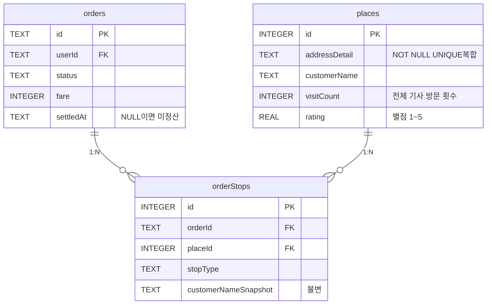

# 1DAL 데이터베이스 스키마 설계서 (v5)

> **문서 상태**: Final Draft  
> **작성일**: 2026-05-01  
> **목적**: 다인용 운행일지, 정산, 장소 평가 시스템을 지원하는 SQLite 스키마

---

## 1. 설계 원칙

| # | 원칙 | 설명 |
|:-:|------|------|
| 1 | **camelCase 통일** | TS 인터페이스와 DB 컬럼명 동일 → 변환 오류 원천 차단 |
| 2 | **장소는 공유 사전** | places는 모든 기사가 공유하는 장소 마스터. "누가 갔는지"는 orders.userId로 추적 |
| 3 | **영수증 불변성** | orderStops에 스냅샷 컬럼으로 과거 데이터 보존 |
| 4 | **장소 평가** | places에 별점·블랙리스트 컬럼으로 위험/불량 장소 필터링 |
| 5 | **정산 간소화** | settledAt 유무로 정산 여부 판단 (NULL=미정산, 값 있음=정산완료) |

---

## 2. v4 → v5 변경 요약

| 항목 | v4 | v5 | 이유 |
|------|----|----|------|
| `orders.canceledAt/cancelReason` | 있음 | **삭제** | 미수행 콜은 의미 없음 |
| `orders.settlementStatus` | 4가지 상태값 | **유지** + `settledAt` 추가 | 정산 시각으로 이력 추적 |
| `places.visitCount` | 없음 | **추가** | 물건 많이 나오는 핫스팟 식별 |
| `places.rating/blacklistMemo` | 없음 | **추가** | 불량 장소 필터링 (거짓콜, 불친절, 위험) |
| `places.addressDetail` | NULL 가능 | **NOT NULL** | 주소 없이 배달 불가 |
| `places UNIQUE 키` | (addressDetail, customerName) | **유지** | 같은 건물 다른 회사 구분 |

---

## 3. ERD



---

## 4. 테이블 DDL

### 4.1 `orders`

```sql
CREATE TABLE IF NOT EXISTS orders (
    -- [식별]
    id                    TEXT PRIMARY KEY,
    type                  TEXT NOT NULL DEFAULT 'NEW_ORDER',
    status                TEXT NOT NULL DEFAULT 'pending',
    userId                TEXT REFERENCES users(id),
    capturedDeviceId      TEXT,
    capturedAt            TEXT,
    timestamp             TEXT NOT NULL,

    -- [UI 요약 — 비정규화]
    pickup                TEXT NOT NULL,
    dropoff               TEXT NOT NULL,

    -- [요금 및 문서]
    fare                  INTEGER DEFAULT 0,
    vehicleType           TEXT,
    paymentType           TEXT,
    billingType           TEXT,
    commissionRate        TEXT,
    tollFare              TEXT,
    tripType              TEXT,
    orderForm             TEXT,
    itemDescription       TEXT,
    detailMemo            TEXT,

    -- [배차사]
    dispatcherName        TEXT,
    dispatcherPhone       TEXT,

    -- [운행 거리/시간]
    distanceKm            REAL,
    totalDistanceKm       REAL,
    totalDurationMin      INTEGER,
    kakaoSoloDistanceKm   REAL,
    kakaoSoloDurationMin  INTEGER,
    kakaoTimeExt          TEXT,

    -- [정산]
    -- settlementStatus: 현재 상태 ('미정산' | '지급예정' | '정산완료' | '미수금')
    -- settledAt: 정산 완료 시각 (NULL이면 아직 미정산, 값 있으면 정산 완료)
    -- → 두 컬럼 조합으로 "언제 정산됐는지"까지 추적 가능
    settlementStatus      TEXT DEFAULT '미정산',
    unpaidAmount          INTEGER DEFAULT 0,
    payerName             TEXT,
    payerPhone            TEXT,
    dueDate               TEXT,
    settlementMemo        TEXT,
    settledAt             TEXT,                   -- [v5 추가] 정산 완료 시각

    -- [메타 플래그]
    isShared              BOOLEAN DEFAULT 0,
    isExpress             BOOLEAN DEFAULT 0,
    postTime              TEXT,
    scheduleText          TEXT,

    -- [타임스탬프]
    createdAt             TEXT DEFAULT (datetime('now', 'localtime')),
    completedAt           TEXT
    -- canceledAt, cancelReason 삭제됨 (v5): 미수행 콜은 장부에 의미 없음
);

CREATE INDEX IF NOT EXISTS idx_orders_dashboard
ON orders(userId, status, completedAt);
```

### 4.2 `places` (장소 마스터 — 전체 기사 공유)

모든 기사가 공유하는 장소 사전입니다.
- `visitCount`: INSERT/UPSERT 시 +1 증가 → 물건이 많이 나오는 핫스팟 식별
- `rating`: 기사가 매긴 별점 (1~5). 블랙리스트 대상은 1점 + blacklistMemo에 사유 기록
- "이 장소에 **내가** 몇 번 갔는지"는 `SELECT COUNT(*) FROM orderStops s JOIN orders o ON ... WHERE o.userId = ?`로 조회

```sql
CREATE TABLE IF NOT EXISTS places (
    id              INTEGER PRIMARY KEY AUTOINCREMENT,

    -- [위치] addressDetail은 NOT NULL — 주소 없이 배달 불가
    address         TEXT,                              -- 간략 주소 (예: "경기 화성시 안녕동")
    x               REAL,                              -- 경도
    y               REAL,                              -- 위도
    region          TEXT,                              -- 광역 지역명
    addressDetail   TEXT NOT NULL,                     -- 상세 주소 (NOT NULL, UNIQUE 복합키)

    -- [고객 정보]
    customerName    TEXT,
    department      TEXT,
    contactName     TEXT,
    phone1          TEXT,
    phone2          TEXT,
    mileage         INTEGER DEFAULT 0,

    -- [v5 추가] 장소 평가 — 위험/불량 장소 필터링
    -- rating: 1=블랙리스트(위험/거짓콜), 2=불친절, 3=보통, 4=양호, 5=우수
    -- blacklistMemo: 블랙리스트 사유 (예: "짐 과다 거짓 콜", "하차 시 위험물", "상습 불친절")
    rating          REAL DEFAULT 3.0,
    blacklistMemo   TEXT,

    -- [v5 추가] 방문 통계 — 전체 기사 통합 카운터
    -- UPSERT 시 visitCount = visitCount + 1 로 증가
    -- "물건이 많이 나오는 곳" = visitCount가 높은 장소
    visitCount      INTEGER DEFAULT 0,

    -- [타임스탬프]
    createdAt       TEXT DEFAULT (datetime('now', 'localtime')),
    lastVisitedAt   TEXT,

    UNIQUE(addressDetail, customerName)
);

CREATE INDEX IF NOT EXISTS idx_places_region ON places(region);
CREATE INDEX IF NOT EXISTS idx_places_rating ON places(rating);  -- 블랙리스트 필터용
```

**UPSERT 예시 (콜 확정 시):**
```sql
INSERT INTO places (addressDetail, customerName, phone1, region, visitCount, lastVisitedAt)
VALUES (?, ?, ?, ?, 1, datetime('now','localtime'))
ON CONFLICT(addressDetail, customerName)
DO UPDATE SET
    phone1 = excluded.phone1,
    visitCount = visitCount + 1,
    lastVisitedAt = excluded.lastVisitedAt;
```

### 4.3 `orderStops`

```sql
CREATE TABLE IF NOT EXISTS orderStops (
    id              INTEGER PRIMARY KEY AUTOINCREMENT,
    orderId         TEXT NOT NULL REFERENCES orders(id) ON DELETE CASCADE,
    placeId         INTEGER NOT NULL REFERENCES places(id),
    stopType        TEXT NOT NULL CHECK(stopType IN ('pickup', 'dropoff')),
    stopOrder       INTEGER DEFAULT 0,

    -- [영수증 불변성 Snapshot]
    customerNameSnapshot TEXT,
    phoneSnapshot        TEXT,

    -- [오더별 가변 데이터]
    requestedTime   TEXT,
    memo            TEXT
);

CREATE INDEX IF NOT EXISTS idx_orderStops_orderId ON orderStops(orderId);
CREATE INDEX IF NOT EXISTS idx_orderStops_placeId ON orderStops(placeId);
```

---

## 5. 다인용 시나리오 설명

### "같은 장소에 여러 기사가 가면?"

```
places 테이블 (공유 사전):
┌────┬───────────────────────┬──────────┬────────────┐
│ id │ addressDetail          │ customer │ visitCount │
├────┼───────────────────────┼──────────┼────────────┤
│  1 │ 화성시 안녕동 158-95    │ 레드캠프  │     15     │  ← A기사 8번 + B기사 7번
│  2 │ 강남구 역삼동 123-4     │ 한국물류  │     22     │  ← A기사 12번 + C기사 10번
└────┴───────────────────────┴──────────┴────────────┘

"나(A기사)는 레드캠프에 몇 번 갔지?"
→ SELECT COUNT(*) FROM orderStops s
  JOIN orders o ON o.id = s.orderId
  WHERE o.userId = 'A기사' AND s.placeId = 1;
→ 결과: 8번

"전체 기사 통합, 물건 많이 나오는 곳 TOP 5는?"
→ SELECT addressDetail, customerName, visitCount
  FROM places ORDER BY visitCount DESC LIMIT 5;
→ 한국물류(22회), 레드캠프(15회), ...
```

### "내가 가본 장소 목록은?"

users 테이블에 배열로 넣는 대신, **조인으로 실시간 조회**합니다:

```sql
-- A기사가 방문한 모든 장소 (중복 제거)
SELECT DISTINCT p.id, p.addressDetail, p.customerName, p.rating
FROM orderStops s
JOIN orders o ON o.id = s.orderId
JOIN places p ON p.id = s.placeId
WHERE o.userId = 'A기사' AND o.status = 'completed';
```

> [!NOTE]
> **왜 users 테이블에 배열을 넣지 않는가?**
> SQLite에서 배열 컬럼은 JSON TEXT로 저장해야 하는데, 장소가 추가/삭제될 때마다 JSON 파싱 → 수정 → 직렬화가 필요합니다. 조인이 훨씬 깔끔하고, places가 삭제되어도 참조 무결성이 자동으로 유지됩니다.

---

## 6. 장소 평가 활용 예시

### 블랙리스트 장소 필터링 (배차 시)
```sql
-- 별점 2점 이하 장소 목록 (콜 자동 거부 대상)
SELECT addressDetail, customerName, rating, blacklistMemo
FROM places
WHERE rating <= 2.0;
```

| 장소 | 고객명 | 별점 | 사유 |
|------|--------|:----:|------|
| 인천 부평구 산곡동 55-3 | XX물류 | ⭐1 | 거짓 콜 — 1t 요청해놓고 5t 분량 |
| 서울 금천구 가산동 | YY택배 | ⭐2 | 상습 불친절, 하차 도움 안 줌 |

### 별점 업데이트 (운행 완료 후)
```sql
UPDATE places SET rating = 1.0, 
    blacklistMemo = '거짓 콜 — 위험물 미고지'
WHERE id = ?;
```

---

## 7. 정산 흐름

```
콜 확정 시:  settlementStatus = '미정산', settledAt = NULL
↓
미수금 발생: settlementStatus = '미수금', unpaidAmount = 55000, settledAt = NULL
↓
입금 확인:   settlementStatus = '정산완료', unpaidAmount = 0, 
             settledAt = '2026-05-15 14:30:00'  ← 정산 완료 시각 기록
```

```sql
-- 미정산 콜 조회 (settledAt이 NULL인 것)
SELECT * FROM orders WHERE settledAt IS NULL AND status = 'completed';

-- 정산 완료 처리
UPDATE orders SET 
    settlementStatus = '정산완료', 
    unpaidAmount = 0,
    settledAt = datetime('now', 'localtime')
WHERE id = ?;
```

---

## 8. 수정 대상 파일 (5개)

> [!CAUTION]
> 소스 코드 수정은 차주님 승인 후에만 진행합니다.

| 파일 | 수정 내용 |
|------|----------|
| `db.ts` | orders DROP+CREATE, places/orderStops 신규 테이블 |
| `dispatchEngine.ts` | handleDecision KEEP: 확장 INSERT + places UPSERT + orderStops 삽입 |
| `socketHandlers.ts` | dispatch-complete: completedAt 기록 |
| `orders.ts` | GET/POST 쿼리 새 스키마 적용 |
| `local.db` | 기존 orders 데이터 삭제 (DROP TABLE) |

---

## 9. 의도적으로 제외한 필드

| 필드 | 제외 사유 |
|------|----------|
| `routePolyline` | 좌표 수천 개 — DB 용량 폭발, 실시간 전용 |
| `sectionEtas`, `pickupEta`, `dropoffEta` | 완료 후 무의미 |
| `isRejected`, `rejectionReasons`, `approvalReasons` | 평가 중에만 유효 |
| `osrmSolo*`, `osrmError` | 보조 연산 — 카카오만 보관 |
| `rawText` | intel 테이블 담당 |
| `canceledAt`, `cancelReason` | v5에서 삭제 — 미수행 콜은 장부에 의미 없음 |
