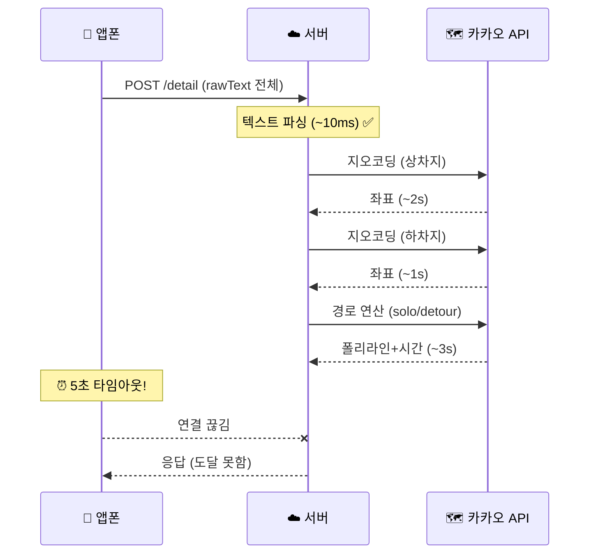
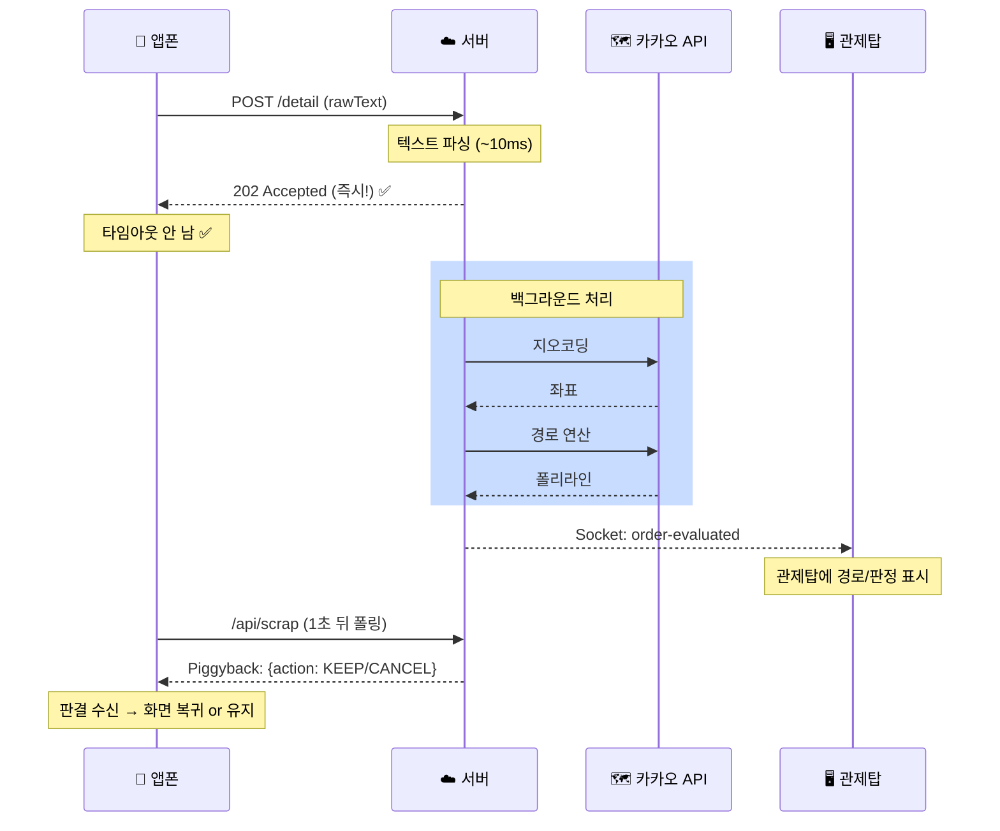

# 🔧 `/api/orders/detail` 타임아웃 수정 — 비동기 응답 전환

## 1. 현상 및 근본 원인

### 타임라인 (실제 로그 기반)

```
[앱폰 — 무인 서핑]
03:51:40.632  🎯 LIST에서 타겟 콜 발견 → 강제 터치
03:51:40.691  ✅ 리스트 터치 성공
03:51:41.031  🚀 확정 버튼 광클
03:51:41.091  ✅ 확정 터치 성공

[앱폰 — 3단계 팝업 서핑] (총 1.3초)
03:51:41.804  📝 적요상세 스크래핑 성공         ✅ (1/3)
03:51:42.228  📝 출발지 스크래핑 성공           ✅ (2/3)  
03:51:42.721  📝 도착지 스크래핑 성공           ✅ (3/3)
03:51:42.731  🏁 무인 서핑 종료 (DONE)

[앱폰 → 서버]
03:51:42.734  🌐 POST /api/orders/detail 전송 (rawText 포함)
              ↓ 서버: 텍스트 파싱 (동기, ~10ms) ✅
              ↓ 서버: 카카오 지오코딩 (비동기, ~2s) ⏳
              ↓ 서버: 카카오 경로연산 (비동기, ~3s) ⏳
              ↓ ... 서버가 응답을 안 줌 ...
03:51:47.751  ❌ [Detail 전송 실패] timeout     ← 앱의 5초 타임아웃
03:51:48.342  ❌ [텔레메트리 통신 실패] timeout  ← /api/scrap도 연쇄 실패
```

### 근본 원인



**`await evaluateNewOrder()`가 HTTP 응답을 블로킹**하고 있었습니다.
카카오 API 3~4회 호출(지오코딩 2회 + 경로 1~2회)이 순차 실행되어 총 5~10초가 걸리는데, 앱은 5초 만에 타임아웃 처리합니다.

---

## 2. 기존 아키텍처 분석 — 왜 `await`가 불필요한가

> [!IMPORTANT]
> 핵심: **앱은 HTTP 응답으로 판결(KEEP/CANCEL)을 받지 않습니다.** 판결은 이미 **Piggyback 채널**로 전달되도록 설계되어 있습니다.

### 데이터 전달 채널 정리

| 데이터 | 수신자 | 전달 채널 | HTTP 응답 필요? |
|:---:|:---:|:---:|:---:|
| KEEP/CANCEL 판결 | 앱폰 | **Piggyback** (다음 `/api/scrap` 응답에 태움) | ❌ |
| order-evaluated (경로/판정) | 관제탑 | **Socket.io** (`io.emit`) | ❌ |
| order-confirmed | 관제탑 | **Socket.io** (`io.emit`) | ❌ |
| 수신 확인 (ACK) | 앱폰 | **HTTP 응답** | ✅ (이것만!) |

**앱이 HTTP 응답에서 필요한 것은 "수신했다"는 ACK 뿐**입니다.
카카오 연산 결과, 꿀/똥 판정, KEEP/CANCEL 판결은 모두 **이미 존재하는 비동기 채널**(Piggyback + Socket.io)로 전달됩니다.

### Piggyback 메커니즘 (이미 구현됨)

```
앱: POST /api/scrap (매 1초 폴링)
        ↓
서버: session.pendingDecisions.get(orderId) 확인
        ↓ action이 있으면 응답에 태워 보냄
앱: Piggyback 응답에서 KEEP/CANCEL 추출 → 화면 복귀 or 유지
```

---

## 3. 수정 내용 (이미 적용됨)

### [MODIFY] [detail.ts](file:///Users/seungwookkim/reps/onedal/onedal-web/server/src/routes/detail.ts#L120-L144)

#### Before (블로킹)

```typescript
// 카카오 연산 완료까지 HTTP 응답이 블로킹됨 (5~10초)
await evaluateNewOrder(userId, pendingOrder, io, targetApp);

// MANUAL
await handleDecision(userId, pendingOrder.id, "ORDER_CONFIRMED", io);
return res.json({ deviceId: 'server', action: 'ACK' });

// AUTO
res.status(202).json({ message: "Accepted..." });
// ← 여기까지 올 때 이미 5초 지남
```

#### After (비동기)

```typescript
// MANUAL: 즉시 ACK → 백그라운드 평가+확정
session.pendingDecisions.set(payload.order.id, { action: 'KEEP', evaluatedAt: Date.now() });
res.json({ deviceId: 'server', action: 'ACK' }); // 🚀 1ms 이내 응답

evaluateNewOrder(userId, pendingOrder, io, targetApp).then(() => {
    return handleDecision(userId, pendingOrder.id, "ORDER_CONFIRMED", io);
}).catch(console.error);

// AUTO: 즉시 202 → 백그라운드 평가
session.pendingDecisions.set(payload.order.id, { action: null, evaluatedAt: Date.now() });
res.status(202).json({ message: "Accepted..." }); // 🚀 1ms 이내 응답

evaluateNewOrder(userId, pendingOrder, io, targetApp).catch(console.error);
// 타이머 즉시 설정 (동기)
```

### 수정 후 시퀀스



---

## 4. 부수 효과 검증

> [!WARNING]
> 비동기 전환으로 인해 발생할 수 있는 엣지 케이스를 점검합니다.

### 4-1. MANUAL 경로: `handleDecision` 실패 시

| 상황 | 영향 | 방어막 |
|:---:|:---:|:---:|
| `evaluateNewOrder` 실패 | 관제탑에 경로/판정 미표시 | `.catch(console.error)` 로 서버 크래시 방지. 관제탑은 텍스트 정보는 이미 `order-detail-received`로 수신 |
| `handleDecision` 실패 | DB 저장 안 됨 | Piggyback에 이미 `KEEP`이 등록되어 앱은 정상 동작. 관제탑 `order-confirmed` 미수신 |

### 4-2. AUTO 경로: 평가가 타이머보다 늦게 끝나면?

- **WARNING 타이머(15초)**: 평가가 아직 진행 중이라도 경고만 보냄 → 문제 없음
- **TIMEOUT 타이머(30초)**: 평가가 30초 이내 완료되면 `pendingDecisions`에 action이 기록됨 → Phase 1 방어로 KEEP 보호
- 30초 초과 시 원래대로 강제 취소 → 기존 동작과 동일

### 4-3. 텔레메트리(/api/scrap)도 타임아웃 났는데?

로그: `03:51:48.342 📡 [텔레메트리 통신 실패] timeout`

이건 `/detail` 실패와 무관합니다. 앱이 `holding=true` 상태에서 매 1초마다 `/api/scrap`을 보내는데, 한두 개가 타임아웃 나도 **다음 폴링에서 정상 수신**됩니다. Piggyback은 "최소 1회만 전달되면 OK"인 구조입니다.

---

## 5. Verification Plan

### 라이브 검증 (main 머지 후)

1. **AUTO 모드 배차 테스트**
   - 관제탑에서 AUTO 모드 활성화
   - 인성콜에서 필터에 매칭되는 콜 발생 대기
   - 앱 Logcat 확인: `❌ [Detail 전송 실패]` 가 **더 이상 안 나오는지** 확인
   - 관제탑 확인: `order-evaluated` 카드가 정상 표시되는지 확인

2. **MANUAL 모드 배차 테스트**
   - 관제탑에서 MANUAL 모드 전환
   - 앱폰에서 수동으로 콜 클릭
   - 앱 Logcat: `ACK` 즉시 수신 확인
   - 관제탑: 콜 카드가 확정(`ORDER_CONFIRMED`) 상태로 표시되는지 확인

3. **서버 로그 확인 (PM2)**
   ```bash
   pm2 logs --lines 30
   ```
   - `evaluateNewOrder` 백그라운드 처리 완료 로그 확인
   - Unhandled Promise Rejection 없는지 확인

### 현재 배포 상태

| 항목 | 상태 |
|:---:|:---:|
| 코드 수정 | ✅ `feature/next-task` 브랜치 커밋 완료 |
| Push | ✅ 원격 반영 완료 |
| main 머지 | ⬜ 사용자 확인 후 진행 |
| 라이브 배포 | ⬜ main 머지 시 GitHub Actions 자동 배포 |
