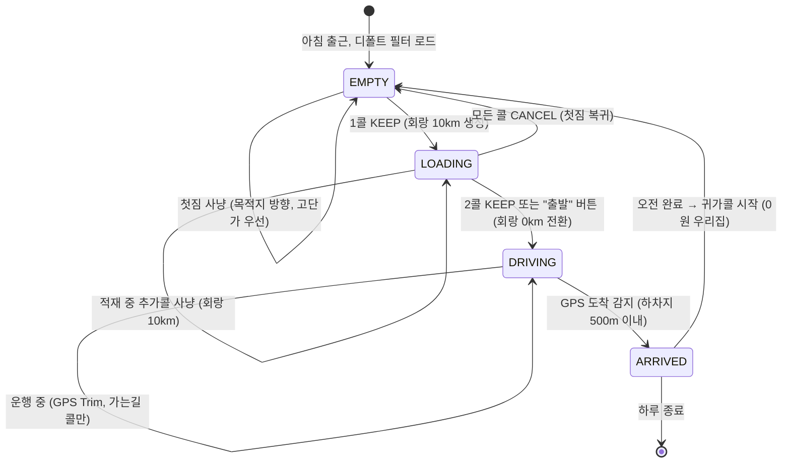

# 🎯 필터 시스템 리팩토링 — 기사 시나리오 V2

## 기사님의 하루: 상세 시나리오



### 시나리오 상세 타임라인

| 시각 | 상태 | 기사 행동 | 필터 동작 | 회랑 반경 |
|------|------|----------|----------|----------|
| 08:00 | `EMPTY` | 목적지=성남 설정, 사냥 시작 | 첫짐 필터 (도착 희망 시/도 기반) | - |
| 08:15 | `EMPTY→LOADING` | 1콜 KEEP (광주→성남 4만원) | **회랑 생성** (경로 주변 콜 탐색) | **10km** |
| 08:25 | `LOADING` | 2콜 KEEP (광주→분당 3만원) | 합짐 경로로 회랑 갱신 | **10km** |
| 08:30 | `LOADING→DRIVING` | "출발" 또는 자동 전환 | **회랑 축소** (가는길 콜만) | **0km** |
| 08:45 | `DRIVING` | 이동 중, GPS 광주 통과 | 광주 읍면동 키워드 **자동 제거** | 0km |
| 09:00 | `DRIVING` | 3콜 자동 포획 (수원→분당 2만원) | 가는길 콜만 통과 | 0km |
| 09:30 | `ARRIVED` | 성남 도착, 배달 완료 | GPS 도착 감지 | - |
| 12:00 | `EMPTY` | **"🏠 귀가콜" 클릭** (0원 우리집) | **귀가 회랑 자동 생성** | 10km |
| 12:10 | `LOADING` | 복귀 1콜 KEEP | 귀가 경로 회랑 | 10km |
| 12:20 | `LOADING→DRIVING` | 복귀 2콜 KEEP, 출발 | 회랑 축소 | 0km |
| 13:00 | `DRIVING` | 복귀 3콜 포획 (가는길) | GPS Trim | 0km |
| 13:30 | `ARRIVED` | 광주 도착, 하루 종료 | - | - |

---

## 현재 코드 Gap Analysis (V2)

| 시나리오 기능 | 현재 상태 | 문제점 |
|---|---|---|
| 디폴트 필터 per-user 저장/로드 | ✅ 동작 | `user_filters` 테이블 + Lazy Load |
| 목적지 도시 설정 (첫짐) | ✅ 동작 | `OrderFilterModal` → `destinationCity` |
| 1콜 KEEP → 회랑 생성 | ✅ 동작 | `syncCorridorFilter()` |
| **3단계 State Machine** | ❌ 미구현 | 1콜 KEEP 즉시 합짐 전환 → "적재 중" 단계 없음 |
| **회랑 반경 자동 전환 (10km→0km)** | ❌ 미구현 | 반경은 수동 변경만 가능 |
| **GPS Progressive Corridor Trim** | ❌ 미구현 | 이동해도 회랑이 줄지 않음 |
| **"🏠 귀가콜" 가상 오더** | ❌ 미구현 | 복귀 시 목적지를 수동 전환해야 함 |
| **GPS 도착 자동 감지** | ❌ 미구현 | 수동 처리만 가능 |
| 필터 변경 DB 영구 저장 | ⚠️ 6곳 중 1곳만 | 서버 재시작 시 롤백 위험 |
| 합짐 차종 개인화 | ❌ 하드코딩 | `["다마스","라보","오토바이"]` 고정 |

---

## Proposed Changes

---

### P0: `applyFilter()` 중앙화 — 모든 필터 변경의 단일 진입점

> 이 작업이 P1~P3의 전제조건입니다. 이것부터 만들어야 이후 작업에서 필터를 안전하게 조작할 수 있습니다.

#### [NEW] [filterManager.ts](file:///Users/seungwookkim/reps/onedal/onedal-web/server/src/state/filterManager.ts)

모든 필터 변경의 단일 진입점. 메모리 갱신 + DB 저장 + 소켓 emit을 원자적으로 보장합니다.

```typescript
export function applyFilter(
    userId: string, 
    changes: Partial<AutoDispatchFilter>, 
    io?: any
): AutoDispatchFilter {
    const session = getUserSession(userId);
    session.activeFilter = { ...session.activeFilter, ...changes };
    stmtUpdateFilter.run(/* prepared statement */);
    if (io) io.to(userId).emit("filter-updated", session.activeFilter);
    return session.activeFilter;
}
```

#### [MODIFY] 기존 7곳의 필터 변경 코드를 `applyFilter()` 1줄로 교체

| 파일 | 현재 | 변경 후 |
|---|---|---|
| [socketHandlers.ts:84-106](file:///Users/seungwookkim/reps/onedal/onedal-web/server/src/socket/socketHandlers.ts#L84-L106) | 30줄 (메모리+DB+emit) | `applyFilter(userId, newFilter, io)` |
| [dispatchEngine.ts:428-437](file:///Users/seungwookkim/reps/onedal/onedal-web/server/src/services/dispatchEngine.ts#L428-L437) | 메모리만 변경 | `applyFilter()` |
| [dispatchEngine.ts:451-460](file:///Users/seungwookkim/reps/onedal/onedal-web/server/src/services/dispatchEngine.ts#L451-L460) | 메모리만 변경 | `applyFilter()` |
| [orders.ts:157-161](file:///Users/seungwookkim/reps/onedal/onedal-web/server/src/routes/orders.ts#L157-L161) | 메모리만 변경 | `applyFilter()` |
| [emergency.ts:96-97](file:///Users/seungwookkim/reps/onedal/onedal-web/server/src/routes/emergency.ts#L96-L97) | 메모리만 변경 | `applyFilter()` |
| [filters.ts:84-99](file:///Users/seungwookkim/reps/onedal/onedal-web/server/src/routes/filters.ts#L84-L99) | 11줄 if 체크 | `applyFilter()` |

---

### P1: 3단계 적재 State Machine

> 현재 1콜 KEEP 즉시 합짐 전환되는 로직을 **EMPTY → LOADING → DRIVING** 3단계로 분리합니다.

#### [MODIFY] [shared/index.ts](file:///Users/seungwookkim/reps/onedal/onedal-web/shared/src/index.ts#L130-L146)

`AutoDispatchFilter`에 적재 상태 필드 추가:

```typescript
export interface AutoDispatchFilter {
    // ... 기존 필드 유지 ...
    
    // [신규] 적재 상태 (State Machine)
    loadState: 'EMPTY' | 'LOADING' | 'DRIVING' | 'ARRIVED';
    
    // [신규] 귀가 주소 (0원 귀가콜용)
    homeAddress?: string;   // "경기 광주시 오포읍 ..."
    homeX?: number;         // 귀가 목적지 X 좌표
    homeY?: number;         // 귀가 목적지 Y 좌표
}
```

#### [MODIFY] [dispatchEngine.ts — handleDecision()](file:///Users/seungwookkim/reps/onedal/onedal-web/server/src/services/dispatchEngine.ts#L320-L467)

KEEP 판정 시 State Machine에 따라 분기:

```typescript
if (action === 'KEEP') {
    const loadState = session.activeFilter.loadState || 'EMPTY';
    
    if (loadState === 'EMPTY') {
        // 첫짐 → LOADING: 회랑 생성 (10km), 아직 합짐 아님
        applyFilter(userId, {
            loadState: 'LOADING',
            isSharedMode: true,      // 회랑 필터 활성화
            corridorRadiusKm: 10,    // 10km 반경으로 추가콜 탐색
        }, io);
        syncCorridorFilter(userId, io);
        
    } else if (loadState === 'LOADING') {
        // 적재 중 추가콜 → DRIVING: 회랑 0km로 축소
        applyFilter(userId, {
            loadState: 'DRIVING',
            corridorRadiusKm: 0,     // 가는길 콜만
        }, io);
        syncCorridorFilter(userId, io);
    }
    // DRIVING 중에도 KEEP 가능 (가는길 콜)
}
```

#### [MODIFY] 프론트엔드: "출발" 버튼 추가

LOADING 상태에서 수동으로 DRIVING 전환할 수 있는 "출발" 버튼을 PinnedRoute에 추가합니다.
(2콜 KEEP 시 자동 전환이 기본이지만, 1콜만으로 출발하고 싶을 때 수동 전환)

---

### P2: "🏠 귀가콜" 가상 오더

> 복귀 시 매번 필터 설정을 바꾸지 않아도, 버튼 하나로 귀가 경로 회랑을 자동 생성합니다.

#### 동작 흐름

```
1. 배달 완료 (ARRIVED 또는 수동)
2. 관제탑 대시보드에 "🏠 귀가콜" 버튼 노출
3. 클릭 시:
   - 하차지 = 저장된 집 주소 (user_settings.home_address)
   - 상차지 = 현재 GPS 위치
   - 요금 = 0원
   - 가상 오더를 서버에 주입 → 카카오 경로 연산 → 폴리라인 생성
   - 즉시 LOADING 상태 + 회랑 10km 생성
4. 이후 흐름은 일반 합짐과 동일
```

#### [MODIFY] [user_settings 테이블 (db.ts)](file:///Users/seungwookkim/reps/onedal/onedal-web/server/src/db.ts)

```sql
ALTER TABLE user_settings ADD COLUMN home_address TEXT DEFAULT '';
ALTER TABLE user_settings ADD COLUMN home_x REAL DEFAULT 0;
ALTER TABLE user_settings ADD COLUMN home_y REAL DEFAULT 0;
```

#### [NEW] 서버 엔드포인트 또는 소켓 이벤트: `create-home-return`

```typescript
socket.on("create-home-return", async () => {
    const session = getUserSession(userId);
    const settings = db.prepare("SELECT home_address, home_x, home_y FROM user_settings WHERE user_id = ?").get(userId);
    
    // 가상 귀가 오더 생성
    const homeOrder: SecuredOrder = {
        id: `home-${Date.now()}`,
        type: 'MANUAL',
        pickup: '현재 위치',
        dropoff: settings.home_address,
        fare: 0,
        pickupX: session.driverLocation?.x,
        pickupY: session.driverLocation?.y,
        dropoffX: settings.home_x,
        dropoffY: settings.home_y,
        status: 'confirmed',
        capturedDeviceId: 'control-tower',
        capturedAt: new Date().toISOString(),
    };
    
    // mainCallState로 직접 주입 + 카카오 경로 연산
    session.mainCallState = homeOrder;
    await evaluateNewOrder(userId, homeOrder, io);
    
    // LOADING + 회랑 생성
    applyFilter(userId, { 
        loadState: 'LOADING', 
        isSharedMode: true, 
        corridorRadiusKm: 10 
    }, io);
    syncCorridorFilter(userId, io);
});
```

#### [MODIFY] 프론트엔드: 대시보드에 "🏠 귀가콜" 버튼 추가

EMPTY 또는 ARRIVED 상태일 때, PinnedRoute 영역에 "🏠 귀가" 버튼을 눈에 띄게 배치합니다.
SettingsModal의 기본 설정 탭에 "집 주소" 입력 필드를 추가합니다.

---

### P3: GPS Progressive Corridor Trim + 도착 자동 감지

> 이동 중 이미 지나간 구간의 키워드를 자동 제거하고, 하차지 도착을 자동 감지합니다.

#### [MODIFY] [geoService.ts](file:///Users/seungwookkim/reps/onedal/onedal-web/server/src/services/geoService.ts)

```typescript
/**
 * GPS 진행도에 따라 폴리라인의 뒤쪽(이미 지나간 구간)을 잘라내고
 * 앞쪽(아직 안 간 구간)만으로 회랑을 재계산합니다.
 */
export function trimCorridorByProgress(
    fullPolyline: Array<{x: number; y: number}>,
    currentGPS: {x: number; y: number},
    corridorRadiusKm: number,
    destinationRadiusKm?: number
) {
    // 1. 현재 GPS에서 폴리라인 위 가장 가까운 점 찾기
    const lineCoords = fullPolyline.map(p => [p.x, p.y]);
    const line = turf.lineString(lineCoords);
    const point = turf.point([currentGPS.x, currentGPS.y]);
    const snapped = turf.nearestPointOnLine(line, point);
    
    // 2. 가까운 점 이후의 폴리라인만 남기기
    const idx = snapped.properties.index || 0;
    const remainingPolyline = fullPolyline.slice(idx);
    
    if (remainingPolyline.length < 2) return null;
    
    // 3. 남은 폴리라인으로 회랑 재계산
    return getCorridorRegions(remainingPolyline, corridorRadiusKm, destinationRadiusKm);
}
```

#### [MODIFY] [scrap.ts](file:///Users/seungwookkim/reps/onedal/onedal-web/server/src/routes/scrap.ts)

GPS 텔레메트리 수신 시 2가지 자동 처리:

```typescript
// GPS 수신 후 처리 (기존 코드 아래에 추가)
if (lat && lng && session.activeFilter.loadState === 'DRIVING') {
    const currentGPS = { x: lng, y: lat }; // 카카오 좌표계 (x=경도, y=위도)
    
    // [1] Corridor Trim: 2km 이상 이동 시에만 트리거 (CPU 보호)
    const lastTrim = session.lastTrimGPS;
    const dist = lastTrim ? haversine(lastTrim, currentGPS) : Infinity;
    
    if (dist > 2) { // 2km 이상 이동
        const polyline = getActivePolyline(session);
        if (polyline) {
            const trimmed = trimCorridorByProgress(polyline, currentGPS, 
                session.activeFilter.corridorRadiusKm || 0,
                session.activeFilter.destinationRadiusKm);
            if (trimmed) {
                applyFilter(userId, { destinationKeywords: trimmed.flat }, io);
            }
            session.lastTrimGPS = currentGPS;
        }
    }
    
    // [2] 도착 감지: 마지막 하차지 500m 이내 도달 시
    const lastDropoff = getLastDropoffCoord(session);
    if (lastDropoff && haversine(currentGPS, lastDropoff) < 0.5) {
        applyFilter(userId, { loadState: 'ARRIVED' }, io);
        io.to(userId).emit("auto-arrived", { 
            message: "🏁 하차지 도착 감지! 배달 완료 처리합니다." 
        });
    }
}
```

#### 트리거 조건 (퍼포먼스 보호)

| 조건 | 값 | 이유 |
|------|-----|------|
| GPS 이동 거리 | 2km 이상 | Turf.js 연산 CPU 보호 (1초마다 X) |
| 도착 감지 반경 | 500m | 도심 GPS 오차 고려 |
| DRIVING 상태에서만 | ✅ | EMPTY/LOADING 때는 불필요 |

---

## Open Question

> [!IMPORTANT]
> **Q1. 도착 처리 방식**: GPS 자동 감지(500m 이내)로 자동 완료 처리 vs 관제 앱에서 수동 "배달 완료" 버튼
> 
> **제안**: **GPS 자동 감지 + 관제 수동 버튼 병행**
> - GPS가 하차지 500m 이내 → "🏁 도착한 것 같습니다. 배달 완료 하시겠습니까?" 팝업
> - 기사가 확인 클릭 → ARRIVED 전환 + 콜 정리
> - 자동이 아니라 **반자동(알림 후 확인)**이면 오감지 위험도 없고 기사님 부담도 최소화됩니다.

---

## 실행 순서

| 순서 | 작업 | 예상 소요 | 의존성 |
|------|------|----------|--------|
| **P0** | `applyFilter()` 중앙화 + DB 저장 보장 | 30분 | 없음 (즉시 가능) |
| **P1** | 3단계 State Machine (EMPTY→LOADING→DRIVING) | 1시간 | P0 필요 |
| **P2** | 🏠 귀가콜 가상 오더 + 집 주소 설정 UI | 1시간 | P0+P1 필요 |
| **P3** | GPS Corridor Trim + 도착 자동 감지 | 1시간 | P0+P1 필요 |

## Verification Plan

### Automated Tests
- `applyFilter()` 호출 후 DB 조회 → 값 일치 확인
- State Machine 전이: EMPTY→KEEP→LOADING→KEEP→DRIVING 순서 검증

### Manual Verification
- 실제 콜 KEEP → 회랑 10km 로그 확인 → 2콜 KEEP → 회랑 0km 전환 로그 확인
- 귀가콜 버튼 → 카카오 경로 연산 → 회랑 생성 로그 확인
- 서버 재시작 → 필터 복원 검증
