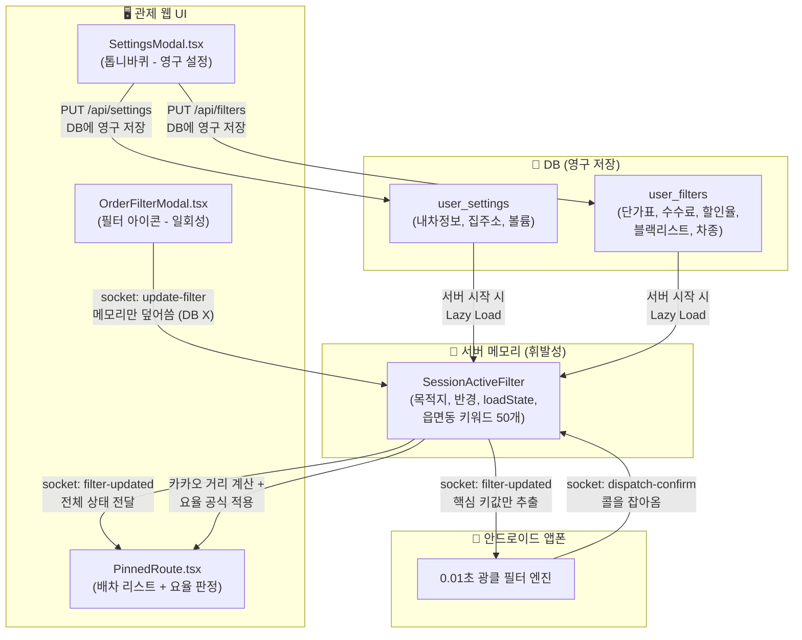

# 1DAL 인텔리전트 필터 아키텍처 및 구현 계획서 (고도화 버전)

사장님 피드백을 기반으로, **"자동 취소(Cancel)가 아닌 관제웹 판단 보조 수단으로의 활용"** 및 **"상세한 ERD 데이터베이스 구조"**를 완벽하게 통합하여 시니어 관점에서 빈틈없이 재설계했습니다.

---

## 1. 🗄️ 데이터베이스 모델링 (ER Diagram)

기존 `user_settings` 및 `user_filters` 스키마를 확장하여, 사장님이 말씀하신 **"기본 설정, 필터 설정(요율), App 기기 설정"** 3가지 탭이 완벽히 DB와 매핑되도록 구조화했습니다.

### 1-1. 변경 전/후 ERD

```mermaid
erDiagram
    users ||--o{ user_devices : "1:N 기기 소유"
    users ||--o{ user_tokens : "1:N 로그인 토큰"
    users ||--|| user_settings : "1:1 기본 설정"
    users ||--|| user_filters : "1:1 요율 및 필터 설정"
    users ||--o{ intel : "1:N 스크랩 소유"

    user_settings {
        TEXT user_id PK_FK "users.id"
        INTEGER car_type "카카오 차종코드 (1~7)"
        TEXT vehicle_type "내 차종 문자열 (1t 등)"
        TEXT car_fuel "GASOLINE | DIESEL | LPG"
        BOOLEAN car_hipass "하이패스 유무"
        INTEGER fuel_price "리터당 유가 (원)"
        REAL fuel_efficiency "연비 (km/L)"
        TEXT default_priority "RECOMMEND | TIME | DISTANCE"
        BOOLEAN avoid_toll "유료도로 회피"
        TEXT home_address "복귀용 집주소"
        REAL home_x "집 경도"
        REAL home_y "집 위도"
        INTEGER alarm_volume "알림 볼륨 0~100 (추가)"
    }

    user_filters {
        TEXT user_id PK_FK "users.id"
        TEXT destination_city "목적지 도시"
        INTEGER destination_radius_km "목적지 반경"
        INTEGER corridor_radius_km "회랑 반경"
        REAL pickup_radius_km "상차지 반경"
        TEXT allowed_vehicle_types "JSON 배열"
        INTEGER min_fare "1차 광클 절대 하한선"
        INTEGER max_fare "최대 운임"
        TEXT excluded_keywords "블랙리스트 JSON 배열"
        TEXT destination_keywords "도착지 읍면동 JSON 배열"
        TEXT destination_groups "그룹핑된 읍면동 JSON"
        BOOLEAN is_active "필터 활성화"
        BOOLEAN is_shared_mode "합짐 모드"
        TEXT load_state "EMPTY | LOADING | DRIVING | ARRIVED"
        TEXT vehicle_rates "차종별 단가표 JSON (추가)"
        REAL agency_fee_percent "퀵사 수수료율 (추가)"
        REAL max_discount_percent "최대 할인율 (추가)"
    }

    user_devices {
        INTEGER id PK "자동증가"
        TEXT user_id FK "users.id"
        TEXT device_id UK "앱폰 고유 ID"
        TEXT device_name "사용자 지정 별명"
        TEXT registered_at "등록일"
    }
```

### 1-2. 추가되는 컬럼 요약

| 테이블 | 신규 컬럼 | 타입 | 디폴트 | 설명 |
|:---|:---|:---|:---|:---|
| `user_settings` | `alarm_volume` | INTEGER | 50 | 시스템 알림 볼륨 |
| `user_filters` | `vehicle_rates` | TEXT(JSON) | `{"오토바이":700,"다마스":800,"라보":900,"승용차":900,"1t":1000,"1.4t":1100,"2.5t":1200,"3.5t":1300,"5t":1500,"11t":2000,"25t":2500,"특수화물":3000}` | 차종별 km당 적정 단가 |
| `user_filters` | `agency_fee_percent` | REAL | 23.0 | 퀵사(사무실) 수수료율 |
| `user_filters` | `max_discount_percent` | REAL | 10.0 | 기사 수용 가능 최대 할인율 |
| `user_filters` | `destination_groups` | TEXT(JSON) | `{}` | UI용 그룹핑 읍면동 (기존 메모리에만 있던 것을 DB 영구화) |

> [!NOTE]
> **기존 컬럼은 단 하나도 삭제하지 않습니다.** SQLite ALTER TABLE은 컬럼 삭제를 지원하지 않으므로, 기존 `min_fare`, `max_fare`, `destination_city` 등은 그대로 유지하면서 신규 컬럼만 추가(ADD COLUMN) 합니다. `max_fare`는 당장 UI에서 노출하지 않더라도, 데이터 구조상 남겨둬서 향후 "최대 운임 상한선" 기능이 필요할 때 바로 활용할 수 있습니다.

---

## 2. 🖥️ UI 분리 및 탭 구성 상세

**① 우측 상단 톱니바퀴 (SettingsModal.tsx - DB 영구 저장용)**
*   **탭 1: 기본 설정** -> 내차정보, 카카오 선호 경로, 집 주소, 알림 볼륨 조절, 로그아웃 (`user_settings` 테이블 수정)
*   **탭 2: 요율/필터 설정** -> 차종별 단가 입력기(오토바이~특수화물 전체 12종 지원), 퀵사 수수료 입력, 최대 할인율 입력, 블랙리스트 (`user_filters` 테이블 수정)
*   **탭 3: 기기 설정** -> 기기 리스트 및 등록 (`user_devices` 테이블 수정)

**② 대시보드 맵 위 필터 아이콘 (OrderFilterModal.tsx - 일회성 메모리 조작용)**
*   **첫짐 탭**: "어디로 갈까?" (도착 시/도, 상/하차 반경 조절)
*   **합짐 탭**: "얼마나 돌아갈까?" (회랑 이탈 허용 반경 조절)
*   *저장 시 DB 수정 없이 서버의 세션 메모리(`SessionActiveFilter`)만 실시간으로 즉시 덮어씌움.*

---

## 3. 🧠 다이내믹 요율 계산 로직 및 2차 추천 (Judge & Recommend)

서버(Node.js)가 안드로이드 앱폰에 지시하는 것은 **"최소한의 쓰레기(블랙리스트, 절대 하한선 등)만 거르고 일단 잡아와라!"** 입니다. 
앱이 0.01초 만에 콜을 낚아채서 서버에 넘기면, 서버는 카카오 거리를 뽑아낸 뒤 사장님의 수학 공식을 돌립니다.

**[계산 공식]**
1. **적정 금액** = `(카카오 실제 주행 거리 km) × (오더 차량에 맞는 단가표 값) × (1 - 퀵사수수료 0.23)`
2. **수용 하한선** = `적정 금액 × (1 - 최대할인율 0.1)`

**[작동 방식: 자동 취소가 아닌 관제웹 판단 보조]**
*   **서버 연산**: 100km짜리 1t 콜이 70,000원에 잡혀왔을 때, 계산된 하한선이 69,300원이면 통과. 만약 오더가 60,000원이면 **"단가 미달 (적정: 69,300원, 실제: 60,000원)"**이라는 사유 생성.
*   **UI 표출**: 서버가 앱으로 취소(Cancel) 명령을 내리지 않습니다. 대신 관제 대시보드 `PinnedRoute` 목록의 배차 리스트에 붉은색 경고 표시와 함께 **[거절 사유: 요율 미달 (-9,300원)]**을 띄워줍니다. (기존 `rejectionReasons[]` 배열에 추가)
*   **최종 판단**: 사장님께서 관제 화면을 보고 "아, 이 방향은 급하니까 그냥 수락하자" 혹은 "안 되겠다, 버리자"라고 **직접 판단하여 최종 버튼(취소/킵)을 누릅니다.**

---

## 4. 🔄 합짐(LOADING) 전환 시 차종 자동 추론

사전에 "합짐용 차종"을 따로 입력받지 않습니다. 서버가 첫 짐의 스펙을 보고 **스스로 남은 적재량을 계산**해 안드로이드 앱에 갈아끼워 줍니다.

*   **상황 A**: 첫 콜로 1t을 잡음 ➡️ 서버가 앱에 보내는 JSON의 `allowedVehicleTypes`를 `["다마스", "라보", "오토바이"]`로 동적 치환.
*   **상황 B**: 첫 콜로 라보를 잡음 ➡️ 서버가 앱에 보내는 JSON의 `allowedVehicleTypes`를 `["라보", "다마스", "오토바이"]`로 동적 치환.
*   동시에 합짐 상태로 전환되면 앱이 검사하는 `pickupRadiusKm`는 무시(999km) 처리하여, 어차피 가는 길이니 상차 반경과 무관하게 경로상에 있으면 잡아오도록 합니다.

> [!NOTE]
> **차종 계층 구조(Hierarchy)**: 기존 코드 `dispatchEngine.ts`의 `getSharedModeVehicleTypes()` 함수에 이미 `['오토바이', '라보', '다마스', '1t']` 순서가 하드코딩되어 있습니다. 이것을 `VEHICLE_OPTIONS` (`vehicles.ts`)의 전체 12종 배열 기반으로 확장해야 합니다. 현재 `['오토바이', '다마스', '라보', '승용차', '1t', '1.4t', '2.5t', '3.5t', '5t', '11t', '25t', '특수화물']` 순서(작은 차 → 큰 차)로 정의되어 있으므로, 이를 그대로 활용합니다.

---

## 5. 🔍 시니어 관점 보완 사항 (추가)

코드베이스를 정밀 교차 검증한 결과 발견한 **빈틈, 엣지케이스, 정합성 리스크**를 아래에 모두 정리합니다.

### 5-1. ⚠️ `filterManager.ts` 이원화 필요

현재 `filterManager.ts`의 `applyFilter()` 함수는 **모든 변경을 무조건 DB에 쓰고 있습니다.** 하지만 이번 설계에서 OrderFilterModal(일회성 세션)의 변경은 메모리만 건드려야 합니다.

**해결 방안**: `applyFilter()`에 `persistToDB: boolean` 파라미터를 추가합니다.
*   SettingsModal(탭2)에서 호출 시: `applyFilter(userId, changes, io, true)` → DB 저장 O
*   OrderFilterModal(대시보드 팝업)에서 호출 시: `applyFilter(userId, changes, io, false)` → 메모리+소켓만, DB 저장 X

### 5-2. ⚠️ 서버 재시작 시 세션 복구 문제

현재 `userSessionStore.ts`의 `getUserSession()`은 서버 재시작 시 DB에서 `user_filters`를 읽어와 세션을 복구합니다. 그런데 일회성 세션 데이터(목적지, 회랑 반경 등)도 DB에 저장되어 있기 때문에, 퇴근 후 다음 날 서버를 켜면 **어제의 목적지가 그대로 살아나는 문제**가 발생합니다.

**해결 방안**: 세션 복구 시 `loadState`를 무조건 `'EMPTY'`로 리셋하고, `isSharedMode`를 `false`로 강제 초기화하는 로직을 추가합니다. 목적지(destination_city)와 반경 값은 "기사가 대부분 같은 루트를 달리므로" 복구해도 무방합니다.

### 5-3. ⚠️ 요율 계산 시 "차종 불일치" 엣지 케이스

인성망에서 오더의 `vehicleType`이 `null`이거나 `"미지정"`인 경우가 있습니다. 이 경우 단가표에서 매칭이 실패하여 적정 금액이 0원으로 계산될 수 있습니다.

**해결 방안**: `calculateDynamicFare()` 함수에서 차종 매핑 실패 시, **기사 본인의 `vehicle_type`(user_settings)을 Fallback으로 사용**합니다. (예: 기사가 1t 기사이면, 차종 불명 오더도 1t 단가 기준으로 계산)

### 5-4. ⚠️ 데이터 흐름도 (어디서 어디로 데이터가 흐르는가)

현재 계획서에 데이터가 어떤 경로로 흘러가는지 시각적으로 보이지 않으므로 추가합니다.



### 5-5. ⚠️ `shared/src/index.ts`의 `AutoDispatchFilter` 타입 정합성

현재 `AutoDispatchFilter` 인터페이스에는 요율 관련 필드가 없습니다. DB에 `vehicle_rates`, `agency_fee_percent`, `max_discount_percent`를 추가하면, 이 타입도 동기화해야 합니다.

**해결 방안**: 다만, 이 값들은 **앱으로 전송할 필요가 전혀 없는 서버 전용 계산 파라미터**이므로, `AutoDispatchFilter`에 넣지 않고 별도의 `PricingConfig` 타입을 만들어 서버에서만 사용합니다. 이렇게 하면 앱으로 불필요한 데이터가 흘러가는 것을 원천 차단합니다.

```typescript
// shared/src/index.ts에 추가
export interface PricingConfig {
    vehicleRates: Record<string, number>;  // { "1t": 1000, "다마스": 800, ... }
    agencyFeePercent: number;              // 23
    maxDiscountPercent: number;            // 10
}
```

### 5-6. ⚠️ 마이그레이션 순서 및 안전성

현재 `db.ts`에는 이미 마이그레이션 코드가 [8]~[12]까지 순차적으로 쌓여 있습니다. 새로운 컬럼 3개를 추가할 때도 동일한 패턴(try/catch + PRAGMA table_info 체크)을 사용해야 합니다.

**해결 방안**: `export default db;` 구문 위에 마이그레이션 블록을 추가합니다. 단, `export default db` 구문이 현재 184번 줄에 있고 그 아래에도 마이그레이션이 있는 비정상 구조이므로, 이번 기회에 **`export default db;`를 파일 맨 끝으로 이동**하여 모든 마이그레이션이 export 전에 완료되도록 정리합니다.

---

## 🚀 개발 마일스톤 (Task List)

### Phase 1: DB & 타입 안전성 (토대 공사)
- [ ] `db.ts`: `export default db`를 파일 맨 끝으로 이동하여 마이그레이션 순서 정상화
- [ ] `db.ts`: `user_filters` 테이블에 `vehicle_rates`, `agency_fee_percent`, `max_discount_percent` 컬럼 추가 마이그레이션
- [ ] `db.ts`: `user_settings` 테이블에 `alarm_volume` 컬럼 추가 마이그레이션
- [ ] `shared/src/index.ts`: `PricingConfig` 타입 추가 (서버 전용, 앱 전송 X)
- [ ] `vehicles.ts`: `getSharedModeVehicleTypes()`가 12종 전체를 지원하도록 확장

### Phase 2: UI/UX 분리 (사용자 경험 개선)
- [ ] `SettingsModal.tsx`: 탭2(요율/필터)에 차종별 단가 입력 폼, 수수료율, 할인율, 블랙리스트 입력 UI 추가
- [ ] `settings.ts` (서버 라우터): GET/PUT API에 신규 컬럼(단가표, 수수료, 할인율) 읽기/쓰기 추가
- [ ] `OrderFilterModal.tsx`: 블랙리스트, 차종, 단가 입력 필드를 제거하여 일회성 목적지 전용으로 축소
- [ ] `filterManager.ts`: `applyFilter()`에 `persistToDB` 파라미터 추가하여 이원화

### Phase 3: 요율 계산 엔진 탑재 (핵심 두뇌)
- [ ] `dispatchEngine.ts`: `calculateDynamicFare(distanceKm, vehicleType, pricingConfig)` 유틸리티 구현
- [ ] `dispatchEngine.ts`: 기존 `rejectionReasons[]` 배열에 요율 미달 사유를 추가하는 로직 연동
- [ ] `PinnedRoute.tsx`: 요율 판정 결과를 콜 카드에 시각적으로 표시 (꿀콜 🍯 / 적정 ✅ / 미달 🔴)

### Phase 4: 상태 머신 자동 추론 (현장 자동화)
- [ ] 상태 머신(EMPTY→LOADING) 전환 시 첫 콜 차종 기반 남은 차종 추론 + `pickupRadiusKm=999` 적용
- [ ] 세션 복구(`getUserSession`) 시 `loadState='EMPTY'`, `isSharedMode=false` 강제 초기화 로직 추가
- [ ] 요율 계산 시 차종 불명(null) 오더에 대한 Fallback 로직 추가
