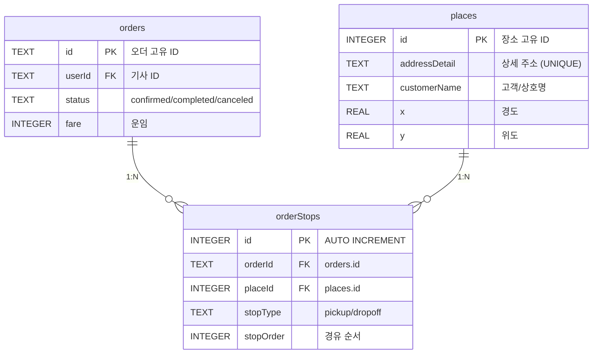

# Orders 스키마 재설계 — 운행일지 완성 (v2)

현재 `orders` 테이블은 9개 컬럼만 존재하여 최소 기록만 가능합니다. 이를 **운행일지를 쓸 수 있는 수준**으로 확장합니다.

> [!IMPORTANT]
> 개발 중이므로 기존 `orders` 데이터는 모두 삭제(DROP + CREATE)합니다. 마이그레이션은 고려하지 않습니다.

## 설계 원칙

1. **camelCase 컬럼명 통일** — TypeScript 인터페이스와 DB 컬럼명을 동일하게 유지하여 snake_case ↔ camelCase 변환 오류를 원천 차단
2. **장소(places) 마스터 분리** — 같은 곳을 어제도 가고 오늘도 갈 수 있으므로, 장소는 독립 테이블에 1번만 저장하고 오더와 N:M 연결
3. **orders 테이블은 날씬하게** — 핵심 오더 정보 + 정산만 보관. 장소 상세는 조인으로 가져옴

---

## 테이블 구조 (ERD)



---

## 새 스키마

### 1. `orders` — 핵심 오더 (날씬하게)

```sql
CREATE TABLE IF NOT EXISTS orders (
    -- ═══════════════════════════════════════
    -- [식별] 오더의 고유 키와 소유자 정보
    -- SecuredOrder.id, .type, .status 에 대응
    -- ═══════════════════════════════════════
    id                    TEXT PRIMARY KEY,     -- 오더 고유 ID (UUID, SecuredOrder.id)
    type                  TEXT NOT NULL          -- 콜 유형: 'NEW_ORDER' | 'INTEL_BULK' | 'MANUAL'
                          DEFAULT 'NEW_ORDER',   -- (SimplifiedOfficeOrder.type)
    status                TEXT NOT NULL          -- 오더 상태: pending → confirmed → completed / canceled
                          DEFAULT 'pending',     -- (SecuredOrder.status)
    userId                TEXT REFERENCES users(id),  -- 이 콜을 소유한 기사의 ID (users 테이블 FK)
    capturedDeviceId      TEXT,                  -- 이 콜을 낚아챈 앱폰 기기 ID (SecuredOrder.capturedDeviceId)
    capturedAt            TEXT,                  -- 콜을 낚아챈 실제 타임스탬프 ISO8601 (SecuredOrder.capturedAt)
    timestamp             TEXT NOT NULL,          -- 콜 원본 등록 시각 (SimplifiedOfficeOrder.timestamp)

    -- ═══════════════════════════════════════
    -- [출발/도착 요약] 리스트 표시용 텍스트
    -- 상세 주소·좌표·고객정보는 places + orderStops에 보관
    -- ═══════════════════════════════════════
    pickup                TEXT NOT NULL,          -- 출발지 요약 텍스트 (예: "경기 광주 오포")
    dropoff               TEXT NOT NULL,          -- 도착지 요약 텍스트 (예: "강남구 역삼동")

    -- ═══════════════════════════════════════
    -- [요금 및 문서] 전표·세금계산서 정보
    -- DetailedOfficeOrder 인터페이스와 1:1 대응
    -- ═══════════════════════════════════════
    fare                  INTEGER DEFAULT 0,      -- 운임 (원 단위, SimplifiedOfficeOrder.fare)
    vehicleType           TEXT,                   -- 차종 ("1t", "다마스" 등, DetailedOfficeOrder.vehicleType)
    paymentType           TEXT,                   -- 결제수단: '신용' | '선불' | '착불' | '카드' | '현금'
    billingType           TEXT,                   -- 세금서류: '계산서' | '인수증' | '무과세'
    commissionRate        TEXT,                   -- 퀵사 수수료율 (예: "23%")
    tollFare              TEXT,                   -- 통행료/탁송료 별도 금액
    tripType              TEXT,                   -- 배송구분: '편도' | '왕복'
    orderForm             TEXT,                   -- 배송형태: '보통' | '급송'
    itemDescription       TEXT,                   -- 물품 요약 (예: "소형 가전", "박스 2개")
    detailMemo            TEXT,                   -- 적요(비고) 원문 전체 (DetailedOfficeOrder.detailMemo)

    -- ═══════════════════════════════════════
    -- [배차사] 콜을 내려준 퀵사무실 정보
    -- ═══════════════════════════════════════
    dispatcherName        TEXT,                   -- 배차 사무실 상호 (예: "고양퀵서비스")
    dispatcherPhone       TEXT,                   -- 배차 사무실 연락처 (예: "031-932-7722")

    -- ═══════════════════════════════════════
    -- [운행 거리/시간] 카카오 연산 결과
    -- 운행일지의 "오늘 총 km / 총 시간" 합산에 사용
    -- ═══════════════════════════════════════
    distanceKm            REAL,                   -- 인성앱 원본 거리 (DetailedOfficeOrder.distanceKm)
    totalDistanceKm       REAL,                   -- 합짐 포함 통합 총 주행거리 (SecuredOrder.totalDistanceKm)
    totalDurationMin      INTEGER,                -- 합짐 포함 통합 총 소요시간(분) (SecuredOrder.totalDurationMin)
    kakaoSoloDistanceKm   REAL,                   -- 이 콜만의 단독 주행거리 (SecuredOrder.kakaoSoloDistanceKm)
    kakaoSoloDurationMin  INTEGER,                -- 이 콜만의 단독 소요시간(분) (SecuredOrder.kakaoSoloDurationMin)
    kakaoTimeExt          TEXT,                   -- 카카오 연산 결과 텍스트 (예: "[추천] +3.2km, +12분 🍯")

    -- ═══════════════════════════════════════
    -- [정산] SettlementInfo 인터페이스를 플랫하게 내재화
    -- 미수금 추적 및 운행일지 정산 현황에 사용
    -- ═══════════════════════════════════════
    settlementStatus      TEXT DEFAULT '미정산',  -- 정산상태: '미정산' | '지급예정' | '정산완료' | '미수금'
    unpaidAmount          INTEGER DEFAULT 0,      -- 미수금 금액 (원 단위)
    payerName             TEXT,                   -- 결제 담당자/회사명 (예: "레드캠프 경리팀")
    payerPhone            TEXT,                   -- 결제 담당자 연락처
    dueDate               TEXT,                   -- 입금 예정일 (예: "매월 말일", ISO date)
    settlementMemo        TEXT,                   -- 정산 메모 (예: "수수료 떼고 입금하기로 함")

    -- ═══════════════════════════════════════
    -- [메타 플래그] 콜 속성 및 시간 정보
    -- ═══════════════════════════════════════
    isShared              BOOLEAN DEFAULT 0,      -- 합짐(혼적) 여부 (DetailedOfficeOrder.isShared)
    isExpress             BOOLEAN DEFAULT 0,      -- 급송(독차) 여부 (DetailedOfficeOrder.isExpress)
    postTime              TEXT,                   -- 콜 등록/상차시간 (예: "12:23")
    scheduleText          TEXT,                   -- 예약 수식어 (예: "낼09시", "@")

    -- ═══════════════════════════════════════
    -- [타임스탬프] 생성·완료 시각
    -- capturedAt(배차) → completedAt(완료) 로 운행 소요시간 계산 가능
    -- ═══════════════════════════════════════
    createdAt             TEXT DEFAULT (datetime('now', 'localtime')),  -- DB 행 생성 시각
    completedAt           TEXT                    -- 운행 완료 시각 (dispatch-complete 시 기록)
);
```

### 2. `places` — 장소 마스터 (중복 방지)

**같은 곳을 어제도 가고 오늘도 가더라도 장소는 딱 1번만 저장됩니다.**
addressDetail 기준으로 UPSERT하여, 고객 정보가 갱신되면 자연스럽게 최신 값으로 업데이트됩니다.

```sql
CREATE TABLE IF NOT EXISTS places (
    -- ═══════════════════════════════════════
    -- [장소 마스터] 한 번 방문한 곳은 영구 등록
    -- LocationDetailInfo 인터페이스와 1:1 대응
    -- "자주 가는 곳 TOP 10" 등 통계 쿼리의 기반 테이블
    -- ═══════════════════════════════════════
    id              INTEGER PRIMARY KEY AUTOINCREMENT,  -- 장소 고유 ID (자동 증가)

    -- ═══ 위치 ═══
    address         TEXT,                   -- 간략 주소 텍스트 (예: "경기 화성시 안녕동")
    x               REAL,                   -- 경도 (카카오 지오코딩 결과)
    y               REAL,                   -- 위도 (카카오 지오코딩 결과)
    region          TEXT,                   -- 광역 지역명 (예: "경기 화성시", LocationDetailInfo.region)
    addressDetail   TEXT UNIQUE,            -- 상세 주소+건물명 (UNIQUE — 중복 장소 방지 키)
                                            -- (예: "경기 화성시 안녕동 158-95(안녕남로119번길 25)")

    -- ═══ 고객 정보 (LocationDetailInfo 매핑) ═══
    customerName    TEXT,                   -- 고객/상호명 (예: "*레드캠프", "SK스토아 홈쇼핑")
    department      TEXT,                   -- 부서명 (예: "정실장님")
    contactName     TEXT,                   -- 담당자명 (예: "정종혁차장")
    phone1          TEXT,                   -- 대표 연락처 (예: "010-2228-4991")
    phone2          TEXT,                   -- 보조 연락처 (예: "031-267-1224")
    mileage         INTEGER DEFAULT 0,      -- 마일리지 포인트

    -- ═══ 타임스탬프 ═══
    createdAt       TEXT DEFAULT (datetime('now', 'localtime')),  -- 최초 등록 시각
    lastVisitedAt   TEXT                    -- 마지막 방문 시각 (UPSERT 시 갱신)
);

-- addressDetail이 NULL인 경우를 대비한 보조 인덱스
CREATE INDEX IF NOT EXISTS idx_places_region ON places(region);
```

### 3. `orderStops` — 오더↔장소 연결 (경유지)

**오더와 장소를 연결하는 중간(junction) 테이블입니다.**
경유콜(상차 2곳 + 하차 3곳)이어도 5개 행으로 자연스럽게 기록됩니다.
오더별 현장 전달사항(memo, requestedTime)처럼 **방문할 때마다 달라지는 정보**만 여기에 둡니다.

```sql
CREATE TABLE IF NOT EXISTS orderStops (
    -- ═══════════════════════════════════════
    -- [경유지 연결] orders ↔ places 중간 테이블
    -- 장소 자체 정보(주소, 고객명 등)는 places에 보관하고
    -- 이 테이블에는 "이 오더에서 이 장소를 어떤 역할로 몇 번째로 방문했는가"만 기록
    -- ═══════════════════════════════════════
    id              INTEGER PRIMARY KEY AUTOINCREMENT,  -- 행 고유 ID
    orderId         TEXT NOT NULL                       -- 어떤 오더의 경유지인가 (orders.id FK)
                    REFERENCES orders(id) ON DELETE CASCADE,
    placeId         INTEGER NOT NULL                    -- 어떤 장소인가 (places.id FK)
                    REFERENCES places(id),
    stopType        TEXT NOT NULL                       -- 역할: 'pickup'(상차) | 'dropoff'(하차)
                    CHECK(stopType IN ('pickup', 'dropoff')),
    stopOrder       INTEGER DEFAULT 0,                  -- 경유 순서 (0부터, 같은 stopType 내에서 정렬)

    -- ═══ 방문별 가변 정보 (같은 장소라도 오더마다 달라지는 값) ═══
    requestedTime   TEXT,                   -- 이번 오더의 상/하차 예약 시간 (예: "13:53")
    memo            TEXT                    -- 이번 오더의 현장 전달사항 (적요에서 추출)
);

-- 특정 오더의 경유지를 빠르게 조회하기 위한 인덱스
CREATE INDEX IF NOT EXISTS idx_orderStops_orderId ON orderStops(orderId);
-- 특정 장소의 방문 이력을 빠르게 조회하기 위한 인덱스
CREATE INDEX IF NOT EXISTS idx_orderStops_placeId ON orderStops(placeId);
```

---

## 현재 vs 새 설계 비교

| 관점 | 현재 (orders 1개, 9컬럼) | 새 설계 (orders + orderStops) |
|------|------------------------|------------------------------|
| **컬럼 네이밍** | snake_case 혼용 | camelCase 통일 (TS 인터페이스 동일) |
| **경유콜** | ❌ pickup/dropoff 텍스트 1개씩 | ✅ orderStops N개 행으로 자연 처리 |
| **고객 상세** | ❌ 없음 | ✅ orderStops에 고객명/연락처/상세주소 |
| **좌표** | ❌ 없음 | ✅ orderStops.x, y (경유지별) |
| **거리/시간** | ❌ 없음 | ✅ orders에 총거리/시간 보관 |
| **정산** | ❌ 없음 | ✅ orders에 미수금/정산상태 |
| **orders 비대화** | - | orders 35컬럼 + orderStops로 분산 |

---

## 운행일지 쿼리 예시

### 오늘 하루 요약
```sql
SELECT 
    COUNT(*)                    AS 총건수,
    SUM(fare)                   AS 총매출,
    SUM(totalDistanceKm)        AS 총주행거리km,
    SUM(totalDurationMin)       AS 총운행시간분,
    SUM(CASE WHEN settlementStatus = '미수금' THEN unpaidAmount ELSE 0 END) AS 미수금합계
FROM orders 
WHERE userId = ? 
  AND status = 'completed' 
  AND DATE(completedAt) = DATE('now', 'localtime');
```

### 오늘 운행 상세 (일지)
```sql
SELECT 
    o.capturedAt, o.completedAt,
    o.pickup, o.dropoff,
    o.fare, o.vehicleType,
    o.totalDistanceKm, o.totalDurationMin,
    o.dispatcherName, o.paymentType,
    o.settlementStatus, o.detailMemo
FROM orders o
WHERE o.userId = ? 
  AND o.status = 'completed' 
  AND DATE(o.completedAt) = DATE('now', 'localtime')
ORDER BY o.capturedAt ASC;
```

### 특정 오더의 경유지 상세 (조인)
```sql
SELECT 
    s.stopType, s.stopOrder,
    s.address, s.addressDetail,
    s.customerName, s.contactName,
    s.phone1, s.requestedTime
FROM orderStops s
WHERE s.orderId = ?
ORDER BY s.stopType, s.stopOrder;
```

### 자주 방문한 장소 TOP 10 (장소 통계)
```sql
SELECT 
    s.customerName, s.addressDetail, s.region,
    COUNT(*) AS 방문횟수,
    MAX(o.completedAt) AS 최근방문
FROM orderStops s
JOIN orders o ON o.id = s.orderId
WHERE o.userId = ? AND o.status = 'completed'
GROUP BY s.addressDetail
ORDER BY 방문횟수 DESC
LIMIT 10;
```

---

## 📋 운행일지 활용 예시 (이 스키마로 할 수 있는 것들)

아래는 차주님이 하루 4건의 콜을 처리한 시나리오를 가정한 실제 데이터 예시입니다.

### 시나리오: 2026년 5월 1일 (목) 하루 운행

| 순서 | 시간 | 출발 | 도착 | 요금 | 거리 | 소요 | 배차사 | 비고 |
|:---:|:---:|------|------|-----:|-----:|-----:|--------|------|
| 1 | 08:30~09:45 | 경기 광주 오포 | 서울 강남구 역삼동 | 45,000 | 32.1km | 48분 | 광주퀵서비스 | 편도 |
| 2 | 10:20~11:10 | 서울 마포구 상암동 | 경기 고양시 일산서구 | 35,000 | 18.5km | 35분 | 고양퀵서비스 | 급송 |
| 3 | 13:00~15:20 | 경기 화성시 안녕동 | 서울 용산구 한남동 + 서울 종로구 평창동 | 72,000 | 65.3km | 92분 | 화성퀵서비스 | **경유콜** (하차 2곳) |
| 4 | 16:00~17:30 | 서울 강남구 역삼동 | 경기 파주시 금촌동 | 55,000 | 52.8km | 78분 | 고양퀵서비스 | 합짐, 착불 |

> [!NOTE]
> 3번 콜은 **경유콜(하차 2곳)**입니다. 현재 스키마에서는 이를 처리할 수 없지만, 새 스키마에서는 `orderStops` 테이블에 행 3개(상차1 + 하차2)로 자연스럽게 기록됩니다.

---

### 활용 1: 🗓 하루 요약 대시보드

```
┌─────────────────────────────────────────────┐
│  📊 2026년 5월 1일 (목) 운행 요약            │
├─────────────────────────────────────────────┤
│  총 건수      4건                            │
│  총 매출      207,000원                      │
│  총 주행거리  168.7km                        │
│  총 운행시간  4시간 13분                      │
│  km당 단가    1,227원/km                     │
├─────────────────────────────────────────────┤
│  💰 정산 현황                                │
│  정산완료     152,000원  (3건)               │
│  미수금       55,000원   (1건 — 고양퀵서비스) │
└─────────────────────────────────────────────┘
```

**사용 쿼리:** `SELECT SUM(fare), SUM(totalDistanceKm), SUM(totalDurationMin) FROM orders WHERE ...`

---

### 활용 2: 📝 상세 운행일지 (프린트용)

| # | 배차시각 | 완료시각 | 출발지 | 도착지 | 차종 | 운임 | 거리 | 시간 | 배차사 | 결제 | 정산 |
|:-:|:-------:|:-------:|--------|--------|:----:|-----:|-----:|-----:|--------|:----:|:----:|
| 1 | 08:30 | 09:45 | 경기 광주 오포 | 강남구 역삼동 | 1t | 45,000 | 32.1 | 48분 | 광주퀵서비스 | 신용 | ✅ |
| 2 | 10:20 | 11:10 | 마포구 상암동 | 고양 일산서구 | 다마스 | 35,000 | 18.5 | 35분 | 고양퀵서비스 | 신용 | ✅ |
| 3 | 13:00 | 15:20 | 화성시 안녕동 | 한남동 → 평창동 | 1t | 72,000 | 65.3 | 92분 | 화성퀵서비스 | 카드 | ✅ |
| 4 | 16:00 | 17:30 | 강남구 역삼동 | 파주시 금촌동 | 1t | 55,000 | 52.8 | 78분 | 고양퀵서비스 | **착불** | ❌ 미수금 |

**사용 쿼리:** `SELECT capturedAt, completedAt, pickup, dropoff, fare, totalDistanceKm, ... FROM orders WHERE ...`

---

### 활용 3: 📍 경유콜 상세 (3번 콜의 orderStops + places 조인)

3번 콜은 상차 1곳 + 하차 2곳이므로 `orderStops`에 3행이 저장됩니다:

| 구분 | 순서 | 장소(places) | 고객명 | 연락처 | 예약시간 | 메모 |
|:----:|:---:|-------------|--------|--------|:-------:|------|
| 🔵 상차 | 0 | 경기 화성시 안녕동 158-95 | *레드캠프 | 010-2228-4991 | 13:00 | 5층 하차 |
| 🔴 하차 | 0 | 서울 용산구 한남동 734-4 | SK스토아 홈쇼핑 | 02-6100-1234 | 14:20 | 지하 1층 반품창고 |
| 🔴 하차 | 1 | 서울 종로구 평창동 123-8 | 평창갤러리 | 02-391-5678 | 15:00 | 정문 앞 대기 |

**사용 쿼리:** `SELECT s.stopType, p.addressDetail, p.customerName, p.phone1, s.requestedTime, s.memo FROM orderStops s JOIN places p ON p.id = s.placeId WHERE s.orderId = ?`

> [!TIP]
> `places` 테이블에 "레드캠프"와 "SK스토아"가 한 번 등록되면, 다음에 같은 곳으로 콜이 와도 **기존 장소를 재사용**합니다. 고객 연락처가 변경되면 UPSERT로 자동 갱신됩니다.

---

### 활용 4: 💸 미수금 추적 보드

| 날짜 | 도착지 | 운임 | 미수금 | 결제처 | 연락처 | 입금예정 | 메모 |
|:----:|--------|-----:|------:|--------|--------|:-------:|------|
| 05/01 | 파주시 금촌동 | 55,000 | 55,000 | 고양퀵서비스 | 031-932-7722 | 5/15 | 착불 — 전화 안받음 |
| 04/28 | 인천 부평구 | 38,000 | 38,000 | 부평퀵서비스 | 032-123-4567 | 4/30 | 수수료 떼고 입금 약속 |
| **합계** | | | **93,000** | | | | |

**사용 쿼리:** `SELECT completedAt, dropoff, fare, unpaidAmount, payerName, payerPhone, dueDate, settlementMemo FROM orders WHERE settlementStatus = '미수금'`

---

### 활용 5: 🏢 단골 장소 TOP 10

`places` 테이블 덕분에 같은 장소를 몇 번이나 방문했는지 통계를 뽑을 수 있습니다:

| 순위 | 장소 | 지역 | 고객명 | 방문 횟수 | 최근 방문 |
|:---:|------|------|--------|:--------:|:---------:|
| 1 | 강남구 역삼동 123-4 | 서울 강남구 | (주)한국물류 | 12회 | 05/01 |
| 2 | 화성시 안녕동 158-95 | 경기 화성시 | *레드캠프 | 8회 | 05/01 |
| 3 | 고양시 일산서구 대화동 | 경기 고양시 | CJ대한통운 | 6회 | 04/30 |

**사용 쿼리:** `SELECT p.addressDetail, p.region, p.customerName, COUNT(*) AS 방문횟수 FROM orderStops s JOIN places p ... GROUP BY p.id ORDER BY 방문횟수 DESC`

> [!TIP]
> 이 데이터를 활용하면 나중에 "이 고객에게 콜이 오면 자동 수락" 같은 VIP 자동화 기능도 구현할 수 있습니다.

---

### 활용 6: 📊 월별 요약 리포트

| 월 | 건수 | 매출 | 주행거리 | 운행시간 | km당 단가 | 미수금 |
|:--:|:---:|------:|--------:|--------:|--------:|------:|
| 3월 | 78건 | 4,230,000 | 2,847km | 71시간 | 1,486원 | 120,000 |
| 4월 | 92건 | 5,180,000 | 3,412km | 84시간 | 1,518원 | 55,000 |
| 5월(진행중) | 4건 | 207,000 | 169km | 4시간 | 1,227원 | 55,000 |

**사용 쿼리:** `SELECT strftime('%Y-%m', completedAt) AS 월, COUNT(*), SUM(fare), SUM(totalDistanceKm) ... GROUP BY 월`

---

## 수정 대상 파일 (4개)

> [!CAUTION]
> 소스 코드 수정은 차주님 승인 후에만 진행합니다.

### [MODIFY] [db.ts](file:///Users/seungwookkim/reps/onedal/onedal-web/server/src/db.ts)
- `CREATE TABLE IF NOT EXISTS orders` → 새 camelCase 스키마로 교체
- `CREATE TABLE IF NOT EXISTS orderStops` 신규 추가
- 기존 ALTER TABLE 마이그레이션 코드 삭제

### [MODIFY] [dispatchEngine.ts](file:///Users/seungwookkim/reps/onedal/onedal-web/server/src/services/dispatchEngine.ts)
- `handleDecision` KEEP 블록: INSERT문을 새 컬럼에 맞게 확장
- `cachedOrder`(SecuredOrder)에서 pickupDetails/dropoffDetails를 꺼내 `orderStops`에 행 삽입

### [MODIFY] [socketHandlers.ts](file:///Users/seungwookkim/reps/onedal/onedal-web/server/src/socket/socketHandlers.ts)
- `dispatch-complete`: `completedAt` 컬럼 함께 기록
- `start-two-track`: 동일하게 `completedAt` 추가

### [MODIFY] [orders.ts](file:///Users/seungwookkim/reps/onedal/onedal-web/server/src/routes/orders.ts)
- GET `/api/orders`: SELECT 쿼리 및 응답 매핑 확장
- POST `/` 레거시: INSERT문 새 스키마 적용

---

## 의도적으로 제외한 필드

| SecuredOrder 필드 | 제외 사유 |
|---|---|
| `routePolyline` | 좌표 수천 개 배열 — DB 용량 폭발. 실시간 전용 |
| `sectionEtas` | 경유지 도착 시간 배열 — 실시간 전용 |
| `pickupEta`, `dropoffEta` | 예상 도착 시간 — 운행 끝나면 무의미 |
| `isRejected`, `rejectionReasons`, `approvalReasons` | 배차 판단 사유 — 평가 중에만 유효 |
| `osrmSolo*`, `osrmError` | 보조 연산 결과 — 카카오 결과만 보관 |
| `kakaoCalculatedFare` | 미구현 확장 필드 |
| `rawText` | 안드로이드 원본 — intel 테이블 담당 |

---

## Open Questions

> [!NOTE]
> **Q1. `completedAt` 외에 `startedAt`(운행 시작 시각)도 필요한지?**
> - 현재: `capturedAt`(배차) → `completedAt`(완료)만 기록
> - 실제 출발 시각 기록하려면 프론트에 "운행 시작" 버튼 추가 필요

## Verification Plan

### Automated Tests
1. `sqlite3 local.db ".schema orders"` — 새 테이블 구조 확인
2. `sqlite3 local.db ".schema orderStops"` — 경유지 테이블 확인
3. 콜 확정 → 완료 후 `SELECT * FROM orders` + `SELECT * FROM orderStops` 검증

### Manual Verification
- 관제탑에서 경유콜(합짐) 확정 → 완료 후 orderStops에 다중 행 저장 확인
- 운행일지 쿼리 실행하여 하루 요약/상세 출력 확인
