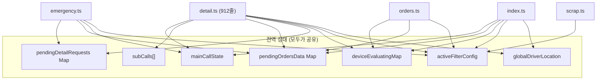

# Phase 0: 코드 리팩토링(모듈화) 상세 실행 계획서

> [!IMPORTANT]
> **핵심 원칙**: 이 리팩토링은 **기능 변경이 절대 없습니다.** 코드를 "쪼개서 옮기는" 작업만 합니다.
> 리팩토링 완료 후 `pnpm dev`를 돌렸을 때, 현재와 100% 동일하게 동작해야 합니다.
> 각 Step은 독립적으로 테스트 가능한 단위이며, 한 Step이 끝날 때마다 서버를 재시작하여 정상 동작을 확인합니다.

> [!NOTE]
> **"서버 세션"이 아닙니다.** 이 문서에서 말하는 "세션"은 Express 세션이나 쿠키 세션이 아니라, 
> Node.js 프로세스 메모리 안에 있는 **순수 JavaScript Map 객체** (`new Map()`)입니다.
> 현재도 `detail.ts`에서 `const pendingOrdersData = new Map()`으로 쓰고 있는 것과 동일한 방식이며,
> 단지 이것을 파일 하나로 모아 정리하는 작업입니다.

---

## 1. 현재 문제 진단: `detail.ts` 해부 결과

`detail.ts` 파일(912줄)을 줄 단위로 분석한 결과, 아래 **5가지 종류의 코드**가 한 파일에 섞여 있습니다.

| 줄 번호 | 분류 | 내용 | 문제 |
|:---|:---|:---|:---|
| L22-39 | ⚙️ 설정값 | `DISPATCH_CONFIG` (꿀콜/똥콜 판정 상수) | 비즈니스 규칙인데 라우터 안에 묻혀있음 |
| L44-88 | 🧮 순수 함수 | `getDistanceKm()`, `optimizeWaypoints()` (TSP) | 어디서든 재사용 가능한 유틸인데 detail.ts에 갇혀있음 |
| L90-127 | 📦 전역 상태 | `mainCallState`, `subCalls`, `pendingOrdersData` 등 5개 변수 | **가장 큰 문제.** 서버 전체가 이 전역 변수에 의존 |
| L129-566 | 🧠 비즈니스 | `handleDecision()`, `recalculateKakaoRoute()` 등 핵심 배차 두뇌 | 라우터 파일에 300줄짜리 함수가 있으면 안 됨 |
| L568-910 | 🌐 HTTP | `router.post("/")` Express 핸들러 | 이것만 라우터에 남아야 함 |

### 전역 상태 의존 관계도 (현재: 거미줄 구조)



**모든 파일이 전역 변수를 직접 import** 하여 읽고 쓰고 있으므로, 나중에 사용자별로 분리하려면 모든 곳을 동시에 고쳐야 합니다. 이것을 먼저 **한 곳(Store)**으로 모아야 합니다.

---

## 2. 리팩토링 실행 계획 (3 Step)

### Step 1: 순수 유틸리티 함수 추출 (위험도: 🟢 제로)

`detail.ts`에서 **외부 상태를 전혀 건드리지 않는 순수 함수**만 빼냅니다. 입력 → 출력만 있고 부수효과(side effect)가 없으므로 옮겨도 동작이 절대 바뀌지 않습니다.

#### [NEW] `server/src/utils/routeOptimizer.ts`
`detail.ts`에서 아래 함수들을 잘라내(cut) 이 파일에 붙여넣습니다(paste):

| 원본 위치 (detail.ts) | 함수명 | 역할 | 옮기는 이유 |
|:---|:---|:---|:---|
| L44-53 | `getDistanceKm(lat1, lon1, lat2, lon2)` | 하버사인 거리 계산 | 순수 수학 함수. 카카오 서비스에서도 재사용 가능 |
| L55-88 | `optimizeWaypoints(startLoc, pickups, dropoffs)` | TSP 경유지 정렬 | 순수 알고리즘. 입출력만 있음 |

#### [NEW] `server/src/config/dispatchConfig.ts`
| 원본 위치 (detail.ts) | 상수명 | 옮기는 이유 |
|:---|:---|:---|
| L22-39 | `DISPATCH_CONFIG` | 향후 사용자별 설정(`user_settings`)으로 교체할 대상. 별도 파일로 분리해두면 나중에 DB 조회로 바꿀 때 이 파일 하나만 수정하면 됨 |

#### [MODIFY] `detail.ts`
- 잘라낸 함수/상수 자리에 `import { getDistanceKm, optimizeWaypoints } from '../utils/routeOptimizer'` 추가
- 잘라낸 상수 자리에 `import { DISPATCH_CONFIG } from '../config/dispatchConfig'` 추가
- **나머지 코드는 한 글자도 건드리지 않음**

#### ✅ Step 1 테스트 방법
```
1. 서버 재시작 (pnpm dev)
2. 웹 대시보드 열어 기존 콜이 정상 표시되는지 확인
3. 콜이 들어왔을 때 카카오 경로 연산이 기존과 동일하게 작동하는지 로그 확인
4. [추천/최단시간/최단거리] 토글 눌러서 재계산이 정상 동작하는지 확인
```

---

### Step 2: 전역 배차 상태를 Store 모듈로 집결 (위험도: 🟡 낮음)

현재 `detail.ts` 파일 내부에 흩어져 있는 **5개의 전역 변수**와 그 getter/setter를 하나의 전용 파일로 **이사**시킵니다.
`filterStore.ts`, `locationStore.ts`는 이미 분리되어 있으므로 그대로 둡니다.

#### [NEW] `server/src/state/dispatchStore.ts`
`detail.ts`에서 아래 항목들을 잘라내 이 파일로 이동합니다:

| 원본 위치 (detail.ts) | 변수/함수명 | 역할 |
|:---|:---|:---|
| L90-91 | `pendingDetailRequests` | 앱폰 롱폴링 HTTP Response 보관 Map |
| L92-93 | `pendingOrdersData` | 평가 중인 오더 캐시 Map |
| L94-95 | `deviceEvaluatingMap` | 기기별 현재 평가 중 오더ID 추적 Map |
| L118-119 | `mainCallState` | 본콜(첫짐) 상태 |
| L120-121 | `subCalls` | 합짐 콜 누적 배열 |
| L123-127 | `getMainCallState()` 등 getter 4개 | 외부 모듈이 상태를 읽는 통로 |
| L362-363 | `resetMainCallState()` | 비상시 본콜 초기화 |

**이 파일의 완성된 모습 (스켈레톤):**
```typescript
// server/src/state/dispatchStore.ts
import type { SecuredOrder } from "@onedal/shared";
import type { Response } from "express";

// ━━━ 배차 엔진 인메모리 상태 (현재는 단일 사용자용) ━━━
let mainCallState: SecuredOrder | null = null;
const subCalls: SecuredOrder[] = [];
const pendingDetailRequests = new Map<string, Response>();
const pendingOrdersData = new Map<string, SecuredOrder>();
export const deviceEvaluatingMap = new Map<string, string>();

// ━━━ Getter / Setter ━━━
export const getMainCallState = () => mainCallState;
export const setMainCallState = (v: SecuredOrder | null) => { mainCallState = v; };
export const getSubCalls = () => subCalls;
export const getPendingDetailRequests = () => pendingDetailRequests;
export const getPendingOrdersData = () => pendingOrdersData;
export const resetMainCallState = () => { mainCallState = null; };
```

#### [MODIFY] `detail.ts`
- 위 변수/함수 선언부를 삭제하고, 대신 `import { ... } from '../state/dispatchStore'` 로 교체
- `mainCallState = xxx` 직접 대입문을 `setMainCallState(xxx)` 호출로 변경 (약 8군데)
- 나머지 로직 코드는 한 글자도 바꾸지 않음

#### [MODIFY] `emergency.ts`
- 기존: `import { getPendingDetailRequests, ... } from "./detail"`
- 변경: `import { getPendingDetailRequests, ... } from "../state/dispatchStore"`
- 로직 코드 변경: 없음

#### [MODIFY] `orders.ts`
- 기존: `import { deviceEvaluatingMap, forceCancelEvaluatingOrder, getPendingOrdersData, handleDecision } from "./detail"`  
- 변경: `deviceEvaluatingMap`, `getPendingOrdersData`는 `"../state/dispatchStore"`에서 import. `forceCancelEvaluatingOrder`, `handleDecision`은 여전히 `"./detail"`에서 import (Step 3에서 이동 예정)

#### [MODIFY] `index.ts`
- `getPendingOrdersData`, `deviceEvaluatingMap` import 출처를 `"../state/dispatchStore"`로 변경

#### ✅ Step 2 테스트 방법
```
1. 서버 재시작
2. 콜 수신 → 카카오 연산 → KEEP/CANCEL 전체 사이클을 1회 실행
3. 합짐 콜 진입 시 mainCallState/subCalls가 정상 갱신되는지 로그 확인
4. 비상 보고(emergency) 시 본콜 초기화가 정상 작동하는지 확인
5. 웹 새로고침 후 기존 데이터가 정상 복원되는지 확인
```

---

### Step 3: 비즈니스 로직(배차 두뇌)을 Service 계층으로 분리 (위험도: 🟡 낮음)

`detail.ts`에 남아있는 **300줄짜리 거대 함수들**(handleDecision, recalculateKakaoRoute 등)을 서비스 파일로 옮깁니다.
`detail.ts`에는 오직 Express `router.post("/")`만 남게 됩니다.

#### [NEW] `server/src/services/dispatchEngine.ts`
아래 함수들을 `detail.ts`에서 잘라내 이동합니다:

| 원본 위치 (detail.ts) | 함수명 | 줄 수 | 역할 |
|:---|:---|:---|:---|
| L97-116 | `forceCancelEvaluatingOrder()` | 20줄 | 기존 평가 오더 강제 삭제 |
| L129-203 | `recalculateActiveKakaoRoute()` | 75줄 | 취소 후 남은 콜 경로 재탐색 |
| L205-360 | `recalculateKakaoRoute()` | 155줄 | 경로 옵션(추천/최단) 토글 시 재탐색 |
| L365-386 | `recalculateCorridorFilter()` | 22줄 | 폴리라인 기반 지역 필터 재추출 |
| L388-413 | `syncCorridorFilter()` | 26줄 | 확정 경로 변경 시 필터 자동 동기화 |
| L415-566 | `handleDecision()` | 152줄 | KEEP/CANCEL 관제 판정 처리 |

**이동 후 `detail.ts`에 남는 것:**
```typescript
// detail.ts (리팩토링 후 — 약 350줄)
import { ... } from '../services/dispatchEngine';
import { ... } from '../state/dispatchStore';

const router = Router();

// POST /detail — 2차 상세 보고 (롱폴링)
router.post("/", async (req, res) => {
    // L568-910의 기존 코드 그대로 유지
    // 단, handleDecision() 등은 import해서 호출
});

export default router;
```

#### [MODIFY] `emergency.ts`
- `forceCancelEvaluatingOrder` 등의 import 출처를 `"./detail"` → `"../services/dispatchEngine"` 으로 변경

#### [MODIFY] `orders.ts`
- `handleDecision`, `forceCancelEvaluatingOrder` import 출처를 `"./detail"` → `"../services/dispatchEngine"` 으로 변경

#### [MODIFY] `index.ts`
- `handleDecision`, `recalculateKakaoRoute`, `recalculateCorridorFilter` import 출처를 `"./routes/detail"` → `"./services/dispatchEngine"` 으로 변경

#### ✅ Step 3 테스트 방법
```
1. 서버 재시작
2. 단독 콜 수신 → 카카오 연산 → KEEP 확정 → 합짐 콜 수신 → CANCEL 취소 전체 사이클 테스트
3. [추천/최단시간/최단거리] 토글 재계산 정상 동작 확인
4. 비상 보고(AUTO_CANCEL) 시 기존과 동일하게 상태 복원되는지 확인
5. 합짐 사냥 모드 전환 후 필터가 정상 갱신되는지 확인
```

---

## 3. 리팩토링 전후 파일 구조 비교

```
server/src/
├── config/
│   └── dispatchConfig.ts     [NEW] DISPATCH_CONFIG 상수 (40줄)
├── utils/
│   ├── routeOptimizer.ts     [NEW] getDistanceKm, optimizeWaypoints (50줄)
│   ├── parser.ts             (기존 유지)
│   └── roadmapLogger.ts      (기존 유지)
├── state/
│   ├── dispatchStore.ts      [NEW] 배차 상태 5개 변수 + getter/setter (40줄)
│   ├── filterStore.ts        (기존 유지 — 변경 없음)
│   └── locationStore.ts      (기존 유지 — 변경 없음)
├── services/
│   ├── dispatchEngine.ts     [NEW] handleDecision 등 핵심 로직 6개 함수 (450줄)
│   └── geoService.ts         (기존 유지)
├── routes/
│   ├── detail.ts             [MODIFY] 912줄 → 약 350줄 (POST 핸들러만 남음)
│   ├── orders.ts             [MODIFY] import 경로만 변경
│   ├── emergency.ts          [MODIFY] import 경로만 변경
│   ├── scrap.ts              (변경 없음)
│   ├── kakaoUtil.ts          (변경 없음)
│   ├── kakao.ts              (변경 없음)
│   ├── devices.ts            (변경 없음)
│   └── config.ts             (변경 없음)
└── index.ts                  [MODIFY] import 경로만 변경
```

---

## 4. 개발 진행 로드맵

- **[ Phase 0 - Step 1 ]** 순수 유틸 추출 → 테스트 → 커밋  
- **[ Phase 0 - Step 2 ]** 전역 상태 Store 집결 → 테스트 → 커밋  
- **[ Phase 0 - Step 3 ]** 비즈니스 로직 Service 분리 → 테스트 → 커밋 + 푸시  
- **[ Phase 1 ]** JWT 인증 + DB 스키마 (auth 계획서 진행)  
- **[ Phase 2 ]** 카카오 개인화 파라미터 주입  
- **[ Phase 3 ]** 사용자/어드민 분리 UI  

> [!TIP]
> Phase 0의 3개 Step은 모두 **import 경로 변경 + 함수 이동**만 합니다.  
> 어떤 로직도 수정되지 않으므로, 리팩토링 전후의 동작이 100% 동일합니다.  
> 각 Step마다 개별 커밋을 찍어두면, 문제가 생겼을 때 `git revert`로 즉시 롤백할 수 있습니다.
