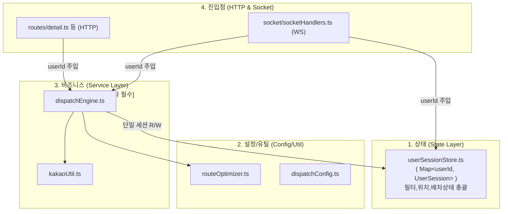

# Phase 0: 코드 리팩토링(모듈화) 상세 실행 계획서 (V2 - SaaS 완벽 대비판)

> [!IMPORTANT]
> **핵심 원칙**: 이 리팩토링은 100% 동일한 기능을 보장하며, 내부 골격만 **"다중 사용자(SaaS)"**를 수용할 수 있도록 통째로 재설계합니다.
> 모든 Store 접근과 Service 함수는 다중 사용자를 대비해 `userId` 파라미터를 갖게 되며, 임시적으로 전역 `"ADMIN_USER"` ID 값을 넘겨서 작동시킵니다.

---

## 1. 현재 문제 진단: `detail.ts` 해부 및 아키텍처 문제점

- **전역 변수 의존**: `detail.ts`에 5개의 전역 상태, `filterStore.ts`, `locationStore.ts`가 서로 파편화되어 존재합니다.
- **다중 유저 Lifecycle 문제**: 유저 1명이 접속 종료 시 배차, 필터, 위치 정보를 동시에 청소(Garbage Collect)해야 하는데 3곳으로 쪼개져 있으면 메모리 누수가 발생합니다.
- **Signature(서명) 한계**: 현재 함수들은 인자가 없어 누구의 상태를 바꿔야 할지 구분이 안 됩니다.
- **Router 비대함**: `detail.ts`, `index.ts`에 비즈니스 및 Socket.io 로직이 뭉쳐 있습니다.

---

## 2. 리팩토링 실행 계획 (총 4 Step)

### Step 1: 순수 유틸리티 함수 추출 (위험도: 🟢 제로)
`detail.ts`에서 **외부 상태를 건드리지 않는 순수 함수**와 설정값을 빼냅니다.
*   **[NEW] `server/src/utils/routeOptimizer.ts`**: `getDistanceKm()`, `optimizeWaypoints()`
*   **[NEW] `server/src/config/dispatchConfig.ts`**: `DISPATCH_CONFIG` 상수

**✅ 테스트**: 서버 부팅 후 기존 로직 정상 컴파일 및 실행 여부 확인.

---

### Step 2: "통합 UserSession 스토어" 구축 (위험도: 🔴 높음)
파편화되어 있던 필터, 위치, 배차 상태를 **하나의 유저 객체**로 강력하게 결합합니다. 나중에 기사별로 이 세트를 하나씩 발급하게 됩니다.

*   **[NEW] `server/src/state/userSessionStore.ts`**:
    ```typescript
    import { AutoDispatchFilter, SecuredOrder } from "@onedal/shared";

    // 1명의 사용자가 가지는 모든 메모리 상태
    export interface UserSession {
        mainCallState: SecuredOrder | null;
        subCalls: SecuredOrder[];
        pendingDetailRequests: Map<string, any>;
        pendingOrdersData: Map<string, SecuredOrder>;
        deviceEvaluatingMap: Map<string, string>;
        activeFilter: AutoDispatchFilter;
        driverLocation: { x: number; y: number } | null;
    }

    // 서버에 접속한 [기사별] 통합 저장소 구역
    const sessions = new Map<string, UserSession>();

    // V2의 핵심: 앞으로 모든 상태 접근은 userId를 필수로 받아야 합니다.
    export function getUserSession(userId: string): UserSession {
        if (!sessions.has(userId)) {
            // 초기 접속 시 빈 세션 및 디폴트 필터 생성
            sessions.set(userId, createDefaultSession());
        }
        return sessions.get(userId)!;
    }
    
    // (이하 get/set 함수들 역시 항상 userId 파라미터를 요구하도록 변경)
    ```
*   **[DELETE]**: 기존 `filterStore.ts`, `locationStore.ts` 등은 폐기하거나 통합 스토어로 합칩니다.

**✅ 테스트**: `parser.js`를 이용한 모의 오더 주입 후, 메모리(`sessions.get("ADMIN_USER")`)에 상태가 정상 적재되는지 확인.

---

### Step 3: 비즈니스 두뇌 Service 분리 및 Signature 개편 (위험도: 🟡 보통)
`detail.ts`에 있던 핵심 로직을 분리하되, **모든 함수가 `userId`를 인자로 받도록 뼈대를 교체합니다.**

*   **[NEW] `server/src/services/dispatchEngine.ts`**:
    ```typescript
    // 이전: export async function handleDecision(orderId: string, action: string, io: any)
    // V2 : 무조건 "어느 기사의 배차를 처리할 것인가?"가 선행되어야 함
    export async function handleDecision(userId: string, orderId: string, action: 'KEEP' | 'CANCEL', io: any) {
        const session = getUserSession(userId);
        // session.mainCallState 등을 조작...
    }
    
    // recalculateKakaoRoute(userId, orderId, priority, io), 등 모든 함수 규칙 적용
    ```
*   **[MODIFY] `detail.ts`**: 이제 HTTP 요청이 들어오면 임시로 하드코딩된 `"ADMIN_USER"` 식별자를 붙여 Service 계층으로 던지기만 하는 역할로 축소됩니다.

**✅ 테스트**: 브라우저 화면에서 KEEP/CANCEL 버튼 직접 클릭, `dispatchEngine.ts` 내 로직 정상 분기.

---

### Step 4: `index.ts` Socket.io 비즈니스 로직 분리 (위험도: 🟡 보통)
`index.ts` 안에 하드코딩된 70여 줄의 `io.on` 로직을 분리하여 라우터와 통일성을 맞춥니다.

*   **[NEW] `server/src/socket/socketHandlers.ts`**:
    ```typescript
    export function registerSocketHandlers(io: any) {
        io.on('connection', (socket) => {
            // V1에서는 임시로 무조건 ADMIN_USER 방에 연결 (향후 JWT 기반으로 전환)
            const mockUserId = "ADMIN_USER"; 
            socket.join(mockUserId);

            socket.on("update-filter", (newFilter) => {
                 getUserSession(mockUserId).activeFilter = newFilter;
                 // 전역 io.emit 대신, 해당 기사의 룸으로만 쏴줍니다 (Multi-Tenant 대비)
                 io.to(mockUserId).emit("filter-updated", newFilter); 
            });
            // ... (decision, disconnect 등 이동)
        });
    }
    ```

**✅ 테스트**: 프론트엔드 대시보드 새로고침 시 소켓 재연결 및 필터 토글 시 정상 통신 확인.

---

## 3. 리팩토링 완료 후 의존 관계도 (최종 목표)



---

## 4. 진행 로드맵 & 🤖 자동화 검증 시나리오

단순 눈대중이 아닌, 명확한 자동화 스트레스 테스트로 기능이 깨지지 않았음을 증명하며 진행합니다.

1. **Phase 0 - Step 1 & 2 완료 후:** `pnpm dev`
2. **검증 API**: 터미널에서 기존에 구축된 파서 스크립트를 실행하여 강제 데이터를 서버에 주입합니다.
   ```bash
   node test_scripts/run_parser_mock.js (또는 curl을 통한 10연속 오더 주입)
   ```
3. **Phase 0 - Step 3 & 4 완료 후:**
4. **검증 시나리오**:
   - `ADMIN_USER` 식별자로 단독 오더를 잡는다 (KEEP)
   - 이어서 합짐 오더 2건이 주입될 때 `routeOptimizer`가 TSP를 정상 연산하는지 확인
   - 30초 대기(Death Valley) 후 자동 CANCEL 및 `mainCallState` 초기화 로직 확인
5. **Phase 1 이동**: 이 구조가 완벽히 검증되면, 비로소 SQLite DB를 연결하고 JWT 로그인을 통해 `ADMIN_USER`라는 하드코딩 명칭을 "기사들의 실제 구글 ID"로 치환하게 됩니다.
