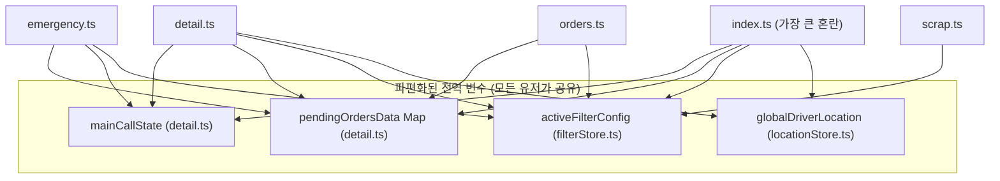
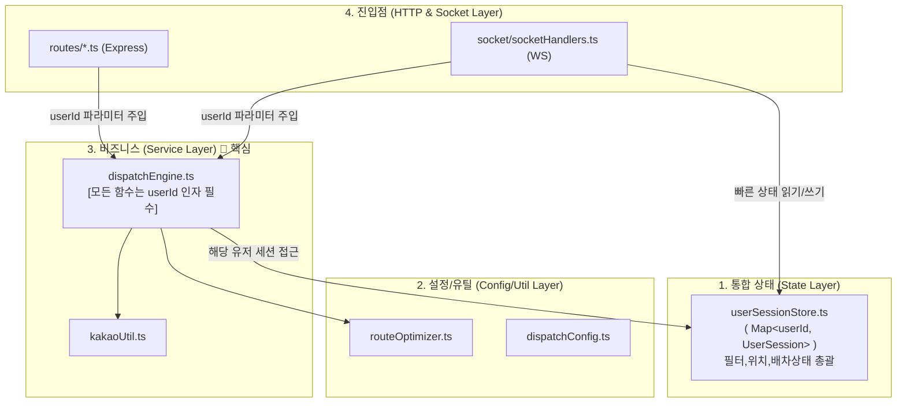

# Phase 0: 코드 리팩토링(모듈화) 상세 실행 계획서 (최종 완성판 - SaaS 완벽 대비)

> [!IMPORTANT]
> **핵심 원칙**: 이 리팩토링은 100% 동일한 기능을 보장하며, 기능 추가는 없습니다. 
> 하지만 내부 골격 단위로는 **"다중 사용자(SaaS)"**를 수용할 수 있도록 통째로 재설계합니다.
> 모든 Store 접근과 Service 함수는 다중 사용자를 대비해 `userId` 파라미터를 강제로 갖게 되며, 임시적으로 전역 `"ADMIN_USER"` ID 값을 넘겨서 작동시킵니다.

---

## 1. 현재 문제 진단: `detail.ts` 해부 및 의존성 거미줄

현재의 1DAL 서버는 "단일 기사"를 위한 구조로, 각종 상태가 전역 공간에 흩뿌려져 있습니다. 다중 사용자 환경에서 치명적인 충돌(Race Condition)을 유발합니다.

### 🚨 `detail.ts` (912줄) 정밀 해부 결과
| 줄 번호 | 분류 | 기존 내용 | 문제점 및 SaaS 전환 시 한계 |
|:---|:---|:---|:---|
| L22-39 | ⚙️ 설정 | `DISPATCH_CONFIG` | 기사별 통행료/차종 개인화 불가 (라우터 내 하드코딩) |
| L44-88 | 🧮 유틸 | `getDistanceKm`, `optimizeWaypoints` | 순수 알고리즘이나 재사용 불가 설정 |
| L90-127 | 📦 상태 | `mainCallState`, `pendingOrdersData` 등 | **가져올 때 userId 구분이 없음. 모든 기사의 배차가 꼬임** |
| L129-566 | 🧠 로직 | `handleDecision()`, `recalculateKakaoRoute()` 등 | 거대 함수 병목 현상. 파라미터에 userId가 없음. |
| L568-910 | 🌐 HTTP | `router.post("/")` | 하나의 라우터에 너무 많은 도메인 결합 |

### 🕸️ 전역 상태 의존 관계도 (리팩토링 전)

**문제점**: 배차, 필터, 내비게이션 위치가 3곳(`detail.ts`, `filterStore.ts`, `locationStore.ts`)에 나뉘어 있어, **기사가 접속을 종료할 때 상태를 한 번에 지우지 못하고 메모리 누수가 발생**합니다.

---

## 2. 리팩토링 실행 계획 (총 4 Step)

모든 Step은 개별적으로 테스트 및 **git commit**이 가능하며, 단계별로 안전성을 확보합니다.

### Step 1: 순수 유틸리티 함수 추출 (위험도: 🟢 제로)
`detail.ts`에서 **외부 상태를 건드리지 않는 순수 함수**와 설정값을 물리적으로 분리합니다.

*   **[NEW] `server/src/utils/routeOptimizer.ts`**
    *   `getDistanceKm(lat1, lon1, lat2, lon2)` (L44-53)
    *   `optimizeWaypoints(startLoc, pickups, dropoffs)` (L55-88)
*   **[NEW] `server/src/config/dispatchConfig.ts`**
    *   `DISPATCH_CONFIG` 상수 객체 (L22-39)
*   **[MODIFY] `detail.ts`**: 위 함수들을 `import` 처리. 나머지 코드 보존.

### Step 2: 통합 `UserSession` 스토어 구축 (위험도: 🔴 높음 - 핵심 공사)
파편화되어 있던 필터, 위치, 배차 상태를 **하나의 유저 객체**로 강력하게 결합합니다. 나중에 기사별로 이 세트를 하나씩 발급합니다.

*   **[NEW] `server/src/state/userSessionStore.ts`**:
    ```typescript
    import { AutoDispatchFilter, SecuredOrder } from "@onedal/shared";

    // 1명의 기사가 가지는 '모든' 상태 캡슐화
    export interface UserSession {
        mainCallState: SecuredOrder | null;
        subCalls: SecuredOrder[];
        pendingDetailRequests: Map<string, any>; // Res 객체
        pendingOrdersData: Map<string, SecuredOrder>;
        deviceEvaluatingMap: Map<string, string>;
        activeFilter: AutoDispatchFilter; // 기존 filterStore 대체
        driverLocation: { x: number; y: number } | null; // 기존 locationStore 대체
    }

    const sessions = new Map<string, UserSession>();

    // V2의 핵심: 앞으로 모든 상태 접근은 userId 파라미터를 강제로 요구합니다.
    export function getUserSession(userId: string): UserSession {
        if (!sessions.has(userId)) {
            sessions.set(userId, createDefaultSession());
        }
        return sessions.get(userId)!;
    }
    ```
*   **[DELETE] `server/src/state/filterStore.ts`**, **`server/src/state/locationStore.ts`** 삭제 (스토어 통폐합)
*   **[MODIFY] 모든 라우터**: `activeFilterConfig` 등을 참조하던 곳을 모두 `getUserSession("ADMIN_USER").activeFilter` 형태로 교체합니다.

### Step 3: 비즈니스 두뇌 Service 분리 및 Signature 개편 (위험도: 🟡 보통)
`detail.ts`에 있던 핵심 로직을 분리하되, **모든 함수가 `userId`를 인자로 받도록 파라미터(Signature)를 갈아엎습니다.**

*   **[NEW] `server/src/services/dispatchEngine.ts`** (300줄 이동):
    *   `forceCancelEvaluatingOrder(userId, orderId, io)` (L97-116)
    *   `recalculateActiveKakaoRoute(userId, orderId, io)` (L129-203)
    *   `recalculateKakaoRoute(userId, priority, io)` (L205-360)
    *   `recalculateCorridorFilter(userId)` (L365-386)
    *   `syncCorridorFilter(userId, io)` (L388-413)
    *   `handleDecision(userId, orderId, action, io)` (L415-566)
    
    *(모든 함수 내부는 `const session = getUserSession(userId);` 를 통해 접근)*

*   **[MODIFY] `detail.ts`, `emergency.ts`, `orders.ts`**: HTTP 요청이 들어오면 임시로 `"ADMIN_USER"` 식별자를 붙여 Service 계층으로 던지는 라우터 본연의 역할만 남습니다 (`detail.ts`는 약 350줄로 다이어트 됨).

### Step 4: `index.ts` Socket.io 비즈니스 로직 분리 (위험도: 🟡 보통)
`index.ts` 안에 하드코딩된 70여 줄의 `io.on` 로직을 별도 파일로 뽑아내어, REST 라우터처럼 깔끔하게 관리합니다.

*   **[NEW] `server/src/socket/socketHandlers.ts`**:
    ```typescript
    import { getUserSession } from '../state/userSessionStore';
    
    export function registerSocketHandlers(io: any) {
        io.on('connection', (socket) => {
            // 현재 V1: 임시로 무조건 ADMIN_USER 방에 연결
            const mockUserId = "ADMIN_USER"; 
            socket.join(mockUserId); 

            // 필터 업데이트, 관리자 판독 결과 등 기존 로직 이동...
            socket.on("update-filter", (newFilter) => {
                 getUserSession(mockUserId).activeFilter = newFilter;
                 // 전역 emit 대신, 해당 기사의 프라이빗 룸으로만 송신 (Multi-Tenant 완벽 지원)
                 io.to(mockUserId).emit("filter-updated", newFilter); 
            });
        });
    }
    ```

---

## 3. 리팩토링 전후 아키텍처 비교 (최종 목표)

### 📂 파일 구조 변경 폭
```text
server/src/
├── config/
│   └── dispatchConfig.ts     [NEW] (기존 detail.ts 상단)
├── utils/
│   ├── routeOptimizer.ts     [NEW] (TSP 로직 등 유틸)
│   ├── parser.ts             
│   └── roadmapLogger.ts      
├── state/
│   ├── userSessionStore.ts   [NEW] (모든 상태를 userId별로 모은 통합 DB)
│   ├── filterStore.ts        [삭제] (userSessionStore로 흡수)
│   └── locationStore.ts      [삭제] (userSessionStore로 흡수)
├── services/
│   ├── dispatchEngine.ts     [NEW] (handleDecision 등 핵심 두뇌)
│   └── geoService.ts         
├── routes/
│   ├── detail.ts             [다이어트] (912줄 → 350줄 수준으로 축소)
│   ├── (기타 라우터들)        [수정] 경로 및 파라미터(userId) 대응
└── socket/
    └── socketHandlers.ts     [NEW] (소켓 이벤트 통합 관리)
```

### 🏛️ 아키텍처 의존 관계도 (4계층 구조)


---

## 4. 자동화 봇 검증 시나리오 (🤖 눈대중 금지)

기능이 훼손되지 않았음을 명확히 증명하기 위해, 모든 작업이 완료되면 아래의 가혹한 테스트를 거칩니다.

1. **Phase 0 완료 직후 (`pnpm dev` 실행)**
2. **모의 주입 스트레스 테스트**:
   *   터미널에서 1DAL 오더 파서 봇 실행 (`node test_scripts/run_parser_mock.js` 또는 curl)
   *   `ADMIN_USER` 식별자로 **최초 단독 오더를 잡습니다 (KEEP 처리).**
   *   이어서 곧바로 **합짐 오더 2건을 연속 주입**합니다.
   *   👉 **검증 1**: 새로 편성된 `routeOptimizer`가 카카오 TSP 경로를 끊김없이 정상 연산하는지 확인.
   *   👉 **검증 2**: 관제사가 아무런 판독을 하지 않을 경우 발생하는 **30초 대기(Death Valley)** 락이 발동하여 자동 CANCEL 되고 `userSessionStore` 내 해당 유저의 `mainCallState`가 null로 정상 청소되는지 확인.
3. 이 시나리오를 통과하면 SaaS를 도입할 기초 공사가 끝납니다. **(Phase 1로 진행)**

---
> 본 문서는 V1, V2, V3의 다이어그램, 파일 구조, 코드 라인 넘버 상세 분석과 V4의 SaaS 전략을 단 하나도 놓치지 않고 완벽하게 집대성한 최종 설계도입니다. 승인 시 바로 Step 1부터 코딩을 개시합니다.
