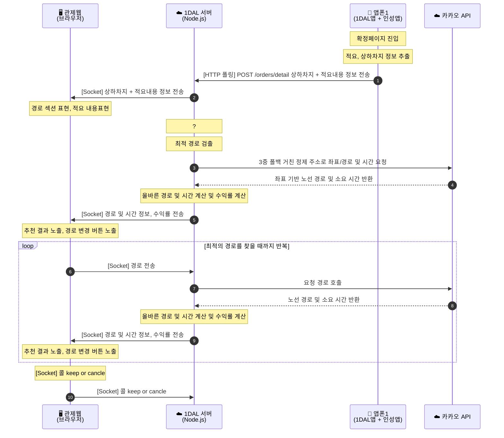

```mermaid
sequenceDiagram
    autonumber
    participant 관제탑 as 🖥️ 관제웹<br/>(브라우저)
    participant 서버 as ☁️ 1DAL 서버<br/>(Node.js)
    participant 앱폰1 as 📱 앱폰1<br/>(1DAL앱 + 인성앱)
    participant 카카오 as ☁️ 카카오 API
    
    
    Note over 앱폰1: 확정페이지 진입
    Note over 앱폰1: 적요, 상하차지 정보 추출
    앱폰1->>서버: [HTTP 폴링] POST /orders/detail 상하차지 + 적요내용 정보 전송
    서버->>관제탑: [Socket] 상하차지 + 적요내용 정보 전송
    Note over 관제탑: 경로 섹션 표현, 적요 내용표현 
    Note over 서버: ?
    Note over 서버: 최적 경로 검출
    서버->>카카오: 3중 폴백 거친 정제 주소로 좌표/경로 및 시간 요청
    카카오-->>서버: 좌표 기반 노선 경로 및 소요 시간 반환
    Note over 서버: 올바른 경로 및 시간 계산 및 수익률 계산
    서버->>관제탑: [Socket] 경로 및 시간 정보, 수익률 전송
    Note over 관제탑: 추천 결과 노출, 경로 변경 버튼 노출
    
    loop 최적의 경로를 찾을 때까지 반복 
        관제탑->>서버: [Socket] 경로 전송
        서버->>카카오: 요청 경로 호출 
        카카오-->>서버: 노선 경로 및 소요 시간 반환
        Note over 서버: 올바른 경로 및 시간 계산 및 수익률 계산
        서버->>관제탑: [Socket] 경로 및 시간 정보, 수익률 전송
        Note over 관제탑: 추천 결과 노출, 경로 변경 버튼 노출

    end   
    Note over 관제탑: [Socket] 콜 keep or cancle 
    관제탑->>서버: [Socket] 콜 keep or cancle

    

    
    
    
    
    
    
    
    
    
    

```