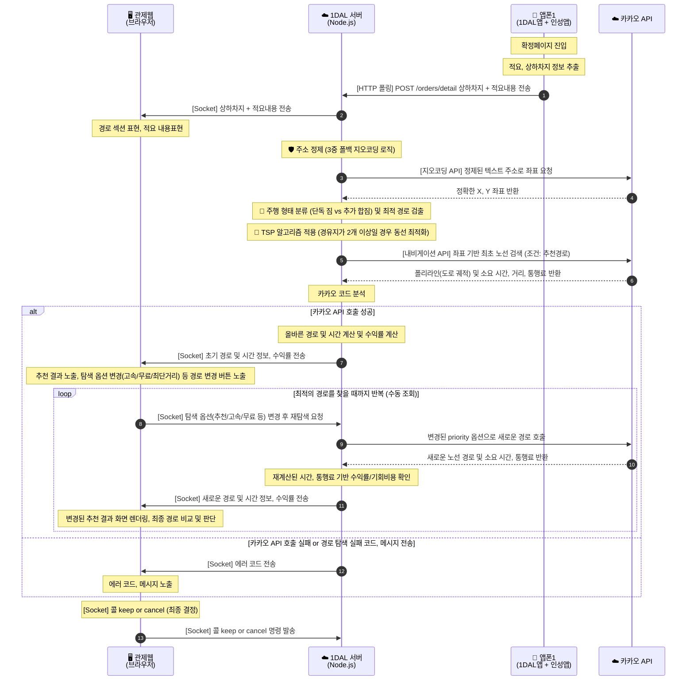

```mermaid
sequenceDiagram
    autonumber
    participant 관제탑 as 🖥️ 관제웹<br/>(브라우저)
    participant 서버 as ☁️ 1DAL 서버<br/>(Node.js)
    participant 앱폰1 as 📱 앱폰1<br/>(1DAL앱 + 인성앱)
    participant 카카오 as ☁️ 카카오 API
    
    Note over 앱폰1: 확정페이지 진입
    Note over 앱폰1: 적요, 상하차지 정보 추출
    앱폰1->>서버: [HTTP 폴링] POST /orders/detail 상하차지 + 적요내용 전송
    서버->>관제탑: [Socket] 상하차지 + 적요내용 전송
    Note over 관제탑: 경로 섹션 표현, 적요 내용표현 
    Note over 서버: 🛡️ 주소 정제 (3중 폴백 지오코딩 로직)
    서버->>카카오: [지오코딩 API] 정제된 텍스트 주소로 좌표 요청
    카카오-->>서버: 정확한 X, Y 좌표 반환
    Note over 서버: 🚙 주행 형태 분류 (단독 짐 vs 추가 합짐) 및 최적 경로 검출
    Note over 서버: 🧩 TSP 알고리즘 적용 (경유지가 2개 이상일 경우 동선 최적화)
    서버->>카카오: [내비게이션 API] 좌표 기반 최초 노선 검색 (조건: 추천경로)
    카카오-->>서버: 폴리라인(도로 궤적) 및 소요 시간, 거리, 통행료 반환
    Note over 서버: 카카오 코드 분석 
    alt 카카오 API 호출 성공
        Note over 서버: 올바른 경로 및 시간 계산 및 수익률 계산
        서버->>관제탑: [Socket] 초기 경로 및 시간 정보, 수익률 전송
        Note over 관제탑: 추천 결과 노출, 탐색 옵션 변경(고속/무료/최단거리) 등 경로 변경 버튼 노출
        loop 최적의 경로를 찾을 때까지 반복 (수동 조회)
            관제탑->>서버: [Socket] 탐색 옵션(추천/고속/무료 등) 변경 후 재탐색 요청
            서버->>카카오: 변경된 priority 옵션으로 새로운 경로 호출 
            카카오-->>서버: 새로운 노선 경로 및 소요 시간, 통행료 반환
            Note over 서버: 재계산된 시간, 통행료 기반 수익률/기회비용 확인
            서버->>관제탑: [Socket] 새로운 경로 및 시간 정보, 수익률 전송
            Note over 관제탑: 변경된 추천 결과 화면 렌더링, 최종 경로 비교 및 판단
        end    
    else 카카오 API 호출 실패 or 경로 탐색 실패 코드, 메시지 전송
        서버->>관제탑: [Socket] 에러 코드 전송 
        Note over 관제탑: 에러 코드, 메시지 노출
    end
    
    
    
    Note over 관제탑: [Socket] 콜 keep or cancel (최종 결정)
    관제탑->>서버: [Socket] 콜 keep or cancel 명령 발송
```