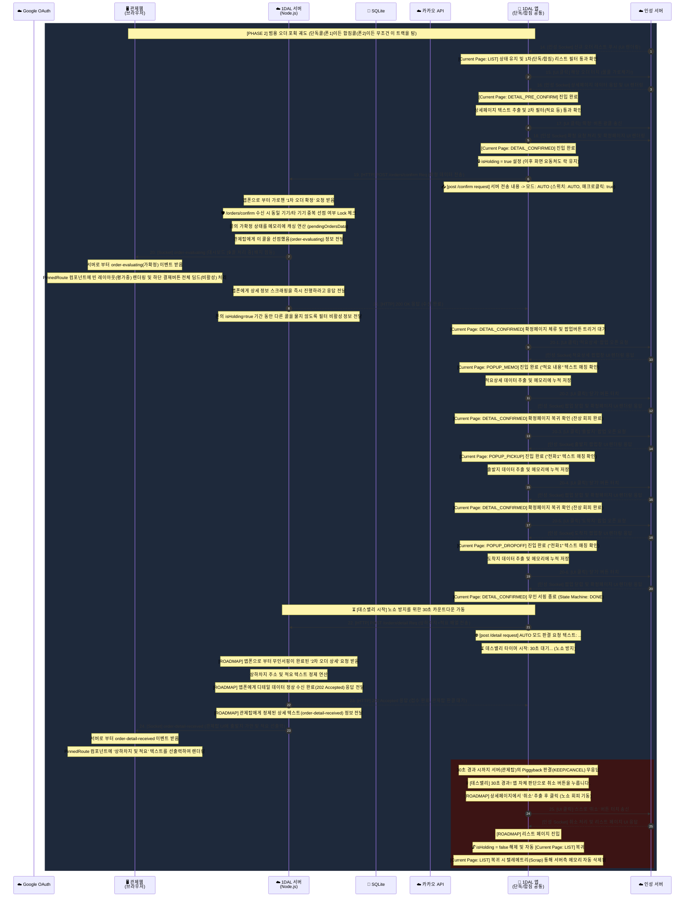

```mermaid
sequenceDiagram
    autonumber
    participant 구글 as ☁️ Google OAuth
    participant 관제탑 as 🖥️ 관제웹<br/>(브라우저)
    participant 서버 as ☁️ 1DAL 서버<br/>(Node.js)
    participant DB as 💾 SQLite
    participant 카카오 as ☁️ 카카오 API
    participant 앱폰 as 📱 1DAL 앱<br/>(단독/합짐 공통)
    participant 인성DB as ☁️ 인성 서버

    
    %% =========================================================
    %% [PHASE 2] 범용 오더 포획 및 무인 서핑 궤도 (단독/합짐 공통 라이프사이클)
    %% =========================================================
    rect rgb(30, 41, 59)
    Note over 관제탑, 앱폰: [PHASE 2] 범용 오더 포획 궤도 (단독콜(폰1)이든 합짐콜(폰2)이든 무조건 이 트랙을 탐)
    
    인성DB-->>앱폰: 14. [인성 Socket] 신규 오더 리스트 푸시 (UI 렌더링)
    Note over 앱폰: [Current Page: LIST] 상태 유지 및 1차(단독/합짐) 리스트 필터 통과 확인
    앱폰->>인성DB: 15. [UI 클릭] 해당 오더 터치 (꿀콜 가로채기!)
    인성DB-->>앱폰: 16. [인성 Socket] 상세페이지 데이터 응답 및 UI 렌더링
    Note over 앱폰: [Current Page: DETAIL_PRE_CONFIRM] 진입 완료
    Note over 앱폰: 상세페이지 텍스트 추출 및 2차 필터(적요 등) 통과 확인
    
    앱폰->>인성DB: 17. [UI 클릭] '확정' 버튼 광클 송신
    앱폰->>인성DB: 18. [인성 Socket] 확정 요청 처리 및 확정페이지 UI 렌더링
    Note over 앱폰: [Current Page: DETAIL_CONFIRMED] 진입 완료
    Note over 앱폰: 🔒 isHolding = true 설정 (이후 화면 요동쳐도 락 유지)
    앱폰->>서버: 19. [HTTP] POST /orders/confirm Req (확정 데이터 전송)
    Note over 앱폰: 📤 [post /confirm request] 서버 전송 내용 -> 모드: AUTO (스위치: AUTO, 매크로클릭: true)
    Note over 서버: 앱폰으로 부터 가로챈 '1차 오더 확정' 요청 받음
    Note over 서버: 🛡️ /orders/confirm 수신 시 동일 기기/타 기기 중복 선점 여부 Lock 체크
    Note over 서버: 콜의 가확정 상태를 메모리에 캐싱 연산 (pendingOrdersData)
    Note over 서버: 관제탑에게 이 콜을 선점했음(order-evaluating) 정보 전달
    서버->>관제탑: 20. [Socket] order-evaluating (대시보드 [🔒 콜 처리 중] 배지 점등)
    Note over 관제탑: 서버로 부터 order-evaluating(가확정) 이벤트 받음
    Note over 관제탑: PinnedRoute 컴포넌트에 빈 레이아웃(평가중) 렌더링 및 하단 결재버튼 전체 딤드(비활성) 처리
    Note over 서버: 앱폰에게 상세 정보 스크래핑을 즉시 진행하라고 응답 전달
    서버-->>앱폰: 21. [HTTP] 200 OK 응답 (수신 완료)
    Note over 서버: 폰의 isHolding=true 기간 동안 다른 콜을 물지 않도록 필터 비활성 정보 전달
    
    %% 서버-->>앱폰: 21-1. [Socket] filter-updated (isActive: false 대기 모드용 빈 필터 발송)
    %% Note over 앱폰: 🏄‍♂️ 무인 서핑 가동 (State Machine: IDLE)
    
    %% 적요상세 스텝
    Note over 앱폰: [Current Page: DETAIL_CONFIRMED] 확정페이지 체류 및 팝업버튼 트리거 대기
    앱폰->>인성DB: 20-1. [UI 클릭] '적요상세' 팝업 오픈 요청
    인성DB-->>앱폰: [인성 Socket] 적요상세 팝업창 UI 렌더링 응답
    Note over 앱폰: [Current Page: POPUP_MEMO] 진입 완료 ("적요 내용" 텍스트 매칭 확인)
    Note over 앱폰: 적요상세 데이터 추출 및 메모리에 누적 저장
    앱폰->>인성DB: 20-2. [UI 클릭] '닫기' 버튼 터치
    인성DB-->>앱폰: [인성 Socket] 팝업 닫힘 및 확정페이지 UI 렌더링 응답
    
    %% 출발지 스텝
    Note over 앱폰: [Current Page: DETAIL_CONFIRMED] 확정페이지 복귀 확인 (잔상 회피 완료)
    앱폰->>인성DB: 20-3. [UI 클릭] '출발지' 팝업 오픈 요청
    인성DB-->>앱폰: [인성 Socket] 출발지 팝업창 UI 렌더링 응답
    Note over 앱폰: [Current Page: POPUP_PICKUP] 진입 완료 ("전화1" 텍스트 매칭 확인)
    Note over 앱폰: 출발지 데이터 추출 및 메모리에 누적 저장
    앱폰->>인성DB: 20-4. [UI 클릭] '닫기' 버튼 터치
    인성DB-->>앱폰: [인성 Socket] 팝업 닫힘 및 확정페이지 UI 렌더링 응답
    
    %% 도착지 스텝
    Note over 앱폰: [Current Page: DETAIL_CONFIRMED] 확정페이지 복귀 확인 (잔상 회피 완료)
    앱폰->>인성DB: 20-5. [UI 클릭] '도착지' 팝업 오픈 요청
    인성DB-->>앱폰: [인성 Socket] 도착지 팝업창 UI 렌더링 응답
    Note over 앱폰: [Current Page: POPUP_DROPOFF] 진입 완료 ("전화1" 텍스트 매칭 확인)
    Note over 앱폰: 도착지 데이터 추출 및 메모리에 누적 저장
    앱폰->>인성DB: 20-6. [UI 클릭] '닫기' 버튼 터치
    인성DB-->>앱폰: [인성 Socket] 팝업 닫힘 및 확정페이지 UI 렌더링 응답
    
    Note over 앱폰: [Current Page: DETAIL_CONFIRMED] 무인 서핑 종료 (State Machine: DONE)
    
    Note over 앱폰, 서버: ⏳ [데스밸리 시작] 노쇼 방지를 위한 30초 카운트다운 가동
    앱폰->>서버: 22. [HTTP] POST /orders/detail Req (상하차지+적요 배열 전송)
    Note over 앱폰: 🌐 [post /detail request] AUTO 모드 판결 요청 텍스트: ...
    Note over 앱폰: ⏳ 데스밸리 타이머 시작: 30초 대기... (노쇼 방지)
    Note over 서버: [ROADMAP] 앱폰으로 부터 무인서핑이 완료된 '2차 오더 상세' 요청 받음
    Note over 서버: 상하차지 주소 및 적요 텍스트 정제 연산
    Note over 서버: [ROADMAP] 앱폰에게 디테일 데이터 정상 수신 완료(202 Accepted) 응답 전달
    서버-->>앱폰: 23. [HTTP] 202 Accepted 응답 (접수 완료, 관제탑 판결 대기)
    Note over 서버: [ROADMAP] 관제탑에게 정제된 상세 텍스트(order-detail-received) 정보 전달
    서버->>관제탑: 24. [Socket] order-detail-received (관제탑 UI에 출발지 가안 및 적요 선출력)
    Note over 관제탑: 서버로 부터 order-detail-received 이벤트 받음
    Note over 관제탑: PinnedRoute 컴포넌트에 '상하차지 및 적요' 텍스트를 선출력하여 렌더링
    
    rect rgb(60, 20, 20)
    
    Note over 앱폰: 30초 경과 시까지 서버(관제탑)의 Piggyback 판결(KEEP/CANCEL) 무응답
    Note over 앱폰: 💀 [데스밸리] 30초 경과! 앱 자체 판단으로 취소 버튼을 누릅니다.
    Note over 앱폰: [ROADMAP] 상세페이지에서 '취소' 추출 후 클릭 (노쇼 회피 기동)
    앱폰->>인성DB: 25. [UI 클릭] 스스로 '취소' 버튼 터치 송신
    인성DB-->>앱폰: [인성 Socket] 취소 처리 및 리스트 페이지 UI 응답
    Note over 앱폰: [ROADMAP] 리스트 페이지 진입
    Note over 앱폰: 🔓 isHolding = false 해제 및 자동 [Current Page: LIST] 복귀
    Note over 앱폰: [Current Page: LIST] 복귀 시 텔레메트리(Scrap) 통해 서버측 메모리 자동 삭제됨
    end
    end
```
