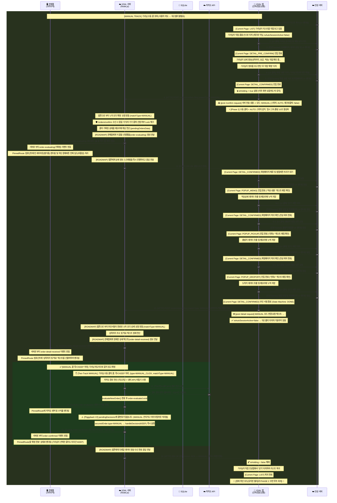

```mermaid
sequenceDiagram
    autonumber
    participant 관제탑 as 🖥️ 관제웹<br/>(브라우저)
    participant 서버 as ☁️ 1DAL 서버<br/>(Node.js)
    participant DB as 💾 SQLite
    participant 카카오 as ☁️ 카카오 API
    participant 앱폰 as 📱 1DAL 앱<br/>(단독/합짐 공통)
    participant 인성DB as ☁️ 인성 서버

    %% =========================================================
    %% [MANUAL TRACK] 기사님이 폰에서 손으로 잡은 콜 (데스밸리 없음)
    %% =========================================================
    rect rgb(40, 50, 30)
        Note over 관제탑, 앱폰: [MANUAL TRACK] 기사님 수동 콜 포획 (사용자 의도 → 데스밸리 불필요)

        인성DB-->>앱폰: 1. [인성 Socket] 신규 오더 리스트 푸시 (UI 렌더링)
        Note over 앱폰: [Current Page: LIST] 기사님이 리스트를 직접 보고 있음
        Note over 앱폰: 기사님이 직접 콜을 손으로 터치 (매크로 아님, isAutoSessionActive=false)
        앱폰->>인성DB: 2. [UI 클릭] 기사님 손가락으로 해당 오더 터치
        인성DB-->>앱폰: 3. [인성 Socket] 상세페이지 데이터 응답 및 UI 렌더링
        Note over 앱폰: [Current Page: DETAIL_PRE_CONFIRM] 진입 완료
        Note over 앱폰: 기사님이 상세 정보(상하차지, 요금, 적요) 직접 확인 중...

        Note over 앱폰: 기사님이 정보를 보고 판단 후 직접 '확정' 터치
        앱폰->>인성DB: 4. [UI 클릭] '확정' 버튼 터치 (기사님 의도에 의한 확정)
        인성DB-->>앱폰: 5. [인성 Socket] 확정 요청 처리 및 확정페이지 UI 렌더링
        Note over 앱폰: [Current Page: DETAIL_CONFIRMED] 진입 완료
        Note over 앱폰: 🔒 isHolding = true 설정 (이후 화면 요동쳐도 락 유지)

        %% /confirm 서버 전송
        앱폰->>서버: 6. [HTTP] POST /orders/confirm Req (matchType: MANUAL)
        Note over 앱폰: 📤 [post /confirm request] 서버 전송 내용 -> 모드: MANUAL (스위치: AUTO, 매크로클릭: false)
        Note over 앱폰: ⚡ [Phase 2] 수동 클릭 + AUTO 스위치 감지. 임시 고속 폴링 10초 활성화
        Note over 서버: 앱폰으로 부터 '1차 오더 확정' 요청 받음 (matchType=MANUAL)
        Note over 서버: 🛡️ /orders/confirm 수신 시 동일 기기/타 기기 중복 선점 여부 Lock 체크
        Note over 서버: 콜의 가확정 상태를 메모리에 캐싱 연산 (pendingOrdersData)
        Note over 서버: [ROADMAP] 관제탑에게 이 콜을 선점했음(order-evaluating) 정보 전달
        서버->>관제탑: 7. [Socket] order-evaluating (대시보드 [🔒 콜 처리 중] 배지 점등)
        Note over 관제탑: 서버로 부터 order-evaluating(가확정) 이벤트 받음
        Note over 관제탑: PinnedRoute 컴포넌트에 빈 레이아웃(평가중) 렌더링 및 하단 결재버튼 전체 딤드(비활성) 처리
        Note over 서버: [ROADMAP] 앱폰에게 상세 정보 스크래핑을 즉시 진행하라고 응답 전달
        서버-->>앱폰: 8. [HTTP] 200 OK 응답 (수신 완료)

        %% 무인 서핑 (매크로가 팝업 순회하며 상세 데이터 수집)
        Note over 앱폰: [Current Page: DETAIL_CONFIRMED] 확정페이지 체류 및 팝업버튼 트리거 대기
        앱폰->>인성DB: 9-1. [UI 클릭] '적요상세' 팝업 오픈 요청
        인성DB-->>앱폰: [인성 Socket] 적요상세 팝업창 UI 렌더링 응답
        Note over 앱폰: [Current Page: POPUP_MEMO] 진입 완료 ("적요 내용" 텍스트 매칭 확인)
        Note over 앱폰: 적요상세 데이터 추출 및 메모리에 누적 저장
        앱폰->>인성DB: 9-2. [UI 클릭] '닫기' 버튼 터치
        인성DB-->>앱폰: [인성 Socket] 팝업 닫힘 및 확정페이지 UI 렌더링 응답

        Note over 앱폰: [Current Page: DETAIL_CONFIRMED] 확정페이지 복귀 확인 (잔상 회피 완료)
        앱폰->>인성DB: 9-3. [UI 클릭] '출발지' 팝업 오픈 요청
        인성DB-->>앱폰: [인성 Socket] 출발지 팝업창 UI 렌더링 응답
        Note over 앱폰: [Current Page: POPUP_PICKUP] 진입 완료 ("전화1" 텍스트 매칭 확인)
        Note over 앱폰: 출발지 데이터 추출 및 메모리에 누적 저장
        앱폰->>인성DB: 9-4. [UI 클릭] '닫기' 버튼 터치
        인성DB-->>앱폰: [인성 Socket] 팝업 닫힘 및 확정페이지 UI 렌더링 응답

        Note over 앱폰: [Current Page: DETAIL_CONFIRMED] 확정페이지 복귀 확인 (잔상 회피 완료)
        앱폰->>인성DB: 9-5. [UI 클릭] '도착지' 팝업 오픈 요청
        인성DB-->>앱폰: [인성 Socket] 도착지 팝업창 UI 렌더링 응답
        Note over 앱폰: [Current Page: POPUP_DROPOFF] 진입 완료 ("전화1" 텍스트 매칭 확인)
        Note over 앱폰: 도착지 데이터 추출 및 메모리에 누적 저장
        앱폰->>인성DB: 9-6. [UI 클릭] '닫기' 버튼 터치
        인성DB-->>앱폰: [인성 Socket] 팝업 닫힘 및 확정페이지 UI 렌더링 응답

        Note over 앱폰: [Current Page: DETAIL_CONFIRMED] 무인 서핑 종료 (State Machine: DONE)

        %% /detail 서버 전송 (데스밸리 없음!)
        앱폰->>서버: 10. [HTTP] POST /orders/detail Req (matchType: MANUAL, 상하차지+적요 배열 전송)
        Note over 앱폰: 🌐 [post /detail request] MANUAL 모드 판결 요청 텍스트: ...
        Note over 앱폰: ✅ isAutoSessionActive=false → 데스밸리 타이머 가동하지 않음
        Note over 서버: [ROADMAP] 앱폰으로 부터 무인서핑이 완료된 '2차 오더 상세' 요청 받음 (matchType=MANUAL)
        Note over 서버: 상하차지 주소 및 적요 텍스트 정제 연산
        Note over 서버: [ROADMAP] 관제탑에게 정제된 상세 텍스트(order-detail-received) 정보 전달
        서버->>관제탑: 11. [Socket] order-detail-received (관제탑 UI에 출발지 가안 및 적요 선출력)
        Note over 관제탑: 서버로 부터 order-detail-received 이벤트 받음
        Note over 관제탑: PinnedRoute 컴포넌트에 '상하차지 및 적요' 텍스트를 선출력하여 렌더링

        rect rgb(30, 60, 30)
            Note over 서버, 관제탑: ✅ [MANUAL 콜 즉시 KEEP 처리] 기사님 의도이므로 묻지 않고 확정
            Note over 서버: ✋ [Two-Track MANUAL] 기사님 수동 클릭 콜. 즉시 KEEP 처리. (type=MANUAL_CLICK, matchType=MANUAL)
            Note over 서버: 카카오 경로 연산 (지오코딩 + 내비 API) 비동기 수행
            서버->>카카오: 12. [지오코딩+내비 API] 경로 연산 요청
            카카오-->>서버: 13. 경로 결과 반환 (폴리라인, 소요시간, 통행료)
            Note over 서버: evaluateNewOrder() 완료 후 order-evaluated emit
            서버->>관제탑: 14. [Socket] order-evaluated (경로+수익률 정보)
            Note over 관제탑: PinnedRoute에 카카오 궤적 및 수익률 렌더링
            Note over 서버: ⚠️ [Piggyback V2] pendingDecisions에 콜번호가 없습니다. (MANUAL 건이거나 이미 타임아웃 처리됨)
            Note over 서버: securedOrder.type=MANUAL → handleDecision(KEEP) 즉시 실행
            서버->>관제탑: 15. [Socket] order-confirmed (대시보드에 KEEP 확정 렌더링)
            Note over 관제탑: 서버로 부터 order-confirmed 이벤트 받음
            Note over 관제탑: PinnedRoute를 '확정 완료' 상태로 렌더링 (기사님이 선택한 콜이니 무조건 KEEP)
        end

        Note over 서버: [ROADMAP] 앱폰에게 디테일 데이터 정상 수신 완료 응답 전달
        서버-->>앱폰: 16. [HTTP] 200 OK 응답 (Action: ACK — MANUAL 콜 즉시 확정 완료)
        Note over 앱폰: 🔓 isHolding = false 해제
        Note over 앱폰: 기사님이 직접 인성앱에서 '닫기' 터치하여 리스트 복귀
        Note over 앱폰: [Current Page: LIST] 복귀 완료
        Note over 앱폰: 🔄 [원래 하던 모드(유지된 필터)로 PHASE 2 무한 루프 회귀] 🔄
    end
```
