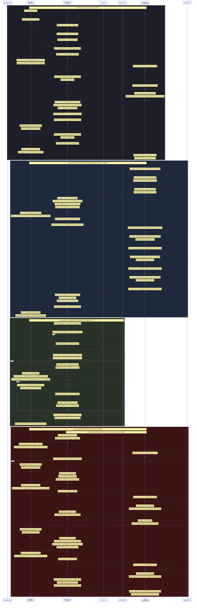

```mermaid
sequenceDiagram
    autonumber
    participant 구글 as ☁️ Google OAuth
    participant 관제탑 as 🖥️ 관제웹<br/>(브라우저)
    participant 서버 as ☁️ 1DAL 서버<br/>(Node.js)
    participant DB as 💾 SQLite
    participant 카카오 as ☁️ 카카오 API
    participant 앱폰 as 📱 1DAL 앱<br/>(단독/합짐 공통)
    participant 인성DB as ☁️ 인성 서버

    %% =========================================================
    %% [PHASE 1] 인증 및 환경 세팅
    %% =========================================================
    rect rgb(30, 30, 40)
    Note over 관제탑, 앱폰: [PHASE 1] Oauth 인증, 필터 초기화 및 기기 접속
    
    Note over 관제탑: 유저가 구글 로그인 버튼 클릭 
    관제탑->>구글: 1. 구글 로그인 버튼 클릭
    구글-->>관제탑: 2. credential (id_token) 반환
    Note over 관제탑: 서버에게 구글 인증(id_token) 정보 전달
    관제탑->>서버: 3. POST /api/auth/google
    Note over 서버: 관제탑으로 부터 구글 로그인 토큰 검증 요청 받음
    서버->>구글: 4. 토큰 위조 검증 (google-auth-library)
    구글-->>서버: 5. 검증 완료 (email, sub 반환)
    Note over 서버: email 바탕으로 접속 유저 정보 DB 조회/생성 연산
    서버->>DB: 6. users 및 user_settings 생성/조회
    Note over 서버: 관제탑에게 인증 JWT Token 발급 및 정보 전달
    서버-->>관제탑: 7. JWT Token (Access/Refresh) 발급
    관제탑->>서버: 8. [Socket] 웹 소켓 실시간 통신 연결
    Note over 서버: 관제탑 소켓 접속 완료 및 기사의 기본 필터 DB Lazy Load 연산
    서버->>DB: 9. 기사의 디폴트 필터 옵션 Lazy Load
    Note over 서버: 관제탑에게 초기 UI 복원용 필터(filter-init) 정보 전달
    서버-->>관제탑: 10. [Socket] filter-init (프론트 UI 복원)
    Note over 관제탑: 서버로 부터 filter-init 초기 필터값(isSharedMode, distance 등) 받음
    Note over 관제탑: OrderFilterStatus 컴포넌트에 현재 설정된 렌즈값 문자열로 렌더링
    
    Note over 앱폰: [Current Page: MainActivity] 1DAL 앱 실행 및 초기 설정
    앱폰->>앱폰: 배터리 최적화 예외 권한 획득
    앱폰->>서버: 기기 연동 PIN 번호 입력 및 인증 요청 (Device Pairing)
    Note over 서버: 앱폰으로 부터 6자리 PIN 인증 요청 받음 및 deviceId 발급 연산
    Note over 서버: 승인된 디바이스 정보 DB 저장
    서버-->>앱폰: 인증 성공 및 고유 deviceId 발급/저장
    Note over 앱폰: 앱 기동 전 또는 백그라운드 ➡️ [Current Page: UNKNOWN]
    앱폰->>앱폰: 안드로이드 환경설정 진입하여 '1DAL 접근성 서비스' 활성화 (HijackService 기동)
    Note over 앱폰: 📍 백그라운드 Telemetry (lat, lng) 획득 엔진 가동!
    
    Note over 앱폰: 🛡️ 파싱된 콜 객체의 (출발지+도착지+요금) 해시값 생성 및 중복 캐시 비교 (디바운스 300ms)
    앱폰->>서버: 11. [HTTP] POST /api/scrap Req (isHolding+GPS 및 방대한 탈락 콜 배열)
    Note over 서버: 앱폰으로 부터 무수한 스크랩(intel) 데이터 및 GPS 요청 받음
    Note over 서버: 🛡️ /api/scrap 수신 시 서버단 중복 해시 제거 및 유효 콜 필터링 연산
    Note over 서버: 방대한 스크랩 배열값을 intel 테이블 DB 저장
    서버->>DB: 11-1. [비동기 Queue] 수천 개의 탈락 콜(intel 테이블) 빅데이터 오답노트 적재
    Note over 서버: 관제탑에게 실시간 마커용 GPS(device-sessions-updated) 정보 전달
    서버->>관제탑: 12. [Socket] device-sessions-updated (지도에 기사 GPS 마커 렌더링)
    Note over 서버: 앱폰에게 최신 필터(dispatchEngineArgs) 및 제어 명령 정보 전달
    서버-->>앱폰: 13. [HTTP] 200 OK 응답 (최신 사냥 필터 payload 및 deviceMode 주입)
    
    %% 관제탑 필터 수동 조작
    Note over 관제탑: 설정 모달창 열고 새 필터값 입력 후 '저장' 버튼 클릭
    Note over 관제탑: 서버에게 새로 작성한 update-filter 정보 전달
    관제탑->>서버: 13-1. [Socket] update-filter (관제원이 필터/옵션 조작 시)
    Note over 서버: 관제탑으로 부터 필터 변경(update-filter) 요청 받음 및 파싱 연산
    Note over 서버: 새로 바뀐 필터 상태값 DB 저장
    서버->>DB: 13-2. [DB] user_filters 테이블 업데이트 (영구 저장)
    Note over 서버: 관제탑에게 변경 적용된 필터(filter-updated) 정보 전달
    서버-->>관제탑: 13-3. [Socket] filter-updated (UI 즉각 동기화)
    Note over 관제탑: 서버로 부터 filter-updated 소켓 이벤트 받음
    Note over 관제탑: OrderFilterStatus 컴포넌트에 즉각 필터 갱신 및 UI 리렌더링
    
    Note over 앱폰: 인성앱 콜 리스트 렌더링 ➡️ [Current Page: LIST] 진입
    Note over 앱폰: 안드로이드 자체 메모리에 필터 캐싱 완료 및 대기
    end

    %% =========================================================
    %% [PHASE 2] 범용 오더 포획 및 무인 서핑 궤도 (단독/합짐 공통 라이프사이클)
    %% =========================================================
    rect rgb(30, 41, 59)
    Note over 관제탑, 앱폰: [PHASE 2] 범용 오더 포획 궤도 (단독콜(폰1)이든 합짐콜(폰2)이든 무조건 이 트랙을 탐)
    
    인성DB-->>앱폰: 14. [인성 Socket] 신규 오더 리스트 푸시 (UI 렌더링)
    Note over 앱폰: [Current Page: LIST] 상태 유지 및 1차(단독/합짐) 리스트 필터 통과 확인
    앱폰->>인성DB: 15. [UI 클릭] 해당 오더 터치 (꿀콜 가로채기!)
    인성DB-->>앱폰: 16. [인성 Socket] 상세페이지 데이터 응답 및 UI 렌더링
    Note over 앱폰: [Current Page: DETAIL_PRE_CONFIRM] 진입 완료
    Note over 앱폰: 상세페이지 텍스트 추출 및 2차 필터(적요 등) 통과 확인
    
    앱폰->>인성DB: 17. [UI 클릭] '확정' 버튼 광클 송신
    앱폰->>인성DB: 18. [인성 Socket] 확정 요청 처리 및 확정페이지 UI 렌더링
    Note over 앱폰: [Current Page: DETAIL_CONFIRMED] 진입 완료
    Note over 앱폰: 🔒 isHolding = true 설정 (이후 화면 요동쳐도 락 유지)
    앱폰->>서버: 19. [HTTP] POST /orders/confirm Req (확정 데이터 전송)
    Note over 서버: 앱폰으로 부터 가로챈 '1차 오더 확정' 요청 받음
    Note over 서버: 🛡️ /orders/confirm 수신 시 동일 기기/타 기기 중복 선점 여부 Lock 체크
    Note over 서버: 콜의 가확정 상태를 메모리에 캐싱 연산 (pendingOrdersData)
    Note over 서버: 관제탑에게 이 콜을 선점했음(order-evaluating) 정보 전달
    서버->>관제탑: 20. [Socket] order-evaluating (대시보드 [🔒 콜 처리 중] 배지 점등)
    Note over 관제탑: 서버로 부터 order-evaluating(가확정) 이벤트 받음
    Note over 관제탑: PinnedRoute 컴포넌트에 빈 레이아웃(평가중) 렌더링 및 하단 결재버튼 전체 딤드(비활성) 처리
    Note over 서버: 앱폰에게 상세 정보 스크래핑을 즉시 진행하라고 응답 전달
    서버-->>앱폰: 21. [HTTP] 200 OK 응답 (수신 완료)
    Note over 서버: 폰의 isHolding=true 기간 동안 다른 콜을 물지 않도록 필터 비활성 정보 전달
    
    %% 서버-->>앱폰: 21-1. [Socket] filter-updated (isActive: false 대기 모드용 빈 필터 발송)
    %% Note over 앱폰: 🏄‍♂️ 무인 서핑 가동 (State Machine: IDLE)
    
    %% 적요상세 스텝
    Note over 앱폰: [Current Page: DETAIL_CONFIRMED] 확정페이지 체류 및 팝업버튼 트리거 대기
    앱폰->>인성DB: 20-1. [UI 클릭] '적요상세' 팝업 오픈 요청
    인성DB-->>앱폰: [인성 Socket] 적요상세 팝업창 UI 렌더링 응답
    Note over 앱폰: [Current Page: POPUP_MEMO] 진입 완료 ("적요 내용" 텍스트 매칭 확인)
    Note over 앱폰: 적요상세 데이터 추출 및 메모리에 누적 저장
    앱폰->>인성DB: 20-2. [UI 클릭] '닫기' 버튼 터치
    인성DB-->>앱폰: [인성 Socket] 팝업 닫힘 및 확정페이지 UI 렌더링 응답
    
    %% 출발지 스텝
    Note over 앱폰: [Current Page: DETAIL_CONFIRMED] 확정페이지 복귀 확인 (잔상 회피 완료)
    앱폰->>인성DB: 20-3. [UI 클릭] '출발지' 팝업 오픈 요청
    인성DB-->>앱폰: [인성 Socket] 출발지 팝업창 UI 렌더링 응답
    Note over 앱폰: [Current Page: POPUP_PICKUP] 진입 완료 ("전화1" 텍스트 매칭 확인)
    Note over 앱폰: 출발지 데이터 추출 및 메모리에 누적 저장
    앱폰->>인성DB: 20-4. [UI 클릭] '닫기' 버튼 터치
    인성DB-->>앱폰: [인성 Socket] 팝업 닫힘 및 확정페이지 UI 렌더링 응답
    
    %% 도착지 스텝
    Note over 앱폰: [Current Page: DETAIL_CONFIRMED] 확정페이지 복귀 확인 (잔상 회피 완료)
    앱폰->>인성DB: 20-5. [UI 클릭] '도착지' 팝업 오픈 요청
    인성DB-->>앱폰: [인성 Socket] 도착지 팝업창 UI 렌더링 응답
    Note over 앱폰: [Current Page: POPUP_DROPOFF] 진입 완료 ("전화1" 텍스트 매칭 확인)
    Note over 앱폰: 도착지 데이터 추출 및 메모리에 누적 저장
    앱폰->>인성DB: 20-6. [UI 클릭] '닫기' 버튼 터치
    인성DB-->>앱폰: [인성 Socket] 팝업 닫힘 및 확정페이지 UI 렌더링 응답
    
    Note over 앱폰: [Current Page: DETAIL_CONFIRMED] 무인 서핑 종료 (State Machine: DONE)
    
    앱폰->>서버: 22. [HTTP] POST /orders/detail Req (상하차지+적요 배열 전송)
    Note over 서버: 앱폰으로 부터 무인서핑이 완료된 '2차 오더 상세' 요청 받음
    Note over 서버: 상하차지 주소 및 적요 텍스트 정제 연산
    Note over 서버: 앱폰에게 디테일 데이터 정상 수신 완료 응답 전달
    서버-->>앱폰: 23. [HTTP] 200 OK 응답 (텔레메트리 접수 완료)
    Note over 서버: 관제탑에게 정제된 상세 텍스트(order-detail-received) 정보 전달
    서버->>관제탑: 24. [Socket] order-detail-received (관제탑 UI에 출발지 가안 및 적요 선출력)
    Note over 관제탑: 서버로 부터 order-detail-received 이벤트 받음
    Note over 관제탑: PinnedRoute 컴포넌트에 '상하차지 및 적요' 텍스트를 선출력하여 렌더링
    end

    %% =========================================================
    %% [PHASE 3] 서버 판독 및 관제 결재 (데이터를 받은 서버의 역할)
    %% =========================================================
    rect rgb(40, 50, 40)
    Note over 관제탑, 카카오: [PHASE 3] 카카오 수익성/패널티 연산 및 관제탑 결재 (서버/관제 책임 구간)
    
    Note over 서버: 🛡️ 주소 3중 폴백 (괄호제거 ➡️ 주소검색 ➡️ 키워드 ➡️ 절사) 연산
    서버->>카카오: 25. [지오코딩 API] 정제 텍스트로 정확한 좌표 요청
    카카오-->>서버: 26. 정확한 상하차지 X, Y 좌표 반환
    Note over 서버: 카카오 지오코딩으로 반환된 출발지/도착지 X/Y 좌표 메모리 갱신 연산
    
    alt 1DAL 앱이 '단독콜 모드'일 때 ➡️ 일반 수익률 연산
        서버->>카카오: 27. [내비 API] 단독 2점 노선 검색 (조건: 추천경로)
        카카오-->>서버: 28. 도착시간, 궤적, 거리, 통행료 반환
        Note over 서버: 시간/통행료를 바탕으로 콜의 실수익률(기회비용) 연산
    else 1DAL 앱이 '합짐콜 모드'일 때 ➡️ 합짐 패널티 우회 연산
        서버->>카카오: 27-1. 기존 콜 궤적 사이에 새 합짐지(경유지)를 끼워넣어 다중 TSP 연산
        카카오-->>서버: 28-1. 우회 노선 결과 반환
        Note over 서버: 🛡️ 우회 노선 산출 시, 기존 회랑 반경(corridor_radius) 이탈 여부 확인
        Note over 서버: 기존 직진 시 대비 추가 소모 시간(+15분) 및 거리(+6km) 패널티 산출
    end
    
    alt 카카오 경로 탐색 성공
        Note over 서버: 경로 폴리라인 및 최종 수익성(콜/꿀/똥) 라벨링 연산
        Note over 서버: 관제탑에게 최종 판독된 오더 정보(order-evaluated) 전달
        서버->>관제탑: 29. [Socket] order-evaluated (초기 경로 정밀 정보 및 수익률/패널티 전송)
        Note over 관제탑: 서버로 부터 order-evaluated 이벤트 받음
        Note over 관제탑: PinnedRoute 내 캔버스 미니맵 좌표 포커싱 및 카카오 궤적(폴리라인) 드로잉 처리
        Note over 관제탑: 예상 시간/수익률을 컴포넌트에 표시하고 결재버튼(KEEP/CANCEL) 즉시 딤드 해제(활성화)
        
        loop 더 나은 우회로 탐색을 위한 수동 재조회 (Optional)
            Note over 관제탑: PinnedRoute 하단의 네비게이션 옵션(추천/최단/무료) 버튼 클릭
            Note over 관제탑: 서버에게 recalculate-route 우회로 연산 요청 전달
            관제탑->>서버: 30. 옵션(고속/무료/최단) 변경 후 [Socket] recalculate-route 요청
            Note over 서버: 관제탑으로 부터 경로 재탐색(recalculate-route) 요청 받음
            서버->>카카오: 31. [내비 재요청] Priority 변경
            카카오-->>서버: 32. 신규 노선 데이터
            Note over 서버: 재탐색 결과로 폴리라인 및 소요시간 갱신 연산
            Note over 서버: 관제탑에게 재산출된 노선(order-evaluated) 정보 전달
            서버->>관제탑: 33. [Socket] order-evaluated (렌더링 갱신)
        end
    else 카카오 API 탐색 에러 발생 시
        Note over 서버: 🛡️ 카카오 API Rate Limit(초당 호출 제한) 임박 여부 모니터링 연산
        Note over 서버: 관제탑에게 카카오 에러 상태(order-evaluated error) 정보 전달
        서버->>관제탑: 29-1. [Socket] order-evaluated (에러 메시지 및 판독 불가 알람)
        Note over 관제탑: UI 상단에 에러 배너 렌더링 및 카카오맵 불가 상태를 PinnedRoute 에 표현
    end
    end

    %% =========================================================
    %% [PHASE 4] 판결 집행 및 사냥망 복귀 (명령을 받은 앱의 역할)
    %% =========================================================
    rect rgb(60, 20, 20)
    Note over 관제탑, 앱폰: [PHASE 4] 판결 하달에 따른 1DAL 앱의 즉각 행동 및 사냥망 복귀
    
    %% 데스밸리 방어기동 (→ 상세는 safety_mode_architecture.md "데스밸리 SSOT" 참조)
    Note over 서버, 앱폰: ⏳ [데스밸리 3중 방어망] (서버측 30초 경고 + 35초 타임아웃 ➡️ 앱측 30초 강제취소)
    Note over 서버: 데스밸리 30초 카운트다운 타이머 감시 연산
    Note over 서버: 관제탑에게 지연 위급 상황(deathvalley-warning) 정보 전달
    서버->>관제탑: 33-1. (요청 후 15초 경과 시) [Socket] deathvalley-warning (관제 지연 경고 팝업)
    Note over 관제탑: 서버로 부터 deathvalley-warning 소켓 경고 이벤트 받음
    Note over 관제탑: 상단 비상 알림 배너 팝업 및 타이머 카운트다운 컴포넌트 텍스트 붉은색 렌더링
    앱폰->>인성DB: 34-1. (요청 후 30초 연속 서버/관제 무응답 시) [인성 Socket] 앱 자체 판단으로 비상 취소 유발
    Note over 앱폰: 🔓 isHolding = false 해제 및 자동 [Current Page: LIST] 복귀
    앱폰->>서버: 34-2. [HTTP 폴링] 비상 취소 상태 통보
    Note over 서버: 앱폰으로 부터 비상 취소상태 원격 통보 받음 및 메모리 비우기 연산
    
    alt 취소를 하달받은 경우 (Cancel)
        Note over 관제탑: PinnedRoute에서 CANCEL(취소) 또는 X 버튼 클릭
        Note over 관제탑: 서버에게 decision=CANCEL 하달 정보 전달
        관제탑->>서버: 35. [Socket] decision=CANCEL 판결 하달 (혹은 데스밸리로 인한 강제 취소)
        Note over 서버: 관제탑으로 부터 Cancel 결재 요청 받음
        Note over 서버: 취소된 콜을 메모리 큐에서 삭제 처리 연산
        Note over 서버: 관제탑에게 콜이 삭제되었음(order-canceled) 정보 전달
        서버->>관제탑: 35-1. [Socket] order-canceled (대시보드 메인 메모리에서 콜 삭제 마무리)
        Note over 관제탑: 서버로 부터 order-canceled 소켓 이벤트 받음
        Note over 관제탑: PinnedRoute 아코디언 컴포넌트를 강제 삭제하고 초기 관제대기 Empty State 화면 렌더링
        Note over 서버: 앱폰에게 Action=Cancel 최종 판결 응답 전달
        서버-->>앱폰: 36. [HTTP] 응답으로 Action=Cancel 명령 수신
        Note over 앱폰: [Current Page: DETAIL_CONFIRMED] 체류 상태 확인
        앱폰->>인성DB: 37. [UI 클릭] 즉각 '취소' 버튼 터치 송신
        인성DB-->>앱폰: [인성 Socket] 취소 정보 서버처리 후 리스트 페이지 응답
        Note over 앱폰: [Current Page: LIST] 로 복귀 렌더링 완료
        Note over 앱폰: 🛡️ [Current Page: LIST] 복귀 후 앱 내부의 scrapBuffer 초기화 및 강제 플러시
        Note over 서버: 기존 디폴트 설정값으로 필터 복구 연산
        Note over 서버: 앱폰 및 관제탑에게 원상복구된 필터(filter-updated) 정보 전달
        서버-->>앱폰: 37-1. [Socket] filter-updated (기존 단독/합짐 렌즈 복원)
        Note over 앱폰: 🔓 isHolding = false 락 해제 완료
        Note over 앱폰: 🔄 [원래 하던 모드(유지된 필터)로 PHASE 2 무한 루프 회귀] 🔄
        
    else 유지를 하달받은 경우 (Keep)
        Note over 관제탑: PinnedRoute에서 KEEP(사냥 확정) 녹색 버튼 클릭
        Note over 관제탑: 서버에게 decision=KEEP 하달 정보 전달
        관제탑->>서버: 35. [Socket] decision=KEEP 판결 하달
        Note over 서버: 관제탑으로 부터 Keep 결재 요청 받음
        Note over 서버: 해당 콜을 '메인콜' (또는 서브콜) 로 승격 및 병합 궤적 생성 연산
        Note over 서버: 🛡️ 결재 완료 후 해당 오더 객체의 생명주기(TTL) 만료 처리 및 캐시 삭제
        Note over 서버: 관제탑에게 확정되었음(order-confirmed) 정보 전달
        서버->>관제탑: 35-2. [Socket] order-confirmed (대시보드를 '합짐 모드'로 격상 고정)
        Note over 관제탑: 서버로 부터 order-confirmed 소켓 이벤트 받음
        Note over 관제탑: PinnedRoute 레이아웃을 합짐/무한 궤도 모드로 격상 렌더링 및 딤드 다시 처리
        Note over 서버: 앱폰에게 Action=Keep 최종 판결 응답 전달
        서버-->>앱폰: 36. [HTTP] 응답으로 Action=Keep 명령 수신
        Note over 앱폰: [Current Page: DETAIL_CONFIRMED] 체류 상태 확인
        앱폰->>인성DB: 37. [UI 클릭] 즉각 '닫기' 버튼 터치 송신
        인성DB-->>앱폰: [인성 Socket] 상세화면 닫힘 및 리스트 페이지 응답
        Note over 앱폰: [Current Page: LIST] 로 복귀 렌더링 완료
        Note over 앱폰: 🛡️ [Current Page: LIST] 복귀 후 앱 내부의 scrapBuffer 초기화 및 강제 플러시
        Note over 서버: 합짐을 위한 반경/목적지 추천 키워드로 다이나믹 필터 생성 연산
        Note over 서버: 새로 부여된 합짐 필터(isSharedMode)값 DB 저장
        Note over 서버: 앱폰 및 관제탑에게 새로운 타겟팅 필터(filter-updated) 정보 전달
        서버-->>앱폰: 37-2. [Socket] filter-updated (합짐 전용 필터+차종 투여)
        Note over 앱폰: 🔓 isHolding = false 락 해제. 다음 타겟을 향한 새로운 "합짐 사냥" 감시 돌입
        Note over 앱폰: 🔄 [새로운 타겟(합짐) 사냥을 위해 PHASE 2 로 무한 루프 회귀] 🔄
    end
    end
```
