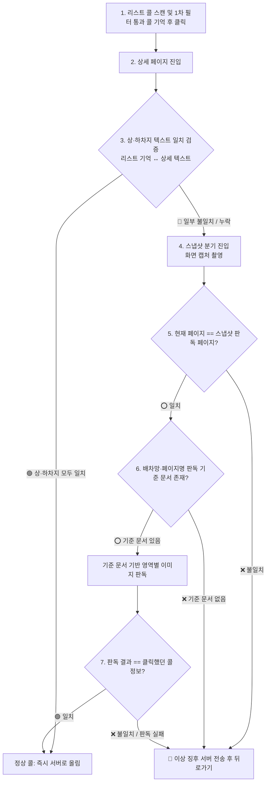

# 📸 스냅샷 검증 및 이상 징후 어드민 관제 시스템 계획

> **문서 상태**: 기사님 확정 아키텍처 (2026-09-18)  
> **위치**: `docs/기획/스냅샷_검증_및_이상징후_어드민_관제_계획.md`  
> **목적**: 배차망의 UI 변경, 테이블 밀림, 중간 끼어들기, 텍스트 누락, 잔상 등의 변수를 원천 차단하고 자가 치유 및 어드민 실시간 감시 체계를 구축한다.

---

## 1. 배경 및 문제 의식

1. **배차망의 실시간 테이블 밀림 현상**:
   * 카카오 픽커 등 일부 배차망은 오더가 위에서 아래로 순차 적재되는 것이 아니라, 실시간으로 목록 맨 위나 중간에 불쑥 끼어든다.
   * 이 과정에서 사용자가 스크롤하지 않아도 Y좌표가 순간적으로 밀리거나 텍스트 노드가 반 토막 나는 현상이 발생한다.
2. **리스트 오더 고유 ID 부재**:
   * 카카오 픽커는 리스트 화면에 오더 고유 번호(ID)가 노출되지 않고 상세 화면에만 존재한다.
   * 따라서 리스트에서 클릭한 콜과 상세 화면의 콜이 동일한지 확신 없이 어설프게 추정하면, 엉뚱한 정보나 빈칸(`""`) 주소가 서버로 올라가 전체 노선 평가를 망가뜨린다.
3. **배차망 UI 리뉴얼 시 감지 지연**:
   * 배차망 앱이 업데이트되어 버튼 위치, 텍스트 레이아웃, 폰트 등이 바뀌면 접근성 트리가 오작동하거나 텍스트를 파싱하지 못한다.
   * 이를 기사님이 실주행 중 발견하기 전에 어드민에서 실시간으로 감지하고 대응할 수 있어야 한다.

---

## 2. 7단계 파이프라인 아키텍처



---

## 3. 단계별 상세 동작 명세

### 1단계: 리스트 스캔 및 클릭 콜 기억
* 리스트에서 1차 필터를 통과한 콜의 정보(요금, 상차지, 하차지, 물품 등)를 `alarmTappedCard` 세션에 온전히 보관하고 터치 수행.
* ⚠️ **가드**: 상차지 또는 하차지가 비어 있거나 깨진 껍데기 카드는 캐시에 보관하지도 않고 클릭하지도 않는다.

### 2단계: 상세 페이지 진입
* `ScreenContext.DETAIL_PRE_CONFIRM` 감지.

### 3단계: 상·하차지 텍스트 1차 대조
* 상세 화면 텍스트 노드에서 추출한 상차지/하차지가 리스트에서 클릭한 콜의 상차지/하차지와 모두 일치하는지 검증.
* **통과 (대부분 99%)**: 즉시 정상 콜로 서버에 `/confirm` 및 `/detail` 전송 (선점 및 평가 돌입).
* **불일치/누락**: 텍스트 접근성 노드가 깨졌거나 끼어들기로 다른 콜이 열렸을 가능성이 있으므로 **4단계 스냅샷 분기**로 전환.

### 4단계: 스냅샷 촬영
* 안드로이드 `AccessibilityService.takeScreenshot()` API를 호출하여 현재 화면의 비트맵 스냅샷을 획득.

### 5단계: 페이지 일치 여부 확인
* 캡처된 이미지의 레이아웃 특징(상단 헤더, 하단 바닥 버튼)을 판별하여, 현재 앱이 보고 있는 페이지(상세 페이지)가 스냅샷 이미지와 동일한지 확인.
* 불일치 시(이미 화면이 닫혔거나 팝업이 덮음): 이상 징후 보고 후 즉시 `performBack()` 뒤로가기.

### 6단계: 판독 기준 문서(Template) 조회
* 서버/로컬에 정의된 `[배차망명]_[페이지명]` 기준 문서(ROI 영역 좌표, 앵커 텍스트, 폰트 규격)를 조회.
* 문서가 없으면: 미등록 신규 UI로 간주하여 이상 징후 보고 후 즉시 `performBack()` 뒤로가기.
* 문서가 있으면: 기준 영역(상차지 박스, 하차지 박스, 요금 박스)을 크롭하여 온디바이스 OCR/비전 판독 수행.

### 7단계: 판독 결과 비교 및 최종 판정
* 이미지 판독된 상차지, 하차지, 요금이 1단계에서 클릭했던 콜의 정보와 일치하면 정상 구제되어 서버로 전송.
* 판독 실패 또는 정보 불일치 시: 위험 콜로 분류하여 즉시 `performBack()` 또는 `넘기기`를 실행하여 리스트로 안전 복귀.

---

## 4. 이상 징후(False) 어드민 실시간 관제 연동

스냅샷 분기 이후 발생하는 모든 실패 상황은 기사님의 주행 화면을 방해하지 않고 **서버의 어드민 전용 채널로 실시간 격리 전송**된다.

### 전송 페이로드 (`POST /api/telemetry/anomalies`)
```json
{
  "timestamp": "2026-09-18T23:55:00.000Z",
  "deviceId": "앱폰-SM-A245N-784",
  "targetApp": "kakaopicker",
  "screenName": "DETAIL_PRE_CONFIRM",
  "failureReason": "DROPOFF_TEXT_MISSING_AND_OCR_MISMATCH",
  "listOrderInfo": {
    "fare": 5700,
    "pickup": "분당 야탑3",
    "dropoff": "분당 이매1"
  },
  "detailParsedText": "픽업지 경기 성남시 분당구 야탑3동 푸라닭-분당야탑점 ... 넘기기 수락하기",
  "screenshotBase64": "data:image/jpeg;base64,...",
  "ocrResult": {
    "extractedPickup": "야탑3동 푸라닭",
    "extractedDropoff": null
  }
}
```

### 어드민 활용 가치
1. **배차망 UI 개편 실시간 탐지**: 특정 배차망의 레이아웃이 바뀌어 텍스트 노드가 안 읽힐 때, 어드민에서 캡처 사진과 함께 알람이 울려 개발자가 즉시 인지.
2. **무중단 기준 문서 갱신**: 서버의 판독 기준 문서(JSON 좌표 영역)만 업데이트하면, 앱 재배포 없이도 즉시 새 화면 구조에 적응.
3. **노선 오염 원천 차단**: 불확실한 똥콜/껍데기 콜이 기사님 관제 화면에 올라와 경로를 망치는 사고가 100% 영구 방지됨.
