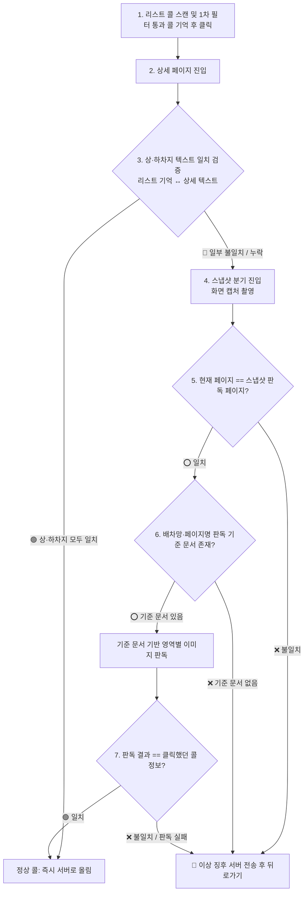

# 📸 스냅샷 검증 및 이상 징후 어드민 관제 시스템 계획

> **문서 상태**: 기사님 확정 아키텍처 (2026-09-18)  
> **위치**: `docs/기획/스냅샷_검증_및_이상징후_어드민_관제_계획.md`  
> **목적**: 배차망의 UI 변경, 테이블 밀림, 중간 끼어들기, 텍스트 누락, 잔상 등의 변수를 원천 차단하고 자가 치유 및 어드민 실시간 감시 체계를 구축한다.

> 🔴 **이 문서는 계획이다.** 코드에 있는 것은 아래 「실물」 표뿐이고, 나머지 단계는 아직 없다.
> 진행은 [todo.md 「📷 그림으로 읽기」](../../todo.md) 에서 센다.

## 0. 실물 — 코드에 있는 것 (2026-09-19)

| 단계 | 실물 | 어디 |
|---|---|---|
| 4 스냅샷 촬영 | ✅ 접근성 `takeScreenshot` → 540폭 축소 | `onedal-app/.../core/ScreenReader.kt` |
| 6 영역 판독 | ✅ 앱에 번들한 한국어 인식(ML Kit) → 줄(y·글자) → `PickerScreenOcr.parseDetail` (상차·하차 행정동·건물·직선km·시각·물품·예약). 기준 문서(ROI JSON)는 **없고**, 「픽업 Nkm」/「배송 Nkm」 머리를 경계로 자른다 | `plugins/kakaopicker/PickerScreenOcr.kt` · 검사 11건 |
| 부르는 자리 | ⚠️ 설정 화면 «📷 5초 뒤 화면 찍어 읽기» 버튼뿐 — **콜 흐름(1·2·3·5·7단계)에는 안 물렸다** | `HijackService.benchScreenRead` |
| 4절 이상 징후 보고 | ⬜ 라우트·표·현황판 없음 | — |

**A24 실측 (픽커 상세)**: 찍기 30~73ms · 변환 54~69ms · 인식 225~308ms(전체) / 167~214ms(아래 60%) · 나누기 1~13ms → **합계 전체 337~448ms · 잘라서 약 290ms**. 기사님 기준 «폰에서 0.5초 안에»를 넘지 않는다.

🔴 **픽커는 3단계 «텍스트 대조»가 성립하지 않는다** — 접근성 트리에 배송지가 아예 안 온다(09-13 실측). 픽커에서는 스냅샷이 «불일치 때 예비»가 아니라 **주된 길**이다. 인성·화물24시는 계획대로 텍스트 대조가 먼저다.

---

## 1. 배경 및 문제 의식

1. **배차망의 실시간 테이블 밀림 현상**:
   * 카카오 픽커 등 일부 배차망은 오더가 위에서 아래로 순차 적재되는 것이 아니라, 실시간으로 목록 맨 위나 중간에 불쑥 끼어든다.
   * 이 과정에서 사용자가 스크롤하지 않아도 Y좌표가 순간적으로 밀리거나 텍스트 노드가 반 토막 나는 현상이 발생한다.
2. **리스트 오더 고유 ID 부재**:
   * 카카오 픽커는 리스트 화면에 오더 고유 번호(ID)가 노출되지 않고 상세 화면에만 존재한다.
   * 따라서 리스트에서 클릭한 콜과 상세 화면의 콜이 동일한지 확신 없이 어설프게 추정하면, 엉뚱한 정보나 빈칸(`""`) 주소가 서버로 올라가 전체 노선 평가를 망가뜨린다.
3. **배차망 UI 리뉴얼 시 감지 지연**:
   * 배차망 앱이 업데이트되어 버튼 위치, 텍스트 레이아웃, 폰트 등이 바뀌면 접근성 트리가 오작동하거나 텍스트를 파싱하지 못한다.
   * 이를 기사님이 실주행 중 발견하기 전에 어드민에서 실시간으로 감지하고 대응할 수 있어야 한다.

---

## 2. 7단계 파이프라인 아키텍처



---

## 3. 단계별 상세 동작 명세

### 1단계: 리스트 스캔 및 클릭 콜 기억
* 리스트에서 1차 필터를 통과한 콜의 정보(요금, 상차지, 하차지, 물품 등)를 `alarmTappedCard` 세션에 온전히 보관하고 터치 수행.
* ⚠️ **가드**: 상차지 또는 하차지가 비어 있거나 깨진 껍데기 카드는 캐시에 보관하지도 않고 클릭하지도 않는다.

### 2단계: 상세 페이지 진입
* `ScreenContext.DETAIL_PRE_CONFIRM` 감지.

### 3단계: 상·하차지 텍스트 1차 대조
* 상세 화면 텍스트 노드에서 추출한 상차지/하차지가 리스트에서 클릭한 콜의 상차지/하차지와 모두 일치하는지 검증.
* **통과 (대부분 99%)**: 즉시 정상 콜로 서버에 `/confirm` 및 `/detail` 전송 (선점 및 평가 돌입).
* **불일치/누락**: 텍스트 접근성 노드가 깨졌거나 끼어들기로 다른 콜이 열렸을 가능성이 있으므로 **4단계 스냅샷 분기**로 전환.
* 🔴 **픽커는 예외 (09-13 실측)**: 카카오 픽커는 접근성 트리에 배송지(하차지) 텍스트가 아예 오지 않으므로 3단계 텍스트 대조가 성립하지 않는다. 따라서 픽커는 3단계를 건너뛰고 **곧바로 4단계 스냅샷 판독**을 주된 길로 탄다. 인성·화물24시는 계획대로 텍스트 대조가 우선이다.

### 4단계: 스냅샷 촬영
* 안드로이드 `AccessibilityService.takeScreenshot()` API를 호출하여 현재 화면의 비트맵 스냅샷을 획득.

### 5단계: 페이지 일치 여부 확인
* 캡처된 이미지의 레이아웃 특징(상단 헤더, 하단 바닥 버튼)을 판별하여, 현재 앱이 보고 있는 페이지(상세 페이지)가 스냅샷 이미지와 동일한지 확인.
* 불일치 시(이미 화면이 닫혔거나 팝업이 덮음): 이상 징후 보고 후 즉시 `performBack()` 뒤로가기.

### 6단계: 판독 기준 문서(Template) 조회
* 서버/로컬에 정의된 `[배차망명]_[페이지명]` 기준 문서(ROI 영역 좌표, 앵커 텍스트, 폰트 규격)를 조회.
* 문서가 없으면: 미등록 신규 UI로 간주하여 이상 징후 보고 후 즉시 `performBack()` 뒤로가기.
* 문서가 있으면: 기준 영역(상차지 박스, 하차지 박스, 요금 박스)을 크롭하여 온디바이스 OCR/비전 판독 수행.

### 7단계: 판독 결과 비교 및 최종 판정
* 이미지 판독된 상차지, 하차지, 요금이 1단계에서 클릭했던 콜의 정보와 일치하면 정상 구제되어 서버로 전송.
* 판독 실패 또는 정보 불일치 시: 위험 콜로 분류하여 즉시 `performBack()` 또는 `넘기기`를 실행하여 리스트로 안전 복귀.

---

## 4. 이상 징후(False) 어드민 실시간 관제 연동

스냅샷 분기 이후 발생하는 모든 실패 상황은 기사님의 주행 화면을 방해하지 않고 **서버의 어드민 전용 채널로 실시간 격리 전송**된다.

### 전송 페이로드 (`POST /api/telemetry/anomalies`)
```json
{
  "timestamp": "2026-09-18T23:55:00.000Z",
  "deviceId": "앱폰-SM-A245N-784",
  "targetApp": "kakaopicker",
  "screenName": "DETAIL_PRE_CONFIRM",
  "failureReason": "DROPOFF_TEXT_MISSING_AND_OCR_MISMATCH",
  "listOrderInfo": {
    "fare": 5700,
    "pickup": "분당 야탑3",
    "dropoff": "분당 이매1"
  },
  "detailParsedText": "픽업지 경기 성남시 분당구 야탑3동 푸라닭-분당야탑점 ... 넘기기 수락하기",
  "screenshotBase64": "data:image/jpeg;base64,...",
  "ocrResult": {
    "extractedPickup": "야탑3동 푸라닭",
    "extractedDropoff": null
  }
}
```

### 어드민 활용 가치
1. **배차망 UI 개편 실시간 탐지**: 특정 배차망의 레이아웃이 바뀌어 텍스트 노드가 안 읽힐 때, 어드민에서 캡처 사진과 함께 알람이 울려 개발자가 즉시 인지.
2. **무중단 기준 문서 갱신**: 서버의 판독 기준 문서(JSON 좌표 영역)만 업데이트하면, 앱 재배포 없이도 즉시 새 화면 구조에 적응.
3. **노선 오염 원천 차단**: 불확실한 똥콜/껍데기 콜이 기사님 관제 화면에 올라와 경로를 망치는 사고가 100% 영구 방지됨.

---

## 5. 공통 관리 아키텍처 (어디서 어떻게 관리할 것인가)

이 기능은 배차망(픽커, 인성, 24시)별 플러그인에 코드를 파편화하지 않고, **원달앱 공통 관문과 공통 비전 엔진 단 한 곳에서 통솔**한다.

```
[원달앱 구조]
com.onedal.app.core.engine.PreConfirmSequence.kt  <-- 🚪 상세 화면(DETAIL_PRE_CONFIRM) 단일 공통 관문
                     │
                     ▼ (텍스트 불일치 또는 픽커 주선)
com.onedal.app.core.SnapshotVerifier.kt           <-- 📸 [신설] 스냅샷 & 비전 판독 공통 엔진 (core/ 안)
                     │
        ┌────────────┴────────────┐
        ▼                         ▼
 [공통 라이프사이클 통솔]     [배차망 플러그인: 설정/규격만 주입]
 - 마지막 이벤트 후 N ms 정지 대기 - 머리 앵커 단어 ("픽업 Nkm", "배송 Nkm")
 - 오버레이 숨김 + 1프레임 대기   - 배차망별 주소 정규화 규칙
 - 캡처/크롭/OCR 싱글톤
 - 비트맵 메모리 recycle
 - 결과 지연 시 카드 폴백 판정
```

### 5.1 관리 위치 명세
* **원달앱 (`onedal-app`)**:
  * `core/engine/PreConfirmSequence.kt`: 상세 화면 진입 시 오더 매칭 실패 및 텍스트 누락 감지 시 `SnapshotVerifier` 호출.
  * `core/SnapshotVerifier.kt` (새 폴더를 파지 않고 `core/`에 배치): 스냅샷 촬영, 오버레이 숨김/복구, 화면 정지 대기, 모델 1회 싱글톤 관리, 비트맵 크롭 및 `recycle()`, 타임아웃 폴백 통솔.
  * `plugins/<배차망>/`: 배차망별 앵커 키워드 및 파싱 규칙만 제공 (알고리즘 중복 금지).
* **서버 (`onedal-web/server`)**:
  * `routes/telemetry.ts`: `POST /api/telemetry/anomalies` 라우트를 공통으로 개설하여 배차망 구분 없이 단일 규격으로 수신.
  * `core/plugins/<배차망>/`: 앵커/좌표 템플릿 정의 서빙.
* **웹 어드민 (`onedal-web/client-app`)**:
  * 관제 대시보드 내 단일 이상 징후 피드 (배차망 뱃지로 필터링/식별).

---

## 6. 실전 문제점 및 세부 방어 전략

도로 위 주행 환경과 보급형 기종(A24)의 자원 한계를 극복하기 위해 아래 5대 방어 전략을 설계 원칙으로 삼는다.

### 6.1 타이밍과 화면 상태 (Timing & Screen State)
1. **화면 멈춤 감지 (접근성 이벤트 정지 N ms + 지문 대기)**:
   * 바텀시트가 올라오는 애니메이션 중에 찍으면 반쪽만 읽힌다.
   * 접근성 지문은 이벤트가 올 때만 계산되므로, 화면이 멈추면 이벤트가 더 이상 오지 않는다.
   * 접근성 서비스 설정상 이벤트를 100ms 단위로 묶어 전달하므로(`notificationTimeout="100"`), 유휴 시간이 80~100ms 수준이면 이벤트 묶음 사이의 빈틈을 «멈춤»으로 오판한다.
   * 따라서 유휴 시간은 **최소 150ms 이상**이어야 하며, 실측을 거쳐 근거 있는 값(규칙 ⑤-4)으로 정하여 화면 멈춤을 확정하고 캡처한다. 안드로이드 시스템이 0.33초당 1장만 허용하므로 **재시도는 최대 1회**로 제한한다.
2. **원달앱 접근성 오버레이 일시 숨김 + 1프레임 대기**:
   * 우리 앱의 빨간 테두리와 터치 표시가 스냅샷에 찍혀 OCR 기호 오독을 유발할 수 있다.
   * `takeScreenshot()` 호출 직전 오버레이를 일시 숨김(`visibility = GONE`) 처리하되, 숨김이 화면에 반영되기까지 **한 프레임(1 frame delay)**을 대기한 후 캡처하고, 콜백에서 즉시 복구한다.
3. **고정 비율 자르기 금지 ➔ 머리 앵커 기반 상대 크롭**:
   * «아래 60% 자르기»는 특정 기종/폰트 크기에서 어긋난다.
   * 픽커 상세 시트의 높낮이(위·중·아래) 변동에 대응하기 위해, **「픽업 Nkm」 / 「배송 Nkm」 머리 앵커를 먼저 전체에서 찾고 그 아래 줄만 다시 읽는 2단계 방식**을 적용한다.

### 6.2 성능과 시스템 자원 (Performance & Resource Management)
1. **A24 실측 기반 지연 기준 및 폴백 기준선**:
   * A24 실측 결과: 전체 화면 기준 337~448ms, 잘라서 읽을 시 약 290ms 소요된다.
   * 온디바이스 인식은 중간에 취소할 수 없으므로, 임의로 짧은 타임아웃(350ms 등)을 걸면 정상 첫 판이 잘려 나간다.
   * 워치독은 픽커 상세 대기 30초 안에서 **«판독 지연 시 이 값을 안 쓰고 카드 정보만으로 선행 전송한다»**는 안전 기준선으로 운용한다.
2. **비트맵 즉시 파기 및 메모리 통제**:
   * 원본 비트맵 2벌(각 10MB)과 ML 모델 적재 시 앱 메모리가 94MB에서 218MB로 늘어난다. A24는 여유가 1GB이나 누수를 막기 위해 **크롭 및 축소 직후 원본 비트맵은 즉시 `recycle()`**하여 폐기한다.
3. **ML Kit 인식 모델 싱글톤 및 번들 모델**:
   * 한국어 인식 모델이 포함된 APK 전체 용량은 52MB 수준이다. 첫 실행 시 네트워크 다운로드 지연을 없애기 위해 앱에 번들된 모델을 사용하며, 접근성 서비스 라이프사이클 동안 **단 1회 싱글톤으로 적재**하여 재사용한다.
4. **전용 백그라운드 스레드 위임 (Executors)**:
   * ML Kit 인식 콜백이 메인 스레드로 오면 접근성 스캔이 200ms 밀릴 수 있다.
   * 앱에 코루틴 의존성이 없으므로, 앱의 기존 구조인 **`Executors` 전용 백그라운드 스레드**로 결과 처리와 무거운 작업을 넘겨 메인(접근성) 스레드를 보호한다.
5. **발열 통제**:
   * 여름철 차량 거치대 발열을 고려하여 **픽커 상세당 최대 1장(시간당 약 22장 수준)**으로 통제한다.

### 6.3 읽은 값의 신뢰와 주소 정규화 (Reliability & Normalization)
1. **행정동 사전 대조 위치 (서버 vs 폰 결정 필요)**:
   * OCR 오독(예: «산성달숨» ↔ «산성달슘») 방지를 위해 행정동을 대조해야 하나, **현재 앱 내부에는 행정동 사전 DB가 없다** (`CautionDongVerifier`는 동명이동 몇 개만 보유).
   * 폰에서 사전 대조를 하려면 서버가 낱말 사전처럼 행정동 목록을 앱에 동기화해 주어야 하며, 그렇지 않다면 폰은 추출 텍스트를 그대로 올리고 **대조를 서버가 받은 뒤 수행**해야 한다 (방향 결정 필요. 사전에 없는 행정동은 «미확인» 처리).
2. **리스트 카드 대조는 "포함(contains)" 검증**:
   * 리스트 카드는 축약형(«야탑3»), 상세 OCR은 풀주소(«경기 성남시 분당구 야탑3동»)이다.
   * 완전 일치가 아니라 **«리스트 토막이 상세 행정동에 포함되는가»**로 대조하여 정상 콜의 오탈락을 방지한다.
3. **예약 콜 vs 즉시 콜 시각 축 (규칙 ⑤-4 선행 문서화)**:
   * 「10:00까지 픽업」 등 예약 콜 시각은 시급·상차버퍼를 바꾸는 새로운 축이다.
   * 규칙 ⑤-4에 따라 어느 칸에 저장하고, 판정이 어떻게 쓰고, 화면에 어떻게 표기할지 문서로 먼저 확정한 뒤 파서에 반영한다.

### 6.4 운영 정책 및 리스크 관리 (Operations & Risk Management)
1. **화주 개인정보 노출 및 보관 정책 (기사님 결정 필요)**:
   * 실패 시 서버로 올라가는 스크린샷에는 화주의 상호, 상세 주소, 전화번호가 그대로 노출된다.
   * 서버에 얼마나 보관하고 누가 조회할 수 있는지에 대한 파기/보관 정책은 기사님의 결정이 필요하다 (현재 미정).
2. **리스크 최소화 원칙**:
   * `reviews/11` 인물 관점 리뷰를 참고하여, 화면 캡처 파일의 외부 전송은 «시각 보조 / 순수 알림» 목적에 부합하도록 **최소 크기·최소 빈도로 엄격히 제한**한다.
3. **배차망 UI 개편 시 Fallback (보고 라우트 선행 원칙)**:
   * 픽커 UI 개편으로 파서가 `null`을 낼 때 콜이 조용히 증발하지 않도록, **`null`이면 기존 동작(리스트 카드 정보만으로 보고)으로 떨어지고 이상 징후 1건을 서버로 발송**한다.
   * 따라서 **4절 이상 징후 보고 라우트(`POST /api/telemetry/anomalies`)가 스냅샷 본체 기능보다 먼저 구현·배포**되어야 한다.

### 6.5 코드 구조 및 테스트 잠금 (Code Structure & Test Policy)
1. **문제지 동기화 (서버 규칙 검사 대조 방식)**:
   * 앱 파서와 서버 파서가 두 벌이므로 같은 문제지로 잠가야 한다.
   * 별도 공통 fixtures 폴더를 파서 빌드 트리를 묶지 않고, **서버 규칙 검사가 앱 검사 파일(`PickerScreenOcrTest.kt` 등)의 문제지 줄을 직접 읽어 대조하는 레포 기존 방식(`appOrderShape` 꼴)**을 따른다.
2. **시험 도구 분리**:
   * 현재 `HijackService`의 시험용 버튼(`benchScreenRead`) 및 `live` 플래그는 실측 도구이므로, 실제 콜 흐름 통합 시 제품 코드와 철저히 분리하거나 디버그 빌드 전용으로 격리한다.
3. **시뮬레이터 실물 상세 재현 (`pnpm e2e:app`)**:
   * e2e 테스트(`pnpm e2e:app`)에서 스냅샷 구간을 온전히 검증할 수 있도록, 웹 시뮬레이터에 실물 픽커와 동일한 «픽업 Nkm / 배송 Nkm» 레이아웃을 구현한다.

