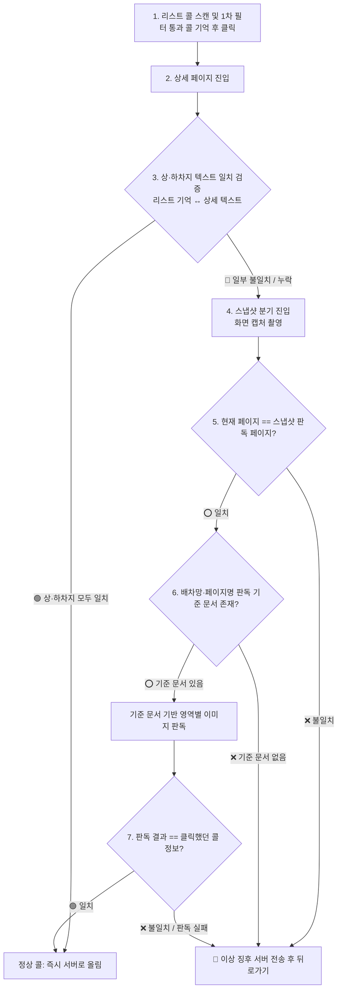

# 📸 스냅샷 검증 및 이상 징후 어드민 관제 시스템 계획

> **문서 상태**: 기사님 확정 아키텍처 (2026-09-18)  
> **위치**: `docs/기획/스냅샷_검증_및_이상징후_어드민_관제_계획.md`  
> **목적**: 배차망의 UI 변경, 테이블 밀림, 중간 끼어들기, 텍스트 누락, 잔상 등의 변수를 원천 차단하고 자가 치유 및 어드민 실시간 감시 체계를 구축한다.

> 🔴 **이 문서는 계획이다.** 코드에 있는 것은 아래 「실물」 표뿐이고, 나머지 단계는 아직 없다.
> 진행은 [todo.md 「📷 그림으로 읽기」](../../todo.md) 에서 센다.

## 0. 실물 — 코드에 있는 것 (2026-09-19 개정)

| 단계 | 실물 | 어디 |
|---|---|---|
| 4 스냅샷 촬영 | ✅ 접근성 `takeScreenshot` → 540폭 축소 (고정 60% 하단 자르기) | `onedal-app/.../core/ScreenReader.kt` |
| 6 영역 판독 | ✅ 앱에 번들한 한국어 인식(ML Kit) → 줄(y·글자) → `PickerScreenOcr.parseDetail` (상차·하차 행정동·건물·직선km·시각·물품·예약) | `plugins/kakaopicker/PickerScreenOcr.kt` · 검사 13건 |
| 콜 흐름 연동 (1·3·7단계) | ✅ 픽커 상세 진입(`DETAIL_PRE_CONFIRM`) 시 150ms 멈춤 대기 후 스냅샷 검증. 알람 카드는 동 엄격 대조(`matchDong`), 수동 콜은 리스트 매칭 카드로 요금 살려 오더 조립(#119 수호) | `core/engine/PreConfirmSequence.kt` |
| 4절 이상 징후 보고 (1단계) | ✅ 서버 라우트(`POST/GET /api/telemetry/anomalies`) 및 SQLite 영구 저장 표(`telemetry_anomalies`), 앱 독립 전송줄(`anomalyExecutor`) | `server/src/routes/telemetry.ts`, `server/src/db.ts`, `ApiClient.kt` |
| 4절 현황판 카드 (2단계) | ⬜ 대시보드 UI 카드 및 실시간 소켓 연동 (관제 화면 필요 시점 연동 예정) | — |
| 6.1-2 오버레이 숨김 | ⬜ 미구현 (현재 테두리/오버레이 유지 상태로 캡처, 글자 영역 미간섭 확인) | — |
| 6.1-3 머리 앵커 기반 가변 자르기 | ⬜ 미구현 (현재 고정 40% 상단 제외 / 하단 60% 자르기로 실측 통과) | — |

**A24 실측 (픽커 상세)**: 찍기 30~73ms · 변환 54~69ms · 인식 225~308ms(전체) / 167~214ms(아래 60%) · 나누기 1~13ms → **합계 전체 337~448ms · 잘라서 약 290ms**. 기사님 기준 «폰에서 0.5초 안에»를 넘지 않는다.

🔴 **픽커는 3단계 «텍스트 대조»가 성립하지 않는다** — 접근성 트리에 배송지가 아예 안 온다(09-13 실측). 픽커에서는 스냅샷이 «불일치 때 예비»가 아니라 **주된 길**이다. 인성·화물24시는 계획대로 텍스트 대조가 먼저다.

---

## 1. 배경 및 문제 의식

1. **배차망의 실시간 테이블 밀림 현상**:
   * 카카오 픽커 등 일부 배차망은 오더가 위에서 아래로 순차 적재되는 것이 아니라, 실시간으로 목록 맨 위나 중간에 불쑥 끼어든다.
   * 이 과정에서 사용자가 스크롤하지 않아도 Y좌표가 순간적으로 밀리거나 텍스트 노드가 반 토막 나는 현상이 발생한다.
2. **리스트 오더 고유 ID 부재**:
   * 카카오 픽커는 리스트 화면에 오더 고유 번호(ID)가 노출되지 않고 상세 화면에만 존재한다.
   * 따라서 리스트에서 클릭한 콜과 상세 화면의 콜이 동일한지 확신 없이 어설프게 추정하면, 엉뚱한 정보나 빈칸(`""`) 주소가 서버로 올라가 전체 노선 평가를 망가뜨린다.
3. **배차망 UI 리뉴얼 시 감지 지연**:
   * 배차망 앱이 업데이트되어 버튼 위치, 텍스트 레이아웃, 폰트 등이 바뀌면 접근성 트리가 오작동하거나 텍스트를 파싱하지 못한다.
   * 이를 기사님이 실주행 중 발견하기 전에 어드민에서 실시간으로 감지하고 대응할 수 있어야 한다.

---

## 2. 7단계 파이프라인 아키텍처



---

## 3. 단계별 상세 동작 명세

### 1단계: 리스트 스캔 및 클릭 콜 기억
* 리스트에서 1차 필터를 통과한 콜의 정보(요금, 상차지, 하차지, 물품 등)를 `alarmTappedCard` 세션에 온전히 보관하고 터치 수행.
* ⚠️ **가드**: 상차지 또는 하차지가 비어 있거나 깨진 껍데기 카드는 캐시에 보관하지도 않고 클릭하지도 않는다.

### 2단계: 상세 페이지 진입
* `ScreenContext.DETAIL_PRE_CONFIRM` 감지.

### 3단계: 상·하차지 텍스트 1차 대조
* 상세 화면 텍스트 노드에서 추출한 상차지/하차지가 리스트에서 클릭한 콜의 상차지/하차지와 모두 일치하는지 검증.
* **통과 (대부분 99%)**: 즉시 정상 콜로 서버에 `/confirm` 및 `/detail` 전송 (선점 및 평가 돌입).
* **불일치/누락**: 텍스트 접근성 노드가 깨졌거나 끼어들기로 다른 콜이 열렸을 가능성이 있으므로 **4단계 스냅샷 분기**로 전환.
* 🔴 **픽커는 예외 (09-13 실측)**: 카카오 픽커는 접근성 트리에 배송지(하차지) 텍스트가 아예 오지 않으므로 3단계 텍스트 대조가 성립하지 않는다. 따라서 픽커는 3단계를 건너뛰고 **곧바로 4단계 스냅샷 판독**을 주된 길로 탄다. 인성·화물24시는 계획대로 텍스트 대조가 우선이다.

### 4단계: 스냅샷 촬영
* 안드로이드 `AccessibilityService.takeScreenshot()` API를 호출하여 현재 화면의 비트맵 스냅샷을 획득.

### 5단계: 페이지 일치 여부 확인
* 캡처된 이미지의 레이아웃 특징(상단 헤더, 하단 바닥 버튼)을 판별하여, 현재 앱이 보고 있는 페이지(상세 페이지)가 스냅샷 이미지와 동일한지 확인.
* 불일치 시(이미 화면이 닫혔거나 팝업이 덮음): 이상 징후 보고 후 즉시 `performBack()` 뒤로가기.

### 6단계: 판독 기준 문서(Template) 조회
* 서버/로컬에 정의된 `[배차망명]_[페이지명]` 기준 문서(ROI 영역 좌표, 앵커 텍스트, 폰트 규격)를 조회.
* 문서가 없으면: 미등록 신규 UI로 간주하여 이상 징후 보고 후 즉시 `performBack()` 뒤로가기.
* 문서가 있으면: 기준 영역(상차지 박스, 하차지 박스, 요금 박스)을 크롭하여 온디바이스 OCR/비전 판독 수행.

### 7단계: 판독 결과 비교 및 최종 판정

상세 화면은 진입 경로에 따라 **두 갈래**로 엄격히 나누어 판정한다:

1. **알람·자동이 연 상세 (`alarmTappedCard != null`)**:
   * 리스트에서 조건을 통과해 직접 찍은 카드 정보가 세션에 존재한다.
   * 이미지 판독된 상차지, 하차지, 요금이 1단계의 기억 카드와 일치하면 정상 구제되어 서버로 전송 (`sendConfirmOnce` + `sendDetail`).
   * 판독 실패 또는 정보 불일치 시: 목록 끼어들기로 다른 콜이 열린 위험 상황이므로, 즉시 `performBack()`을 실행하여 리스트로 안전 복귀.
2. **기사님이 손으로 연 상세 (`alarmTappedCard == null` · 버그 대장 #119)**:
   * 손으로 연 상세는 기억 카드가 없다.
   * 🔴 **카드가 없다고 불일치로 간주하여 뒤로가기를 실행하면 손으로 연 콜이 통째로 죽는다.**
   * 이 갈래에서는 스냅샷 OCR 판독 결과가 대조 대상이 아니라 **화면의 실물을 증명하는 유일한 원천 자료**다.
   * 판독에 성공하면 해당 정보로 정상 오더(`SimplifiedOfficeOrder`)를 조립하여 서버에 미리보기/평가로 올린다.

---

## 4. 이상 징후 어드민 실시간 관제 연동

스냅샷 분기 이후 발생하는 모든 실패 상황은 기사님의 주행 화면을 방해하지 않고 **서버의 어드민 전용 채널로 실시간 격리 전송**된다.

### 전송 페이로드 (`POST /api/telemetry/anomalies`)
```json
{
  "timestamp": "2026-09-18T23:55:00.000Z",
  "deviceId": "앱폰-SM-A245N-784",
  "targetApp": "kakaopicker",
  "screenName": "DETAIL_PRE_CONFIRM",
  "failureReason": "DROPOFF_TEXT_MISSING_AND_OCR_MISMATCH",
  "listOrderInfo": {
    "fare": 5700,
    "pickup": "분당 야탑3",
    "dropoff": "분당 이매1"
  },
  "detailParsedText": "픽업지 경기 성남시 분당구 야탑3동 푸라닭-분당야탑점 ... 넘기기 수락하기",
  "screenshotBase64": null,
  "ocrResult": {
    "extractedPickup": "야탑3동 푸라닭",
    "extractedDropoff": null
  }
}
```
* ⚠️ `screenshotBase64`는 기사님 정책 결정 전까지 `null`(선택적)로 처리한다.

### 서버 저장 및 관제 웹소켓
1. **SQLite 테이블 영구 보관 (`telemetry_anomalies`)**:
   * 메모리나 파일에만 두면 서버 재시작 시 증발하므로, DB 테이블에 기록하여 며칠간에 걸쳐 나타나는 배차망 UI 개편 징후를 추적한다.
   * 테이블 추가 시 스키마 변경이 수반되므로, 기존 DB 사본(`data.db` / `local.db`)으로 부팅 안전성을 사전에 검증한다.
2. **웹소켓 이벤트 규약 (`anomaly-detected`)**:
   * 서버 이벤트 명명 규약(소문자 하이픈)에 따라 `anomaly-detected` 이벤트로 관제웹에 브로드캐스트한다 (`pnpm audit:socket` 게이트 통과 필수).

---

## 5. 공통 관리 아키텍처 (어디서 어떻게 관리할 것인가)

이 기능은 배차망(픽커, 인성, 24시)별 플러그인에 코드를 파편화하지 않고, **원달앱 공통 관문과 단일 화면 판독기(`ScreenReader`)에서 통솔**한다.

```
[원달앱 구조]
PreConfirmSequence.kt  <-- 🚪 상세 화면(DETAIL_PRE_CONFIRM) 단일 공통 관문
         │
         ▼ (픽커 상세 또는 타 배차망 텍스트 누락)
ScreenReader.kt        <-- 📸 단일 화면 판독기 (새 클래스 생성 없이 흡수)
         │
    ┌────┴────┐
    ▼         ▼
 [공통 라이프사이클 통솔]     [배차망 플러그인: 규격만 제공]
 - 150ms 멈춤 유휴 대기      - 머리 앵커 단어 ("픽업 Nkm", "배송 Nkm")
 - 오버레이 숨김 + 1프레임 대기   - `PickerScreenOcr.parseDetail` (줄→칸 파서)
 - 모델 싱글톤 & 비트맵 recycle
 - 별도 전송줄 (anomalyExecutor)
```

### 5.1 관리 위치 명세
* **원달앱 (`onedal-app`)**:
  * `core/engine/PreConfirmSequence.kt`: 상세 화면 진입 시 알람 콜/수동 콜 분기 및 `ScreenReader` 판독 호출.
  * `core/ScreenReader.kt`: 새 클래스(`SnapshotVerifier`)를 파지 않고 기존 시험용 `ScreenReader`에 **실제 콜 흐름 판독 함수(`readAndVerifyPickerDetail`)를 흡수·통합**.
  * **전송 줄 분리**: 초당 스크랩을 막지 않도록, **별도의 비동기 전송 줄(`anomalyExecutor`)**로 격리 전송.
* **서버 (`onedal-web/server`)**:
  * `src/index.ts`: 라우트 등록 (엔트리포인트).
  * `src/routes/telemetry.ts`: `POST /api/telemetry/anomalies` 엔드포인트 및 SQLite 저장.
* **웹 어드민 (`onedal-web/client-app`)**:
  * 관제 대시보드에서 `anomaly-detected` 소켓 이벤트 청취 및 표시.


---

## 6. 실전 문제점 및 세부 방어 전략

도로 위 주행 환경과 보급형 기종(A24)의 자원 한계를 극복하기 위해 아래 5대 방어 전략을 설계 원칙으로 삼는다.

### 6.1 타이밍과 화면 상태 (Timing & Screen State)
1. **유휴 시간 150ms 규칙 ⑤-4 정의**:
   | 이름 | 뜻 | 값 | 까닭 | 자리 |
   |---|---|---|---|---|
   | `DETAIL_STABILIZE_IDLE_MS` | 상세 진입 후 접근성 이벤트 정지 확인 유휴 시간 | `150L` | `accessibility_service_config.xml`의 `notificationTimeout="100"`에 의해 100ms 버퍼링이 걸리므로, 80~100ms는 묶음 사이 빈틈을 멈춤으로 오판함. 150ms 이상이어야 실질 멈춤임 | `ScreenReader.kt` |
2. **원달앱 접근성 오버레이 일시 숨김 + 1프레임 대기**:
   * 우리 앱의 빨간 테두리와 터치 표시가 스냅샷에 찍혀 OCR 기호 오독을 유발하지 않도록, `takeScreenshot()` 전 오버레이를 `GONE` 처리하고 **한 프레임(1 frame delay)** 대기 후 캡처하며 콜백에서 즉시 복구한다.
3. **고정 비율 자르기 금지 ➔ 머리 앵커 기반 상대 크롭**:
   * «아래 60% 자르기» 대신, **「픽업 Nkm」 / 「배송 Nkm」 머리 앵커를 먼저 전체에서 찾고 그 아래 줄만 다시 읽는 2단계 방식**을 적용한다.

### 6.2 성능과 시스템 자원 (Performance & Resource Management)
1. **A24 실측 기반 지연 기준 및 폴백 기준선**:
   * A24 실측 결과: 전체 화면 기준 337~448ms, 잘라서 읽을 시 약 290ms 소요된다.
   * 온디바이스 인식은 중간에 취소할 수 없으므로, 워치독은 강제 종료가 아니라 **«판독 지연 시 이 값을 안 쓰고 카드 정보만으로 선행 전송한다»**는 안전 기준선으로 운용한다.
2. **비트맵 즉시 파기 및 메모리 통제**:
   * 크롭 및 축소 직후 **원본 비트맵은 즉시 `recycle()`**하여 폐기한다.
3. **ML Kit 인식 모델 싱글톤 및 번들 모델**:
   * 한국어 인식 모델이 포함된 APK 전체 용량은 52MB 수준이다. 첫 실행 다운로드 지연을 없애기 위해 번들 모델을 사용하며, 접근성 서비스 수명 동안 **단 1회 싱글톤으로 적재**한다.
4. **전용 백그라운드 스레드 위임 (Executors)**:
   * 앱에 코루틴 의존성이 없으므로, 앱의 기존 구조인 **`Executors` 전용 백그라운드 스레드**로 처리하여 메인(접근성) 스레드를 보호한다.

### 6.3 읽은 값의 신뢰와 주소 정규화 (Reliability & Normalization)
1. **행정동 사전 대조 위치 (서버 vs 폰 결정 필요)**:
   * 현재 앱에는 행정동 사전 DB가 없으므로(`CautionDongVerifier`는 동명이동 몇 개만 보유), 폰은 추출 텍스트를 그대로 올리고 **대조를 서버가 받은 뒤 수행**하거나 서버가 행정동 사전을 내려주어야 한다 (미정, 현재는 사전에 없으면 «미확인» 처리).
2. **리스트 카드 대조는 "포함(contains)" 검증**:
   * 리스트 카드는 축약형(«야탑3»), 상세 OCR은 풀주소(«경기 성남시 분당구 야탑3동»)이므로 **«리스트 토막이 상세 행정동에 포함되는가»**로 대조한다.
3. **예약 콜 시각 축 (규칙 ⑤-4 선행 문서화)**:
   * 「내일 15:00」 등 예약 콜 시각 축은 시급·상차버퍼를 바꾸는 새로운 축이므로, 규칙 ⑤-4에 따라 어느 칸에 저장하고 판정이 어떻게 쓰는지 문서로 먼저 확정한 뒤 파서에 반영한다.

### 6.4 운영 정책 및 리스크 관리 (Operations & Risk Management)
1. **화주 개인정보 노출 및 캡처 전송 정책 (기사님 결정 필요)**:
   * 스크린샷에는 화주 상호/주소/전화번호가 노출되므로, **앱이 실제 이미지(`screenshotBase64`)를 실어 보낼지 여부는 기사님 결정 후 활성화**한다. 받는 쪽 API는 `null`을 허용한다.
2. **리스크 최소화 원칙**:
   * `reviews/11` 인물 관점 리뷰를 참고하여, 외부 전송은 «시각 보조 / 순수 알림» 범위 내에서 최소 크기·최소 빈도로 제한한다.
3. **배차망 UI 개편 시 Fallback (보고 라우트 선행 원칙)**:
   * 픽커 UI 개편으로 파서가 `null`을 낼 때 콜이 증발하지 않도록, **`null`이면 기존 카드 정보로 전송하고 이상 징후 1건을 서버로 발송**한다.

### 6.5 코드 구조 및 전체 게이트 검증 체계
1. **짝이 있는 것 (CLAUDE.md 동기화)**:
   * 앱 `PickerScreenOcr.kt` ↔ 서버 `pickerScreenOcr.ts`는 같은 문제지 둘을 무는 짝 파일이므로, 루트 `CLAUDE.md` 「짝이 있는 것」 표에 한 줄을 명시한다.
2. **시험 도구와 live 플래그 격리**:
   * `HijackService.benchScreenRead` 및 관련 버튼은 실측 도구이므로, 실제 콜 흐름에 영향을 주지 않도록 시험용 코드로 격리 유지한다.
3. **엄격한 전체 품질 게이트 (커밋 전 필수)**:
   * 서버 단위 검사: `cd onedal-web/server && npx jest`
   * 소켓 이벤트 검사: `pnpm audit:socket`
   * 문서 감사: `pnpm audit:docs`
   * 타입 및 린트 검사: 서버 tsc, 클라이언트 tsc, `pnpm test:web`, `pnpm audit:dead`, `pnpm lint:gate`
   * 앱 컴파일 및 검사: `./gradlew testDebugUnitTest`
   * e2e 시뮬레이터 검사: `pnpm e2e:app`

