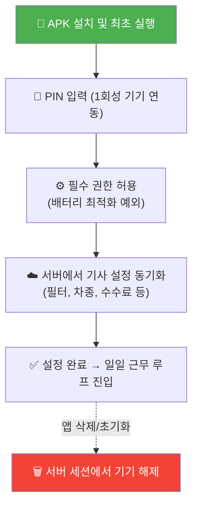
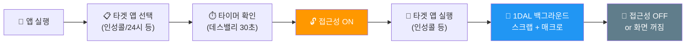

# 📱 1DAL 안드로이드 앱 기획 및 확장 아키텍처 설계서

> **문서 상태**: Draft v1  
> **작성일**: 2026-05-05  
> **목적**: 1DAL 안드로이드 앱의 전체 라이프사이클, UI/UX, 다중 플랫폼 확장 아키텍처를 종합 기획

---

## 🧑‍✈️ 1. 사용자 앱 라이프사이클 기획

### 🔄 1-1. 설치 및 해지 라이프사이클 (App Install & Uninstall Lifecycle)



1. **[최초 설치 및 실행]** 기사님이 APK를 통해 1DAL 앱을 설치하고 최초 실행.
2. **[기기 연동 (1회성)]** 관제웹에서 발급받은 기사 전용 PIN 번호를 입력하여 계정과 기기를 영구 매칭 (이후 자동 로그인).
3. **[권한 허용]** 앱이 정상 동작하기 위한 필수 권한(배터리 최적화 예외 등)을 허가받음.
4. **[설정 동기화]** 서버로부터 기사님의 설정(거리 필터, 수수료, 기본 타겟 앱 등)을 로드.
5. **[앱 삭제/초기화]** 기사님이 앱을 삭제하거나 데이터를 지울 경우, 서버 세션에서 해당 기기 연결이 영구 해제됨.

### ⏱️ 1-2. 일일 근무 라이프사이클 (Daily Work Lifecycle)



1. **[출근 / 앱 셋업]** 1DAL 앱을 열어 타겟 앱 선택, 데스밸리 타이머 확인.
2. **[근무 시작]** 1DAL 앱 내 버튼으로 안드로이드 '접근성 권한 설정 화면' 이동 → 권한 **ON**. (서버로 온라인 텔레메트리 즉시 전송)
3. **[타겟 앱 진입]** 1DAL 앱을 백그라운드로 내리고, 선택한 타겟 앱(예: 인성콜)을 실행하여 화면을 띄워둠. 1DAL이 보이지 않는 곳에서 화면을 읽고 관제탑으로 전송.
4. **[퇴근]** 화면이 꺼지거나 접근성을 **OFF** → 즉시 서버로 '오프라인' 통보.

---

## 🎨 2. UI/UX 기획서: 현재 워크플로우에 맞춘 화면 개편

앱에 머무르는 시간이 짧고(설정 후 타겟 앱으로 이동), 안드로이드 기본 UI를 활용하는 실용적인 기조를 유지하되, **다중 탭(Bottom Navigation)** 기반으로 직관적이고 깔끔하게 개편합니다.

### 📍 탭 1: 상태 및 제어 (Dashboard)
근무 시작 전 가장 많이 보게 될 메인 화면입니다.
- **연결 상태 (Status):** 기기 페어링 상태(PIN 연동 완료) 및 현재 관제 서버 연결(Online/Offline) 유무 표시.
- **접근성 권한 토글:** 접근성 설정 화면으로 바로 이동하는 버튼 (안드로이드 기본 스위치 UI 활용).
- **스크랩 현황판 (Mini Log):** 접근성이 켜져 있을 때 현재 1DAL이 읽고 있는 타겟 앱의 이름과 상태("인성콜 스크랩 중...", "24시 대기 중...")를 텍스트 피드로 표시.

### 📍 탭 2: 작업 설정 (Settings)
출근 직후 세팅하는 공간입니다. 최초 1회 PIN 입력도 여기서 관리됩니다.
- **[1회성] 계정 관리:** PIN 번호 재입력 및 초기화.
- **[일일 세팅] 스크래핑 앱 선택:** [인성콜, 화물24시, 원콜] 중 스크랩 대상을 다중 선택 (안드로이드 기본 체크박스/스위치).
- **[일일 세팅] 타이머 설정:** 데스밸리 자동 취소 타이머 시간 조절.
- **[시스템] 필수 권한 점검:** 배터리 최적화 예외 등 기타 권한 점검 버튼.

---

## 🏗️ 3. 구조적 개발 방향: 다중 플랫폼 추상화 (Plugin Architecture)

### 3-1. 물리적 디렉토리 구조 (패키지 분리)
```text
com.onedal.app/
├── core/
│   ├── engine/       # ⚙️ 엔진 코어 (Base 인터페이스)
│   │   ├── BaseScrapParser.kt
│   │   ├── BaseAutomationEngine.kt
│   │   └── EngineRouter.kt (활성 타겟 앱 스위칭)
│   └── network/      # API 통신 및 Telemetry
├── plugins/          # 🧩 개별 앱 플러그인 공간
│   ├── insung/       # 인성콜 전용 (3단계 팝업 서핑 등)
│   ├── cargo24/      # 화물24시 전용 (예정)
│   └── onecall/      # 원콜 전용 (예정)
└── ui/
    ├── dashboard/    # 상태 대시보드 화면
    └── settings/     # 환경 설정 화면
```

### 3-2. 플러그인 추상화 전략
- **`BaseScrapParser`**: 화면 텍스트 노드를 표준 `SimplifiedOfficeOrder`로 파싱하는 인터페이스.
- **`BaseAutomationEngine`**: 타겟 앱별 터치 자동화 (인성: 3단계 팝업, 24시: 단일 리스트 등).
- **`EngineRouter`**: 현재 활성 앱의 Package Name을 감지하여 해당 플러그인 엔진으로 라우팅.

---

## 🚀 4. 리팩토링 진행 단계 (Phases)

1. **Phase 1: 아키텍처 및 코어 물리 분리** — `core`와 `plugins/insung` 패키지 생성, 인터페이스 기반 분해.
2. **Phase 2: UI 껍데기 및 MVVM 세팅** — 2탭(상태/설정) 구조 생성, ViewModel 도입.
3. **Phase 3: 관제 서버 통신 모듈 연동 및 테스트** — EngineRouter 통해 새 엔진 동작 검증.
