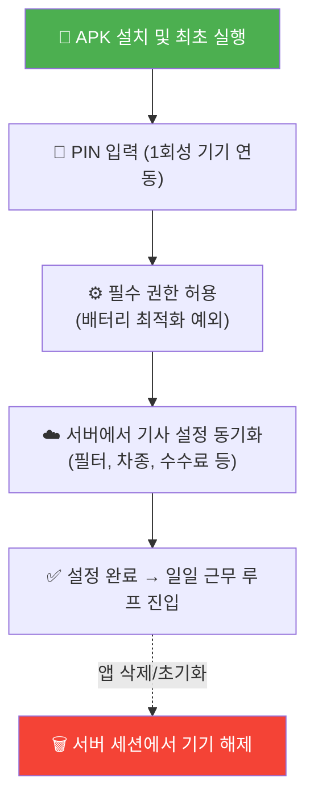
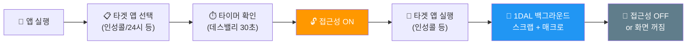
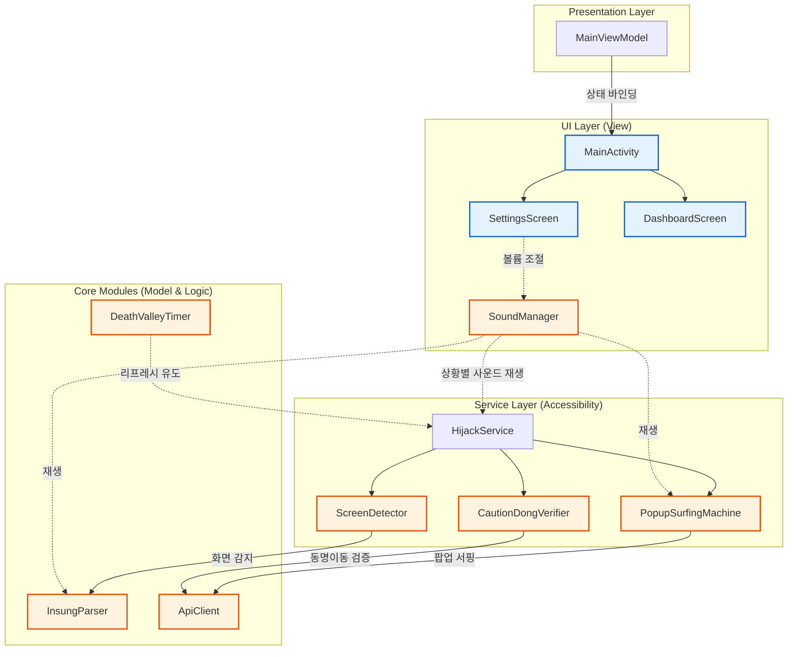

# 📱 1DAL 안드로이드 앱 기획 및 확장 아키텍처 설계서

> **문서 상태**: Draft v1  
> **작성일**: 2026-05-05  
> **목적**: 1DAL 안드로이드 앱의 전체 라이프사이클, UI/UX, 다중 플랫폼 확장 아키텍처를 종합 기획

---

## 🧑‍✈️ 1. 사용자 앱 라이프사이클 기획

### 🔄 1-1. 설치 및 해지 라이프사이클 (App Install & Uninstall Lifecycle)

```mermaid
flowchart TD
    A["📲 APK 설치 및 최초 실행"] --> B["🔑 PIN 입력 (1회성 기기 연동)"]
    B --> C["⚙️ 필수 권한 허용<br/>(배터리 최적화 예외)"]
    C --> D["☁️ 서버에서 기사 설정 동기화<br/>(필터, 차종, 수수료 등)"]
    D --> E["✅ 설정 완료 → 일일 근무 루프 진입"]

    E -.->|앱 삭제/초기화| F["🗑️ 서버 세션에서 기기 해제"]

    style A fill:#4CAF50,color:#fff
    style F fill:#f44336,color:#fff
```

1. **[최초 설치 및 실행]** 기사님이 APK를 통해 1DAL 앱을 설치하고 최초 실행.
2. **[기기 연동 (1회성)]** 관제웹에서 발급받은 기사 전용 PIN 번호를 입력하여 계정과 기기를 영구 매칭 (이후 자동 로그인).
3. **[권한 허용]** 앱이 정상 동작하기 위한 필수 권한(배터리 최적화 예외 등)을 허가받음.
4. **[설정 동기화]** 서버로부터 기사님의 설정(거리 필터, 수수료, 기본 타겟 앱 등)을 로드.
5. **[앱 삭제/초기화]** 기사님이 앱을 삭제하거나 데이터를 지울 경우, 서버 세션에서 해당 기기 연결이 영구 해제됨.

### ⏱️ 1-2. 일일 근무 라이프사이클 (Daily Work Lifecycle)

```mermaid
flowchart LR
    A["🌅 앱 실행"] --> B["📋 타겟 앱 선택<br/>(인성콜/24시 등)"]
    B --> C["⏱️ 타이머 확인<br/>(데스밸리 30초)"]
    C --> D["🔓 접근성 ON"]
    D --> E["📱 타겟 앱 실행<br/>(인성콜 등)"]
    E --> F["🤖 1DAL 백그라운드<br/>스크랩 + 매크로"]
    F --> G["🌙 접근성 OFF<br/>or 화면 꺼짐"]

    style D fill:#FF9800,color:#fff
    style F fill:#2196F3,color:#fff
    style G fill:#607D8B,color:#fff
```

1. **[출근 / 앱 셋업]** 1DAL 앱을 열어 타겟 앱 선택, 데스밸리 타이머 확인.
2. **[근무 시작]** 1DAL 앱 내 버튼으로 안드로이드 '접근성 권한 설정 화면' 이동 → 권한 **ON**. (서버로 온라인 텔레메트리 즉시 전송)
3. **[타겟 앱 진입]** 1DAL 앱을 백그라운드로 내리고, 선택한 타겟 앱(예: 인성콜)을 실행하여 화면을 띄워둠. 1DAL이 보이지 않는 곳에서 화면을 읽고 관제탑으로 전송.
4. **[퇴근]** 화면이 꺼지거나 접근성을 **OFF** → 즉시 서버로 '오프라인' 통보.

---

## 🎨 2. UI/UX 기획서: 현재 워크플로우에 맞춘 화면 개편

앱에 머무르는 시간이 짧고(설정 후 타겟 앱으로 이동), 안드로이드 기본 UI를 활용하는 실용적인 기조를 유지하되, **다중 탭(Bottom Navigation)** 기반으로 직관적이고 깔끔하게 개편합니다.

### 📍 탭 1: 상태 및 제어 (Dashboard)
근무 시작 전 가장 많이 보게 될 메인 화면입니다.
- **연결 상태 (Status):** 기기 페어링 상태(PIN 연동 완료) 및 현재 관제 서버 연결(Online/Offline) 유무 표시.
- **접근성 권한 토글:** 접근성 설정 화면으로 바로 이동하는 버튼 (안드로이드 기본 스위치 UI 활용).
- **스크랩 현황판 (Mini Log):** 접근성이 켜져 있을 때 현재 1DAL이 읽고 있는 타겟 앱의 이름과 상태("인성콜 스크랩 중...", "24시 대기 중...")를 텍스트 피드로 표시.

### 📍 탭 2: 작업 설정 (Settings)
출근 직후 세팅하는 공간입니다. 최초 1회 PIN 입력도 여기서 관리됩니다.
- **[1회성] 계정 관리:** PIN 번호 재입력 및 초기화.
- **[일일 세팅] 스크래핑 앱 선택:** [인성콜, 화물24시, 원콜] 중 스크랩 대상을 다중 선택 (안드로이드 기본 체크박스/스위치).
- **[일일 세팅] 타이머 설정:** 데스밸리 자동 취소 타이머 시간 조절.
- **[시스템] 필수 권한 점검:** 배터리 최적화 예외 등 기타 권한 점검 버튼.

---

## 🏗️ 3. Native 100% 아키텍처 및 9대 핵심 모듈 (Task 6)

기존의 통짜 서비스(`HijackService`) 스파게티 코드를 청산하고, **Model-View-Presenter (MVP)** 패턴을 도입하여 9개의 독립적인 핵심 모듈로 역할을 완벽하게 분리했습니다.

### 3.1 핵심 모듈 다이어그램

```mermaid
graph TD
    subgraph "UI Layer (View)"
        M[MainActivity] --> S[SettingsScreen]
        M --> D[DashboardScreen]
        S -.->|볼륨 조절| SM[SoundManager]
    end

    subgraph "Presentation Layer"
        VM[MainViewModel] --> |상태 바인딩| M
    end

    subgraph "Service Layer (Accessibility)"
        HS[HijackService] --> SD[ScreenDetector]
        HS --> PM[PopupSurfingMachine]
        HS --> CV[CautionDongVerifier]
    end

    subgraph "Core Modules (Model & Logic)"
        SD -->|화면 감지| IP[InsungParser]
        PM -->|팝업 서핑| API[ApiClient]
        CV -->|동명이동 검증| API
        
        DT[DeathValleyTimer] -.->|리프레시 유도| HS
        SM[SoundManager] -.->|상황별 사운드 재생| HS
        SM -.->|재생| IP
        SM -.->|재생| PM
    end

    classDef ui fill:#e3f2fd,stroke:#1565c0,stroke-width:2px;
    classDef logic fill:#fff3e0,stroke:#e65100,stroke-width:2px;
    class M,S,D ui;
    class SD,PM,CV,IP,DT,SM,API logic;
```

### 3.2 9대 핵심 모듈 명세

1. **ScreenDetector**: 현재 화면(노드)이 메인 리스트인지, 배차 팝업인지, 상세 팝업인지 감지합니다.
2. **SessionManager**: 서버와의 세션(Online/Offline) 및 소켓 연결을 총괄합니다.
3. **PopupSurfingMachine**: 오더를 낚아채기 위해 3단계 팝업(목록 -> 배차 팝업 -> 상세 팝업)을 자동으로 서핑하고 클릭하는 터치 매크로입니다.
4. **CautionDongVerifier**: 1차 필터를 통과한 "동 이름만 있는 주소"의 동명이동 여부를 3단계 팝업에서 최종 검증합니다.
5. **DeathValleyTimer (Task 9)**: 오더 리스트가 텅 비어 화면이 멈추는 데스밸리(Death Valley) 현상을 방지하기 위해, 일정 시간 오더가 없으면 빈 공간을 터치해 화면 갱신을 유도합니다.
6. **SoundManager (Task 11)**: 배차 성공, 실패, 똥콜, 확정 등 상황별 사운드를 스마트하게 분리 재생하며, `SettingsScreen` UI와 연동되어 볼륨 조절을 지원합니다.
7. **InsungParser**: 화면 텍스트 노드를 표준 `PendingOrder`로 파싱합니다.
8. **ApiClient**: 서버와의 REST API 통신(오더 심사 요청, 텔레메트리 전송)을 담당합니다.
9. **LocationTracker**: 백그라운드 GPS 트래킹 파이프라인.

---

## 🌐 4. 시뮬레이터 환경 및 WebView 래퍼 제약 사항 (Task 21)

A24 실기기를 대체하거나 보완하기 위한 시뮬레이터(PC 환경)에서 동작하는 래퍼(Wrapper) 앱에 대한 제약 사항입니다.

- **풀스크린 및 메뉴바 개선**: 시뮬레이터의 안드로이드 시스템 UI(상단바, 하단 네비게이션바)에 의해 앱 하단의 주요 메뉴가 가려지는 현상이 있었습니다. 이를 방지하기 위해 래퍼 앱 수준에서 풀스크린 모드를 해제하고, 시뮬레이터 전체 메뉴가 노출되도록 `WindowInsets` 여백을 강제 할당하여 UI 겹침 버그를 해결했습니다.
