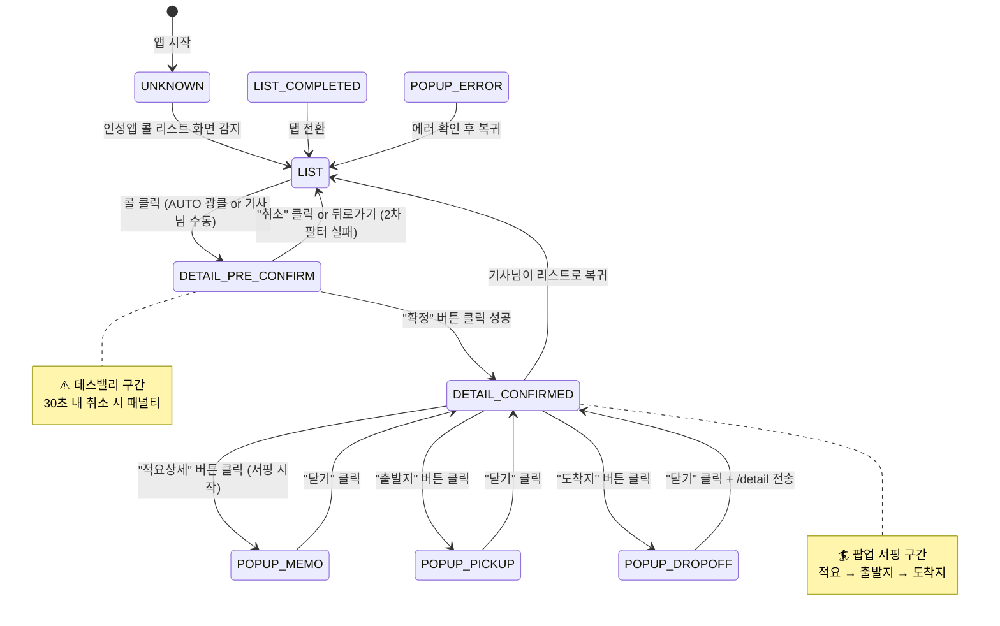
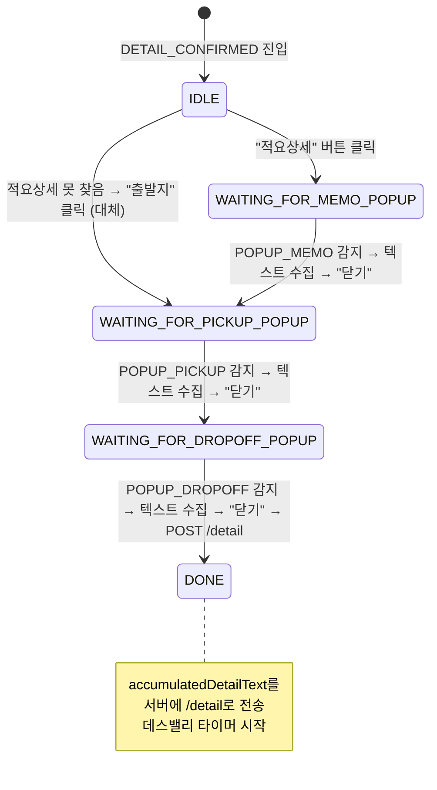
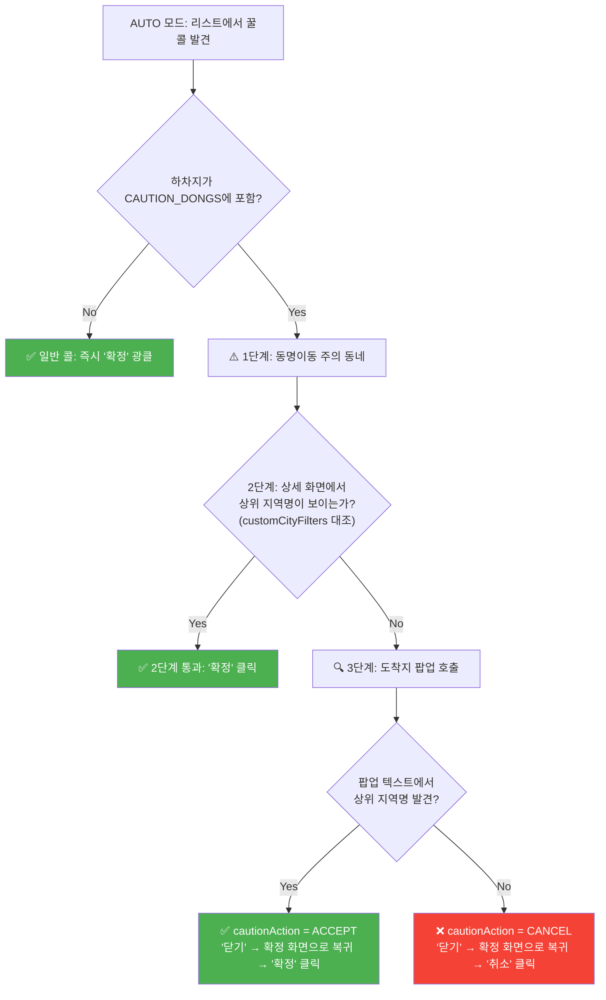

# 🧠 1DAL 화면 상태 머신 명세서 (Screen State Machine)

> **문서 상태**: v1.0  
> **작성일**: 2026-05-05  
> **근거 코드**: `HijackService.kt` (897줄), `ScreenKeywords.kt`, `SharedModels.kt`  
> **목적**: HijackService의 두뇌 — 화면 판별, 상태 전이, 팝업 서핑, 동명이동 방어 로직을 코드에서 완전히 추출하여 문서화

---

## 1. ScreenContext 상태 정의

앱이 현재 보고 있는 타겟 앱(인성콜 등)의 **화면 종류**를 나타내는 9가지 상태입니다.

```kotlin
enum class ScreenContext(val value: String) {
    LIST("LIST"),                          // 신규 콜 리스트 화면
    DETAIL_PRE_CONFIRM("DETAIL_PRE_CONFIRM"),  // 상세 화면 (배차 전 — "확정" 버튼 있음)
    DETAIL_CONFIRMED("DETAIL_CONFIRMED"),      // 상세 화면 (배차 후 — "확정" 버튼 없음)
    POPUP_PICKUP("POPUP_PICKUP"),              // 출발지 상세 팝업
    POPUP_DROPOFF("POPUP_DROPOFF"),            // 도착지 상세 팝업
    POPUP_MEMO("POPUP_MEMO"),                  // 적요 상세 팝업
    POPUP_ERROR("POPUP_ERROR"),                // 에러/실패 팝업
    LIST_COMPLETED("LIST_COMPLETED"),          // 완료 리스트 화면
    UNKNOWN("UNKNOWN"),                        // 알 수 없는 화면 (카카오톡 등)
}
```

---

## 2. 화면 판별 엔진 (detectScreenContext)

`HijackService.detectScreenContext()` 함수는 화면의 전체 텍스트를 키워드 사전(`ScreenKeywords`)과 대조하여 현재 화면을 판별합니다.

### 판별 우선순위 (위에서 아래로 먼저 매칭되면 확정)

| 우선순위 | 상태 | 판별 조건 (인성콜 기준) | 매칭 규칙 |
|:---:|------|------|------|
| 1 | `POPUP_ERROR` | `"취소할 수 없"` or `"시간이 지나"` or `"실패"` | **any** 포함 |
| 2 | `POPUP_PICKUP` | `"출발지 상세"` or `"상차지 상세"` | **any** 포함 |
| 3 | `POPUP_DROPOFF` | `"도착지 상세"` or `"하차지 상세"` | **any** 포함 |
| 4 | `POPUP_MEMO` | `"적요 상세"` **AND** `"적요 내용"` | **all** 포함 |
| 5a | `DETAIL_PRE_CONFIRM` | `"적요상세"` + `"요금"` + (`"확정"` or `"배차"`) | detail **all** + confirm **any** |
| 5b | `DETAIL_CONFIRMED` | `"적요상세"` + `"요금"` (확정/배차 없음) | detail **all** + confirm 없음 |
| 6 | `LIST` | `"신규"` **AND** `"빠른설정"` | **all** 포함 |
| 7 | `LIST_COMPLETED` | `"완료"` **AND** `"신규"` | **all** 포함 |
| 8 | `UNKNOWN` | 위 어디에도 해당 안 됨 | fallback |

> **핵심 구분**: `"적요상세"` (붙여쓰기) = 확정/상세 화면의 버튼 라벨, `"적요 상세"` (띄어쓰기) = 팝업 타이틀. 이 띄어쓰기 한 칸 차이로 팝업과 본 화면을 구분합니다.

### 사전 필터 (판별 전 스킵 조건)
- **로딩 화면**: `"오더 조회"` 또는 `"기다려 주십"` 텍스트가 있으면 판별 자체를 건너뜀
- **핑거프린트 동일**: 이전 화면과 텍스트 해시가 같으면 스킵 (중복 이벤트 방어)

---

## 3. 메인 상태 전이 다이어그램



---

## 4. 팝업 서핑 상태 머신 (SurfingState)

확정 화면(`DETAIL_CONFIRMED`)에 진입한 뒤, 적요상세 → 출발지 → 도착지 팝업을 **자동으로 순서대로 열고 닫으며** 텍스트를 수집하는 상태 머신입니다.

### 상태 정의

```kotlin
private enum class SurfingState {
    IDLE,                      // 서핑 대기 (확정 화면 최초 진입)
    WAITING_FOR_MEMO_POPUP,    // 적요상세 팝업 열림 대기 중
    WAITING_FOR_PICKUP_POPUP,  // 출발지 팝업 열림 대기 중
    WAITING_FOR_DROPOFF_POPUP, // 도착지 팝업 열림 대기 중
    DONE                       // 서핑 완료 → /detail 전송됨
}
```

### 전이 흐름



### 팝업 로딩 검증 (거짓 이벤트 방어)

각 팝업은 열리는 즉시 텍스트가 나오지 않고 로딩 시간이 있습니다. 거짓 이벤트를 걸러내기 위해 특정 텍스트가 보여야만 "로딩 완료"로 판단합니다:

| 팝업 | 로딩 완료 판별 기준 |
|------|------|
| `POPUP_MEMO` | `"적요 내용"` 텍스트가 화면에 있어야 함 |
| `POPUP_PICKUP` | `"전화1"` 또는 `"도착지 상세"` 텍스트가 있어야 함 |
| `POPUP_DROPOFF` | `"전화1"` 텍스트가 있어야 함 |

---

## 5. 동명이동 3단계 검증 (Caution Dong Defense)

전국에 동일한 이름의 동(洞)이 여러 시/구에 존재합니다 (예: "신사동" → 서울 강남구 / 인천 남동구).  
AUTO 모드에서 리스트의 하차지만 보고 광클했다가 **실제로는 전혀 다른 지역**인 경우를 방어하는 3단계 검증입니다.

### 대상 동네 목록 (CAUTION_DONGS)

코드에 하드코딩된 `setOf(...)` — 약 80여 개의 위험 동네 (금곡동, 중동, 갈현동, 신사동, 논현동 등)

### 검증 흐름



### customCityFilters란?

서버(관제탑)에서 `FilterConfig.customCityFilters` 필드로 내려보내는 문자열 배열입니다.  
예: `["부천", "인천 부평", "서울 강남"]`  
상세 화면이나 도착지 팝업의 텍스트에서 이 문자열이 포함되어 있으면 "우리 동네가 맞다"고 판단합니다.

### cautionAction 상태값

| 값 | 의미 |
|---|---|
| `null` | 일반 상태 (동명이동 검증 불필요) |
| `"VERIFY"` | 도착지 팝업을 열어서 3단계 검증 진행 중 |
| `"ACCEPT"` | 3단계 통과 → 확정 화면에서 "확정" 클릭 예정 |
| `"CANCEL"` | 3단계 적발 → 확정 화면에서 "취소" 클릭 예정 |

---

## 6. AUTO 모드 vs MANUAL 모드 분기

### 리스트 화면 (LIST)

```
IF (AUTO 모드 && 사냥 중 아님):
    콜 리스트에서 fareNode를 순회
    → scrapParser.shouldClick(order) 통과?
        → YES: fareNode 좌표 강제 터치 (광클)
               isAutoSessionActive = true (사냥 시작)
               processedOrderHashes에 선등록 (반송 대비)
        → NO:  터치 안 함, 서버에 텔레메트리 보고만
ELSE (MANUAL 모드):
    콜 리스트 파싱 후 서버에 텔레메트리 보고만
    기사님이 직접 콜을 터치함
```

### 상세 화면 (DETAIL_PRE_CONFIRM)

```
IF (AUTO 모드):
    2차 필터(scrapParser.shouldClick) 재검증
    → 통과:
        서버에 POST /confirm 전송 (step: "BASIC")
        동명이동 검증 분기 진입 (위 3단계 참조)
        → 검증 통과 시: "확정" 버튼 자동 클릭
    → 실패:
        "취소" 버튼 자동 클릭 (2차 필터 실패 회피)
        세션 초기화 (다음 꿀콜 대기)
ELSE (MANUAL 모드):
    서버에 POST /confirm 전송 (matchType: "MANUAL")
    기사님이 직접 확정/취소 선택
    → 스위치가 AUTO면 10초간 고속 폴링 임시 활성화
```

---

## 7. 세션 상태 변수 목록

`HijackService` 내부에서 하나의 콜 처리 세션을 추적하는 변수들입니다.

| 변수명 | 타입 | 초기값 | 역할 |
|--------|------|--------|------|
| `currentSessionOrderId` | `String` | `""` | 현재 처리 중인 오더 ID |
| `isAutoSessionActive` | `Boolean` | `false` | AUTO 매크로가 클릭해서 시작된 세션인지 여부 |
| `isDetailScrapSent` | `Boolean` | `false` | 이미 /confirm을 보냈는지 (중복 전송 방지) |
| `isWaitingForServerDecision` | `Boolean` | `false` | 서버 판결(KEEP/CANCEL) 대기 중인지 |
| `surfingState` | `SurfingState` | `IDLE` | 팝업 서핑 진행 상태 |
| `accumulatedDetailText` | `String` | `""` | 팝업에서 수집한 텍스트 누적 버퍼 |
| `lastDetailOrder` | `SimplifiedOfficeOrder?` | `null` | 상세 화면에서 참조할 원본 오더 데이터 |
| `cautionAction` | `String?` | `null` | 동명이동 3단계 검증 상태 |
| `lastScreenFingerprint` | `Int` | `0` | 중복 화면 이벤트 필터링용 해시값 |

### 세션 초기화 (resetSessionState)

아래 상황에서 모든 세션 변수가 초기값으로 리셋됩니다:
- **리스트(LIST)** 화면 감지 시
- **완료 리스트(LIST_COMPLETED)** 감지 시
- `"대기 중인 오더가 없"` 텍스트 감지 시
- AUTO 모드에서 2차 필터 실패로 "취소" 후
- 판결 집행(`executeDecisionImmediately`) 완료 후

```kotlin
private fun resetSessionState() {
    isDetailScrapSent = false
    surfingState = SurfingState.IDLE
    accumulatedDetailText = ""
    lastDetailOrder = null
    currentSessionOrderId = ""
    isAutoSessionActive = false
    cautionAction = null
    cancelDeathValleyTimer()
    telemetryManager.isHolding = false
    telemetryManager.forceFlushEvent()
}
```

---

## 8. 데스밸리 타이머 (Death Valley Timer)

서버에 `/detail` 전송 후, 관제탑이 KEEP/CANCEL 판결을 내리기를 기다리는 시간제한 타이머입니다.

| 항목 | 값 |
|------|---|
| **기본 타이머** | 30초 (SharedPreferences `deathValleyTimeout`에서 읽음) |
| **발동 조건** | AUTO 모드에서 `/detail` 전송 직후 |
| **타임아웃 시** | `EmergencyReason.AUTO_CANCEL` 비상 보고 → `executeDecisionImmediately("CANCEL")` 강제 취소 |
| **정상 해제** | 서버로부터 Piggyback으로 판결 수신 시 즉시 취소 |

> MANUAL 모드에서는 데스밸리 타이머가 시작되지 않습니다 (기사님에게 취소 강제 불가).

---

## 9. 잔상 방어 (Popup Residue Defense)

팝업을 닫은 직후, 안드로이드 애니메이션 때문에 팝업의 텍스트가 0.1~0.3초간 화면에 잔류합니다.  
이 잔상을 본 엔진이 "아직 팝업 안에 있다"고 오판하는 것을 방어합니다.

```kotlin
private fun isPopupResidue(rawScreenStr: String): Boolean {
    return rawScreenStr.contains("출발지 상세") || rawScreenStr.contains("도착지 상세")
}
```

`handlePreConfirmScreen()`과 `handleConfirmedScreen()` 진입 시 가장 먼저 호출되어, 잔상이 감지되면 해당 프레임의 처리를 통째로 건너뜁니다.

---

## 10. 복귀 감지 (Return Detection)

기사님이 수동으로 "뒤로가기"를 누르거나 리스트로 돌아가면, 세션을 강제 정리합니다.

```kotlin
// HijackService.onAccessibilityEvent() 내부
if (detected == ScreenContext.LIST 
    || detected == ScreenContext.LIST_COMPLETED 
    || rawScreenStr.contains("대기 중인 오더가 없")) {
    
    if (isAutoSessionActive || isWaitingForServerDecision || currentSessionOrderId.isNotEmpty()) {
        resetSessionState()  // 모든 락 해제
    }
}
```

또한 `isWaitingForServerDecision == true` 상태에서는 화면 핸들러 라우팅 자체를 건너뛰어, 서버 판결 대기 중 엔진이 화면을 함부로 조작하는 것을 방지합니다.
