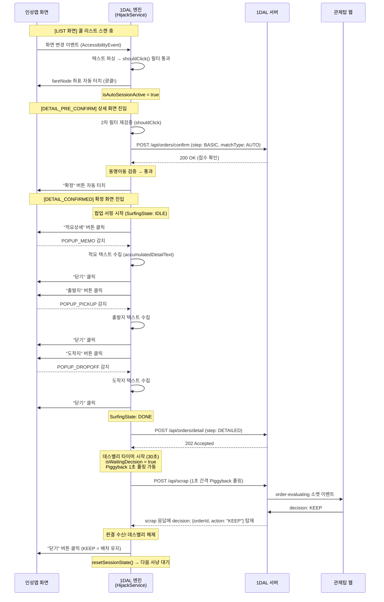
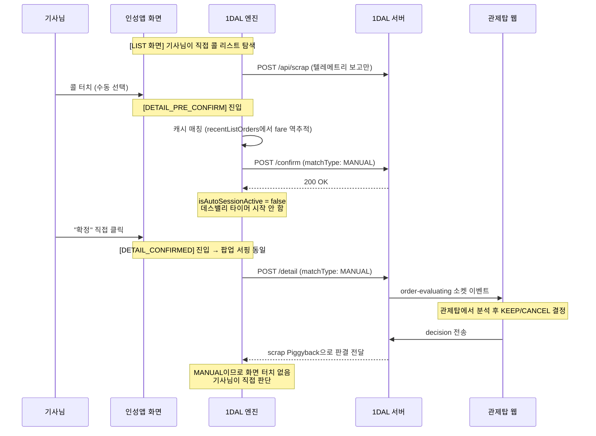
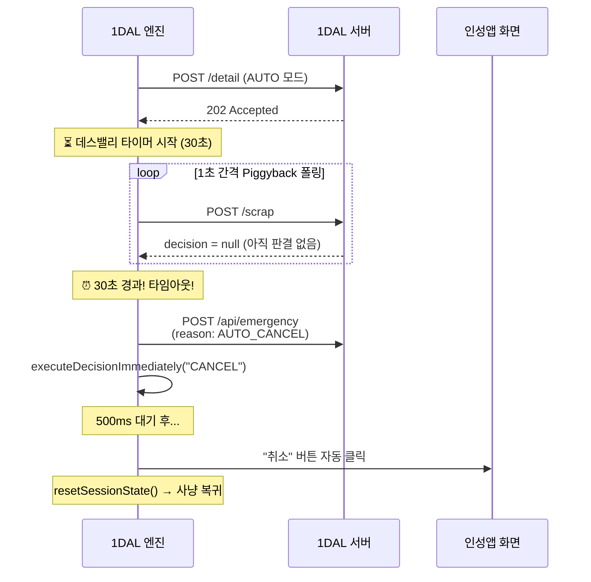
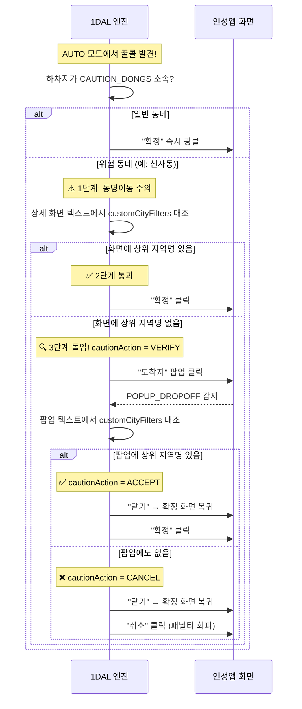
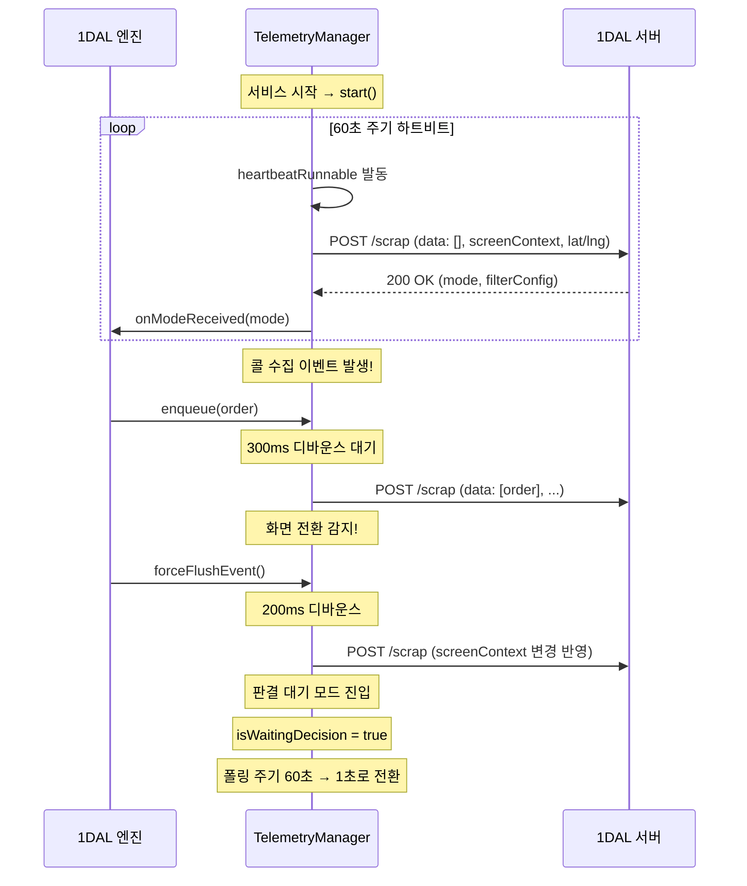

# 🔄 1DAL 시퀀스 다이어그램 모음

> **문서 상태**: v1.0  
> **작성일**: 2026-05-05  
> **목적**: 주요 사용 시나리오별 앱 ↔ 서버 ↔ 관제탑 간 통신 흐름을 시간순으로 시각화

---

## 1. AUTO 모드 — 정상 배차 시나리오 (꿀콜 광클 → 서핑 → KEEP)

---

## 2. MANUAL 모드 — 기사님 수동 클릭 시나리오

---

## 3. 데스밸리 타임아웃 — 비상 취소 시나리오

---

## 4. 동명이동 3단계 검증 시퀀스

---

## 5. 텔레메트리 생존신고 흐름

