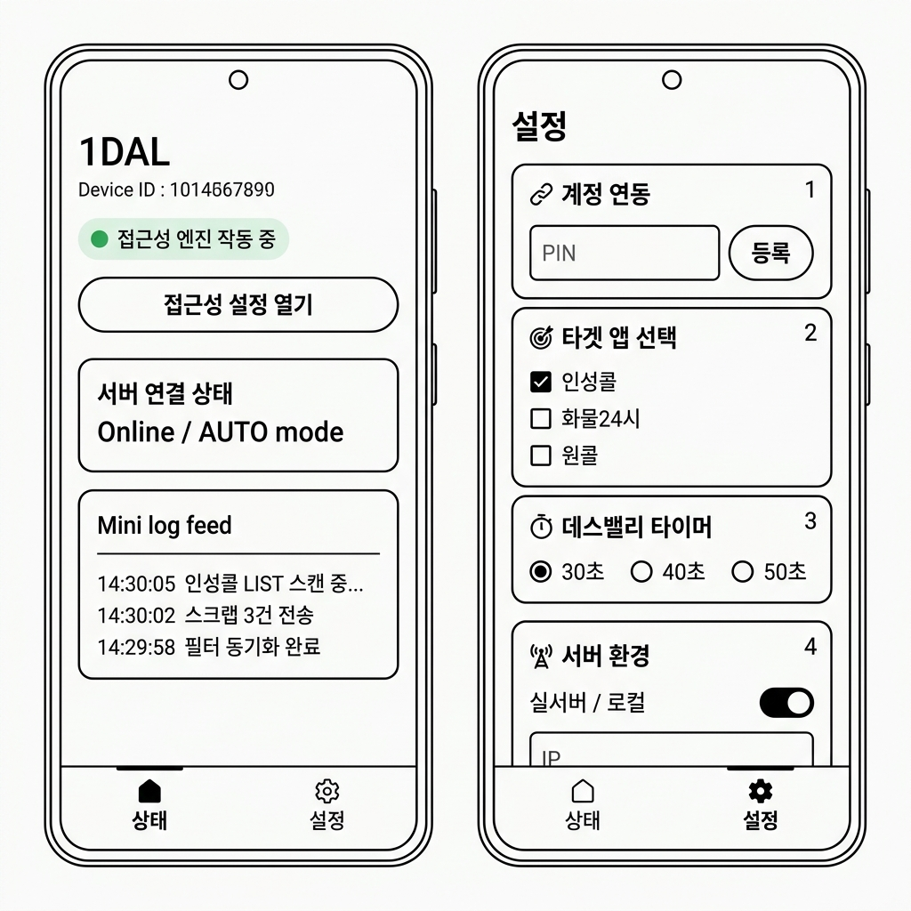

# 🖼️ 1DAL 안드로이드 앱 UI 와이어프레임

> **문서 상태**: v1.0  
> **작성일**: 2026-05-05  
> **목적**: 리팩토링 후 앱의 화면 구조를 시각적으로 정의

---

## 1. 전체 화면 구조 (2탭)

---

## 2. 탭 1: 상태 (Dashboard) — 상세 레이아웃

기사님이 앱을 열었을 때 가장 먼저 보는 화면입니다.  
**목적:** 현재 엔진 상태를 한눈에 파악하고, 접근성을 켜서 근무를 시작하는 것.

### 레이아웃 요소 (위→아래)

| 순서 | 요소 | 설명 | 데이터 소스 |
|:---:|------|------|------|
| 1 | **앱 타이틀 + 기기 ID** | "1DAL" + `deviceId` 표시 | SharedPrefs `deviceId` |
| 2 | **접근성 상태 배지** | 🟢 작동 중 / 🔴 꺼짐 (연두/빨간 뱃지) | `isAccessibilityServiceEnabled()` |
| 3 | **접근성 설정 버튼** | 안드로이드 접근성 설정 화면으로 이동 | `ACTION_ACCESSIBILITY_SETTINGS` Intent |
| 4 | **서버 연결 카드** | Online/Offline 상태 + 현재 모드(AUTO/MANUAL) | SharedPrefs `deviceControl` |
| 5 | **미니 로그 피드** | 최근 엔진 동작 기록 3~5줄 표시 | 신규 구현 필요 (로그 버퍼) |

### 상태별 UI 변화

| 조건 | 접근성 배지 | 서버 카드 | 미니 로그 |
|------|------------|----------|----------|
| 접근성 OFF + 서버 미연결 | 🔴 꺼짐 | ⚫ Offline | (비어 있음) |
| 접근성 ON + 서버 연결 | 🟢 작동 중 | 🟢 Online / AUTO | 실시간 갱신 |
| 접근성 ON + 서버 끊김 | 🟡 연결 시도 중 | 🟡 Reconnecting | "서버 응답 없음..." |

---

## 3. 탭 2: 설정 (Settings) — 상세 레이아웃

출근 직후 또는 최초 1회 세팅하는 화면입니다.

### 레이아웃 요소 (위→아래)

| 순서 | 요소 | 설명 | 빈도 |
|:---:|------|------|------|
| 1 | **계정 연동 카드** | 6자리 PIN 입력 + "등록" 버튼 + 기기 별명(선택) | 1회성 |
| 2 | **타겟 앱 선택 카드** | ☑ 인성콜 / ☐ 화물24시 / ☐ 원콜 (다중 체크박스) | 일일 |
| 3 | **데스밸리 타이머 카드** | ◉ 30초 / ○ 40초 / ○ 50초 (라디오 버튼) | 일일 |
| 4 | **서버 환경 카드** | 실서버↔로컬 토글 + IP 입력 필드 | 개발 시 |
| 5 | **배터리 최적화 버튼** | 배터리 최적화 예외 설정 바로가기 | 1회성 |

---

## 4. 현재 MainActivity vs 개편 후 비교

| 항목 | 현재 (단일 스크롤) | 개편 후 (2탭) |
|------|-------------------|-------------|
| 구조 | 460줄 단일 Column에 모든 UI | Dashboard / Settings 분리 |
| 로직 | View 안에서 SharedPrefs 직접 접근 | ViewModel 경유 |
| 설정 | 상태 정보와 설정이 뒤섞임 | 탭으로 물리 분리 |
| 디버그 | API 로그가 메인 화면에 노출 | 개발 모드 숨김 or 별도 탭 |
