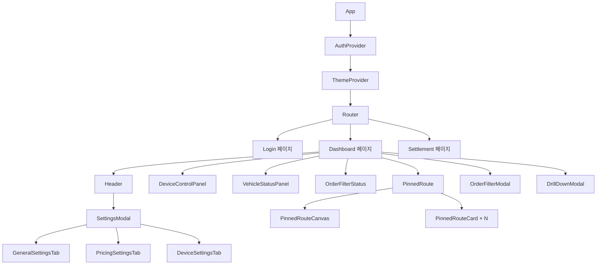
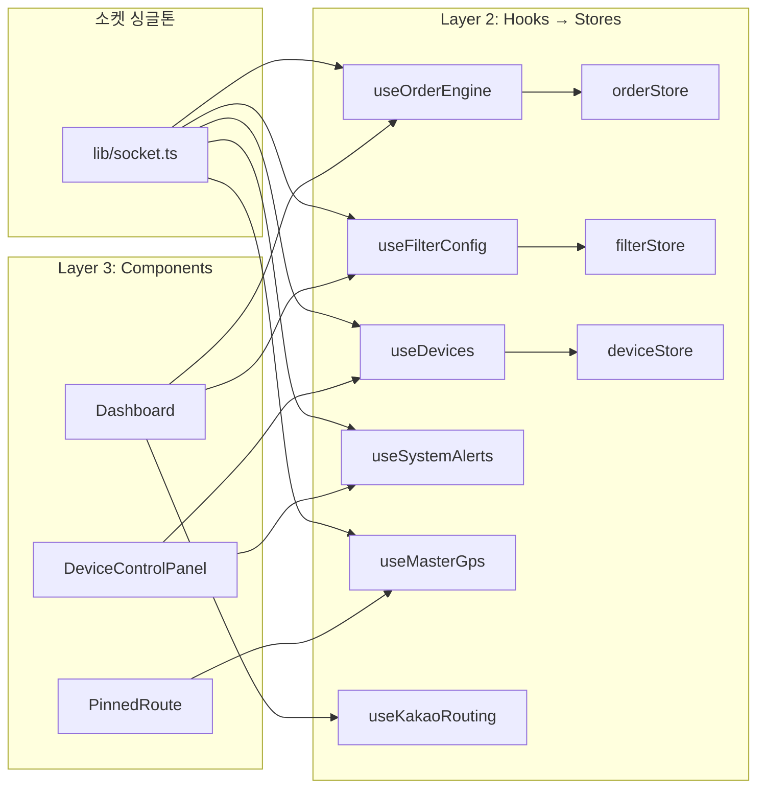

# 🖥️ 1DAL 관제웹 — Client Architecture Guide

> **문서 상태**: v1  
> **작성일**: 2026-05-05  
> **목적**: 관제웹(React) 클라이언트의 구조적 역할과 책임을 정의합니다.

---

## 1. 리팩토링 철학

### 3가지 핵심 원칙

1. **"로직은 이동, 동작은 불변"** — 검증된 비즈니스 로직(소켓 이벤트, 상태 전이, 필터 동기화)은 절대 변경하지 않습니다.
2. **"문서가 곧 설계도"** — 이 문서가 정의한 계층 구조에 맞춰 코드를 배치합니다.
3. **"RN 전환을 위한 기반 조성"** — 순수 로직과 UI를 분리하여, React Native 전환 시 로직 레이어를 그대로 가져갈 수 있게 합니다.

---

## 2. 3계층 아키텍처

```
┌─────────────────────────────────────────────────┐
│  Layer 3: UI Components (플랫폼 종속)            │  ← RN 전환 시 이것만 교체
│  pages/, components/dashboard/, components/ui/  │
├─────────────────────────────────────────────────┤
│  Layer 2: State Stores (플랫폼 무관)             │  ← Zustand stores
│  stores/orderStore, filterStore, deviceStore    │
├─────────────────────────────────────────────────┤
│  Layer 1: Pure Logic (플랫폼 무관)               │  ← 순수 함수/상수
│  lib/routeOptimizer, lib/orderConstants,        │
│  lib/routeUtils, lib/soundManager              │
└─────────────────────────────────────────────────┘
     ↕ shared/ (@onedal/shared)
┌─────────────────────────────────────────────────┐
│  Foundation: 서버-클라이언트 공유 타입/상수        │
│  OrderStatus, SecuredOrder, AutoDispatchFilter  │
│  TERMINAL_STATUSES, isTerminal(), isEvaluating()│
└─────────────────────────────────────────────────┘
```

### 계층별 책임

| 계층 | 위치 | 책임 | RN 전환 시 |
|------|------|------|------------|
| **Layer 1** | `lib/`, `shared/` | 순수 함수, 상수, 유틸리티. 어떤 프레임워크에도 의존하지 않음 | 그대로 복사 |
| **Layer 2** | `stores/`, `hooks/` | Zustand 스토어 + 소켓 연결 훅. React에만 의존 | 그대로 복사 |
| **Layer 3** | `pages/`, `components/` | JSX 렌더링, Tailwind 스타일링, 브라우저 API | RN 컴포넌트로 교체 |

---

## 3. 디렉토리 구조

```text
client/src/
├── api/                    # [네트워크 계층]
│   └── apiClient.ts        # Axios 인스턴스 + JWT 인터셉터 + 토큰 갱신
│
├── stores/                 # [Layer 2] Zustand 글로벌 상태 (신규)
│   ├── orderStore.ts       # 오더 상태 (activeRoute, pendingOrders, isConnected)
│   ├── filterStore.ts      # 필터 상태 (activeFilter, baseFilter)
│   └── deviceStore.ts      # 기기 상태 (devices, telemetry)
│
├── hooks/                  # [Layer 2] React 커스텀 훅 (스토어 래퍼 + 소켓 연결)
│   ├── useOrderEngine.ts   # 핵심: 소켓 이벤트 → orderStore 연결. 오더 라이프사이클 관리
│   ├── useFilterConfig.ts  # 소켓 filter-init/filter-updated → filterStore 연결
│   ├── useDevices.ts       # 소켓 telemetry-devices → deviceStore 연결
│   ├── useSystemAlerts.ts  # 비상/데스밸리 경고 수신
│   ├── useMasterGps.ts     # GPS 마스터 (Real/Mock 자동 분기)
│   ├── useKakaoRouting.ts  # 카카오 경로 시뮬레이션
│   ├── useMockGpsSimulator.ts  # 테스트용 Mock GPS
│   └── useSoundManager.ts  # 사운드 상태 구독
│
├── lib/                    # [Layer 1] 순수 유틸리티 (React 의존 없음)
│   ├── orderConstants.ts   # 상태 상수 (TERMINAL_STATUSES 등) — shared 재export
│   ├── routeOptimizer.ts   # TSP 정렬, ETA 매핑, visitOrder 계산 (신규)
│   ├── routeUtils.ts       # 하버사인 거리, 주소 라벨, 분 차이 계산
│   ├── soundManager.ts     # 오디오 재생 엔진 (싱글톤)
│   ├── roadmapLogger.ts    # 로드맵 이벤트 콘솔 로깅
│   └── socket.ts           # Socket.IO 싱글톤 인스턴스
│
├── contexts/               # [Layer 3] React Context (인증/테마)
│   ├── AuthContext.tsx      # Google OAuth + JWT 세션 관리
│   └── ThemeContext.tsx     # 다크/라이트 모드 토글
│
├── components/
│   ├── dashboard/          # [Layer 3] 대시보드 전용 컴포넌트
│   │   ├── PinnedRoute.tsx         # 확정 경로 컨테이너 (지도 + 카드 리스트)
│   │   ├── PinnedRouteCanvas.tsx   # Canvas 2D 미니맵 렌더링
│   │   ├── PinnedRouteCard.tsx     # 개별 오더 카드 (상태별 분기 UI)
│   │   ├── OrderFilterModal.tsx    # 필터 설정 모달 (첫짐/합짐 모드)
│   │   ├── OrderFilterStatus.tsx   # 필터 상태 읽기전용 요약 뱃지
│   │   ├── SettingsModal.tsx       # 설정 모달 쉘 (탭 라우팅만)
│   │   ├── settings/               # SettingsModal 하위 탭 컴포넌트 (신규)
│   │   │   ├── GeneralSettingsTab.tsx
│   │   │   ├── PricingSettingsTab.tsx
│   │   │   └── DeviceSettingsTab.tsx
│   │   ├── DeviceControlPanel.tsx  # 앱폰 연결 상태 + 모드 전환
│   │   ├── VehicleStatusPanel.tsx  # 차량 속도/상차 감지 패널
│   │   └── DrillDownModal.tsx      # 합짐 시뮬레이션 상세
│   ├── layout/
│   │   └── Header.tsx              # 글로벌 헤더 (시계, 연결상태, 프로필)
│   └── ui/                 # shadcn/ui 기반 프리미티브
│       ├── button.tsx, card.tsx, badge.tsx, dialog.tsx,
│       ├── input.tsx, switch.tsx, tabs.tsx, select.tsx,
│       ├── avatar.tsx, toggle-group.tsx
│       └── ...
│
├── pages/                  # [Layer 3] 페이지 라우트
│   ├── Dashboard.tsx       # 메인 대시보드 (모든 위젯 조합)
│   ├── Login.tsx           # Google OAuth 로그인
│   └── Settlement.tsx      # 정산 페이지
│
├── styles/
│   └── themes.ts           # Canvas 전용 테마 색상 정의
│
└── App.tsx                 # 라우팅 + AuthProvider + ThemeProvider
```

---

## 4. 컴포넌트 계층 트리



---

## 5. 훅 의존성 그래프



---

## 6. 데이터 흐름

```
[안드로이드 앱폰]
    │ POST /api/scrap (텔레메트리)
    │ POST /api/dispatch/confirm (배차 확정)
    ▼
[Node.js 서버]
    │ dispatchEngine.ts → 꿀/똥콜 판별
    │ socketHandlers.ts → 소켓 이벤트 방출
    ▼
[관제웹 소켓 수신]
    │ useOrderEngine → orderStore.setActiveRoute()
    │ useFilterConfig → filterStore.setFilter()
    │ useDevices → deviceStore.setDevices()
    ▼
[UI 렌더링]
    │ Dashboard → PinnedRoute → PinnedRouteCard
    │ Header → SettingsModal
    ▼
[사용자 액션]
    │ "거절" 버튼 → socket.emit("decision", {action: "ORDER_CANCELED"})
    │ 필터 변경 → socket.emit("update-filter", newFilter)
    │ 경로 재탐색 → socket.emit("recalculate-route", {priority})
    ▼
[서버로 역류] → 상태 변경 → 다시 소켓으로 클라이언트에 전파
```

---

## 7. 확장 규칙

### 새 소켓 이벤트 추가 시
1. `SOCKET_EVENT_MAP.md`에 이벤트 문서화
2. 해당 도메인의 훅(예: `useOrderEngine.ts`)에 `socket.on()` 핸들러 추가
3. 필요 시 Zustand 스토어에 상태 필드 추가

### 새 설정 탭 추가 시
1. `components/dashboard/settings/` 에 `NewSettingsTab.tsx` 생성
2. `SettingsModal.tsx`의 `TabsList`에 탭 추가
3. 서버에 대응하는 API 엔드포인트가 있으면 `apiClient` 활용

### 새 대시보드 위젯 추가 시
1. `components/dashboard/` 에 위젯 컴포넌트 생성
2. 필요한 데이터를 기존 스토어에서 가져오거나 새 훅 생성
3. `Dashboard.tsx`에 위젯 배치

### RN 전환 시
1. Layer 1(`lib/`)과 Layer 2(`stores/`, `hooks/`)를 그대로 복사
2. Layer 3의 각 컴포넌트를 `react-native` + `react-native-paper` 등으로 교체
3. `useMasterGps`의 Real 모드를 `expo-location`으로 교체
4. `PinnedRouteCanvas`를 `react-native-canvas` 또는 `react-native-maps`로 교체
