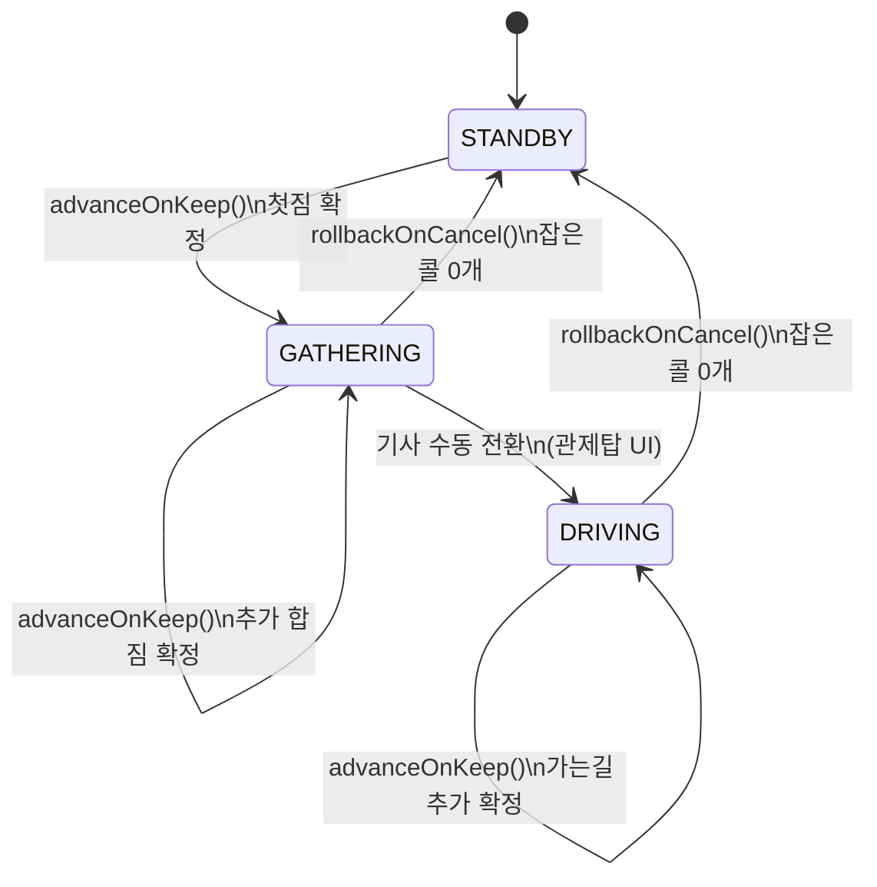

# 🚥 1DAL 백엔드 합짐 상태 머신 (Dispatch State Machine)

> **문서 상태**: v3.0 (코드 동기화)  
> **SSOT 코드**: [StateMachine.ts](file:///Users/seungwookkim/reps/onedal/onedal-web/server/src/core/engine/StateMachine.ts)

---

## 1. 설계 의도

기사의 운행 상태(빈차 → 짐싣기 → 운행 중)에 따라 콜 필터와 라우팅 모드를 자동 전환합니다.
`StateMachine`은 **외부 의존성 없는 순수 로직**으로, `activeFilter`를 직접 수정하지 않고 `newFilter` 부분 객체를 반환합니다. 호출측(`dispatchEngine.ts`)이 `updateActiveFilter()`를 통해 적용합니다.

---

## 2. 상태 전이 다이어그램



---

## 3. 함수 시그니처 (실제 코드 기준)

### `advanceOnKeep` — KEEP 시 전진

```typescript
StateMachine.advanceOnKeep(
    session: UserSession,
    order: MyOrder | PendingOrder,
    destinationKeywords: string[],    // 회랑 키워드 (외부에서 계산하여 전달)
    sharedVehicleTypes: string[]      // 합짐 허용 차종 (외부에서 계산하여 전달)
): StateTransitionResult
```

**반환**: `{ changed: true, newFilter: { isSharedMode: true, isActive: true, dispatchPhase, destinationKeywords, allowedVehicleTypes } }`

### `rollbackOnCancel` — CANCEL 시 롤백

```typescript
StateMachine.rollbackOnCancel(
    session: UserSession,
    activeCallsCount: number          // ⚠️ 문서 v2.0에는 orderId로 적혀있었으나, 실제는 남은 콜 개수
): StateTransitionResult
```

**동작**:
- `activeCallsCount === 0` → STANDBY 완전 복귀 (isSharedMode=false, driverAction='WAITING')
- `activeCallsCount > 0` → 현재 상태 유지, 탐색 재개 (isActive=true)

---

## 4. 상태별 필터 차이

| 항목 | STANDBY | GATHERING | DRIVING |
|------|---------|-----------|---------|
| `isSharedMode` | `false` | `true` | `true` |
| `minFare` 검사 | ✅ 적용 (절대 하한가) | ❌ 미적용 (PricingEngine 하한선 대체) | ❌ 미적용 |
| `destinationKeywords` | 무시 | ✅ 회랑 자동 부여 | ✅ 회랑 자동 부여 |
| 라우팅 알고리즘 | Solo (단독) | Detour (TSP 우회) | Detour (TSP 우회) |
| `pickupRadius` 기준 | 설정값 고정 | 설정값 고정 | GPS 실시간 좁힘 |
