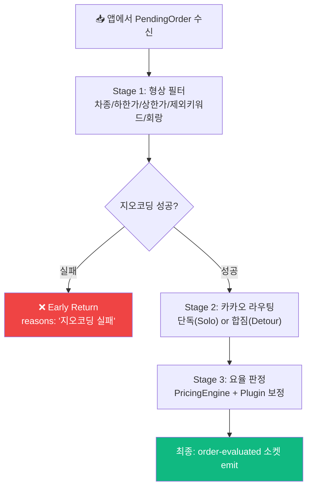

# 🧠 1DAL 콜 심사 파이프라인 (Order Evaluation Flow)

> **문서 상태**: v3.0 (코드 동기화)  
> **SSOT 코드**: [OrderEvaluator.ts](file:///Users/seungwookkim/reps/onedal/onedal-web/server/src/core/engine/OrderEvaluator.ts)

---

## 1. 설계 의도

앱에서 올라온 `PendingOrder`를 **3단계 파이프라인**으로 심사하여, 장점(`approvalReasons`)과 단점(`rejectionReasons`)을 **모두 수집**합니다. 지오코딩 실패를 제외하면 Short-Circuit 하지 않습니다 — 관제사가 "왜 걸렀는지" 전체 맥락을 볼 수 있도록 하기 위함입니다.

---

## 2. 파이프라인 흐름



---

## 3. 생성자 시그니처 (실제 코드 기준)

```typescript
// ⚠️ 문서 v2.0에서는 3개 인자(plugin, kakaoService, pricingEngine)를 주입했으나,
// 실제 코드는 targetApp 문자열 1개만 받고 내부에서 PluginFactory로 플러그인을 생성합니다.

const evaluator = new OrderEvaluator('insung');  // or 'hwamul24'
await evaluator.evaluate(userId, pendingOrder, io);
```

### `evaluate()` 시그니처

```typescript
evaluate(
    userId: string,                       // 기사 ID (세션 조회용)
    securedOrder: SecuredOrder | PendingOrder,  // 심사 대상 오더
    io: any                               // Socket.IO 인스턴스 (order-evaluated emit용)
): Promise<void>
```

---

## 4. Stage별 동작 요약

### Stage 1: 형상 필터 (`runStage1ShapeFilter`)
- 차종 일치 여부
- 첫짐 절대 하한가 (`STANDBY` 모드일 때만)
- 최대 운임 초과 여부
- 제외 키워드 + 플러그인 커스텀 룰 (`plugin.evaluateCustomRules()`)
- 도착지 회랑 이탈 여부 (합짐 모드일 때만)

### Stage 2: 카카오 라우팅
- **단독** (`activeCalls.length === 0`): `calculateSoloRoute()` → 소요 시간 기준 꿀/똥 판정
- **합짐** (`activeCalls.length > 0`): `optimizeWaypoints()` → `calculateDetourRoute()` → 우회 시간/거리 패널티 판정

> 판정 상수는 [dispatchConfig.ts](file:///Users/seungwookkim/reps/onedal/onedal-web/server/src/config/dispatchConfig.ts) 참조

### Stage 3: 요율 판정 (`runStage3Pricing`)
- `SettingsRepository.loadPricingConfig()` → `PricingEngine.calculateDynamicFare()`
- `plugin.applyPricingExceptions()` → 앱별 수수료 보정
- 결과: `HONEY`(적정가 이상), `FAIR`(하한~적정), `UNDERPAID`(하한 미달)

---

## 5. 출력

심사 완료 후 `securedOrder`에 다음 필드가 주입됩니다:

| 필드 | 설명 |
|------|------|
| `rejectionReasons: string[]` | 모든 패널티 사유 |
| `approvalReasons: string[]` | 모든 장점 |
| `isRejected: boolean` | `rejectionReasons.length > 0`이면 `true` |
| `kakaoTimeExt: string` | UI 표시용 문자열 (예: `+5km, +15분 '콜'`) |
| `status` | `ORDER_AWAITING_DECISION` 으로 승격 |
