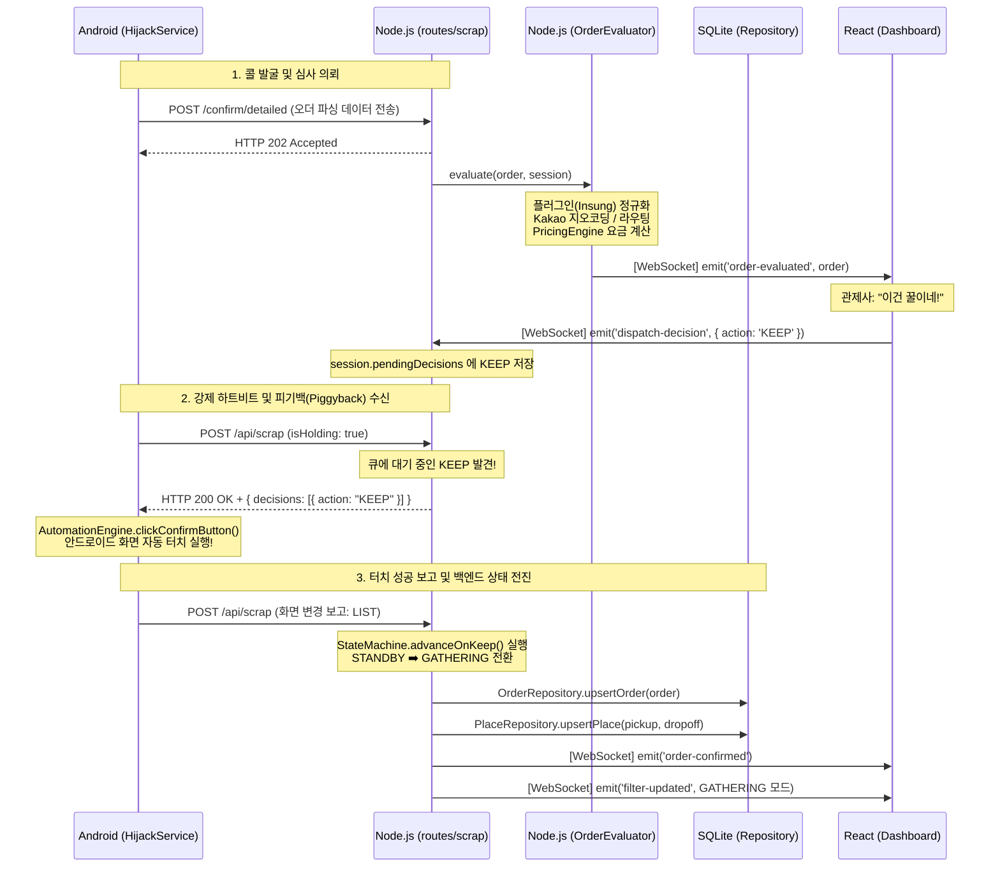

# ⏱️ 1DAL 실시간 통신 시퀀스 다이어그램 (Sequence Diagrams)

> **문서 상태**: v2.0 (상세 확장판)  
> **목적**: 앱의 `HijackService`, 서버 라우터, 관제탑 소켓, DB 간의 엔드투엔드(E2E) 통신 흐름 상세 도해.

---

## 1. 1DAL E2E 생명주기 (Scrap -> Evaluate -> Piggyback)

앱에서 팝업을 열었을 때부터 관제탑을 거쳐 최종 터치(KEEP)가 집행되기까지의 흐름을 실제 호출되는 **함수명과 API 엔드포인트** 기준으로 그렸습니다.

