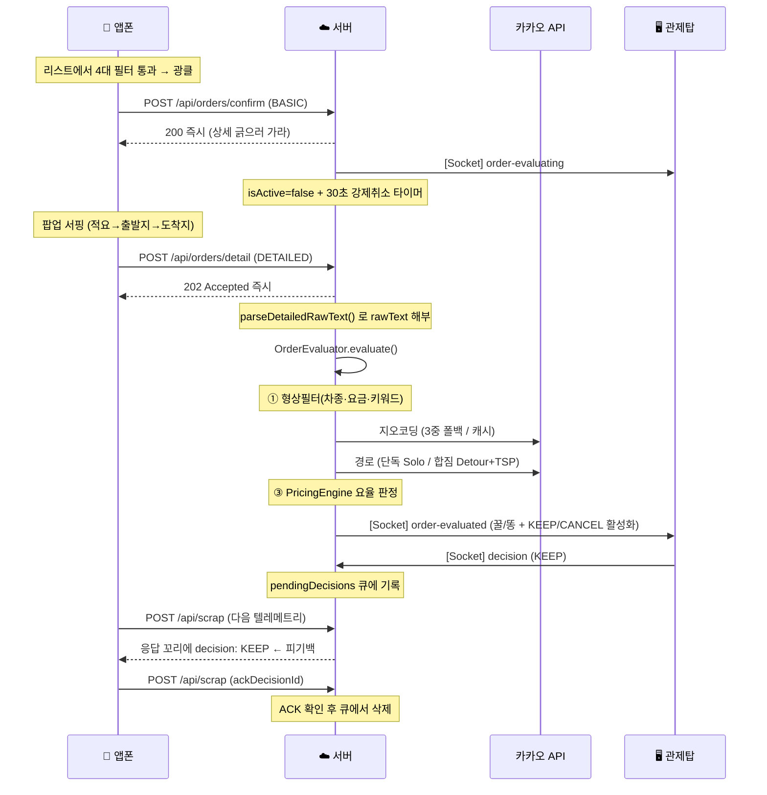

# 🏛️ 1DAL 백엔드 서버 아키텍처

> **문서 상태**: v4.0 — **2026-08-09 코드 전수 대조 후 재작성**
> **작성 원칙**: 코드에 실제로 들어간 것만 적는다. 계획은 [todo.md](../../../todo.md)에 적는다.

> [!IMPORTANT]
> **v3.0 문서는 사실이 아닌 내용을 다수 포함하고 있었습니다.**
> ESM 전환 완료, `RouteManager.ts`, `routes/confirm.ts`, dispatchEngine "God Object 해체",
> "Task 29 브로드캐스트 캐싱" 등은 **모두 존재하지 않았습니다.**
> 계획을 완료로 기술한 결과, 이 문서를 근거로 작업하면 없는 파일을 찾게 되는 상태였습니다.
> 같은 일이 반복되지 않도록 아래 내용은 전부 실제 파일·라인과 대조했습니다.

---

## 1. 런타임 사실 (Facts)

| 항목 | 실제 값 |
|---|---|
| 모듈 시스템 | **CommonJS** (`package.json`의 `"type": "commonjs"`) |
| `require()` 잔존 | **4곳** — `userSessionStore.ts`(3), `dispatchEngine.ts`(1). 순환 참조 회피용 지연 로딩 |
| 실행 방식 | **빌드 없이 `tsx`로 TS 직접 실행** (`ecosystem.config.cjs` → `npx tsx src/index.ts`) |
| 프레임워크 | Express 5.x, Socket.IO 4.x |
| DB | better-sqlite3 (동기 API). 로컬 `local.db` / 프로덕션 `data.db` |
| 포트 | 4000 (`0.0.0.0` 바인딩 — 앱폰이 LAN으로 직접 접속) |
| 인스턴스 | **1개 고정** — SQLite라 클러스터 불가 (`ecosystem.config.cjs`) |
| 총 소스 | 43개 파일 / 약 6,300줄 |

> `tsx`로 직접 실행하므로 **`tsc --noEmit`이 통과해도 런타임 에러는 잡히지 않습니다.**
> 배포 전 실제 기동 확인이 필요합니다.

---

## 2. 실제 디렉터리 구조

```text
server/src/
├── index.ts                     진입점. 라우터 등록, 소켓 초기화, SPA 서빙
├── db.ts                        SQLite 스키마 정의 + 부팅 시 마이그레이션
├── geoResolver.ts               시/도 → 지역 매핑
│
├── routes/                      HTTP 인터페이스
│   ├── health.ts                ⭐ 서버 정체(부팅시각·git 커밋) 노출
│   ├── scrap.ts                 앱폰 텔레메트리 수신 + 피기백 응답
│   ├── orders.ts                GET 목록 / POST confirm(BASIC) / POST decision
│   ├── detail.ts                POST DETAILED — 상세 스크랩 수신 후 비동기 평가
│   ├── devices.ts               기기 세션·PIN 페어링·모드 제어
│   ├── auth.ts                  Google OAuth · JWT 발급/갱신 · bypass
│   ├── settings.ts              개인 설정 CRUD (차량·집주소·요율)
│   ├── filters.ts               activeFilter 조회/변경
│   ├── config.ts                앱별 키워드 사전 제공
│   ├── emergency.ts             앱폰 비상 보고
│   ├── kakao.ts                 프론트엔드용 카카오 CORS 프록시
│   ├── osrmUtil.ts              OSRM 폴백 라우팅
│   └── logbook/                 운행일지 BFF (analytics, places)
│
├── core/
│   ├── constants.ts             TERMINAL_STATUSES
│   ├── helpers.ts               getActiveCalls()
│   ├── engine/                  순수 로직 — 여기만 단위 테스트가 있다
│   │   ├── OrderEvaluator.ts    3단계 심사 (형상필터 → 지오코딩·경로 → 요율)
│   │   ├── PricingEngine.ts     거리×단가×수수료 요율 계산 (상태 없음)
│   │   └── StateMachine.ts      STANDBY ↔ GATHERING 전이
│   └── plugins/                 앱별 차이 격리
│       ├── IAppPlugin.ts        인터페이스
│       ├── PluginFactory.ts     targetApp 문자열 → 구현체
│       ├── insung/InsungPlugin.ts
│       └── hwamul24/Hwamul24Plugin.ts
│
├── services/                    외부 연동 + 오케스트레이션
│   ├── dispatchEngine.ts        ⚠️ 938줄. 이 서버에서 가장 큰 파일
│   ├── kakaoService.ts          카카오 지오코딩·경로 (3중 폴백, 지오캐시)
│   ├── geoService.ts            Turf.js 회랑 추출, 전국 읍면동 폴리곤
│   └── statService.ts           통계 집계
│
├── repositories/                SQL 격리
│   ├── OrderRepository.ts / PlaceRepository.ts / SettingsRepository.ts
│
├── state/                       인메모리 상태
│   ├── userSessionStore.ts      Map<userId, UserSession> — Lazy Load
│   ├── filterManager.ts         baseFilter(DB) / activeFilter(메모리) 격리
│   └── pairingStore.ts          PIN 임시 저장
│
├── middlewares/authMiddleware.ts  requireAuth / requireAdmin
├── socket/socketHandlers.ts       Socket.IO 이벤트 + 1초 브로드캐스트
├── utils/                         parser, dbQueue, routeOptimizer, roadmapLogger
└── config/dispatchConfig.ts       판독 기준·타임아웃 상수
```

> **존재하지 않는 것** (v3.0 문서가 언급했던 것들):
> `core/engine/RouteManager.ts`, `routes/confirm.ts`

---

## 3. 실제 배차 파이프라인

v3.0 문서는 `scrap.ts → OrderEvaluator`라고 기술했으나 **틀렸습니다.**
`scrap.ts`는 평가하지 않습니다. 평가는 `detail.ts`가 시작합니다.



**핵심 설계 — 피기백(Piggyback)**
모바일 웹소켓이 자주 끊기므로 서버 → 앱 방향은 **`/api/scrap` 응답 본문 꼬리**에 명령을 싣습니다.
앱이 ACK를 보낼 때까지 큐에서 지우지 않아 판결이 유실되지 않습니다.
서버 ↔ 관제탑만 Socket.IO를 씁니다.

---

## 4. 상태 관리 — 저장하지 말고 파생시킨다

2026-08-09에 확립된 원칙입니다. 저장된 상태는 실제와 어긋날 수 있지만 파생값은 어긋날 수 없습니다.

| 값 | 파생 원천 | 함수 |
|---|---|---|
| `dispatchPhase` | 활성 콜 개수 + driverAction | `deriveDispatchPhase()` |
| `allowedVehicleTypes` (합짐) | 내 차 용량 − Σ실은 짐 | `getRemainingCapacityTypes()` |
| `allowedVehicleTypes` (빈차) | 내 차종 | `getEligibleVehicleTypes()` |
| `isShared` (DB 기록) | `getActiveCalls().length > 1` | — |
| `destinationKeywords` | 현재 경로 폴리라인 | `syncCorridorFilter()` |

서버 재시작 시 `restoreAndRecalculateSession()`이 DB에서 오늘의 활성 콜을 복구한 뒤
**위 값들을 전부 다시 파생**시킵니다. (이슈 W — 그전에는 콜만 복구하고 필터는 첫짐인 채로 남아
회랑 검사가 꺼진 상태로 사냥이 돌았습니다)

### 필터 2계층 — `filterManager.ts`

```
baseFilter   (DB user_filters)   "내일 출근할 때 적용될 설정"   ← 톱니바퀴 UI
activeFilter (메모리)             "지금 사냥 중인 조건"          ← 돋보기 UI + 시스템
```
`saveBaseFilter()`는 DB만, `updateActiveFilter()`는 메모리만 건드립니다.
영구 설정을 바꿔도 진행 중인 사냥에 영향이 없습니다.

---

## 5. 계층별 규칙

1. **`routes/`** — 인증·검증만. 비즈니스 로직은 `services`/`core`에 위임
2. **`core/engine/`** — DB·외부 API 직접 접근 금지. `repositories`/`services` 경유
3. **`repositories/`** — SQL만. 판단 로직 금지
4. **`core/plugins/`** — `targetApp`에 따라 주입. 앱별 주소 정규화·요율 예외·커스텀 룰

> ⚠️ **현재 지켜지지 않는 부분**: `services/dispatchEngine.ts`가 938줄로 비대하며
> `db.prepare`를 직접 호출하는 곳이 남아 있습니다. 분해는 아직 하지 않았습니다.

---

## 6. 성능·안정성 (실제 적용된 것만)

- **Event Loop 블로킹 방어** — `filterManager.recalculateDerivedFields()`가 지리 연산(`getCityRegionsWithRadius`, CPU 집약적)을 `destinationCity`/`destinationRadiusKm`가 실제로 바뀐 경우에만 수행합니다. (커밋 `65f739a`)
- **지리 연산 최적화** — `geoService`가 Douglas-Peucker로 폴리라인을 압축하고, 전국 읍면동 폴리곤에 BBox 선행 검사를 걸어 교차 연산량을 대폭 줄입니다.
- **지오코딩 영구 캐시** — `geocode_cache` 테이블. 같은 주소는 카카오 API를 호출하지 않습니다.
- **DB 쓰기 큐** — `dbQueue`가 `setImmediate`로 쪼개 SQLite 락과 이벤트 루프 블로킹을 완화합니다.
- **피기백 페이로드 다이어트** — `/api/scrap` 응답에서 `destinationGroups`를 제외합니다. 앱이 파싱하지 않는데 응답의 27%를 차지했습니다. (13,458B → 7,147B, 동일 조건 −47%)
- **API 404 가드** — 정의되지 않은 `/api/*`는 SPA 폴백(HTML 200) 대신 404 JSON을 반환합니다.

> **아직 안 된 것**: 소켓 1초 브로드캐스트 최적화, `intel` 테이블 `COUNT(*)` 풀스캔 제거,
> 필터 해시 기반 전송 생략. → [todo.md](../../../todo.md) Phase 3

---

## 7. 서버 정체 확인 (이슈 U)

`tsx watch`가 파일 변경을 놓치는 경우가 있어, 고친 코드가 실제로 돌고 있는지 확인할 수단이 필요합니다.

```bash
curl -s http://localhost:4000/api/health | python3 -m json.tool
```
```json
{
  "bootedAt": "2026-08-08T16:55:52.586Z",
  "uptimeSec": 56,
  "git": { "commit": "870ed90", "branch": "phase0-2-cleanup-and-status-fix" },
  "env": "development",
  "dbFile": "local.db"
}
```
**소스를 고쳤는데 `bootedAt`이 그대로면 재기동이 안 된 것입니다.** 기동 로그에도 같은 정보가 한 줄 출력됩니다.

---

## 8. 테스트

```bash
cd onedal-web/server && npx jest
```
현재 **5 suites / 39 tests**. 커버 범위:

| 파일 | 대상 |
|---|---|
| `tests/core/engine/PricingEngine.test.ts` | 요율 계산 |
| `tests/core/engine/OrderEvaluator.test.ts` | 콜 심사 |
| `tests/core/engine/StateMachine.test.ts` | 상태 전이 |
| `tests/shared/vehicles.test.ts` | 적재 용량 점수제 (24개) |
| `tests/shared/dispatchPhase.test.ts` | 재시작 복구 시 상태 파생 (7개) |

> `dispatchEngine.ts`(938줄)와 라우터 전반은 아직 테스트가 없습니다.
